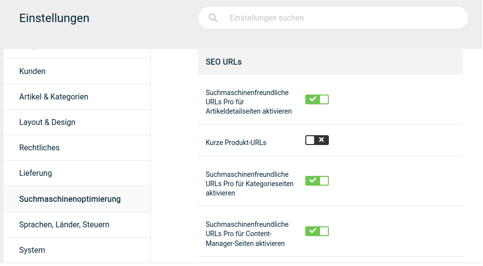

# Erste Schritte 

!!! note "Hinweis" 
	 Dieses Kapitel enthält Empfehlungen für die ersten Schritte mit deinem neuen Onlineshop. Diese Schritte sollten nach der Installation deines Shops durchgeführt werden. Diese Hinweise beziehen sich auf die detaillierteren Ausführungen aus den jeweiligen Kapiteln.
	 
## Im Shop anmelden 

Bevor du Deinen neuen Onlineshop administrieren kannst, musst du dich im System anmelden. Die Zugangsdaten zu deinem Administratorkonto legst du während des Installationsprozesses fest.

Gib die bei der Installation festgelegte E-Mail Adresse und das Passwort in die Kundenlogin-Box, die du über den Eintrag im oberen, rechten Menü erreichst, ein und klicke auf _**Anmelden**_.

Im oberen rechten Menü erscheint nun der Button _**Gambio Admin**_.

 

## Shop offline stellen 

Direkt nach der Installation ist der Shop noch nicht für die Öffentlichkeit geeignet. Zunächst muss die Grundkonfiguration vorgenommen, die Artikeldaten eingefügt und das Layout angepasst werden. Versetze deinen Shop unter _**Inhalte \> Shop online/offline**_ in den Offline-Modus. Die im Offline-Modus angezeigte Seite dient als Platzhalter und enthält kein Anmeldeformular. Ein spezielles Anmeldeformular für Administratoren kannst du jederzeit über www.DeinShop.de/login\_admin.php aufrufen \(ersetze hierbei www.DeinShop.de durch deine tatsächliche Shopadresse\).

!!! danger "Achtung"

	 Bei Arbeiten am Shop sollte dieser unbedingt offline geschaltet werden. Geschieht dies nicht, werden dem Kunden z.B. unvollständige AGBs oder Testartikel angezeigt, die nicht lieferbar sind. Hier besteht die Gefahr einer Abmahnung, ein einfacher Hinweis wie *Dieser Shop ist nur zu Testtzwecken online.*, ist **nicht ausreichend**.
	 
## Grundkonfiguration vornehmen

In verschiedenen Bereichen muss dein neuer Onlineshop nach der Installation erstmalig konfiguriert werden. Überprüfe zunächst sämtliche Angaben unter _**Einstellungen / Shop**_. Beachte hier besonders die Felder _**Name des Shops**_, _**Inhaber**_ sowie _**Land**_, _**Region**_ und _**Geschäftsadresse und Telefonnummer**_ etc..

!!! note "Hinweis" 
	 Leere nach dem Aktivieren der SEO Boost URLs die Servercaches unter _**Toolbox \> Cache**_. Betätige hierzu die Schaltflächen von unten nach oben.

Sofern dein Server es zulässt, empfehlen wir, die Gambio SEO Boost URLs zu verwenden. Installiere den SEO Boost unter _**Einstellungen / Suchmaschinenoptimierung / SEO URLs**_. Die SEO Boost URLs simulieren aus dem dynamischen Shopinhalt statische Dokumente und fördern die Lesbarkeit deiner URLs. Die Kontrollkästchen sind nicht auswählbar, solange die vorherig genannte Konfiguration nicht vorgenommen wurde.

!!! note "Hinweis" 
	 Bei der Installation des Shopsystems werden die Grundeinstellungen zu den Steuersätzen für Deutschland angelegt. Shopbetreiber aus Ländern der Europäischen Union \(EU\) korrigieren die voreingestellten Steuersätze für die Steuerzone EU. Shopbetreiber aus der Schweiz und Ländern außerhalb der EU legen zunächst eine neue Steuerzone für ihr Land an und fügen neue Steuersätze für diese Steuerzone hinzu. Nähere Informationen erhältst du im Kapitel _**Lokalisierung**_.

!!! danger "Achtung"

	 Sämtliche Preise im Onlineshop müssen mit einem Dezimalpunkt getrennt werden! Notiere Preise daher immer nach folgendem Beispiel: ein Artikel soll zu 5,95 EUR verkauft werden, in der Artikeleingabemaske gibst du im Feld _**Preis**_ den Wert 5.95 mit einem Punkt als Dezimaltrennzeichen ein.

Installiere anschließend jeweils mindestens eine Versandart und ein Zahlungsmodul. Die Zahlungsweisen findest du im Gambio Admin unter _**Module \> Zahlungsweisen**_, die Versandarten unter _**Module \> Versandarten**_.

!!! note "Hinweis" 
	 **Hinweis für Kleinunternehmer**: Aktiviere die Kleinunternehmer-Regelung, bevor du beginnst, Preise einzugeben. Die Kleinunternehmer-Regelung aktivierst du im Gambio Admin unter _**Einstellungen / Rechtliches / Mehrwertsteueranzeige**_ sowie unter _**Module \> Zusammenfassung**_. Wähle anschließend bei allen Preisangaben den Standardsteuersatz aus.

!!! note "Hinweis" 
	 Wenn du die Zahlung per _**PayPal**_ anbieten möchtest, trage die API Daten, die du von PayPal erhältst, auf der Konfigurationsseite des Moduls ein. Gehe hierzu unter _**Module \> Zahlungsweisen**_, wähle das Modul _**PayPal und PayPal Plus**_ aus und klicke auf die Schaltflächen _**Installieren **_\(sofern noch nicht geschehen\) und _**Konfiguration**_. Nähere Informationen zu den Zahlungsmodulen von Drittanbietern erhältst du beim jeweiligen Anbieter.
	 
## Artikel einpflegen

!!! note "Hinweis" 
	 Kleinunternehmer sollten vor dem Anlegen von Artikeln die Kleinunternehmerregelung aktivieren.

Wenn du deine Artikel mit dem Import Assistenten aus einem bestehenden Shop importierst, führe nun den Import aus. Wenn du das erste Mal einen Shop installierst, füge Kategorien und Artikel über die jeweiligen Eingabemasken hinzu.

!!! note "Hinweis" 

	 Leere nach Änderungen an den Artikeln und Kategorien die jeweiligen Caches unter _**Toolbox \> Cache**_.

Wenn du große Mengen von Artikeln einpflegen möchtest, zu denen du bereits eine Liste führst, verwende zum Einstellen von Artikeln und Kategorien die CSV Import-Schnittstelle. Der CSV Import ist auch beim Import von Artikeldaten von deinem Großhändler geeignet. Beachte, dass CSV Dateien von Dritten in der Regel an das von Gambio verwendete Format angepasst werden müssen.

## Rechtliches und Informationen

!!! danger "Achtung"

	 Lasse den nachfolgenden Schritt abschließend von deinem Rechts- und/oder Steuerberater prüfen! Falsche oder fehlerhafte Texte bergen die Gefahr einer Abmahnung!

Jeder Shop im Internet muss bestimmte Informationspflichten erfüllen. Diese Texte kannst du in den dafür vorgesehenen Contents unter _**Inhalte \> Content Manager**_ hinterlegen.

Wenn du zusätzliche Informationen hinterlegen möchtest, bearbeite einen der vorhandenen Contents im Content Manager oder legen neue Contents an. Informationsseiten können dabei automatisch in einer der Navigationen verlinkt werden.

## SSL im Shop aktivieren

!!! danger "Achtung"

	 Dieser Schritt darf erst dann durchgeführt werden, wenn für deine Shop-Domain ein _**SSL-Zertifikat**_ eingerichtet ist. Nimmst du die Änderungen vor, bevor dein Hoster die Einrichtung abgeschlossen hat, ist dein Shop im schlimmsten Fall **nicht mehr erreichbar**.

Um den gesamten Shop über HTTPS lauffähig zu machen, ohne dabei eine permanente Weiterleitung der Domain von HTTP auf HTTPS zu verwenden, musst du folgende Änderungen vornehmen.

Bitte beachte, dass vor der SSL Aktivierung bereits ein gültiges SSL-Zertifikat für deinen Shop zur Verfügung stehen muss, da es ansonsten zu Fehlern nach der Aktivierung kommen wird. Sollte dir kein gültiges SSL-Zertifikat zur Verfügung stehen, wende dich bitte einmal direkt an deinen Webhoster.

1.  Verbinde dich per FTP-Client mit deinem Shop, zum Beispiel mit FileZilla.
2.  Ändere die Dateirechte \(CHMOD\) der beiden Konfigurationsdateien _**includes/configure.php**_ und _**admin/includes/configure.php**_ auf 777, so dass diese dadurch voll beschreibbar sind
3.  Öffne die Datei includes/configure.php mit einem einfachen Texteditor und bearbeite diese wie folgt:

    Vor der Bearbeitung:

    define\('HTTP\_SERVER', 'http://www.meinshop.de'\);

    define\('HTTPS\_SERVER', 'https://www.meinshop.de'\);

    define\('ENABLE\_SSL', false\);

    Nach der Bearbeitung:

    define\('HTTP\_SERVER', 'https://www.meinshop.de'\);

    define\('HTTPS\_SERVER', 'https://www.meinshop.de'\);

	!!! note "Hinweis" 
		 Bitte beachte, dass hier http durch https ersetzt wurde

    define\('ENABLE\_SSL', true\);

    Speichere die Änderung ab und ändere die Dateirechte \(CHMOD\) wieder auf 444 zurück.

4.  Öffne die Datei admin/includes/configure.php mit einem einfachen Texteditor und bearbeite diese wie folgt:

    Vor der Bearbeitung:

    define\('HTTP\_SERVER', 'http://www.meinshop.de'\);

    define\('HTTP\_CATALOG\_SERVER', 'http://www.meinshop.de'\);

    define\('HTTPS\_CATALOG\_SERVER', 'https://www.meinshop.de'\);

    define\('ENABLE\_SSL\_CATALOG', 'false'\);

    Nach der Bearbeitung:

    define\('HTTP\_SERVER', 'https://www.meinshop.de'\);

	!!! note "Hinweis" 

		 Bitte beachte, dass hier http durch https ersetzt wurde

    define\('HTTP\_CATALOG\_SERVER', 'https://www.meinshop.de'\);

	!!! note "Hinweis" 

		 Bitte beachte, dass hier http durch https ersetzt wurde

    define\('HTTPS\_CATALOG\_SERVER', 'https://www.meinshop.de'\);

    define\('ENABLE\_SSL\_CATALOG', 'true'\);

    Speichere die Änderung ab und ändere die Dateirechte \(CHMOD\) wieder auf 444 zurück.

5.  Leere den gesamten Cache des Shops unter _**Toolbox \> Cache**_.
6.  Der gesamte Shop ist nun über HTTPS zu erreichen.

## Layout anpassen

Wenn Artikel und Contents angelegt und Zahlungsweisen und Versandarten konfiguriert sind, starte den Shop unter _**Inhalte \> Template-Einstellungen**_ im Bearbeitungsmodus. Im Bearbeitungsmodus kannst du das Aussehen des mitgelieferten Templates bzw. Themes an deine Bedürfnisse anpassen.

## Testen

Teste abschließend alle relevanten Funktionen. Führe mit Testkunden aus jeder verwendeten Kundengruppe Testbestellungen durch. Teste dabei jede Versandart und jede Zahlungsweise auf korrekte Funktion. Wenn beim Testen keine Probleme und Fehler mehr auftreten, ist die Grundkonfiguration deines Shops abgeschlossen.

## Shop online stellen

Wenn du die Grundkonfiguration des Shops und das Einstellen von Artikeln abgeschlossen sowie das Layout angepasst hast, ist dein Shop bereit, im Internet veröffentlicht zu werden. Stelle den Shop unter _**Inhalte \> Shop online/offline**_ wieder online und melde ihn in den gängigen Suchmaschinen an.

Wenn du einen älteren Shop auf die aktuelle Shopversion aktualisiert hast, solltest du vor dem Onlinestellen den alten Shop ebenfalls offline stellen und zunächst die Shops wie in der Anleitung zum Import Assistenten beschrieben umstellen. Schalte den neuen Shop erst anschließend online.
