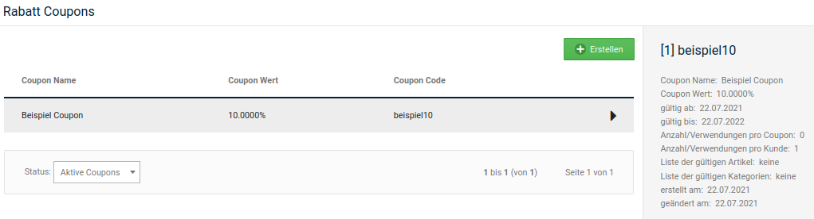
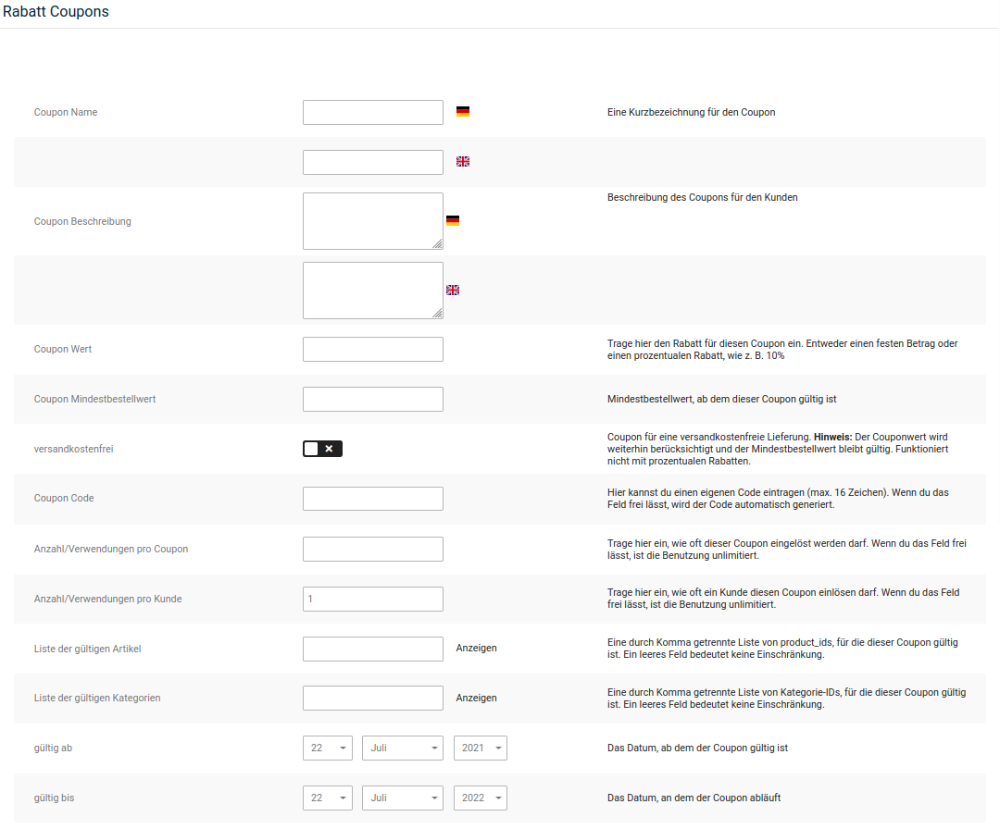
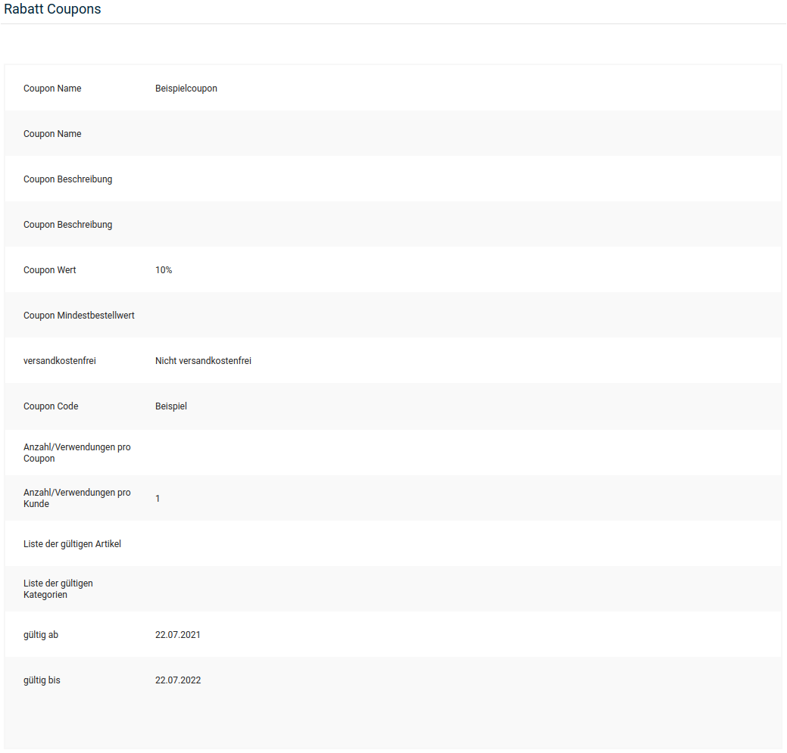

# Rabatt Coupons

Mit Rabatt Coupons bietest du deinen Kunden eine Vergünstigung auf bestimmte Artikel oder Artikel aus bestimmten Kategorien an. Der Preisnachlass wird prozentual vom Warenwert berechnet oder als fester Betrag hinterlegt.

Über Rabatt Coupons kannst du außerdem die Versandkosten erstatten, die bei einer Bestellung normalerweise entstehen würden. Ausgenommen hiervon sind Sperrgutzuschläge. Die Befreiung von den Versandkosten kann mit einem festen Preisnachlass kombiniert werden.

Installiere das Modul _**Rabatt Coupons**_ unter _**Module \> Zusammenfassung**_, damit Rabatt Coupons bei der Berechnung der Bestellsummen berücksichtigt werden. Informationen zur Konfiguration dieses Moduls erhältst du im Kapitel _**Zusammenfassung \> Rabatte**_.

!!! note "Hinweis" 
	 Wenn der Warenwert geringer ist, als der Coupon-Wert, so entfällt der Restwert des Rabatt Coupons nach der Bestellung.

## Willkommens-Rabatt Coupon

Das Shopsystem kann neuen Kunden mit der Registrierungsbestätigung einen Willkommens- Rabatt Coupon ausstellen. Der Coupon muss vom Kunden aktiv eingelöst werden, damit er verwendet werden kann. Beachte, dass du den Willkommens-Rabatt Coupon zuerst anlegen musst, bevor du den Code einträgst.

Trage den Code des gewünschten Willkommens-Rabatt Coupons im Modul _**Gutscheinsystem**_ unter _**Module \> Modul-Center**_ in das Feld _**Willkommens-Rabatt Coupon**_ ein.

!!! note "Hinweis" 
	 Wenn du sowohl einen Willkommens-Gutschein als auch einen Willkommens-Rabatt Coupon einrichtest, wird dem Kunden bei der Registrierung ein Gutschein-Code und ein Rabatt Coupon-Code zugeschickt.

## Neuen Rabatt Coupon anlegen

1.  Öffne im Gambio Admin deines Shops den Menüpunkt _**Gutscheine \> Rabatt Coupons**_
2.  Klicke auf _**Erstellen**_

    Die Eingabemaske für Rabatt Coupons öffnet sich

3.  Fülle die gewünschten Felder aus. Beachte dabei auch die Tabelle _**Coupon-Eingabemaske**_
4.  Wähle über die Listen _**gültig ab**_ und _**gültig bis**_ einen Gültigkeitszeitraum aus
5.  Klicke auf Vorschau

    Du siehst eine Übersicht mit den Details deines neuen Coupons

6.  Klicke auf _**Bestätigen**_, wenn die Details deines neuen Coupons korrekt sind

!!! note "Hinweis" 
	 Die Option _**versandkostenfrei**_ kann ausschließlich mit einem festen Coupon-Wert kombiniert werden. Wenn du die Option _**versandkostenfrei**_ mit einem prozentualen Coupon-Wert aktivierst, werden deinen Kunden mit dem Coupon ausschließlich die Versandkosten erstattet.

|Feldname|Beschreibung|
|--------|------------|
|Coupon Name|interne Beschreibung für den Coupon|
|Coupon Beschreibung|Beschreibung des Coupons für den Kunden; wird beim Einlösen in den Coupon-Details angezeigt|
|Coupon Wert|Pflichtfeld: Gegenwert des Coupons; möglich sind prozentuale Werte \(10%\) oder feste Beträge \(2.5000 =\> 2.50 EUR\)|
|Coupon Mindestbestellwert|Warenwert, der mindestens im Warenkorb liegen muss, damit der Coupon bei der Berechnung berücksichtigt wird|
|versandkostenfrei|wenn aktiviert, wird zusätzlich zu einem festen Coupon-Wert die Höhe der Versandkosten erstattet \[nicht aktiv\]|
|Coupon Code|Code, der zum Einlösen des Coupons eingegeben werden muss; wird automatisch erzeugt, wenn kein Code eingegeben wird|
|Anzahl/Verwendungen pro Coupon|legt fest, wie oft der Coupon eingelöst werden kann; lasse das Feld leer, wenn der Coupon beliebig oft eingelöst werden können soll|
|Anzahl/Verwendungen pro Kunde|legt fest, wie oft der Coupon von jedem Kunden eingelöst werden kann; lasse das Feld leer, wenn der Coupon von jedem Kunden beliebig oft eingelöst werden können soll \[1\]|
|Liste der gültigen Artikel|kommagetrennte Liste von internen Artikel-IDs, auf die der Coupon eingeschränkt wird|

!!! note "Hinweis"

	 Eine Liste der zugehörigen IDs kann über den Link _**Anzeigen**_ aufgerufen werden. Sie öffnet sich in einem neuen Browser-Fenster.

|Feldname|Beschreibung|
|--------|------------|
|Liste der gültigen Kategorien|kommagetrennte Liste von internen Kategorie-IDs, auf die der Coupon eingeschränkt wird|

!!! note "Hinweis"

	 Eine Liste der zugehörigen IDs kann über den Link _**Anzeigen**_ aufgerufen werden. Sie öffnet sich in einem neuen Browser-Fenster.

|Feldname|Beschreibung|
|--------|------------|
|gültig ab|das Datum, ab dem der Coupon eingelöst werden kann \[aktuelles Datum\]|
|gültig bis|das Datum, an dem der Coupon abläuft \[aktueller Tag im nächsten Jahr\]|