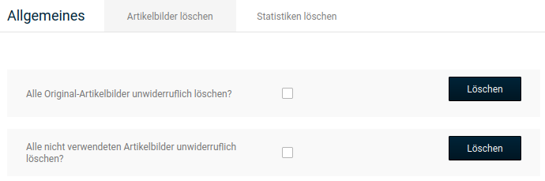

# Artikelbilder löschen

Unter _**Toolbox \> Artikelbilder löschen**_ besteht die Möglichkeit Artikelbilder bei Bedarf zu löschen. Es können die Originalbilder \(Verzeichnis /images/product\_images/original\_images\) sowie nicht benötigte Artikelbilder, die keinem Artikel mehr zugeordnet sind, entfernt werden.

Setze hierzu den Haken in das Kästchen hinter die gewünschte Funktion und klicke auf Löschen.

!!! danger "Achtung"

	 Die Original-Bilder werden für den Bilderzoom verwendet. Werden diese gelöscht, steht die Vergrößerung nicht mehr in der bisherigen Auflösung zur Verfügung.

!!! danger "Achtung"

	 Ab Version **4.1** werden die in Kollektionen hinterlegten Bilder für Optionswerte \(Auswahlwerte bei Artikelattributen\) zusammen mit den Originalbildern gespeichert. Durch das Löschen der Originalbilder werden die **Kollektionsbilder für Attribute** ebenfalls **unwiederbringlich entfernt**!