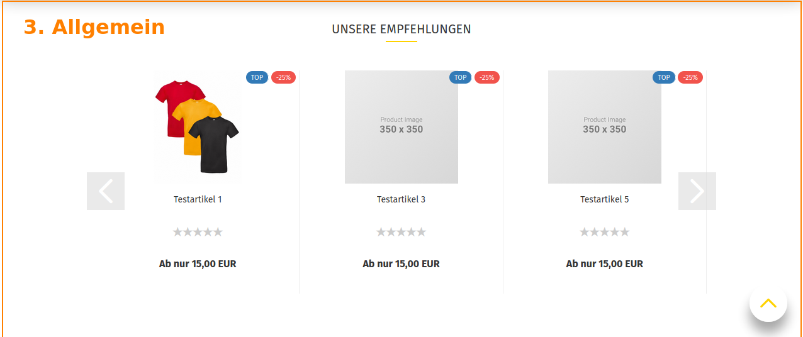
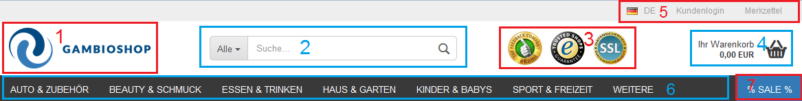
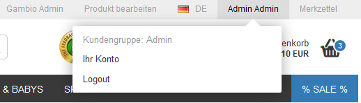
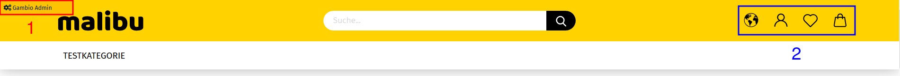
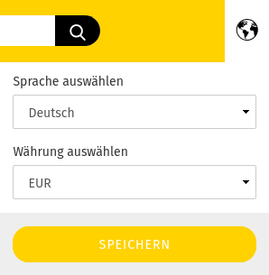
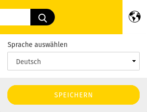
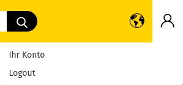
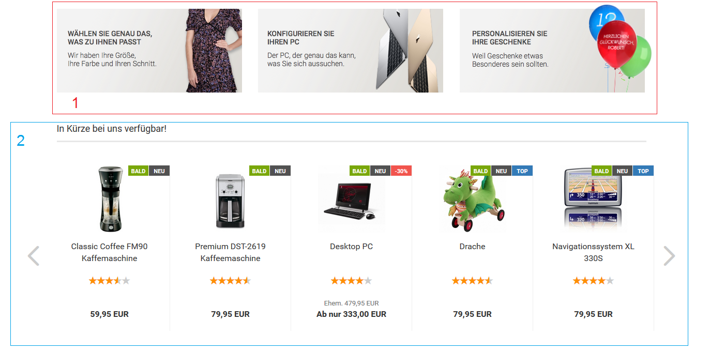
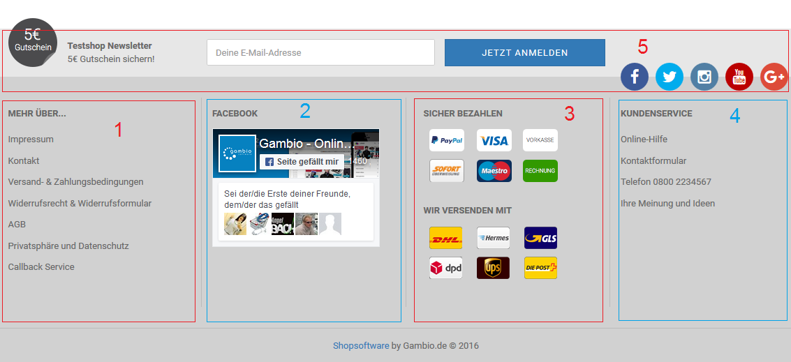

# Shopbereich

1.  Header
2.  Teaser-Slider
3.  Allgemein
4.  Footer

## Header 

1.  Shop-Logo
2.  Suche
3.  Content Header
4.  Warenkorb
5.  Sekundärnavigation
6.  Horizontale Kategorienavigation
7.  Horizontale Contentnavigation \(Bereich _**Hauptkategorien**_ im Content Manager\)

### Sekundärnavigation 

von Links nach Rechts:

-   Gambio Admin: Aufruf des Gambio Admins
-   Produkt bearbeiten: Bearbeiten des aufgerufenen Artikels
-   Konto-Schaltfläche: Zugriff auf _**Ihr Konto**_ und _**Logout**_

### Header im Malibu

Der Header im Malibu unterscheidet sich in seiner Darstellung und Andordnung der einzelnen Elemente.

1.  Der Gambio Admin-Button ist links oben angeordnet
2.  Einzelne Funktionen der Sekundärnavigation sind in der sogenannten _**Sekundär-Spalte**_ auf Icons aufgeteilt. Von links nach rechts sind dies Lokalisierung \(Sprach- und Währungsauswahl\), Login / Ihr Konto, Merkzettel und der kleine Warenkorb.

!!! note "Hinweis"

	 Standardmäßig ist die Währungsauswahl abgeschaltet.

	 

	 Unter _**Einstellungen / Layout & Design**_ kann der Haken für _**Währungsauswahl im Top-Menü aktivieren**_ gesetzt werden, um die Währungsauswahl anzuzeigen.

## Allgemein 

1.  Content
2.  Swiper

Die Startseite des Shops kann mit verschiendenen Contents und Artikelzusammenstellungen bestückt werden. Diese werden abwechselnd aufgeführt, wie in der Abbildung anhahnd des Contents Index \(ID 5\) und den Artikelankündigungen zu sehen ist. Letztere können als sogenannter _**Swiper**_ angezeigt werden, bei dem über die Vor- und Zurück-Pfeile die Artikel durchgeschaltet werden können.

Die Reihenfolge der einzelnen Contens und Artikelzusammenstellzungen auf der Startseite ist wie folgt:

1.  Index \(ID 5\)
2.  Artikelankündigungen
3.  Freier Inhalt 1 \(ID 4321002\): Dieser Content wird nur angezeigt, wenn es _**Artikelankündigungen**_ auf der Startseite gibt.
4.  Empfehlungen: Artikel, die als Empfehlung gekennzeichnet wurden
5.  Index \(Mitte\) \(ID 10\)
6.  Freier Inhalt 2 \(ID 4321003\): Dieser Content wird nur angezeigt, wenn es _**Sonderangebote**_ auf der Startseite gibt.
7.  Sonderangebotsartikel
8.  Freier Inhalt 3 \(ID 4321004\): Dieser Content wird nur angezeigt, wenn es _**Neue Artikel**_ auf der Startseite gibt.
9.  Neue Artikel
10. Index \(Unten\) \(ID 11\)

!!! note "Hinweis" 
	 Contents bezeichnen Informationsseiten. Diese können unter _**Inhalte \> Content Manager**_ bearbeitet oder neu angelegt werden \(siehe auch Kapitel _**Content Manager**_\).

## Footer

Der Footer ist in vier unabhängige Spalten und einem darüber angeordneten Bereich aufgeteilt:

1.  Spalte 1 _**Mehr über**_: Links zu allen Contents die im Content Manager im Bereich _**Infoseiten**_ angelegt und sichtbar geschaltet sind
2.  Spalte 2: frei einrichtbar über den Content _**Footer 2. Spalte**_ \(ID 4321005\)
3.  Spalte 3: frei einrichtbar über den Content _**Footer 3. Spalte**_ \(ID 4321006\)
4.  Spalte 4: frei einrichtbar über den Content _**Footer 4. Spalte**_ \(ID 4321007\)
5.  oberer Bereich: frei einrichtbar über den Content _**Footer**_ \(ID 199\)

