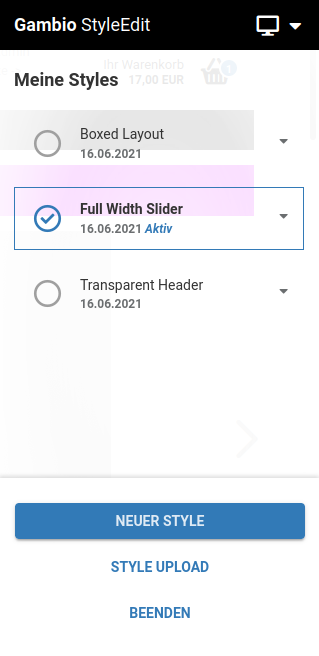
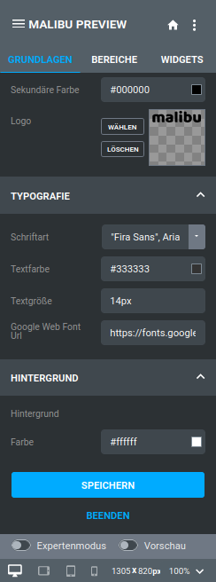

# StyleEdit v3 und StyleEdit 4

In den Shopversionen GX3 und GX4 (bis einschließlich Version 4.4) stehen im Shop zwei verschiedene Grundsysteme für grafische Oberflächen zur Verfügung, Templates und Themes. Beide haben den gleichen Grundaufbau, allerdings bieten Themes weitergehende Möglichkeiten in der Gestaltung.

!!! note "Hinweis"

	 Ab Version **4.5** werden Templates nicht mehr im Shop verwendbar sein. Wenn du ein Design neu anlegen möchtest, empfehlen wir daher ein Theme zu verwenden. Die Einstellungen aus einem bestehenden Template können in ein neues Theme übernommen werden (siehe Unterkapitel _**StyleEdit 4 aufrufen**_).

Du findest eine Beschreibung des jeweiligen StyleEdits in den Kapiteln _**Honeygrid und StyleEdit v3**_ bzw. _**StyleEdit 4 / Themes**_ dieses Handbuchs.

