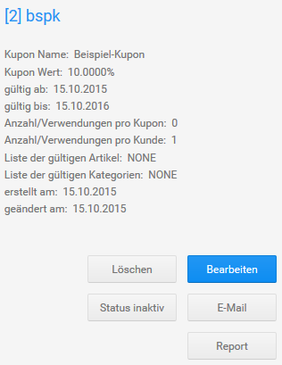
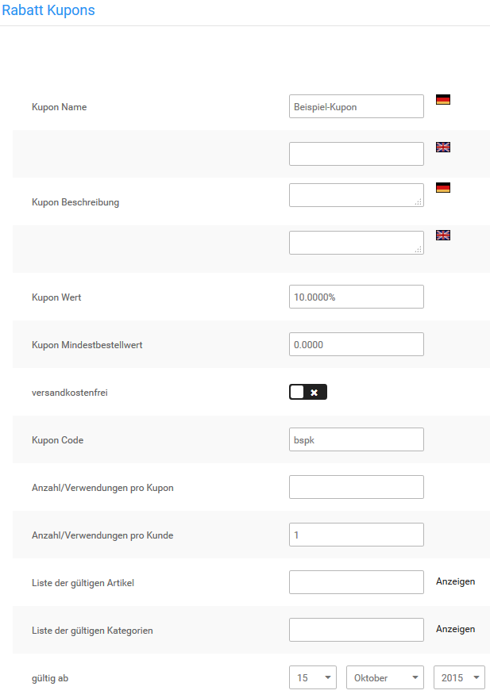
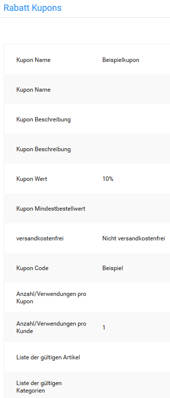

# Rabatt Kupons

Mit Rabatt Kupons bietest du deinen Kunden eine Vergünstigung auf bestimmte Artikel oder Artikel aus bestimmten Kategorien an. Der Preisnachlass wird prozentual vom Warenwert berechnet oder als fester Betrag hinterlegt.

Über Rabatt Kupons kannst du außerdem die Versandkosten erstatten, die bei einer Bestellung normalerweise entstehen würden. Ausgenommen hiervon sind Sperrgutzuschläge. Die Befreiung von den Versandkosten kann mit einem festen Preisnachlass kombiniert werden.

Installiere das Modul _**Rabatt Kupons**_ unter _**Module \> Zusammenfassung**_, damit Rabatt Kupons bei der Berechnung der Bestellsummen berücksichtigt werden. Informationen zur Konfiguration dieses Moduls erhältst du im Kapitel _**Zusammenfassung \> Rabatte**_.

!!! note "Hinweis" 
	 Wenn der Warenwert geringer ist, als der Kupon-Wert, so entfällt der Restwert des Rabatt Kupons nach der Bestellung.

## Willkommens-Rabatt Kupon

Das Shopsystem kann neuen Kunden mit der Registrierungsbestätigung einen Willkommens- Rabatt Kupon ausstellen. Der Kupon muss vom Kunden aktiv eingelöst werden, damit er verwendet werden kann. Beachte, dass du den Willkommens-Rabatt Kupon zuerst anlegen musst, bevor du den Code einträgst.

Trage den Code des gewünschten Willkommens-Rabatt Kupons im Modul _**Gutscheinsystem**_ unter _**Module \> Modul-Center**_ in das Feld _**Willkommens-Rabatt Kupon**_ ein.

!!! note "Hinweis" 
	 Wenn du sowohl einen Willkommens-Gutschein als auch einen Willkommens-Rabatt Kupon einrichtest, wird dem Kunden bei der Registrierung ein Gutschein-Code und ein Rabatt Kupon-Code zugeschickt.

## Neuen Rabatt Kupon anlegen

1.  Öffne im Gambio Admin deines Shops den Menüpunkt _**Gutscheine \> Rabatt Kupons**_
2.  Klicke auf _**Erstellen**_

    Die Eingabemaske für Rabatt Kupons öffnet sich

3.  Fülle die gewünschten Felder aus. Beachte dabei auch die Tabelle _**Kupon-Eingabemaske**_
4.  Wähle über die Listen _**gültig ab**_ und _**gültig bis**_ einen Gültigkeitszeitraum aus
5.  Klicke auf Vorschau

    Du siehst eine Übersicht mit den Details deines neuen Kupons

6.  Klicke auf _**Bestätigen**_, wenn die Details deines neuen Kupons korrekt sind

!!! note "Hinweis" 
	 Die Option _**versandkostenfrei**_ kann ausschließlich mit einem festen Kupon-Wert kombiniert werden. Wenn du die Option _**versandkostenfrei**_ mit einem prozentualen Kupon-Wert aktivierst, werden deinen Kunden mit dem Kupon ausschließlich die Versandkosten erstattet.

|Feldname|Beschreibung|
|--------|------------|
|Kupon Name|interne Beschreibung für den Kupon|
|Kupon Beschreibung|Beschreibung des Kupons für den Kunden; wird beim Einlösen in den Kupon-Details angezeigt|
|Kupon Wert|Pflichtfeld: Gegenwert des Kupons; möglich sind prozentuale Werte \(10%\) oder feste Beträge \(2.5000 =\> 2.50 EUR\)|
|Kupon Mindestbestellwert|Warenwert, der mindestens im Warenkorb liegen muss, damit der Kupon bei der Berechnung berücksichtigt wird|
|versandkostenfrei|wenn aktiviert, wird zusätzlich zu einem festen Kupon-Wert die Höhe der Versandkosten erstattet \[nicht aktiv\]|
|Kupon Code|Code, der zum Einlösen des Kupons eingegeben werden muss; wird automatisch erzeugt, wenn kein Code eingegeben wird|
|Anzahl/Verwendungen pro Kupon|legt fest, wie oft der Kupon eingelöst werden kann; lasse das Feld leer, wenn der Kupon beliebig oft eingelöst werden können soll|
|Anzahl/Verwendungen pro Kunde|legt fest, wie oft der Kupon von jedem Kunden eingelöst werden kann; lasse das Feld leer, wenn der Kupon von jedem Kunden beliebig oft eingelöst werden können soll \[1\]|
|Liste der gültigen Artikel|kommagetrennte Liste von internen Artikel-IDs, auf die der Kupon eingeschränkt wird|

!!! note "Hinweis"

	 Eine Liste der zugehörigen IDs kann über den Link _**Anzeigen**_ aufgerufen werden. Sie öffnet sich in einem neuen Browser-Fenster.

|Feldname|Beschreibung|
|--------|------------|
|Liste der gültigen Kategorien|kommagetrennte Liste von internen Kategorie-IDs, auf die der Kupon eingeschränkt wird|

!!! note "Hinweis"

	 Eine Liste der zugehörigen IDs kann über den Link _**Anzeigen**_ aufgerufen werden. Sie öffnet sich in einem neuen Browser-Fenster.

|Feldname|Beschreibung|
|--------|------------|
|gültig ab|das Datum, ab dem der Kupon eingelöst werden kann \[aktuelles Datum\]|
|gültig bis|das Datum, an dem der Kupon abläuft \[aktueller Tag im nächsten Jahr\]|