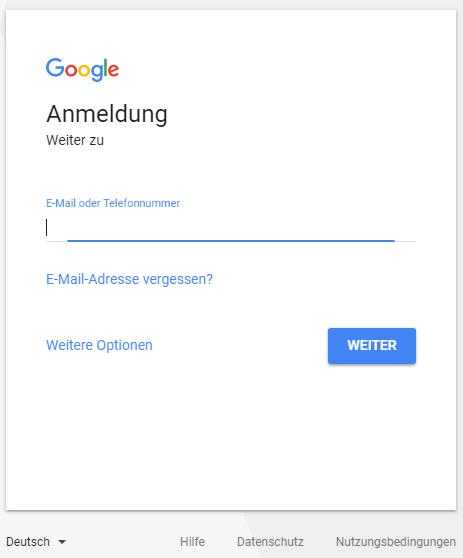
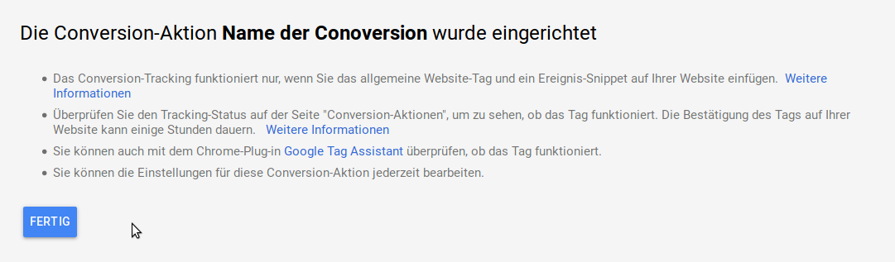
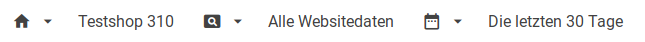
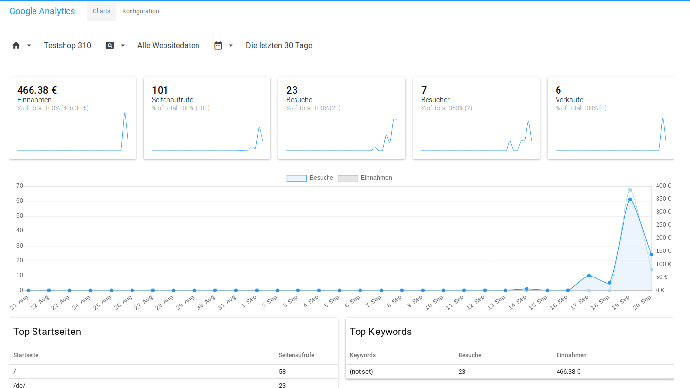
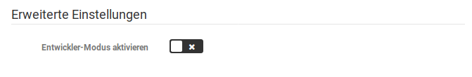

# Google Services

Über das Modul _**Google Services**_ kann der Shop direkt mit Google Shopping verknüpft werden. Zudem ist die Auswertung deiner Google Ads-Kampagnen möglich.

## Anmeldung

Zur Nutzung der Google Services ist die Verknüpfung mit einem _**Google AdWords**_-Account notwendig. Wähle hierzu einen beliebigen Menüpunkt im Bereich _**Google**_ aus oder klicke auf die rote Anzeige am unteren Rand des Gambio Admins: _**Google nicht verbunden**_.

Klicke auf den Button _**Verknüpfen**_ und du wirst direkt zur Anmeldeseite weitergeleitet.

Gib hier deine Zugangsdaten ein.

Nach der Anmeldung wirst du in einem Dialog dazu aufgefordert den Zugriff auf die Verwaltung von AdWords-Kampagnen zu bestätigen. Klicke hier auf _**Zulassen**_.

## Google Shopping

Über _**Google \> Google Shopping**_ kannst du Google Shopping-Profile erstellen und diese verwalten.

!!! note "Hinweis"

	 Wenn du für deine Exporte zu Google Shopping bisher Export-Profile unter _**Artikel \> Import/Export**_ verwendet hast, so werden diese nicht für das Google Services Modul übernommen.

Über die Schaltfläche _**Erstellen**_ kann ein neues Export-Profil angelegt werden.

Bewege den Mauszeiger in die Zeile eines erstellten Export-Profils, um die möglichen Aktionen anzuzeigen. Diese werden am rechten Ende der Zeile als Icons aufgeführt:

Die möglichen Aktionen, für bereits angelegte Profile, sind von links nach rechts:

-   _**herunterladen**_: lädt die Datei auf deinen Computer herunter, hierfür muss vorher ein Export durchgeführt worden sein
-   _**exportieren**_: führt einen Export zu Google Shopping durch
-   _**bearbeiten**_: ruft die Einstellungen zu einem Export-Profil auf
-   _**löschen**_: löscht ein angelegtes Export-Profil
-   _**duplizieren**_: kopiert ein bestehendes Export-Profil

### Einstellungen

Wenn du ein Export-Profil anlegst oder bearbeitest, gelangst du in den Reiter _**Einstellungen**_, den wir nachfolgend erläutern. Standard-Belegungen eines Felds sind in eckigen Klammern \[ \] angegeben.

#### Allgemeine Einstellungen

|Feldname|Beschreibung|
|--------|------------|
|Profilname|Name des Export-Profils|
|Dateiname|Dateiname der Export-Datei|
|Trennzeichen|Steuerzeichen zum Trennen der Spalten \[\\t\]|
|Texttrenner|Steuerzeichen zum Markieren von Inhalten \[\]|
|Währung|Währung in der Preise exportiert werden \[EUR\]|
|Sprache|Der Artikelname und die Artikelbeschreibung\(en\) werden in dieser Sprache exportiert \[Deutsch\]|
|Zusätzliche Bilder|Maximale Anzahl der Einträge für die Spalte Zusätzliche Bilder \[10\]|
|Kundengruppe|Die Preise für diese Kundengruppe werden exportiert \[Gast\]|
|Kampagne|Kampagne die für den Export verwendet werden soll \[keine Kampagne\]|
|Versandkostenfrei ab|Warenwert ab dem kostenfreier Versand erfolgt \[0\]|
|Mindestbestand|Minimaler Lagerstand für einen Export des Artikels \[0\]|
|Attribute exportieren|Ist die Einstellung gesetzt, werden Attribute beim Export berücksichtigt. Jeder Optionswert \(Auswahl bei einem Attribut\) wird als eigenständiger Artikel exportiert \[x\]|
|Eigenschaften exportieren|Ist die Einstellung gesetzt, werden Eigenschaften beim Export berücksichtigt. Jede Kombination \(Auswahl aller Eigenschaften eines Artikels\) wird als eigenständiger Artikel exportiert \[x\]|
|Eigenschaftenbild bevorzugen|Ist die Einstellung gesetzt, wird anstelle des Artikelbilds das Kombinationsbild der jeweiligen Kombination exportiert, sofern vorhanden \[x\]|

#### Einstellungen für den automatischen Export

|Feldname|Beschreibung|
|--------|------------|
|Export-URL|URL der Export-Datei|
|Cronjob-URL|URL zum Aufrufen des automatischen Exports, muss beim Hoster bzw. Cronjob-Anbieter eingetragen werden|
|Automatischer Export|Ist die Einstellung gesetzt, wird das Export-Profil für den automatischen Export berücksichtigt \[x\]ACHTUNG: damit der Export automatisch vorgenommen wird, muss bei deinem Hosting-Anbieter ein Cronjob eingerichtet werden|
|Wochentage|Der automatische Export wird an den aktivierten Wochentagen \(blau hinterlegt\) vorgenommen \[Mo, Di, Mi, Do, Fr, Sa, So\]|
|Modus|Legt fest ob der automatische Export zu einer bestimmten Startzeit oder in einem regelmäßigen Intervall vorgenommen wird \[Startzeit\]|
|Startzeit|Zeitpunkt zu dem der automatische Export gestartet wird \[03:00\] HINWEIS: wird als Modus _**Intervall**_ gewählt, ist die Einstellung **ausgegraut**|
|oder Intervall|Intervall in dem der automatische Export durchgeführt wird \[1 Stunde\] HINWEIS: wird als Modus _**Startzeit**_ gewählt, ist die Einstellung **ausgegraut**|

Bestätige vorgenommene Änderungen mit einem Klick auf Speichern. Über Abbrechen verlässt du die Einstellungen des Profils ohne die Änderungen zu speichern.

#### Hinweis zu automatischen, zeitgesteuerten Exporten

Damit - unabhängig von manuellen Exporten per Klick - automatisch Exporte stattfinden können, muss ein sogenannter Cronjob eingerichtet werden. Dazu wird eine URL bei deinem Hoster hinterlegt, die von diesem regelmäßig aufgerufen wird. Wenn die URL aufgerufen wird, prüft der Shop welche Aktionen für den aktuellen Zeitpunkt auszuführen sind und führt diese dann aus.

Die Einrichtung beim Hoster selbst ist für diesen spezifisch und kann daher nicht allgemein erklärt werden. Fragen dazu wird dir dein Hoster gerne beantworten. Bitte beachte, dass oftmals vor der URL ein Kommando eingetragen werden muss wie _**wget**_ oder _**curl**_, beachte hier die Hilfen deines jeweiligen Hosters.

Manche Hoster unterstützen keine Cronjobs, in diesem Fall kannst du über spezielle Anbieter für Cronjobs dennoch Gebrauch vom automatischen Export machen.

Beachte auch, dass der Cronjob für einen regelmäßigen Aufruf von 1x pro Minute eingerichtet werden muss. Der Export kann je nach Größe in mehreren Arbeitsschritten erfolgen, sodass bei nur einmaliger Ausführung eines Cronjobs zum Exportzeitpunkt eventuell kein vollständiger Export erzeugt wird. Befürchte hier keine Überlast durch den häufigen Aufruf der Cronjob URL, wenn keine Aufgaben abzuarbeiten sind, beendet sich der Aufruf des Shops sofort.

### Artikeldaten

Über den Reiter _**Artikeldaten**_ werden die Spalten des Export-Profils aufgeführt. Durch Setzen oder Entfernen des Hakens neben dem Spaltennamen kann festgelegt werden ob eine Spalte exportiert werden soll.

Wird der Mauszeiger über einen Spalten-Eintrag bewegt, werden die möglichen Aktionen hierfür angezeigt:

Diese sind von links nach rechts:

-   bearbeiten
-   löschen
-   verschieben

Die Aktionen _**bearbeiten**_ und _**löschen**_ können über einen Mausklick ausgelöst werden. Um eine Spalte zu verschieben, klicke das Pfeilsymbol an und halte die Maustaste gedrückt. Ziehe anschließend die Maus nach oben oder unten, um die Position der Spalte zu ändern.

#### Spalte hinzufügen / bearbeiten

Klicke auf _**Erstellen**_ um eine neue Spalte hinzuzufügen. Klicke auf das Bleistift-Icon einer Spalte, um diese zu _**bearbeiten**_.

In dem sich nun öffnenden Fenster kann der _**Spaltenname**_, _**Spaltenwert**_ sowie ein _**Standardwert**_ festgelegt werden. Der Spaltenwert wird anhand einer Variable defniert, die über einen Variablennamen in geschweiften Klammern in das Feld Spaltenwert eingetragen wird.

Die Eintragung muss jedoch nicht von Hand vorgenommen werden. Klicke auf das nach unten weisende Dreieck, um eine Liste der möglichen Werte für den Export anzuzeigen. Klicke einen Eintrag an, um eine genaue Beschreibung seines Verwendungszwecks zu erhalten. Wenn du dir sicher bist dass du die gewählte Variable verwenden möchtest, klicke auf _**Hinzufügen**_.

Über Klick auf _**Speichern**_ wird die Spalte angelegt bzw. die Änderung an einer bestehenden Spalte gespeichert. Über _**Abbrechen**_ gelangst du zurück zur Übersicht ohne eine Spalte anzulgen bzw. ohne die Änderungen zu speichern.

### Kategorien

Über den Reiter _**Kategorien**_ können die Kategorien ausgewählt werden, aus denen Artikel exportiert werden.

Setze den Haken für _**Alle angezeigten Kategorien auswählen / Auswahl aufheben**_ um alle Kategorien gleichzeitig aus- bzw. abzuwählen.

Ist der Haken für _**Alle zuküftig angelegten Kategorien mit exportieren**_ gesetzt, werden neu angelegte Kategorien automatisch für den Export hinzugefügt.

## Google Ads

Unter _**Google \> Google Ads**_ können die Google Ads-Kampagnen ausgewertet werden. Über das Drodpown oben rechts kann der Zeitraum für die Auswertung festgelegt werden. Über einen Klick auf die Spaltenüberschrift kann die Auflistung nach der jeweiligen Spalte sortiert werden.

Es stehen die folgenden Spalten zur Verfügung:

-   _**Status**_
-   _**Kampagne**_
-   _**Budget \(pro Tag\)**_
-   _**Klicks**_
-   _**Impressions**_ - AdWord wurde angezeigt, aber nicht angeklickt
-   _**CTR**_ - Click Through Rate, Verhältnis von Impressions zu Klicks
-   _**CPC Ø**_ - Costs per Click, durchschnittliche Kosten pro Klick
-   _**Kosten**_

### Conversion Tracking

Ohne weitere Konfiguration wird hier nur der Hinweis ausgegeben, dass in Google Ads noch eine Conversion-Aktion angelegt werden muss.

Logge dich hierzu unter https://ads.google.com/ in dein Goole Ads-Konto ein und wähle unter _**Tools**_ den Menüpunkt _**Messung \> Conversions**_ aus.

Füge über das Plus-Symbol oben links eine neue Aktion hinzu. In der Liste werden bereits in Analytics angelegte Aktionen aufgeführt.

Wähle als _**Art der Aktion**_ den Eintrag _**Website**_ aus. Der Name der Aktion kann frei vergeben werden. Bitte wähle _**Kauf/Verkauf**_ als _**Kategorie**_ aus.

Wähle unter _**Wert**_ den Eintrag _**unterschiedliche Werte**_ aus. Der Standardwert kann unverändert auf 1 gelassen werden, der Shop ersetzt diesen anhand der tatsächlich auftetenden Werte. Setze die _**Zählmethode**_ auf _**Alle**_.

Klicke anschließend auf _**Erstellen und Fortfahren**_.

Der Shop übernimmt das Einfügen des Tags in den Websitecode. Klicke hier also auf _**Tag selbst einfügen**_.

Bestätige die nun folgende Anzeige mit einem Klick auf _**Fertig**_. Die angelegte Aktion wird nun in der Liste aufgeführt.

Unter dem Reiter _**Conversion Tracking**_ findest du nun weitere Angaben und kannst das Conversion Tracking aktivieren.

## Google Analytics

!!! note "Hinweis" 
	 Wurde Google Analytics bisher noch nicht verwendet, erfolgt die Aufforderung seitens Google, das _**E-Commerce-Tracking**_ zu aktivieren. Diese Einstellung findest du in deinem Google Analytics-Konto unter dem Menüpunkt _**Verwaltung**_. Anschließend müssen Nutzerkonto und Property ausgewählt werden, dann kannst du in der dritten Spalte den Punkt _**E-Commerce-Einstellungen**_ aktivieren und dort _**E-Commerce aktivieren**_ auswählen.

Rufe zunächst dein Google Analytics-Konto unter https://analytics.google.com/ auf und gehe unten links auf _**Verwaltung**_.

Wähle in der dritten Spalte die _**E-Commerce-Einstellungen**_ aus.

Aktiviere dort das E-Commerce-Tracking sowie die erweiterten Berichte, für letztere muss ein _**Label-Name**_ vergeben werden. Bestätige die Einstellungen mit einem Klick auf _**Speichern**_, damit die Daten getrackt werden können.

Bitte beachte, dass diese Daten erst zeitverzögert bei Analytics zu sehen sind.

### Erfasste Daten und Auswahl der Quelle

Hier werden alle Daten ausgegeben, die von Google Analytics getrackt wurden. In der oberen Menüleiste kann ausgewählt werden, welche Daten angezeigt werden sollen. Es ist die Auswahl nach Property \(Domain\), Art der Daten und Zeitraum möglich.

Die für die Property erfassen Werte werden in den Boxen ausgegeben.

### Konfiguration

Bevor Daten erfasst werden können, muss das Modul im Reiter _**Konfiguration**_ eingerichtet werden.

#### Haupteinstellungen

|Feldname|Beschreibung|
|--------|------------|
|Netto-Preise tracken|Auswahl, ob Analytics Netto- oder Bruttopreise erfassen soll.|
|IP-Adresse anonymisieren|Auswahl, ob die IP-Adressen der Besucher anonymisiert werden soll. Empfohlene Einstellung ist ✔.|
|Google Analytics aktivieren|Hier kann das Tracking durch Google Analytics aktiviert oder deaktiviert werden.|
|UA Tracking Code|Deine UA-ID, die beim Anlegen einer Property bei Google Analytics erstellt wird. Diese ID kann in Google Analytics in den Property-Einstellungen nachgesehen werden.|
|Google-Analytics opt-out-url|Über den hier ausgegebenen Link können Besucher des Shops erreichen, dass ihre Daten nicht von Google Analytics erfasst werden. Dieser Link wird benötigt, wenn die Opt-out-Möglichkeit manuell angegeben werden muss.|

#### Tracking Optionen

|Feldname|Beschreibung|
|--------|------------|
|Boxen Impressionen|Sollen Aufrufe der Boxen Bestseller, Angebote und Was ist neu getrackt werden?|
|Listen Impressionen|Sollen Aufrufe der Listen Bestseller, Angebote, Was ist neu, Bald verfügbar und Empfehlungen getrackt werden?|
|Klick auf Produkt|Wenn aktiv, wird der Klick auf das Produckt getrackt|
|Detailansicht von Produkt|Trackt die Aufrufe der Produktseiten. Interessant bei direkten Aufrufen im Vergleich zu der Anzahl der Klicks auf Produkt|
|Warenkorb-Aktionen|Trackt die Warenkorb-Aktionen|
|Checkout|Trackt den Ablauf des Checkouts, so kann verfolgt werden, auf welcher Seite die Kunden am häufigsten aussteigen.|

#### Boxennamen

Über diese Eingabefelder können die Boxennamen geändert werden. Dies vereinfacht die Zuordnung der Werte, wenn man diese Boxen im Shop umbenannt hat.

#### Listennamen

Auch hier ist eine Änderung der Bezeichnungen möglich, hier die der angeführten Listen.

#### Erweiterte Einstellungen

Während der Scriptcode im Livebetrieb soweit aufbereitet wird, dass Adblocker diesen in der Regel nicht blocken können, ist dies bei aktiviertem Entwickler-Modus nicht der Fall. Der unveränderte Scriptcode ermöglicht Tests, z.B. mit dem Google Tag Manager, führt aber gleichzeitig auch dazu, dass der Code von Adblockern blockiert werden kann. Der Entwicklermodus sollte daher nur aktiviert werden, wenn eine genauere Analyse ansteht, die der Weiterentwicklung des Moduls dient.

!!! danger "Achtung"

	 Im normalen Betrieb sollte der Entwickler-Modus unbedingt deaktiviert werden!