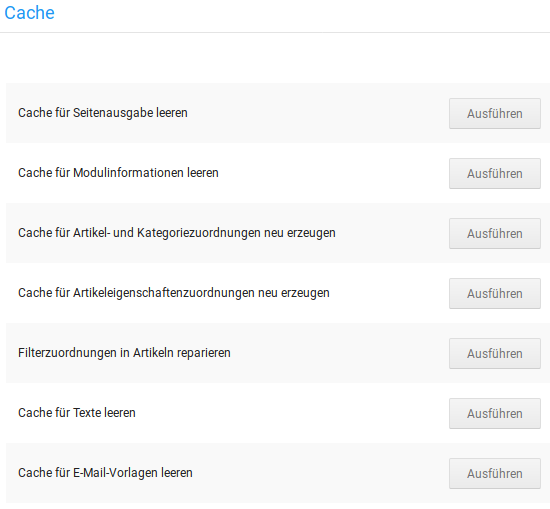

# Cache

## Einleitung

Die Shopsoftware baut jede Seite des Shops  aus verschiedenen Bestandteilen - vorgefertigten Texten, Datenbankinformationen, Grafiken, Skripten etc. - zusammen. Das Endergebnis wird in Form einer HTML-Datei im Browser des Besuchers angezeigt.

Der Cache (gesprochen Käsch) funktioniert als Zwischenspeicher. Dieser hält die fertigen HTML-Seiten bereit, damit sie direkt beim Aufruf des Shops zur Verfügung stehen und nicht jedes Mal neu zusammengestellt werden müssen. 

!!! note "Hinweis"

	 Es gibt verschiedene Arten von Caches, darunter ist auch der sogenannte Browser-Cache, also ein eigener Zwischenspeicher im Webbrowser. Dieser legt ebenfalls Kopien der Seiten an, die er aus dem Shop bekommen hat. 

	 Dies kann problematisch werden, wenn man Änderungen am Shop vornimmt und diese prüfen möchte; da einem so gegebenenfalls noch eine Ansicht angezeigt wird, die die alten Einstellungen verwendet hat. 

	 Bei manchen Browsern kann der Cache mit der Tastekombination _**STRG + SHIFT + R**_ geleert werden. Oft ist es jedoch notwendig, dies in den Browsereinstellungen vorzunehmen.

## Caches im Shop

Unter _**Toolbox > Cache**_ können die verschiedenen Caches des Shops geleert bzw. neu erzeugt werden.

Die einzelnen Caches sind im Gambio Admin von den allgemeineren zu den spezielleren angeordnet. Daher sollten sie immer **von unten nach oben** geleert bzw. neu erzeugt werden - zuerst die spezielleren Änderungen, zuletzt die allgemeine Anzeige. Klicke hierzu jeweils auf _**Ausführen**_, neben dem jeweiligen Cache-Eintrag und warte, bis die Bestätigungsmeldung angezeigt wird.

Nachfolgend ein paar Beispiele, wann welche Caches geleert werden sollten:

!!! example "Änderungen an Kategorien"

	 Wenn Kategorien neu erstellt, umbenannt, verschoben, kopiert, gelöscht oder neu verschachtelt werden, ist es i.d.R. notwendig die folgenden Caches zu leere bzw. neu zu erzeugen:

	 1. Artikel- und Kategorizuordnungen
	 2. Modulinformationen
	 3. Seitenausgabe

!!! example "Änderungen an Texten"

	 Werden shopinterne Texte unter _**Inhalte > Texte anpassen**_ geändert, sollten die folgenden Caches geleert werden:

	 1. Texte
	 2. Seitenausgabe

!!! example "Änderungen an E-Mail-Vorlagen"

	 Werden E-Mail-Vorlagen angepasst, müssen die folgenden Caches geleert werden:

	 1. E-Mail-Vorlagen
	 2. Modulinformationen
	 3. Seitenausgabe

!!! note "Hinweis"

	 Für die meisten Fälle ist es ausreichend, die Caches für _**Modulinformationen**_ und _**Seitenausgabe**_ zu leeren, in dieser Reihenfolge.

