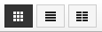

# Dateimanager

Ab Shopversion 3.7 steht der _**Responsive Filemanager**_ zur Verfügung, über den direkt auf benötigte Dateien auf dem FTP-Server zugegriffen werden kann. Es ist ebenfalls möglich Dateien auf diese Weise hoch- oder runterzuladen. Ist der Dateimanager installiert, kann er über _**Toolbox \> Dateimanager**_ aufgerufen werden.

## Installation des Dateimanagers

### Hochladen auf den FTP-Server

Im Installationspaket deines Shops findest du den Ordner _**ResponsiveFilemanager**_. Lade diesen Ordner in das Hauptverzeichnis deines Shops, sofern noch nicht geschehen.

!!! note "Hinweis" 
	 Das Installationsverzeichnis deines Shops kann über einen kleinen Trick relativ einfach festgestellt werden. Rufe im Gambio Admin wahlweise _**Toolbox \> Dateien sichern**_ oder _**Toolbox \> Datenbanksicherung**_ auf. Es wird jeweils eine Tabelle mit Sicherungen angezeigt. Unter der Tabelle ist das sogenannte Sicherungsverzeichnis angegeben, z.B.

	 _**/htdocs/shop/admin/backups/**_

	 oder dergleichen \(in deinem Shop wird wahrscheinlich ein anderer Pfad angezeigt\). Entferne gedanklich den Teil

	 _**/admin/backups/**_

	 und du erhältst den Ordner auf dem FTP-Server.

### Installation im Shop

Der Dateinamanger kann unter _**Module \> Modul-Center**_ installiert werden. Wähle hier den Eintrag _**Dateimanager**_ aus und klicke unten rechts auf _**Installieren**_. Anschließend steht das Modul zur Verfügung und wird im Shop verwendet.

## Konfiguration

Der Dateimanager ist nach der Installation für Verwendung im ganzen Shop voreingestellt. Unter _**Module \> Modul-Center**_ können diese Einstellungen bei Bedarf angepasst werden. Es stehen folgende Einstellungsmöglichkeiten zur Verfügung:

-   Dateimanager in CKEditor einbinden
-   Dateimanager in Kategorien- und Artikelseiten einbinden
-   Dateimanager in Hersteller-Seiten einbinden
-   Dateimanager in Content-Manager-Seiten einbinden
-   Dateimanager in Artikelattribute-Seiten einbinden
-   Dateimanager in Artikeleigenschaften-Seiten einbinden
-   Dateimanager in Banner-Manager-Seiten einbinden
-   Dateimanager in Lieferstatus-Seiten einbinden
-   Dateimanager in Emails-Seite einbinden

Setze bzw. entferne einen Haken, um die jeweiligen Einstellung zu aktivieren bzw. zu deaktivieren und bestätige die Änderungen mit einem Klick auf _**Speichern**_.

## Funktionsübersicht des Dateimanagers

Das Fenster des Dateimanagers besteht aus einem zentralen Bereich, in dem Dateien und Verzeichnisse angezeigt werden, sowie zwei Leisten über die Einstellungen vorgenommen werden können.

Die Hauptfunktionen befinden sich am linken Ende der oberen Leiste, diese sind von links nach rechts:

-   Hochladen
-   Neue Datei
-   Neues Verzeichnis
-   Aus der Zwischenablange einfügen
-   Zwischenablage leeren

In der Mitte der oberen Leiste sind die Einstellungen für die Ansicht:

-   Box Ansicht
-   Listenansicht
-   Spaltenansicht

Am rechten Ende der oberen Leiste befinden sich die Filtereinstellungen. Wähle einen der Filter-Buttons aus um nur

-   Dateien
-   Bilder
-   Archive
-   Videos
-   Musik

anzeigen zu lassen bzw. verwende das Eingabefeld 'text filter' um nach einem Dateinamen zu filtern.

Über einen Klick auf das x \(Alle\) wird der Filter zurückgesetzt.

In der unteren Leiste befindet sich links die Angabe des aktuellen Pfads, über einen Klick auf eines der angegebenen Verzeichnisse kann dorthin gewechselt werden. Mit einem Klick auf das Haus gelangst du zum Hauptverzeichnis.

Rechts sind die Steuerungen

-   Sortiere
-   Aktualisieren
-   Sprache wechseln
-   über...

## Verwenden des Dateimanagers

Der Dateimanager kann wahlweise unter _**Toolbox \> Dateimanager**_ bzw. in dem jeweiligen Bereich, in dem dieser eingebunden wird, aufgerufen werden. Klicke hierzu auf die Schaltfläche mit dem Datei-Upload-Symbol. Je nach Bereich, aus dem der Dateimanager heraus aufgerufen worden ist, wird das zugeorndete Verzeichnis auf dem FTP-Server angezeigt. Beim Aufruf über _**Toolbox \> Dateimanager**_ wird das Hauptverzeichnis des Shops angezeigt.

!!! note "Hinweis" 
	 Der Dateimanager zeigt nur die Dateien und Verzeichnisse an, die für die Bearbeitung relevant sind. Quelldateien, welche die Funktion des Shops betreffen, sind hierüber nicht verfügbar.

### Hochladen einer Datei

Klicke auf _**Hochladen**_, es öffnet sich der Dialog zum Hochladen einer Datei. Ziehe die gewünschte\(n\) Datei\(en\) in das weiße Feld, um diese hochzuladen oder klicke wahlweise auf die grüne Schaltfläche _**Dateien hinzufügen**_.

### Anlegen einer textbasierten Datei

Klicke auf _**Neue Datei**_ um eine Datei anzulegen. Lege den Namen im Feld _**Dateiname**_ fest und wähle die gewünschte Endung im Dropdown rechts davon. Im darunterliegenden Textfeld kann der Inhalt festgelegt werden. Über Klick auf _**OK **_wird die Datei angelegt, über _**Abbrechen**_ kannst du den Dialog ohne Anlegen einer Datei schließen.

### Anlegen eines Verzeichnisses

Über Klick auf _**Neues Verzeichnis**_ kann ein neuer Ordner im aktuellen Verzeichnis angelegt werden. Gib den Namen des Ordners an und bestätige mit _**OK**_. Mit Klick auf _**Abbrechen**_ verlässt du den Dialog, ohne eine Verzeichnis anzulegen.

### Aktionen bei Dateien

Um eine Aktion mit einer Datei auszuführen, bewege den Mauszeiger darüber. Der Dateiname bewegt sich nach oben und es werden der Reihe nach folgende Icons angezeigt:

-   Download
-   Vorschau
-   Umbenennen
-   Löschen

Ist ein Icon ausgegraut, kann die jeweilige Aktion nicht ausgeführt werden.

### Aktionen bei Verzeichnissen

Um eine Aktion mit einem Verzeichnis auszuführen, bewege den Mauszeiger darüber. Der Verzeichnisname bewegt sich nach oben und es werden der Reihe nach folgende Icons angezeigt:

-   Umbenennen
-   Löschen