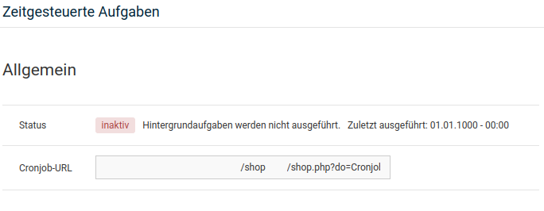
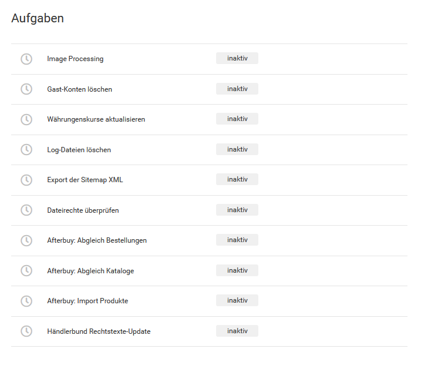
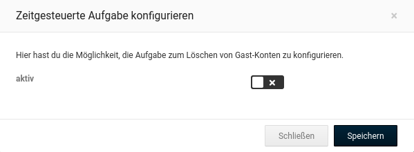

# Zeitgesteuerte Aufgaben

Über zeitgesteuerte Aufgaben lassen sich bestimmte Aktionen automatisch ausführen. Gehe hierzu im Gambio Admin unter _**Toolbox \> Zeitgesteuerte Aufgaben**_. Mögliche Aktionen sind:

-   Image Processing
-   Gast-Konten löschen
-   Währungskurse aktualisieren
-   Log-Dateien löschen
-   Export der Sitemap XML
-   Dateirechte überprüfen
-   Afterbuy: Abgleich Bestellungen
-   Afterbuy: Abgleich Kataloge
-   Afterbuy: Import Produkte
-   Händlerbund Rechtstexte-Update

Um eine dieser Aktionen automatisch ausführen zu können, muss die gewünschte Aufgabe zuerst über das Stift-Symbol aufgerufen und bearbeitet werden. Es öffnet sich ein weiteres Fenster, in dem die Aufgabe aktiviert und gespeichert werden kann. Setze hierzu den Haken hinter _**aktiv**_ und bestätige dies mit einem Klick auf _**Speichern**_.

Damit die eingestellten Aufgaben ausgeführt werden, muss bei deinem Hoster \(oder wahlweise einem anderen, hierauf spezialisierten Anbieter\) ein sogenannter _**Cronjob**_ eingerichtet werden. Dieser ruft in einem bestimmten Intervall eine voreingestellte Internetadresse \(URL\) auf.

Kopiere für die Einrichtung den Inhalt des Felds _**Cronjob-URL**_ und verwende ihn als Aufruf-URL für den Cronjob. Stelle zudem das Intervall auf eine Minute ein. Details und weitere Hilfestellung hierzu erhältst du bei deinem jeweiligen Hosting- oder Cronjob-Anbieter.

