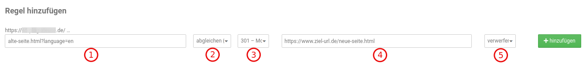

# Weiterleitungsregeln

## Verfügbarkeit

Dieses Modul wurde mit der Shopversion _**v4.3.x**_ eingeführt und kann unter _**Toolbox > Weiterleitungsregeln**_ aufgerufen werden. Es ist nicht separat erhältlich und steht somit nur für Shopversion _**4.3**_ oder neuer zur Verfügung.

## Einsatzzweck

Mit diesem Modul können Seiten umgeleitet werden, die bei einem direkten Aufruf einen Fehlercode _**404**_ (File not found) zurückliefern würden. Es ist also nicht möglich bestehende und aufrufbare Shopseiten damit umzuleiten.

## Browsercache

Die Option _**Weiterleitungen im Browsercache halten**_ legt fest wie lange die Information über die Weiterleitungen im Browsercache des Besuchers gehalten werden sollen.

## Regel hinzufügen

### Standardeinstellung

Im Standard ist der Expertenmodus nicht aktiv. Beim Einrichten von Weiterleitungsregeln werden bei deaktiviertem Expertenmodus immer die Einstellungen

- Parameter abgleichen
- 301 Umleitung
- Parameter verwerfen

angewendet. Nachfolgend beschreiben wir diese im Abschnitt _**Expertenmodus**_.

### Expertenmodus

#### 1: Umzuleitende/ungültige URL

Hier wird die alte, nicht mehr aufrufbare URL eingetragen. Eine URL kann neben dem Pfad zur Seite nach einem Trennzeichen ("?") zusätzliche Parameter haben, wie z.B. Angaben für die gewünschte Sprache, Währung, etc. In unserem Beispiel gibt es den Parameter _?language=en_, der festlegt, dass es sich hier um die englische Variante der Produktseite handelt.

#### 2: Parameter abgleichen/ignorieren

##### Abgleichen

Beim Abgleich wird zwischen der umzuleitenden URL und der vom Besucher aufgerufenen URL geprüft, dabei können auch die der URL angehängten Parameter berücksichtigt werden. Hierbei müssen die Parameter nur in der vom Besucher aufgerufenen URL vorkommen, können aber auch in anderer Reihenfolge angegeben sein. Werden hingegen keine Parameter angegeben, so wird nur bei absoluter Übereinstimmung der URL umgeleitet.

!!! example "Beispiele"

    | Umzuleitende URL (aus Punkt 1)               | Aufruf vom Besucher                             | Verhalten                                                    |
    | -------------------------------------------- | ----------------------------------------------- | ------------------------------------------------------------ |
    | https://www.shop.de?language=de&currency=EUR | https://www.shop.de?currency=EUR&language=de    | Parameter werden trotz anderer Reihenfolge als vorhanden erkannt, es wird auf die gewünschte Ziel-URL umgeleitet |
    | https://www.shop.de/alte-seite.html          | https://www.shop.de/alte-seite.html             | 100% Übereinstimmung zwischen ungültiger und aufgerufener URL, es wird auf die gewünschte Ziel-URL umgeleitet |
    | https://www.shop.de/alte-seite.html          | https://www.shop.de/alte-seite.html?language=en | Keine komplette Übereinstimmung zwischen ungültiger und aufgerufener URL, es wird nicht umgeleitet |

##### Ignorieren

Diese Einstellung wird gewählt, wenn die angegebene alte URL immer umgeleitet werden soll, unabhängig davon, ob noch Parameter folgen. Hierüber ist dann auch das Umleiten von kompletten alten URLs oder alten Kategorien möglich. Es kann mit einem Wildcard bestimmt werden, dass alles zutreffende umgeleitet werden soll.

!!! example "Beispiele"

    | Umzuleitende URL (aus Punkt 1)               | Aufruf vom Besucher                             | Verhalten                                                    |
    | -------------------------------------------- | ----------------------------------------------- | ------------------------------------------------------------ |
    | https://www.shop.de/alte-kategorie/*         | https://www.shop.de/alte-kategorie/artikel.html | Die vom Kunden aufgerufene URL enthält die umzuleitende URL, es wird daher auf die gewünschte Ziel-URL umgeleitet. |
    | https://www.shop.de?language=de&currency=EUR | https://www.shop.de?language=de                 | Parameter werden ignoriert, geprüft wird nur, ob die aufgerufene URL https://www.shop.de enthält. Das ist hier der Fall, es wird also auf die Ziel-URL umgeleitet. |

#### 3: Art der Weiterleitung

Hier kann die gewünschte Art der Weiterleitung ausgewählt werden. In der Standardeinstellung wird hier _**301 – Moved Permanently**_ gesetzt. Bei erweiterten Anforderungen stehen außerdem zur Verfügung:

- 301 – Moved Permanently (Dauerhafte Weiterleitung)
- 302 – Found (vorübergehende Umleitung)
- 303 – See Other (Expertenoptionen)
- 307 – Temporary Redirect (Expertenoptionen)
- 308 – Permanent Redirect (Expertenoptionen)

!!! note "Hinweis"
    Zu den einzelnen Weiterleitungsarten als solchen können wir im Rahmen dieses Handbuchs leider keine detaillierte Beschreibung oder Hilfestellung anbieten. Da hierbei serverseitige Einstellungen betroffen sind, empfehlen wir im Zweifelsfall deinen Hosting-Anbieter zu kontaktieren.

#### 4: Ziel-URL

Hier wird angegeben, wohin der Besucher bei Aufruf der angegebenen ungültigen URL umgeleitet werden soll. Diese URL wird absolut (vollständig) angegeben und kann auch außerhalb des Shops liegen.

#### 5: Behandlung der Parameter

##### Erweitern

Wird Erweitern gewählt, werden die beim Aufruf der Seite angegebenen Parameter mit an die Ziel-URL gehängt. Die Parameter (hier: artikel.html) werden also übernommen.

!!! example "Beispiel"

    | Umzuleitende URL (aus Punkt 1)       | Aufruf vom Besucher                             | im Modul angegebene Ziel-URL | tatsächliche Ziel-URL                |
    | ------------------------------------ | ----------------------------------------------- | ---------------------------- | ------------------------------------ |
    | https://www.shop.de/alte-kategorie/* | https://www.shop.de/alte-kategorie/artikel.html | https://www.ziel-url.de      | https://www.ziel-url.de/artikel.html |

##### Verwerfen

Wird Verwerfen ausgewählt, werden die Parameter nicht auf die Ziel-URL übernommen, sondern verworfen.

!!! example "Beispiel"

    | Umzuleitende URL (aus Punkt 1)       | Aufruf vom Besucher                         | im Modul angegebene Ziel-URL | tatsächliche Ziel-URL   |
    | ------------------------------------ | ------------------------------------------- | ---------------------------- | ----------------------- |
    | https://www.shop.de/alte-kategorie/* | https://shop.de/alte-kategorie/artikel.html | https://www.ziel-url.de      | https://www.ziel-url.de |

