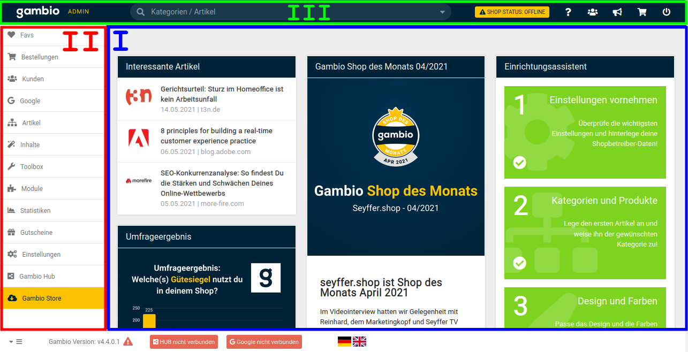

# Gambio Admin 

1.  \(I\) rechte Spalte
2.  \(II\) linke Spalte: In der linken Spalte des Gambio Admins werden die Konfigurationsmodule in Oberkategorien zusammengefasst dargestellt.
3.  \(III\) oberes Menü: Im zentralen Bereich des oberen Menüs findest du ein Feld zur Schnellsuche von Artikeln, Bestellungen und Kunden. Hier kannst du gezielt nach Artikelnamen, Bestellnummern oder Kundennamen suchen. Im rechten Bereich des oberen Menüs findest du einen zusätzlichen Eintrag für die Suche, die Admin-Info-Box für Benachrichtigungen sowie Schaltflächen zum Aufrufen des Shops und zum Abmelden.

!!! note "Hinweis"
	 Einträge des Konfigurationsmenüs können als Favorit zugeordnet werden, diese werden dann zusätzlich unter Favs angezeigt.

	 Um einen Eintrag als Favorit zu setzen, klicke ihn an und halte die linke Maustaste gedrückt. Ziehe den Eintrag anschließend nach rechts, es wird eine Box mit einem Herz-Symbol angezeigt. Ziehe den Eintrag darauf und lasse die Maustaste los, der Eintrag ist nun unter Favs aufgeführt.

	 Ein Eintrag kann auf die gleiche Weise wieder aus den Favs entfernt werden, indem dieser nach rechts auf das sich einblendende Mülltonnen-Symbol gezogen wird.

	 Einträge unter Favs werden zusätzlich angelegt. Die normalen Menüpunkte werden hierdurch weder verschoben noch entfernt.

!!! note "Hinweis"
	 Die Suche im Gambio Admin ist für genaue Übereinstimmungen ausgelegt, daher sollte bei der Suche nach Teilbegriffen auf sogenannte Wildcards zurückgegriffen werden.

	 Wenn zum Beispiel nach streifen gesucht wird, werden auch nur Artikel mit exakt diesem Artikelnamen gefunden. Mit der Verwendung von Sternchen als Wildcard kann über die Suche \*streifen\* auch der Artikel Nadelstreifenanzug gefunden werden.

