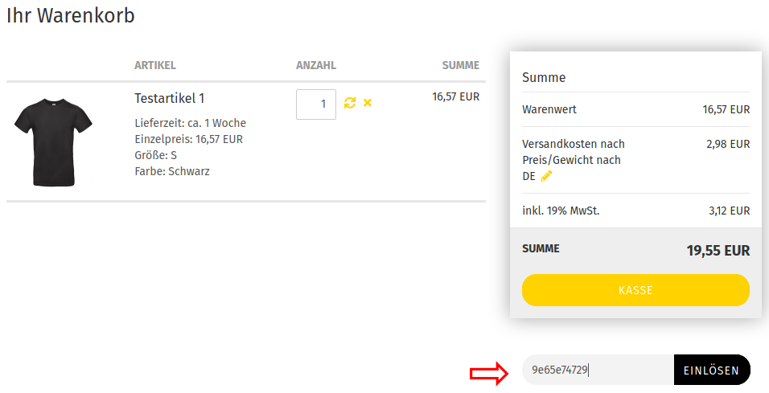
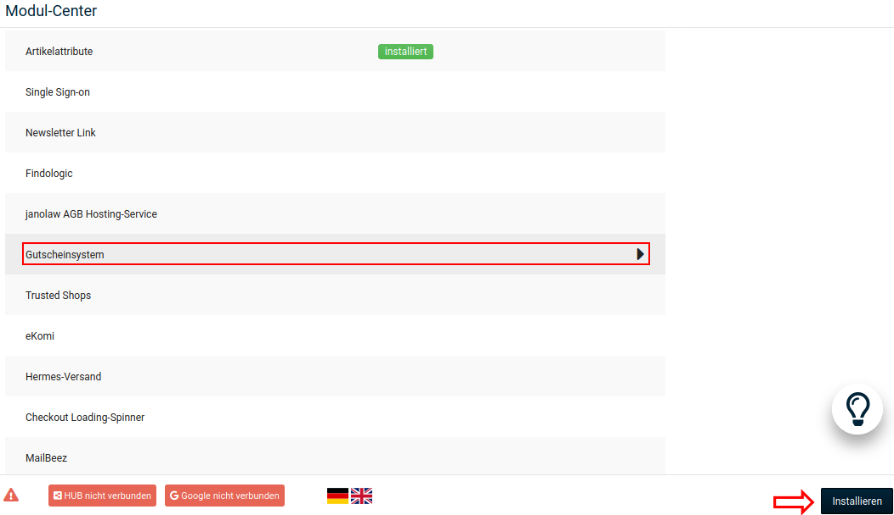
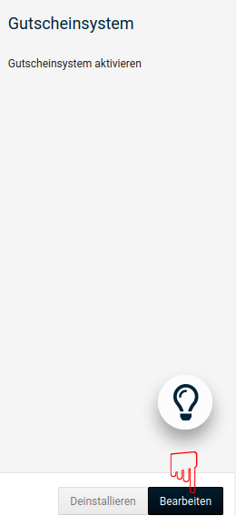
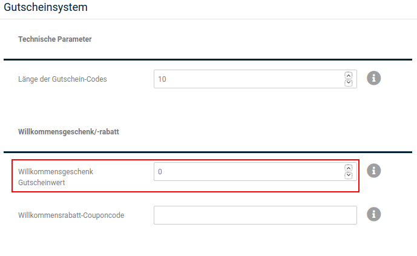
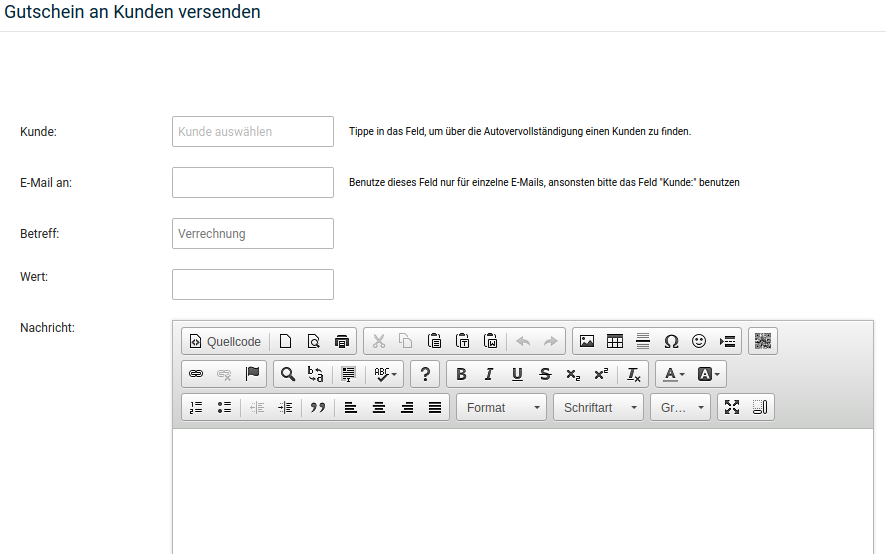
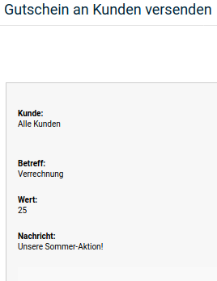

# Gutscheine

Gutscheine können von dir im Shop zum Kauf angeboten werden. Außerdem hast du die Möglichkeit, Gutscheine gezielt an bestimmte Kunden oder potentielle Neukunden zu versenden.

Installiere das Modul _**Gutscheine**_ unter _**Module \> Zusammenfassung**_, damit Gutscheine bei der Berechnung der Bestellsummen berücksichtigt werden.

!!! note "Hinweis" 
	 Der Gutscheinwert ist nicht an das Kunden- oder Gastkonto gebunden, an das der Gutscheincode verschickt oder von dem der Gutschein-Artikel erworben wurde.

## Gutscheine verschicken

### Willkommensgeschenk-Gutschein

Das Shopsystem kann neuen Kunden mit der Registrierungsbestätigung einen Willkommens-Gutschein ausstellen. Der Gutschein muss vom Kunden aktiv eingelöst werden, damit er verwendet werden kann.

Aktiviere das _**Gutscheinsystem**_, indem du das zugehörige Modul unter _**Module \> Modul-Center**_ installierst.

Bearbeite das Modul, um den Wert des Willkommensgeschenk-Gutscheins einzutragen.

Trage den gewünschten Gutscheinwert in das Feld _**Willkommensgeschenk Gutscheinwert**_ ein.

!!! note "Hinweis" 
	 Wenn du sowohl einen Willkommensgeschenk-Gutschein als auch einen Willkommens-Rabatt Coupon einrichtest, wird dem Kunden bei der Registrierung ein Gutschein-Code und ein Coupon-Code zugeschickt.

### Gutschein E-Mail

Wenn du einem bestimmten Kunden oder einem potentiellen Neukunden einen Gutschein zusenden möchtest, rufe im Gambio Admin den Menüpunkt _**Gutscheine \> Gutschein E-Mail**_ auf.

1.  Wähle einen Kunden aus der Liste _**Kunde**_ oder trage eine E-Mail Adresse deiner Wahl in das Feld _**E-Mail an**_ ein
2.  Gib im Feld _**Betreff**_ einen Betreff für die Gutschein E-Mail ein

    Wenn du keinen Betreff einträgst, wird als Betreff _**Verrechnung**_ verwendet

3.  Gib den Gutschein-Wert im Feld _**Wert**_ ein
4.  Im Feld _**Nachricht**_ kannst du eine persönliche Nachricht hinzufügen
5.  Klicke auf _**E-Mail senden**_, um eine Vorschau anzuzeigen
6.  Klicke erneut auf _**E-Mail senden**_, um den Gutschein zu verschicken

Der Gutschein-Empfänger erhält eine E-Mail mit dem gewählten Betreff. Die E-Mail enthält den Gutschein-Code für die Eingabe im Warenkorb sowie einen Link, über den der Gutschein direkt eingelöst werden kann.

!!! note "Hinweis" 
	 Der Gutschein-Empfänger kann den Gutschein-Code weitergeben, sodass ein anderer Kunde den Gutschein einlösen kann.
	 
## Gutscheine als Artikel

Gutscheine können als Artikel im Shop angeboten werden. Deine Kunden kaufen mit einem Gutschein-Artikel Guthaben, das sie einer anderen Person per E-Mail schenken oder bei einem späteren Einkauf verrechnen lassen können.

!!! danger "Achtung"
	 Gutschein-Artikel können nur direkt im Shop bestellt werden. Das manuelle Anlegen oder Nachbearbeiten einer Bestellung mit Gutschein-Artikeln ist nicht vorgesehen; so hinzugefügte oder bearbeitete Gutscheine werden nicht vom Gutscheinsystem verarbeitet.

	 Anstelle einer händisch angelegten Bestellung sollte die Funktion _**Als Kunde einloggen**_ über die Dropdown-Schaltfläche des jeweiligen Kundenkontos unter _**Kunden > Kunden**_ verwendet werden, um eine Bestellung anstelle des Kunden auszuführen.

1.  Lege einen neuen Gutschein-Artikel an.

    Achte beim Anlegen von Gutschein-Artikeln auf die im Kapitel _**Artikel anlegen**_ beschriebenen Pflichtfelder.

2.  Trage im Feld _**Artikelnummer**_ eine Artikelnummer ein, die mit dem Schlüsselwort _**GIFT\_**_ beginnt, gefolgt von einer Nummer.
3.  Trage im Feld _**Preis**_ den Gutscheinwert ein.
4.  Speichere deinen neuen Artikel.

Der bestellte Gutschein muss freigegeben werden, bevor er einglöst werden kann. Hierzu gibt es im Shop zwei verschiedene Möglichkeiten:

### Freigeben über die Gutschein-Freigabeliste

Der bestellte Gutschein wird in der Freigabeliste unter _**Gutscheine \> Gutschein Queue**_ aufgelistet. Wenn du den Zahlungseingang verzeichnet hast, schalte den Gutschein frei.

")

1.  Klicke auf die Zeile mit dem freizugebenden Gutschein

    Die Zeile färbt sich dunkelgrau ein

2.  Klicke auf _**Einlösen**_

    Zum Freigeben eines Gutscheins sind zwei Schritte nötig, um fehlerhaften Freigaben vorzubeugen. Es wird der Dialog zum Versenden einer Gutschein-E-Mail aufgerufen.

3.  Passe bei Bedarf die Angaben in den Feldern _**E-Mail an**_, _**Betreff**_ oder _**Wert**_ an und füge ggf. eine persönliche _**Nachricht**_ hinzu. Klicke auf _**E-Mail senden**_ und prüfe die Vorschau. Klicke erneut auf _**E-Mail senden**_, um den Versand zu bestätigen.

    Der Kunde wird per E-Mail über die Freigabe informiert

### Freigeben über den Bestellstatus

Alternativ kannst du unter _**Bestellungen \> Bestellungen**_ den Status der zugehörigen Bestellung ändern. Hierzu muss zuvor im Modul _**Gutscheinsystem**_ unter _**Module \> Modul-Center**_ zumindest ein Status unter _**Bestellstatus für automatischen Versand von Gutscheincodes**_ angehakt sein \(siehe Kapitel _**Gutscheinsystem**_\). Dem Kunden wird beim Ändern des Status eine Gutschein E-Mail zugesendet, die den Code zum Einlösen enthält.

## Gutscheinkarten

Da der Gutscheinwert beim Kauf von Gutschein-Artikeln direkt dem Guthabenkonto des Käufers gutgeschrieben wird, ist ein Verkauf von Gutscheinkarten nicht direkt möglich.

1.  Erstelle einen neuen, regulären Artikel für deine Gutscheinkarte

    Die Artikelnummer für die Gutscheinkarte sollte nicht mit _**GIFT\_**_ beginnen

2.  Wenn ein Kunde eine Gutscheinkarte bestellt, sende dir selbst über die Funktion _**Gutscheine \> Gutschein E-Mail**_ einen Gutschein über den gewählten Wert zu
3.  Du erhältst eine E-Mail mit dem Gutschein-Code
4.  Trage den Gutschein-Code auf deiner Gutscheinkarte ein
