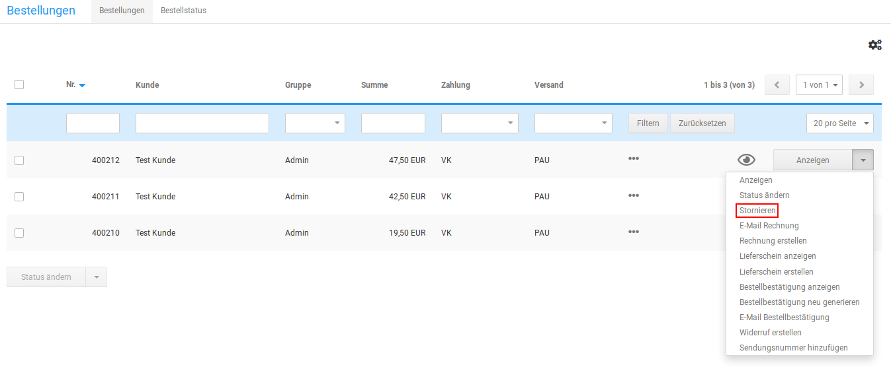
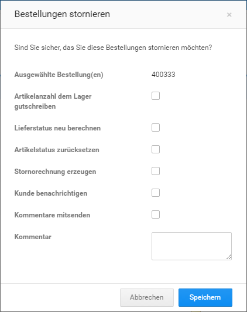

# Bestellung rückabwickeln

!!! note "Hinweis" 
	 Die enthaltenen Möglichkeiten für die Bestellabwicklung sind nur rudimentär und für erweiterte Funktionen, wie teilweise Stornierungen und Gutschriften, nicht ausgelegt. Wenn du auf diese Funktionalitäten nicht verzichten kannst, binde deinen Onlineshop an ein Warenwirtschafts- oder Finanzbuchhaltungs-System an, das dies unterstützt.

## Bestellung stornieren

Bestellungen kannst du im Gambio Admin deines Shops unter _**Bestellungen \> Bestellungen**_ stornieren. Der Bestellstatus einer stornierten Bestellung kann nachträglich nicht mehr verändert werden.

1.  Wähle aus der Bestellübersicht die zu stornierende Bestellung aus

    Die aktuell gewählte Bestellung ist grau hinterlegt

2.  Klicke in der Dropdown-Schaltlfläche auf _**Stornieren**_
3.  Fülle die Maske _**Stornieren**_ aus

    Eine Beschreibung der Felder in der Maske _**Stornieren**_ findest du in der Tabelle _**Übersicht über die Stornieren-Maske**_

4.  Klicke auf _**Senden**_

    Der Bestellstatus deiner Bestellung wechselt auf _**Storniert**_

!!! danger "Achtung"

	 Wurde zu einer zu stornierenden Bestellung bereits eine Rechnung erstellt, sollte hierzu eine Stornorechnung erzeugt werden \(siehe _**Stornorechnung erzeugen**_\).

|Feldname|Beschreibung|
|--------|------------|
|Artikelanzahl dem Lager gutschreiben|wenn aktiviert, wird die Artikelanzahl dem Lagerbestand gutgeschrieben|
|Lieferstatus neu berechnen|wenn aktiviert, wird der Lieferstatus für die Artikel der Bestellung neu berechnet \(nur, wenn du automatische Lieferstatus verwendest\)|
|Artikelstatus zurücksetzen|wurde der Artikel während der Bestellung inaktiv gesetzt, wird dies rückgängig gemacht|
|Stornorechnung erzeugen|wurde zu der Bestellung bereits eine Rechnung erzeugt, wird eine entsprechende Stornorechnung angelegt|
|Kunde benachrichtigen|wenn aktiviert, wird der Kunde über die Stornierung benachrichtigt|
|Kommentare mitsenden|wenn aktiviert, wird der Benachrichtigung ein persönlicher Kommentar mitgesendet|
|Betreff|Betreff der Benachrichtigung|
|E-Mail|Empfänger der Benachrichtigung|
|Kommentare|persönlicher Kommentar zur Benachrichtigung|

## Gutschrift erstellen

Eine direkte Gutschrift kann ohne Hilfsmittel, wie ein angebundenes Warenwirtschaftssystem, nicht erstellt werden. Für vollständige Stornierungen kannst du deinem Kunden unter _**Gutscheine \> Gutschein E-Mail**_ einen Gutschein per E-Mail senden.

!!! note "Hinweis" 
	 Das Gutscheinsystem unter _**Module \> Modul-Center**_ muss installiert und aktiviert sein, damit deine Kunden Gutschein-Codes im Shop einlösen können.
	 
