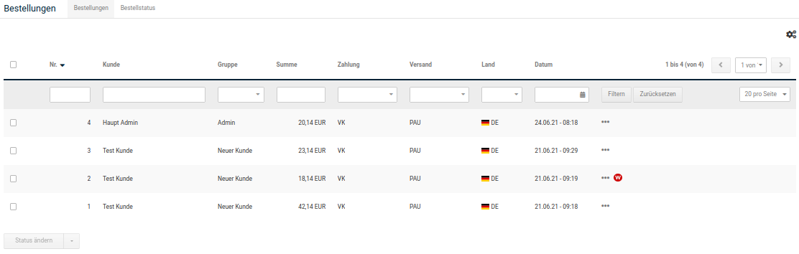
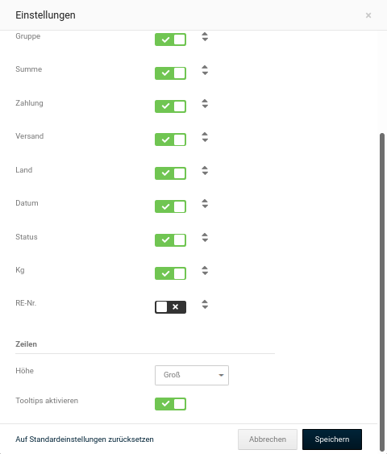
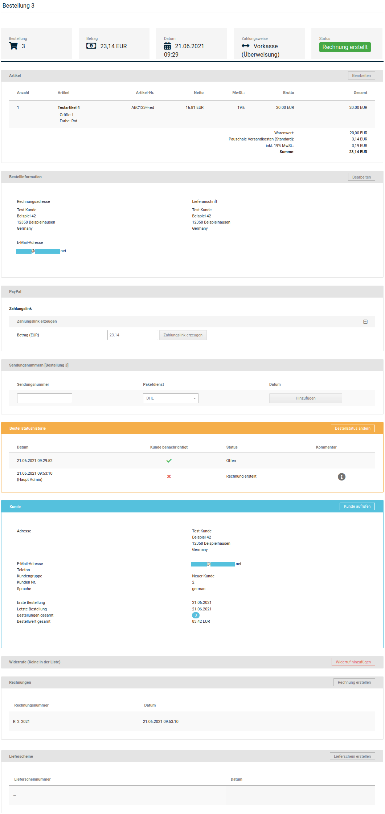
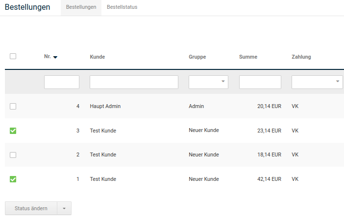
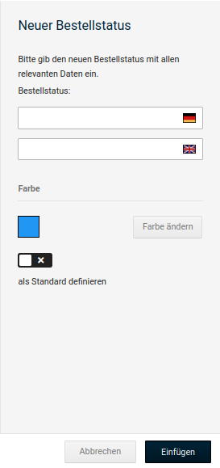
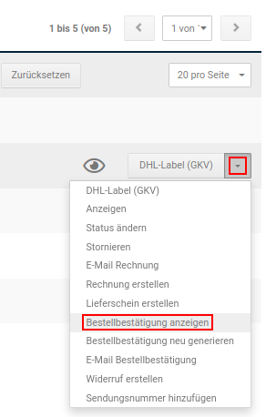
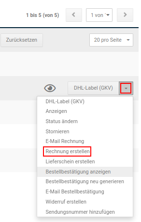

# Bestellungen abwickeln

Im Gambio Admin deines Shops unter _**Bestellungen \> Bestellungen**_ findest du eine Übersicht über alle Bestellungen, die im Shopbereich getätigt oder im Gambio Admin manuell angelegt wurden. Der aktuelle Stand einer Bestellung wird über Bestellstatus festgelegt, die in der Spalte _**Status**_ angezeigt werden.

Über das Zahnrad-Symbol \(siehe rote Markierung in der Abbildung _**Bestellübersicht**_\) können die Einstellungen der Bestellübersicht aufgerufen werden. Im oberen Teil werden die einzelnen Spalten der Übersicht aufgelistet. Durch Setzen beziehungsweise Entfernen des Häkchens hinter dem Spaltennamen kann die jeweilige Spalte zur Anzeige an- respektive abgeschaltet werden.

Die Reihenfolge der Spalten kann geändert werden, indem du den Mauszeiger über das Pfeilsymbol bewegst und die linke Maustaste klickst und hältst. Ziehe anschließend die betreffende Spalte nach oben oder unten an ihre neue Position und lasse die Maustaste wieder los.

Über die das Dropdown _**Höhe**_ kannst du die Zeilenhöhe der Übersicht einstellen. Setze beziehungsweise entferne den Haken für _**Tooltips aktivieren**_ um die Anzeige der Tooltips an- respektive abzuschalten.

Die Detailseite zu einer Bestellung enthält zusätzliche Informationen, wie die verwendete Zahlungsweise, die Versandart und die Rechnungs- und Lieferadresse.

1.  Wähle in der Liste _**Bestellungen**_ die gewünschte Bestellung aus
2.  Klicke am Ende der Zeile auf _**Anzeigen**_ oder das Augen-Symbol

")

!!! note "Hinweis" 
	 Die Detailseite einer Bestellung enthält alle für die Bestellabwicklung nötigen Funktionen. Wesentliche Funktionen sind zum schnellen Zugriff auch in der Bestellübersicht vorhanden.

## Bestellstatus

Über den Bestellstatus wird der aktuelle Stand der Bestellung festgelegt. Der Bestellstatus ist sowohl für den Shopbetreiber im Gambio Admin des Shops, als auch für den Kunden im Shopbereich sichtbar.

### Bestellstatus einer Bestellung ändern

Den Bestellstatus einer einzelnen Bestellung kannst du auf der Detailseite der Bestellung im Gambio Admin unter _**Bestellungen \> Bestellungen**_ ändern.

")

1.  Klicke auf die farbige Status-Anzeige oder die Schaltfläche _**Bestellstatus ändern**_ und wähle aus der Liste _**Neuer Bestellstatus**_ den neuen Bestellstatus aus
2.  Aktiviere das Kontrollkästchen _**Kunde benachrichtigen**_, wenn der Kunde per E-Mail über die Änderung des Bestellstatus informiert werden soll
3.  Aktiviere das Kontrollkästchen _**Kommentare mitsenden**_, wenn der Inhalt des Feldes _**Kommentar**_ in der Benachrichtigung mitgesendet werden soll
4.  Aktiviere das Kontrollkästchen _**Sendungsnummer mitsenden**_, wenn du dem Kunden mit der E-Mail-Benachrichtigung die Sendungsnummer und den Tracking-Link des jeweiligen Versanddienstleisters zuschicken möchtest.
5.  Wenn du das Kontrollkästchen _**Kommentare mitsenden**_ aktiviert hast, trage in das Feld _**Kommentar**_ einen persönlichen Kommentar ein, der in der Benachrichtigung mitgesendet werden soll
6.  Klicke auf _**Ausführen**_, um den Bestellstatus zu aktualisieren und je nach Auswahl dem Kunden eine Benachrichtigung per E-Mail zuzusenden

Der neue Bestellstatus ist im Shopbereich unter _**Ihr Konto \> Bestellungen**_ für den Kunden einsehbar. Wenn du die Benachrichtigung aktiviert hast, wird der Kunde außerdem per E-Mail über die Änderung des Status seiner Bestellung informiert.

### Bestellstatus mehrerer Bestellungen gleichzeitig ändern

Den Bestellstatus mehrerer Bestellungen kannst du gleichzeitig in der Bestellübersicht unter _**Bestellungen \> Bestellungen**_ ändern.

")

1.  Aktiviere die Kontrollkästchen in der ersten Spalte der Bestellübersicht-Liste bei den Bestellungen, deren Bestellstatus verändert werden soll
2.  Wähle über die Dropdown-Schaltfläche _**Status ändern**_ aus und wähle den neuen Bestellstatus für alle aktivierten Bestellungen aus
3.  Aktiviere das Kontrollkästchen _**Kunde benachrichtigen**_, wenn die Kunden der Bestellungen per E-Mail über die Änderung des Bestellstatus informiert werden sollen
4.  Aktiviere das Kontrollkästchen _**Sendungsnummern mitsenden**_, wenn du den Kunden mit der E-Mail-Benachrichtung die Sendungsnummer und den Tracking-Link des jeweiligen Versanddienstleisters zuschicken möchtest.
5.  Aktiviere das Kontrollkästchen _**Kommentare mitsenden**_, wenn den Kunden der Inhalt des Feldes _**Kommentar**_ in der Benachrichtigung mitgesendet werden soll
6.  Wenn du das Kontrollkästchen Kommentare mitsenden aktiviert hast, trage in das Feld _**Kommentar**_ einen Kommentar ein, der allen Kunden in der Benachrichtigung mitgesendet werden soll
7.  Klicke auf _**Ausführen**_, um den Bestellstatus zu aktualisieren und je nach Auswahl den Kunden eine Benachrichtigung per E-Mail zuzusenden

Der neue Bestellstatus ist im Shopbereich unter _**Ihr Konto \> Bestellungen**_ für die Kunden der gewählten Bestellungen einsehbar. Wenn du die Benachrichtigung aktiviert hast, werden die Kunden außerdem per E-Mail über die Änderung des Status ihrer Bestellungen informiert.

### Bestellstatus anlegen

Neue Bestellstatus kannst du im Gambio Admin deines Shops unter _**Bestellungen \> Bestellungen \> Bestellstatus**_ anlegen. Klicke hierzu auf _**Erstellen**_.

1.  Trage im Feld _**Bestellstatus**_ einen Namen für den neuen Bestellstatus ein
2.  Aktiviere die Einstellung _**als Standard definieren**_, wenn der neue Bestellstatus automatisch jeder eingehenden Bestellung zugewiesen werden soll
3.  Klicke auf _**Einfügen**_, um den neuen Bestallstatus anzulegen

### Bestellstatus löschen

Vorhandene Bestellstatus kannst du im Gambio Admin deines Shops unter _**Bestellungen \> Bestellungen \> Bestellstatus**_ löschen. Der Standard-Bestellstatus sowie feststehende Bestellstatus können nicht gelöscht werden.

1.  Wähle aus der Liste _**Bestellstatus**_ den zu löschenden Bestellstatus aus

    Der aktuell gewählte Bestellstatus wird grau hinterlegt

2.  Klicke in der rechten Spalte auf _**Löschen**_
3.  Stelle in der rechten Spalte sicher, dass du den korrekten Bestellstatus gewählt hast und klicke erneut auf _**Löschen**_, um das Löschen zu bestätigen

!!! danger "Achtung"

	 Lösche nur Bestellstatus, die keiner Bestellung zugewiesen sind. Bestellungen, deren Bestellstatus gelöscht wurde, werden in der Bestellübersicht nicht mehr angezeigt und sind nur noch über die Direktsuche aufrufbar.

## Bestellbestätigung

Die Bestellbestätigung wird in der Grundkonfiguration automatisch nach dem Eingang einer Bestellung an den Kunden und an die unter _**Kunden \> E-Mails \> E-Mail-Optionen**_ im Feld _**Verrechnung - Weiterleitungsadressen**_ hinterlegten E-Mail Adressen geschickt. Wenn zu einer Bestellung vom Shopsystem keine Bestellbestätigung versendet wurde, wird die betroffene Bestellung in der Bestellübersicht unter _**Bestellungen \> Bestellungen**_ mit einem Briefumschlag-Symbol markiert.

!!! note "Hinweis" 
	 Bei manuell angelegten Bestellungen wird vom Shopsystem keine automatische Bestellbestätigung versendet.

### Bestellbestätigung anzeigen

Die Bestellbestätigung kann zur schnellen Einsicht aus dem Gambio Admin deines Shops angezeigt werden. Klicke in der Bestellübersicht unter _**Bestellungen \> Bestellungen**_ auf den Eintrag _**Bestellbestätigung anzeigen**_ der Dropdown-Schaltfläche. Die Bestellbestätigung zur ausgewählten Bestellung wird in einem neuen Fenster geöffnet.

### Bestellbestätigung versenden

Die Bestellbestätigung zu einer Bestellung versendest du im Gambio Admin deines Shops unter _**Bestellungen \> Bestellungen**_ von Hand. Die E-Mail-Adresse des Empfängers kannst du dabei individuell eingeben.

1.  Wähle aus der Bestellübersicht die Bestellung aus, zu der du eine Bestellbestätigung versenden möchtest
2.  Klicke über die Dropdown-Schaltfläche auf _**E-Mail Bestellbestätigung**_

    Die Funktion zum Versenden der Bestellbestätigung findest du außerdem auf der Detailseite zur gewählten Bestellung am unteren Rand

3.  Trage im Feld _**Betreff**_ einen abweichenden Betreff für die Bestätigungsmail ein
4.  Trage im Feld _**E-Mail**_ die E-Mail-Adresse des Empfängers ein
5.  Klicke auf _**Senden**_, um die Bestätigungsmail an die angegebene E-Mail-Adresse zu senden

### Bestellbestätigung neu generieren

Wenn du Änderungen an einer Bestellung vornimmst, wie unter _**Bestellung bearbeiten**_ beschrieben, musst du die Bestätigungsmail neu generieren. Wähle in der Bestellübersicht die Bestellung aus, zu der du die Bestätigungsmail neu generieren möchtest und klicke über die Dropdown-Schaltfläche auf _**Bestellbestätigung neu generieren**_.

## Rechnung & Lieferschein 

!!! note "Hinweis" 
	 Die Optionen für Rechnung und Lieferschein stehen nur in Verbindung mit dem PDFCreator-Zusatzmodul zur Verfügung, das separat installiert werden muss. Die notwendigen Schritte sind in der Installationsanleitung beschrieben.

Die Rechnung und den Lieferschein zu einer Bestellung kannst du auf der Detailseite der Bestellung im Gambio Admin deines Shops unter _**Bestellungen \> Bestellungen**_ erzeugen. Eine Anleitung zur Konfiguration von Rechnung und Lieferschein findest du im Kapitel _**Rechnung & Lieferschein konfigurieren**_.

### Rechnung erstellen

Wenn du die Rechnung zu einer Bestellung per Post, beispielsweise mit der Lieferung, verschicken möchtest, erstelle die Rechnung im Gambio Admin deines Shops unter _**Bestellungen \> Bestellungen**_.

1.  Wähle aus der Bestellübersicht die Bestellung aus, zu der du eine Rechnung erzeugen möchtest
2.  Klicke in der Dropdown-Schaltfläche auf _**Rechnung erstellen**_

    Die Funktion _**Rechnung erstellen**_ kannst du auch auf der Detailseite der Bestellung unterhalb der Bestelldetails ausführen

3.  Der Bestellstatus deiner Bestellung wechselt auf _**Rechnung erstellt**_, die Rechnung wird erzeugt und im Webbrowser angezeigt

!!! danger "Achtung"

	 Jeder Klick auf _**Rechnung erstellen**_ erzeugt eine neue Rechnung mit eigener Rechnungsnummer. Zur Einsicht klicke stattdessen bitte auf _**Rechnung anzeigen**_.

### Rechnung per E-Mail senden

Wenn du die Rechnung per E-Mail versendest, muss sie vorher nicht generiert werden. Die Rechnung kannst du im Gambio Admin deines Shops unter _**Bestellungen \> Bestellungen**_ versenden.

1.  Wähle aus der Bestellübersicht die Bestellung aus, zu der du eine Rechnung erzeugen möchtest
2.  Klicke in der Dropdown-Schaltfläche auf _**E-Mail Rechnung**_

    Die Funktion _**E-Mail Rechnung**_ kannst du auch auf der Detailseite der Bestellung unterhalb der Bestelldetails ausführen

3.  Der Bestellstatus deiner Bestellung wechselt auf _**Rechnung erstellt**_, die Rechnung wird erzeugt und dem Kunden per E-Mail zugesandt

### Lieferschein erstellen

Wenn du deiner Lieferung einen Lieferschein beilegen möchtest, erstelle den Lieferschein im Gambio Admin deines Shops unter _**Bestellungen \> Bestellungen**_.

1.  Wähle aus der Bestellübersicht die Bestellung aus, zu der du einen Lieferschein erzeugen möchtest
2.  Klicke in der Dropdown-Schaltfläche auf _**Lieferschein erstellen**_

    Die Funktion _**Lieferschein erstellen**_ kannst du auch auf der Detailseite der Bestellung unterhalb der Bestelldetails ausführen

3.  Der Bestellstatus deiner Bestellung bleibt unverändert, der Lieferschein wird erzeugt und im Webbrowser angezeigt
