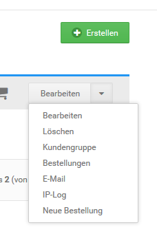
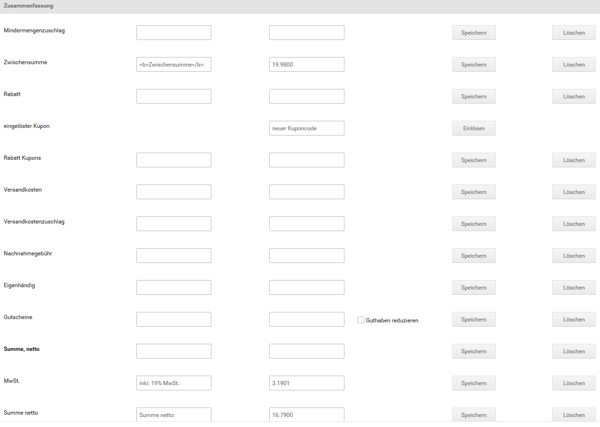

# Bestellung manuell anlegen

Bestellungen kannst du für deine Kunden im Gambio Admin deines Shops unter _**Kunden \> Kunden**_ anlegen. Wähle aus der Kundenliste den Kunden aus, für den du eine neue Bestellung anlegen möchtest. Der aktuell ausgewählte Kunde ist grau hinterlegt. Klicke im Dropdown auf _**Neue Bestellung**_. Das Shopsystem legt eine neue, leere Bestellung für den gewählten Kunden an.

!!! note "Hinweis" 
	 In den meisten Fällen ist es einfacher und komfortabler, Bestellungen im Namen des Kunden über den Shopbereich anzulegen. Registriere dazu ein neues Kundenkonto für deinen Kunden, melde dich mit dem Konto in deinem Shop an und führe die Bestellung über den Shopbereich aus.

## Kundendaten eintragen

Bei einer vorhandenen Bestellung kannst du die Kundendaten, wie die Versand- und Rechnungsadresse, in der Bestell-Eingabemaske eintragen. Klicke auf der Detailseite der Bestellung im Bereich _**Bestellinformation**_ auf _**Bearbeiten**_, um die Bestell-Eingabemaske aufzurufen.

1.  Die Spalten_** Kundenadresse**_, _**Versandadresse**_ und _**Rechnungsadresse**_ sind mit den Standard-Adressdaten des Kunden vorausgefüllt
2.  Ändere die Kundenadressen bei Bedarf ab

    Die Änderungen an den Kundendaten werden nicht im Kundenkonto gespeichert

3.  Wähle aus der Liste _**Kundengruppe in der Bestellung**_ die Kundengruppe des Kunden aus, die für diese Bestellung gelten soll
4.  Ändere die Felder _**E-Mail**_, _**Telefon**_ und _**USt-IdNr.**_ bei Bedarf ab
5.  Klicke auf _**Übernehmen**_, um die Änderungen an den Kundendaten zu speichern

## Artikel hinzufügen

Einer vorhandenen Bestellung kannst du neue Artikel über die Bestell-Eingabemaske hinzufügen. Klicke auf der Detailseite der Bestellung im Bereich _**Artikel**_ auf _**Bearbeiten**_, um die Bestell-Eingabemaske aufzurufen.

!!! danger "Achtung"
	 Gutschein-Artikel können nur direkt im Shop bestellt werden. Das manuelle Anlegen oder Nachbearbeiten einer Bestellung mit Gutschein-Artikeln ist nicht vorgesehen; so hinzugefügte oder bearbeitete Gutscheine werden nicht vom Gutscheinsystem verarbeitet.

	 Anstelle einer händisch angelegten Bestellung sollte die Funktion _**Als Kunde einloggen**_ über die Dropdown-Schaltfläche des jeweiligen Kundenkontos unter _**Kunden > Kunden**_ verwendet werden, um eine Bestellung anstelle des Kunden auszuführen.

1.  Trage im Feld _**Artikelsuche**_ den Namen oder einen Teil des Namens des hinzuzufügenden Artikels ein, lasse das Feld leer, um alle Artikel anzeigen zu lassen
2.  Klicke auf _**Suchen**_
3.  Trage in das Feld in der Spalte _**Anzahl**_ bei dem hinzuzufügenden Artikel die bestellte Menge des Artikels ein
4.  Klicke auf _**Hinzufügen**_ neben der Artikelnummer des hinzuzufügenden Artikels, um den Artikel der Liste oberhalb der Artikelsuche hinzuzufügen
5.  Wiederhole die Schritte 2 bis 4, bis die Bestellung komplett ist
6.  Klicke auf _**Speichern**_, um die bestellten Artikel zu speichern

### Artikel-Varianten erfassen

Wenn du einen Artikel mit Artikelattributen oder Eigenschaften hinzugefügt hast, musst du die verfügbaren Varianten von Hand eintragen.

1.  Klicke im Bereich _**Artikel**_ auf _**Bearbeiten**_
2.  Klicke in der Zeile des Artikels mit Artikelattributen auf _**Artikeloptionen**_ oder _**Eigenschaften**_
3.  Wähle die jeweiligen Optionswerte oder Kombinationen aus und setze den Haken bei _**Nachbearbeitung beenden und Bestellung neu berechnen**_. Klicke abschließend auf _**Schließen**_
4.  Die gewählten Optionen sind dem Artikel nun zugewiesen und werden auf der Detailseite der Bestellung ausgegeben

## Bestellsummen erzeugen

Die Bestellsummen erzeugst du auf der Bestell-Eingabemaske. Klicke auf der Detailseite der Bestellung auf _**Bearbeiten**_, um die Bestell-Eingabemaske aufzurufen.

### Sprache der Bestellung einrichten

1.  Klicke auf _**Bearbeiten**_ und anschließend auf den Reiter _**Versandarten, Zahlungsweisen und Summen**_
2.  Wähle unter _**Sprache**_ die Sprache aus, die in der Bestellbestätigung und auf der Rechnung verwendet wird und klicke auf _**Speichern**_

### Zahlungsweise und Versandart festlegen

1.  Klicke auf _**Bearbeiten**_ und anschließend auf den Reiter _**Versandarten, Zahlungsweisen und Summen**_
2.  Wähle unter _**Zahlungsweise**_ aus der Liste _**Neu**_ die gewünschte Zahlungsweise aus und klicke auf _**Speichern**_
3.  Wähle unter _**Versandart**_ aus der Liste _**Neu**_ die gewünschte Versandart aus
4.  Trage die Höhe der Versandkosten in das Feld _**Preis**_ ein
5.  Klicke auf _**Speichern**_, um die Versandkosten zu speichern

Die Versandkosten werden automatisch in die Zusammenfassung eingetragen

### Bestellsummen berechnen

Ab der Version 2.1 werden die Bestellsummen automatisch berechnet. Setze hierzu den Haken bei _**Nachbearbeitung beenden und Bestellung neu berechnen**_ bevor du die Bearbeitung schließt.

Du hast eine Bestellung manuell angelegt. Bei manuell angelegte Bestellungen werden vom Shopsystem keine automatischen E-Mails versendet. Informationen zur weiteren Abwicklung der Bestellung kannst du dem Kapitel _**Bestellung abwickeln**_ entnehmen.