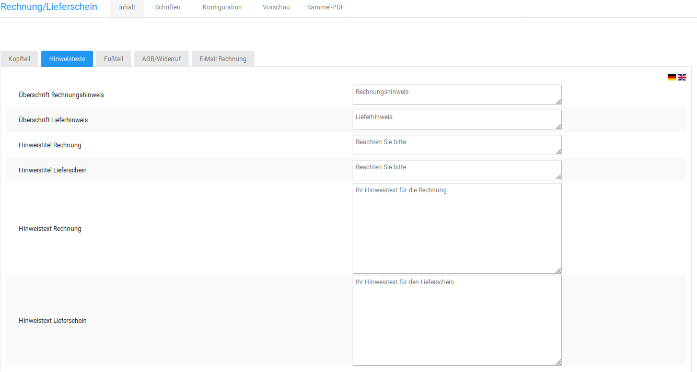

# Rechnung & Lieferschein konfigurieren

Die Darstellung von Rechnung und Lieferschein kannst du unter _**Einstellungen / System / Rechnung & Lieferschein**_, nach Aufrufen der Seite, anpassen.

## Inhalt

Auf der Registerkarte _**Inhalt**_ kannst du Inhalte vorgeben, die auf allen Rechnungen erscheinen sollen.

### Kopfteil

Auf der Registerkarte _**Inhalt**_ im Abschnitt _**Kopfteil**_ kannst du deine Firmenanschrift und den Inhalt für die Betreffzeile eintragen. Gib die gewünschten Daten ein und klicke auf _**Speichern**_.

Wenn du den Kopfteil der Rechnung verwenden möchtest, wähle auf der Registerkarte _**Konfiguration**_ im Abschnitt _**Anzeige**_ bei der _**Liste Kopfteil verwenden?**_ den Wert ✔ aus.

### Hinweistexte

Auf der Registerkarte _**Inhalt**_ im Abschnitt _**Hinweistexte**_ kannst du Hinweistexte für die Rechnung und den Lieferschein hinterlegen, die auf jeder Rechnung ausgegeben werden. Gib die gewünschten Daten ein und klicke auf _**Speichern**_.

Wenn du die Hinweistexte verwenden möchtest, wähle auf der Registerkarte _**Konfiguration**_ im Abschnitt _**Anzeige**_ bei den Checkboxen _**Hinweis verwenden?**_ und _**Hinweistext verwenden?**_ jeweils den Wert ✔ aus.

### Fußteil

Auf der Registerkarte _**Inhalt**_ im Abschnitt _**Fußteil**_ kannst du deine Firmenanschrift und den Inhalt für die Fußzeile der Rechnung eintragen. Die Fußzeile enthält immer vier Spalten. Gib die gewünschten Daten ein und klicke auf _**Speichern**_.

Wenn du den Fußteil der Rechnung verwenden möchtest, wähle auf der Registerkarte _**Konfiguration**_ im Abschnitt _**Anzeige**_ bei der Checkbox _**Fußteil verwenden?**_ den Wert ✔ aus.

Wenn eine der Spalten Bankdaten enthalten soll, setze hierfür jeweils den Haken unter _**Spalte enthält Bankverbindung**_.

### Agb/Widerruf

Auf der Registerkarte _**Inhalt**_ im Abschnitt _**AGB/Widerruf**_ kannst du die AGB und die Widerrufsbelehrung eintragen, die auf der PDF-Rechnung angezeigt werden sollen. Gib die gewünschten Daten ein und klicke auf _**Speichern**_.

Wenn du deine AGB und das Widerrufsrecht auf der Rechnung verwenden möchtest, wähle auf der Registerkarte _**Konfiguration**_ im Abschnitt _**Anzeige**_ bei den Checkboxen _**Agbs verwenden?**_ und _**Widerruf verwenden?**_ jeweils den Wert ✔ aus.

### E-Mail Rechnung

Auf der Registerkarte _**Inhalt**_ im Abschnitt _**E-Mail Rechnung**_ kannst du den Inhalt der Betreffzeile für die Rechnungs E-Mail festlegen. Gib im Feld _**E-Mail Betreff**_ den E-Mail Betreff für die Rechnungs E-Mail ein und klicke auf _**Speichern**_. Es steht ebenfalls ein Feld für einen abweichenden Betreff beim Erzeugen mehrerer Rechnungen zur Verfügung.

## Schriften

Auf der Registerkarte _**Schriften**_ kannst du die Schriftarten, -farben und -größen einstellen, die auf der Rechnung verwendet werden.

1.  Wähle aus der ersten Liste einer Schrift die Schriftart aus
2.  Wähle aus der zweiten Liste einer Schrift den Schritstil aus
3.  Wähle aus der dritten Liste einer Schrift die Schriftgröße aus
4.  Gib in das Textfeld einer Schrift die Schriftfarbe in Hexadezimal-Codierung ein, oder wähle rechts neben dem Textfeld die gewünschte Schriftart mit dem Farbrad aus

Klicke nach vorgenommenen Änderungen auf _**Speichern**_, um die Änderungen für zukünftige Rechnungen zu übernehmen.

1.  Kundenadresse

    Die Kundenadresse wird links im Sichtfenster angezeigt

2.  Firmenadresse links

    Die Firmenadresse links wird oberhalb der Kundenadresse angezeigt

3.  Firmenadresse rechts

    Die Firmenadresse rechts wird im Kopfteil der Rechnung rechts angezeigt

4.  Überschrift

    Die Schrift _**Überschrift**_ wird für Betreff und die Seitenzahlen verwendet

5.  Bestell-Tabellenkopf

    Der Bestell-Tabellenkopf ist die Titelzeile der Artikel-Liste

6.  Bestell-Tabelle

    Die Bestell-Tabelle enthält die Artikel der Bestellung

7.  Bestell-Zusammenfassung

    Die Bestell-Zusammenfassung enthält den Summenblock

8.  Überschrift Hinweis

    Die Überschrift für den Hinweis wird unterhalb des Summenblocks angezeigt

9.  Hinweistext

    Der Hinweistext wird unter der Überschrift für den Hinweis angezeigt

10. Fußteil

    Der Fußteil wird am unteren Seitenrand jeder Seite angezeigt
	
## Konfiguration

Auf der Registerkarte _**Konfiguration**_ kannst du steuern, welche Inhalte auf der Rechnung angzeigt werden sollen und wie die gewählten Inhalte angezeigt werden.

### Anzeige

Auf der Registerkarte _**Konfiguration**_ im Abschnitt _**Anzeige**_ wählst du aus, welche Inhalte auf der Rechnung ausgegeben werden. Stelle über die Checkbox neben dem gewünschten Inhalt den Wert ✔ ein, wenn der Inhalt angezeigt werden soll, oder ✖, wenn der Inhalt nicht angezeigt werden soll.

Klicke nach vorgenommenen Änderungen auf Speichern, um die Änderungen für zukünftige Rechnungen zu übernehmen.

### Layout

Auf der Registerkarte _**Konfiguration**_ im Abschnitt _**Layout**_ kannst du die Abstände auf der Rechnung vorgeben. Mit den Listen _**Zoomfaktor der PDF im Reader**_ und _**Seitenlayout der PDF im Reader**_ stellst du das Verhalten der PDF-Rechnung im PDF-Betrachtungsprogramm ein. In der Liste _**Ausgabemodus**_ kannst du auswählen, ob dir PDF-Dateien nach dem Erzeugen im Browser angezeigt oder direkt heruntergeladen werden.

Klicke nach vorgenommenen Änderungen auf _**Speichern**_, um die Änderungen für zukünftige Rechnungen zu übernehmen.

### Sicherheit

Auf der Registerkarte _**Konfiguration**_ im Abschnitt _**Sicherheit**_ kannst du die PDF-Sicherheitseinstellungen vorgeben. Klicke nach vorgenommenen Änderungen auf _**Speichern**_, um die Änderungen für zukünftige Rechnungen zu übernehmen.

### Bestellstatus und Rechnungsdatum

Auf der Registerkarte _**Konfiguration**_ im Abschnitt _**Bestellstatus und Rechnungsdatum**_ legst du fest, welchen Bestellstatus eine Bestellung erhalten soll, wenn die Rechnung erstellt oder per E-Mail versendet wurde. Wähle in der Liste _**Bestellstatus, der zur Ermittlung des Rechnungsdatum verwendet werden soll**_ den Bestellstatus aus, der zur Ermittlung des Rechnungsdatums verwendet werden soll. Als Rechnungsdatum auf der Rechnung wird der Zeitpunkt des erstmaligen Erreichen des konfigurierten Bestellstatus verwendet.

Klicke nach vorgenommenen Änderungen auf _**Speichern**_, um die Änderungen für zukünftige Rechnungen zu übernehmen.

## Vorschau

Auf der Registerkarte _**Vorschau**_ kannst du eine Vorschau einer Rechnung oder eines Lieferscheins mit der aktuellen Konfiguration erstellen.

!!! note "Hinweis" 
	 Du kannst die Rechnungsvorschau nur generieren, wenn bereits mindestens eine Bestellung in deinem Shop eingegangen ist. Wenn du deinen Shop noch einrichtest, erstelle zunächst eine Testbestellung.

1.  Wähle aus der Liste _**Wählen**_ eine Bestellung aus deinem Shop aus
2.  Klicke auf _**Rechnung**_, um eine Vorschau für die Rechnung zu dieser Bestellung zu generieren
3.  Klicke auf _**Lieferschein**_, um eine Vorschau für den Lieferschein zu dieser Bestellung zu generieren

