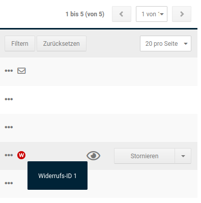
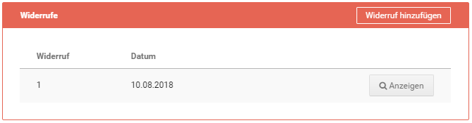

# Widerrufe

## Verwalten der Widerrufe im Gambio Admin

Unter _**Bestellungen \> Widerrufe**_ werden die eingegangenen Widerrufe nach Datum absteigend sortiert aufgelistet. Über einen Klick auf die Schaltfläche _**Bearbeiten**_ lassen sich die Details zum ausgewählten Widerruf anzeigen.

Die Bestellnummer kann über das zugehörige Eingabefeld geändert werden. Über die Schaltflächen _**Kunde aufrufen**_ \(bei Gast-Kunden nicht vorhanden\) und _**Bestelldetails öffnen**_ gelangst du direkt zur zugehörigen Kunden- bzw. Bestellungs-Detailseite. Neben den Kundendaten, Bestelldaten und dem eigentlichen Widerrufstext wird im unteren Bereich der Seite angezeigt, ob der Widerruf durch den Kunden oder den Administrator erzeugt wurde. Mit Klick auf _**Zurück**_ gelangst du zurück zur Widerrufsübersicht. Mit Klick auf _**Löschen**_ kann der gewählte Widerruf entfernt werden. Dies wird mit einer Sicherheitsabfrage bestätigt.

Der Menüpunkt _**Bestellungen \> Bestellungen**_ enthält eine Anzeige neben der Spalte _**Status**_. Das dort eingeblendete Icon gibt an, dass für diese Bestellung ein Widerruf vorliegt. Mehrere eingegangene Widerrufe werden durch mehrere, aufeinanderfolgende Icons angezeigt. Mit einem Klick auf das rote Icon gelangst du direkt zum jeweiligen Widerruf. Die zugehörige ID wird als Tooltip angezeigt, wenn der Mauszeiger über dem Symbol platziert wird.

Zudem kann sowohl aus der Bestellübersicht als auch aus der Bestelldetailansicht zu der gewählten Bestellung ein Widerruf durch den Administrator erstellt werden. Es öffnet sich das vorausgefüllte Online-Widerrufsformular in einem neuen Tab bzw. neuem Fenster \(je nach Browser-Einstellung\).

In den Bestelldetails werden die zu dieser Bestellung eingegangenen bzw. angelegten Widerrufe angezeigt. Die Auflistung erfolgt unter Angabe der ID und dem Datum des Widerrufs. Mit Klick auf _**Anzeigen**_ wird der entsprechende Widerruf aufgerufen.

Hat der Kunde bei einem Download oder einer Dienstleistung auf sein Widerrufsrecht verzichtet, wird unter der Widerrufsliste zudem ein neuer Bereich _**Widerrufsverzicht**_ aufgeführt. Hier wird die Meldung _**Verzicht auf Widerrufsrecht bei Dienstleistung: JA**_ bzw. _**Verzicht auf Widerrufsrecht bei Downloadartikel: JA**_ angezeigt.

## Umsetzung der Verbraucherrechterichtlinie im Frontend des Shops

### Warenkorb

Es wird ein Link mit dem Hinweis _**Hier finden Sie Informationen zu Versand- & Zahlungsbedingungen.**_ oberhalb der Schaltfläche _**Weiter einkaufen**_ angezeigt.

### Bestellvorgang

Unter dem Punkt _**Widerrufsrecht**_ im Bereich _**Zahlungsinformationen**_ werden die Inhalte _**Widerrufsrecht 1**_ bis _**Widerrufsrecht 4**_ \(je nach dem, ob sichtbar geschaltet oder nicht\) angezeigt. Zudem hat der Kunde, bei Download-Artikeln und Dienstleistungen, die Möglichkeit der Ausführung des Vertrags vor Ablauf des Widerrufsrechts zuzustimmen. Dies kann durch Anhaken der Box mit dem Text

_**Ich bin einverstanden und möchte vor dem Ende der Widerrufsfrist sofort mit dem Download beginnen...**_

bzw.

_**Ich bin einverstanden und verlange ausdrücklich, dass Sie vor Ende der Widerrufsfrist mit der Ausführung der beauftragten Dienstleistung beginnen...**_

bestätigt werden.

!!! note "Hinweis" 
	 Das Setzen dieses Hakens kann für Download-Artikel und Dienstleistungen durch den Shop-Betreiber als Pflichtfeld festgelegt werden. Die entsprechenden Einstellungen findest du unter _**Einstellungen / Rechtliches**_. Siehe _**Rechtliche Einstellungen**_.

Über den Link \(_**Als PDF downloaden**_\) hat der Kunde die Möglichkeit sowohl die Allgemeinen Geschäftsbedingungen als auch das Widerrufsrecht als PDF-Datei herunterzuladen.

### Bestellinformationen

Wenn unter _**Einstellungen / Rechtliches**_ die Einstellungen gesetzt sind, wird in den Bestellinformationen unter _**Ihr Konto**_ der entsprechende Verweis auf das Widerrufsformular angezeigt. Dies kann wahlweise im PDF-Format und/oder als Online-Formular erfolgen.

Zudem wird dem Kunden bei einem Verzicht auf das Widerrufsrecht, wie es bei einem Download oder einer Dienstleistung der Fall sein kann, der zugehörige Bestätigungstext unterhalb des Bereichs _**Artikel**_ angezeigt.

### Bestellbestätigung

Die Bestellbestätigungs-E-Mail enthält mit der Einrichtung der Verbraucherrechterichtlinie nun standardmäßig AGB und Widerrufsrecht als PDF-Anhang. Das Widerrufsformular wird ebenfalls mitgesendet, wenn unter _**Einstellungen / Rechtliches**_ die Einstellung_** PDF-Formular anbieten**_ gesetzt ist. Zudem werden identische Verweise auf das Widerrufsformular aufgeführt, wie bereits in den Bestellinformationen unter Ihr Konto, wenn die entsprechenden Haken gesetzt sind.

### Online-Widerrufsformular

!!! note "Hinweis" 
	 Der Verweis auf das Online-Widerrufsformular wird unter _**Einstellungen / Rechtliches**_ eingestellt. Setze hierzu die Einstellung bei _**Webformular anbieten**_ im Bereich _**Widerrufsrecht**_.

Das Online-Widerrufsformular kann sowohl über den allgemeinen Content _**Widerrufsrecht & Muster-Widerrufsformular**_ \(siehe Box _**Mehr über...**_ im Footer\) als auch aus den Bestellungen unter _**Ihr Konto**_ aufgerufen werden \(siehe _**Bestellinformationen**_\). Erfolgt der Aufruf aus der betroffenen Bestellung selbst, ist das Online-Formular bereits weitestgehend vorausgefüllt. Generell werden Pflichtfelder mit einem Sternchen \* gekennzeichnet. Diese Funktion ist bei Gast- Kunden eingeschränkt.

Das Formular enthält standardmäßig die unter _**Einstellungen / Shop / Shopbetreiber**_ eingetragenen Kontaktinformationen als Adressat, sowie im Bereich _**Widerruf**_ ein Texteingabefeld, das mit einem Standardtext belegt ist:

Hiermit widerrufe\(n\) ich/wir den von mir/uns abgeschlossenen Vertrag über den Kauf der folgenden Waren / die Erbringung der folgenden Dienstleistung:

Unterhalb des Textfeldes wird ein Hinweis aufgeführt, nach dem Unzutreffendes zu streichen und der Inhalt entsprechend zu ergänzen ist.

Ein weiteres Eingabefeld dient zum Festlegen des Datums, an dem die Bestellung erfolgt ist, bzw. erhalten wurde. Ein Klick in das Eingabefeld öffnet einen Kalender, über den das Datum ausgewählt und automatisch in das Feld eingefügt werden kann. Zudem kann über einen Radio-Button zwischen _**Bestellt am**_ und _**Erhalten am**_ ausgewählt werden.

Anschließend folgen Felder für Name, Anschrift und E-Mail-Adresse des Verbrauchers. Schlussendlich besteht ein weiteres Pflichtfeld mit Kalenderfunktion für das Widerrufsdatum. Dieses Feld ist in keinem Fall vorausgefüllt.

Mit Klick auf die Schaltlfäche _**Widerruf erklären**_ wird das Formular abgeschickt. Der Kunde erhält eine automatische Bestätigungs-E-Mail.

### Widerrufsbestätigung

Die Bestätigungsmail wird automatisch an den Kunden versandt. Sie enthält, mit Ausnahme der E-Mail-Adresse des Kunden, alle Informationen, die Bestandteil des Online-Widerrufsformulars sind.

Der Mail-Versand erfolgt nach Klick auf die Schaltlfäche _**Widerruf erklären**_ im Online-Formular. Dies ist sowohl der Fall, wenn der Widerruf durch den Kunden als auch durch den Administrator erstellt wird.

