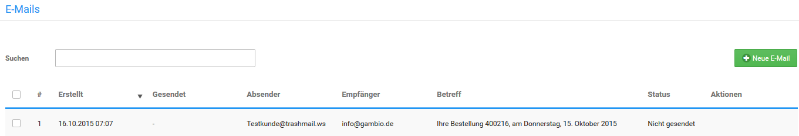
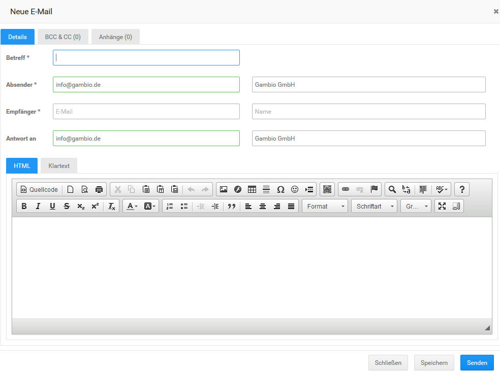
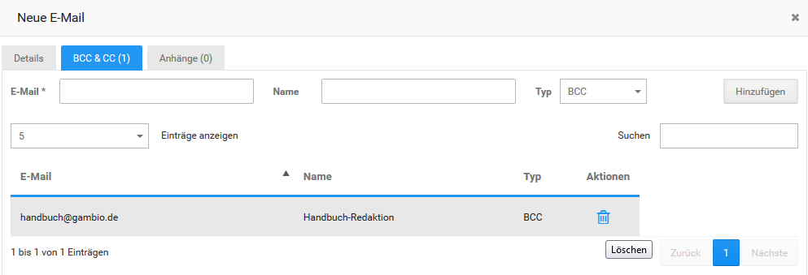
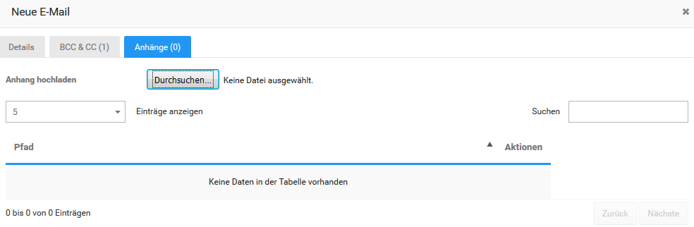
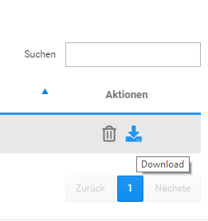
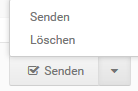

# E-Mails

Über _**Kunden \> E-Mails**_ hast du die Möglichkeit E-Mails an Kunden zu verschicken und zu verwalten.

## Schreiben, Bearbeiten und Weiterleiten von E-Mails

Mit einem Klick auf _**Neue E-Mail**_ kannst du eine E-Mail schreiben. Es öffnet sich ein neues Fenster im Reiter _**Details**_. Das gleiche Fenster steht dir zur Verfügung, wenn du eine bestehende E-Mail bearbeitest bzw. weiterleitest. Genaueres hierzu findest du im Kapitel _**Verwalten von E-Mails**_.

### Details

Im oberen Abschnitt können _**Betreff**_, _**Absender**_, _**Empfänger**_ sowie eine optionale Antwortadresse \(_**Antwort an**_\) eingetragen werden.

Im unteren Abschnitt des Fensters kann der eigentliche Mail-Text eingegeben werden. Über die Reiter _**HTML**_ und _**Klartext**_ kann die Mail wahlweise als HTML \(standard\) oder als reiner Text, ohne Formatierungen, geschrieben werden.

Im Reiter _**HTML**_ ist der sogenannte CK-Editor eingebunden. Hierüber kann der Text formatiert und wahlweise mit Links und Bildern versehen werden. Eine genaue Übersicht über die möglichen Funktionen findest du im Kapitel _**CK-Editor**_.

Mit einem Klick auf _**Senden**_ wird die E-Mail verschickt. Über _**Speichern**_ wird die Mail gespeichert, um später verschickt zu werden \(siehe _**Verwalten von E-Mails**_\). Wurde eine Mail bereits versendet, wird beim Speichern eine neue Mail angelegt.

### BCC & CC

Über den Reiter _**BCC & CC**_ können weitere Empfänger, sowohl als _**Carbon Copy**_ als auch als _**Blind Carbon Copy**_ hinzugefügt werde. Trage hierzu die Adresse im Feld _**E-Mail**_ ein und wähle über das Dropdown-Menü _**Typ**_ aus, ob du _**BCC**_ oder _**CC**_ verwenden möchtest. Mit einem Klick auf _**Hinzufügen**_ wird die Adresse als Empfänger hinzugefügt. Über das Mülltonnen-Symbol in der Spalte _**Aktionen**_ kann ein Adressat wieder gelöscht werden.

Über das Dropdown-Menü _**Einträge anzeigen**_ kann die Anzahl der angezeigten Empfäger pro Seite festgelegt werden, wahlweise werden 5 oder 10 Einträge pro Seite aufgelistet. Über das Eingabefeld _**Suchen**_ lassen sich die Einträge filtern, sowohl nach E-Mail als auch nach Name, die Eingrenzung der Einträge erfolgt direkt bei der Eingabe. Zudem können über die Spaltenüberschriften der Tabelle die Empfänger wahlweise aufsteigend und absteigend sortiert werden.

Unterhalb der Tabelle kann zwischen den einzelnen Seiten gewechselt werden, wenn nicht alle Einträge auf einer Seite angezeigt werden.

### Anhänge 

Über den Reiter _**Anhänge**_ kann die Mail mit Datei-Anhängen versehen werden. Klicke hierzu unter _**Anhang hochladen**_ auf den Button _**Durchsuchen**_. Nach der Auswahl der Datei über den Dialog wird diese hochgeladen und der E-Mail hinzugefügt. Die Datei wird mit dem Server-Pfad in der darunterstehenden Tabelle angezeigt. Über den Klick auf das Mülltonnen-Symbol in der Spalte _**Aktionen**_ kann der Anhang wieder entfernt werden. Über das Download-Symbol kann die Datei vom Server heruntergeladen werden.

Über das Dropdown-Menü _**Einträge anzeigen**_ kann die Anzahl der angezeigten Anhänge pro Seite festgelegt werden, wahlweise werden 5 oder 10 Einträge pro Seite aufgelistet. Über das Eingabefeld _**Suchen**_ lassen sich die Einträge nach dem Dateinamen im Pfad filtern, die Eingrenzung der Einträge erfolgt direkt bei der Eingabe. Zudem können über die Spaltenüberschrift der Tabelle die Anhänge nach Dateiname sortiert werden.

Unterhalb der Tabelle kann zwischen den einzelnen Seiten gewechselt werden, wenn nicht alle Einträge auf einer Seite angezeigt werden.

## Verwalten von E-Mails

Versendete und gespeicherte Mails werden in einer Tabelle aufgeführt. Mit Hilfe des Dropdown- Menüs _**...pro Seite**_ kann die Anzahl der E-Mails pro Seite wahlweise auf 20, 30, 50 oder 100 Einträge festgelegt werden.

Über das Eingabefeld _**Suchen**_ lassen sich die E-Mails nach Absender, Empfänger oder Betreff filtern, die Eingrenzung der Einträge erfolgt direkt bei der Eingabe.

Die Mails können durch einen Klick auf die Spaltenüberschriften sortiert werden. Unterhalb der Tabelle kann zwischen den einzelnen Seiten gewechselt werden, wenn nicht alle Einträge auf einer Seite angezeigt werden.

Für jede E-Mail stehen in der Spalte _**Aktionen**_ von links nach rechts folgende Möglichkeiten zur Verfügung:

-   Senden: E-Mail wird an die eingetragenen Empfänger versendet
-   Weiterleiten: E-Mail wird weitergeleitet, es öffnet sich ein neues Fenster \(siehe _**Schreiben, Bearbeiten und Weiterleiten von E-Mails**_\)
-   Löschen: E-Mail wird gelöscht
-   Ansehen: E-Mail wird angezeigt und kann bearbeitet werden \(siehe _**Schreiben, Bearbeiten und Weiterleiten von E-Mails**_\)

Das Versenden und Löschen von E-Mails ist zudem gesammelt möglich. Setze hierzu die jeweiligen Haken für jede E-Mail, die du löschen oder versenden möchtest, in der ersten Spalte. Wahlweise können auch alle Mails gleichzeitig an- bzw. abgehakt werden, verwende hierzu bitte das Kästchen in der linken, oberen Ecke der Tabelle. Wähle anschließend über die Dropdown-Schaltfläche aus, ob du die E-Mails _**Senden**_ oder _**Löschen**_ möchtest.

Zudem können alte Anlagen bis einschließlich einem bestimmten Datum gelöscht werden. Der Shop bezieht sich hierbei auf das Datum in der Spalte _**Erstellt**_. Klicke hierzu zunächst auf _**Alte Anhänge löschen**_ und stelle in dem sich öffnenden Feld das Datum ein, bis zu dem du die Anlagen löschen möchtest. In den Klammern links neben dem Datum wird nun die zu löschende Datenmenge angezeigt. Klicke auf _**Alte Anhänge löschen**_, um die Anhänge zu löschen.

!!! note "Hinweis" 
	 Gelöschte Anhänge werden weiterhin als Anlage angezeigt, um eine entsprechende Historie bieten zu können. Da die Datei aber nicht mehr vorhanden ist, kann sie nicht heruntergeladen werden.

