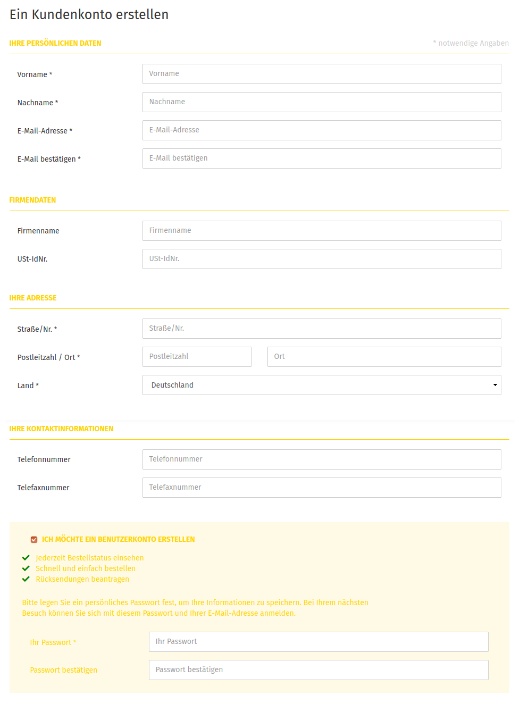

# Kundenregistrierung

Im Gambio Admin deines Shops kannst du unter _**Kunden \> Kunden \> Kunden-Details**_ festlegen, ob deine Kunden über ein Registrierungsformular selbständig ein Kundenkonto anlegen können. Wähle bei _**Art der Kontoerstellung**_ eine der in der Tabelle _**Art der Kontoerstellung**_ beschriebenen Optionen aus. Klicke anschließend auf _**Speichern**_, um die Änderungen zu speichern.

|Art|Beschreibung|
|---|------------|
|Kundenkonto|bei der Kontoerstellung _**Kundenkonto**_ können ausschließlich registrierte Kunden in deinem Shop bestellen|
|Gastkonto|bei der Kontoerstellung _**Gastkonto**_ können keine Kundenkonten für Stammkunden angelegt werden|
|beides|bei der Kontoerstellung _**beides**_ können Kunden sich in deinem Shop registrieren oder ohne Kundenkonto bestellen|

Gast-Konten werden nicht notwendigerweise dauerhaft angelegt, da Kunden hierüber die Möglichkeit haben sollen ohne festes Kundenkonto zu bestellen. Wenn sich der Kunde direkt nach der Bestellung ausloggt, wird das Konto unwiderruflich gelöscht. Die Bestellung mit den vollständigen Kontaktdaten bleibt dabei erhalten. Wähle unter _**Kunden \> Kunden \> Kunden-Details**_ bei _**Löschen von Gastkonten**_ die Option ✖ aus, wenn das automatische Löschen von Gastkonten nicht gewünscht ist. Klicke anschließend auf _**Speichern**_, um die Änderungen zu speichern.

!!! danger "Achtung"

	 In manchen Shopversionen wird zum Teil unter _**Kunden \> Kunden \> Kunden-Details**_ eine Cronjob-URL angezeigt. Diese ist nicht mehr aktuell und wird mit einem kommenden Update entfernt. Für das automatisierte Löschen von Gast-Konten sollte die Cronjob-URL unter _**Toolbox \> Zeitgesteuerte Aufgaben**_ verwendet werden.

## Felder des Registrierungsformulars

Im Gambio Admin deines Shops unter _**Kunden \> Kunden \> Kunden-Details**_ legst du fest, welche Angaben deiner Kunden im Registrierungsformular abgefragt werden. Wähle bei den Angaben, die abgefragt werden sollen, die Option ✔. Bei Optionen, die du bei deinen Kunden nicht abfragen möchtest, wähle die Option ✖. Klicke anschließend auf _**Speichern**_, um die Änderungen zu speichern.

## Kunden-Details

Über den Bereich _**Kunden \> Kunden \> Kunden-Details**_ wird die Zusammenstellung des Registrierungsformulars festgelegt und die Art der anlegbaren Kundenkonten konfiguriert.

|Feldname|Beschreibung|
|--------|------------|
|Faxnummer|Die Abfrage der Faxnummer in der Kontoerstellung aktivieren|
|Anrede|Die Abfrage für die Anrede im Account benutzen|
|Telefonnummer|Die Abfrage der Telefonnummer in der Kontoerstellung aktivieren|
|Geburtsdatum|Die Abfrage für das Geburtsdatum im Account benutzen|
|Firma|Die Abfrage für die Firma im Account benutzen|
|Stadtteil|Die Abfrage für den Stadtteil im Account benutzen|
|Bundesland|Die Abfrage für das Bundesland im Account benutzen|
|Addresszusatzfeld anzeigen|Anzeige eines Addresszusatzfeldes \(für Etagenangaben, etc.\)|
|Straße und Hausnummer trennen|Straße und Hausnummer getrennt voneinander abspeichern?|

!!! danger "Achtung"

	 Externe Module \(Zahlungsmodule, ERP, Warenwirtschaften etc.\) müssen Straße und Hausnummer getrennt verarbeiten können. Wenn du dir nicht sicher bist, lasse diese Option deaktiviert.

|Feldname|Beschreibung|
|--------|------------|
|Art der Kontoerstellung|Sollen nur reguläre Kundenkonten, nur Gastkonten oder beides erstellt werden können?|
|Gewerbetreibender-Status|Die Abfrage für den Gewerbetreibender-Status in der Kontoerstellung aktivieren|
|Löschen von Gastkonten|Sollen Gastkonten nach erfolgter Bestellung gelöscht werden? \(Bestelldaten bleiben erhalten\)|
|Standardwert für Gewerbetreibender-Status|Standardwert für _**Gewerbetreibender-Status**_ bei der Kundenregistrierung \(Dieser Wert greift auch, wenn der Gewerbetreibender-Status nicht angezeigt wird\)|
|Vor- & Nachname optional|Vor- & Nachname optional, sofern das Feld _**Firmenname**_ ausgefüllt wird|
|Anrede als Pflichtfeld|Lege hier fest, ob die Anrede zwingend ausgefüllt werden muss.|

### Gastkonten

Gastkonten werden nicht notwendigerweise dauerhaft angelegt, da Kunden hierüber die Möglichkeit haben sollen ohne festes Kundenkonto zu bestellen. Wenn sich der Kunde direkt nach der Bestellung ausloggt und das Löschen von Gastkonten aktiviert ist, wird das Konto unwiderruflich gelöscht.

Zudem kann ein Gast-Konto nur ein Mal \(innerhalb einer sogenannten Session im Browser\) verwendet werden. Da kein Passwort vergeben wird, ist ein erneutes Einloggen nicht möglich. Aus diesen Grund lassen sich Gast-Bestellungen ein und desselben Kunden im Regelfall nicht einem einzigen Konto zuordnen, da für jede neue Bestellung ein neues Gastkonto angelegt wird.

### Gewerbetreibender-Status

Die Einstellung _**Gewerbetreibender-Status**_ wurde mit dem _**Gambio GX2 Mwst-Update**_ eingeführt, welches aufgrund einer Gesetzesänderung zur Besteuerung von elektronsich erbrachten Leistungen von uns erstellt worden ist. Das Update ist Bestandteil aller aktuellen Shopversionen.

Beim Anlegen eines Kundenkontos ist es möglich anzugeben, ob der Kunde als Gewerbetreibender aufritt. Zudem kann der Standardwert für diese Einstellung festgelegt werden.

!!! note "Hinweis"

	 Bitte beachte, dass der Administrator immer wie ein Gewerbetreibender behandelt wird. Unabhängig von seinem ausgewählten Wohnort, sieht der Administrator immer die Mehrwertsteuer, die für das unter _**Shop Einstellungen \> Mein Shop**_ bzw. _**Einstellungen / Shop / Shopbetreiber**_ ausgewählte Land des Shopbetreibers gilt.

## Pflichtfelder festlegen

Im Gambio Admin deines Shops unter _**Shop Einstellungen \> Minimum-Werte**_ bzw. _**Einstellungen / Kunden / Mindestlänge für Kundenfelder**_ kannst du festlegen, welche der abgefragten Werte bei der Registrierung Pflichtangaben sind.

")

Trage in die Felder, die bei der Kundenregistrierung als Pflichtangabe abgefragt werden sollen, einen ganzzahligen Wert über 0 ein. Trage bei Feldern, die bei der Registrierung optional sind, den Wert 0 ein. Klicke anschließend auf _**Speichern**_, um die Änderungen zu speichern.