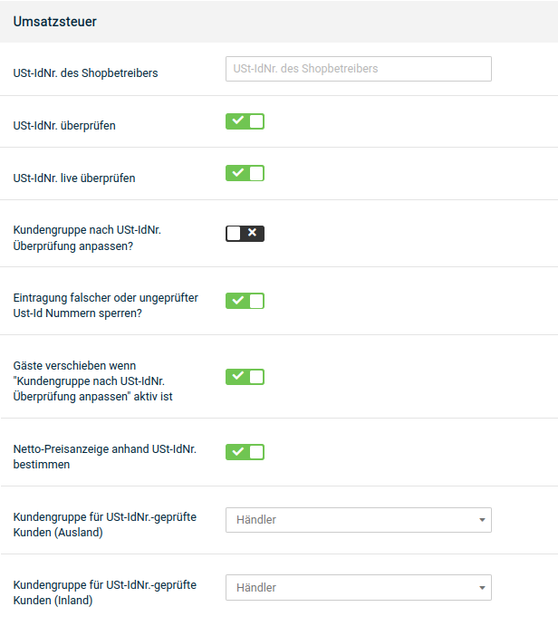

# Händlerkunden

Das Shopsystem bietet eine Funktion, über die Händler bei Angabe einer gültigen Umsatzsteuer Id-Nummer bei der Registrierung nach einer Prüfung automatisch in eine vordefinierte Kundengruppe verschoben werden. Die Konfiguration dieser Funktion kannst du unter _**Einstellungen / Sprachen, Länder, Steuern / Umsatzsteuer**_ vornehmen. Bitte beachte, dass die Ust-IdNr nur für EU-Staaten geprüft werden kann.

## Live-Prüfung aktivieren

In der Grundkonfiguration des Shopsystems ist die Live-Prüfung der Umsatzsteuer ID-Nummer bereits aktiviert. Wenn du die Live-Prüfung zwischenzeitlich deaktiviert hast, führe die folgenden Schritte aus.

1.  Wähle bei _**USt-IdNr. überprüfen**_ und bei _**USt-IdNr. live überprüfen**_ die Option ✔
2.  Wähle bei _**Kundengruppe nach USt-IdNr. Überprüfung anpassen**_ die Option ✔
3.  Wähle aus den Listen _**Kundengruppe für USt-IdNr.-geprüfte Kunden**_ die Kundengruppen für in- und ausländische Kunden aus
4.  Klicke auf _**Speichern**_, um die Änderungen an der Umsatzsteuer-Prüfung zu speichern

## Live-Prüfung deaktivieren

Wenn du die Umsatzsteuer ID-Nummer deiner Kunden nicht überprüfen möchtest, führe die folgenden Schritte aus, um die Live-Prüfung oder die vollständige Prüfung zu deaktivieren.

1.  Wähle bei _**USt-IdNr. live überprüfen**_ die Option ✖
2.  Wenn du die Umsatzsteuer ID-Nummer nicht prüfen möchtest, wähle auch bei _**USt-IdNr. überprüfen**_ die Option ✖
3.  Klicke auf _**Speichern**_, um die Änderungen an der Umsatzsteuer-Prüfung zu speichern

