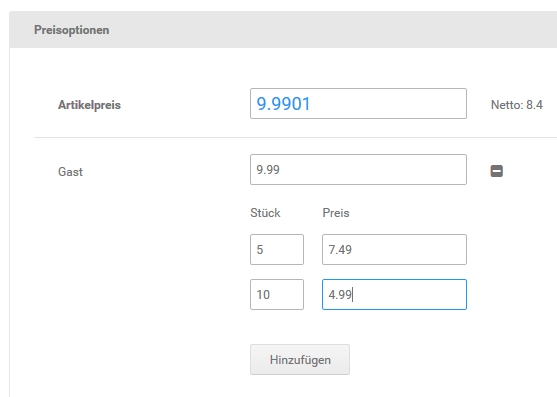
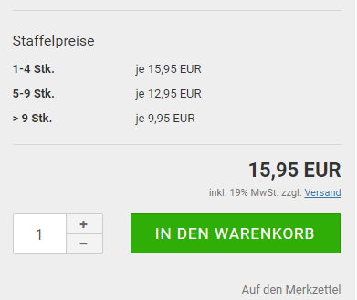
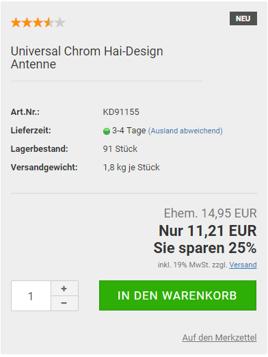
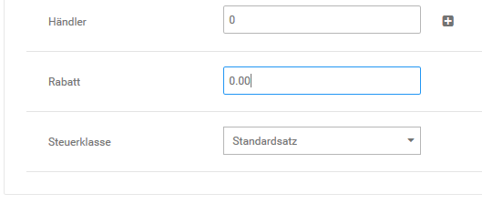
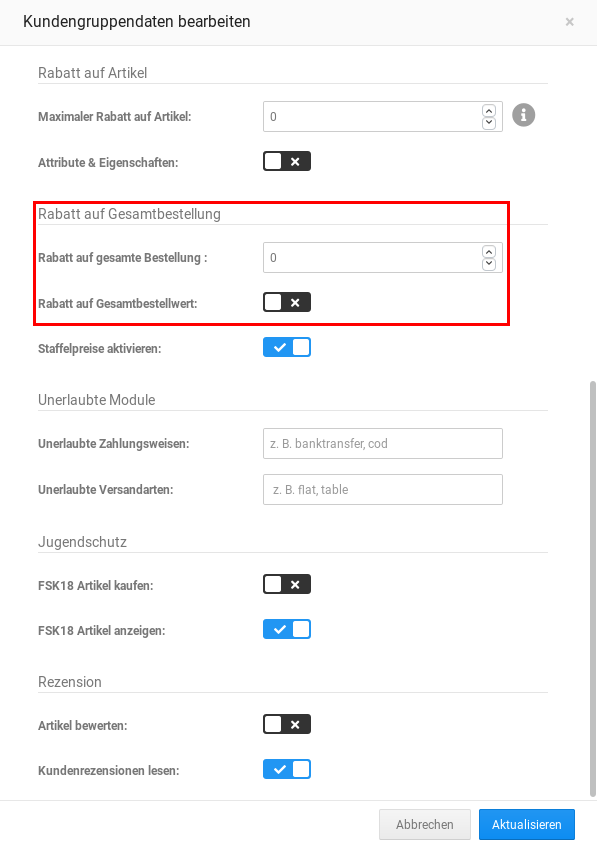
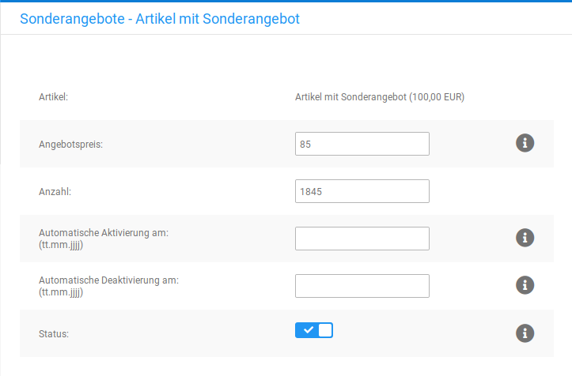

# Rabatte & Sonderangebote

Das Shopsystem bietet mehrere Möglichkeiten, Preisnachlässe auf einzelne Artikel oder den gesamten Bestellwert zu konfigurieren. Rabatte auf Kategorien sind über _**Rabatt Kupons**_ möglich, genaueres hierzu findest du im Kapitel _**Rabatt Kupons**_.

## Staffelpreise

Mit Staffelpreisen hast du die Möglichkeit, deine Artikelpreise abhängig von der verkauften Stückzahl je Bestellung zu gestalten. Staffelpreise werden in der Artikel-Eingabemaske angelegt und müssen für jede Kundengruppe explizit aktiviert werden. Je Kundengruppe können eigene Staffelpreise angelegt werden, sodass die Preismodelle für Händler und Endverbraucher getrennt gehalten werden können. Bei Artikeln mit Varianten über die Artikeleigenschaften oder Artikelattribute wird nur der Preis des Hauptartikels als Grundlage für die Berechnung der Staffelpreise verwendet.

!!! note "Hinweis" 
	 Administratoren können aus technischen Gründen keine Kundengruppen- oder Staffelpreise angezeigt werden. Lege zum Testen gegebenenfalls ein Testkonto in der betroffenen Kundengruppe an.

Bearbeite den Artikel, dem du Staffelpreise zuordnen möchtest. Im unteren Bereich der Artikel-Eingabemaske siehst du ein allgemeines Feld für den Artikelpreis, sowie ein Feld für den Kundengruppenpreis jeder Kundengruppe. Klicke auf das Plus-Zeichen hinter dem Preisfeld der Kundengruppe, es erscheinen zwei neue Eingabefelder. Wenn du bereits Staffelpreise angelegt hast, werden diese unter den bestehenden Staffelpreisen angezeigt.

!!! note "Hinweis" 
	 Gib für die Kundengruppe, für die du Staffelpreise einrichtest, einen Kundengruppenpreis an. Der Kundengruppenpreis kann identisch zum regulären Artikelpreis sein. Wenn kein Kundengruppenpreis angegeben wird, kann die Anzeige und die Berechnung der Staffelpreise im Shop fehlerhaft sein.

Der Kundengruppenpreis funktioniert gleichzeitig als Staffelpreis ab 1 Stück. Wenn du eine Mindestbestellmenge konfiguriert hast, wird der Kundengruppenpreis als Staffelpreis ab der Mindestbestellmenge berechnet. Trage in das Feld _**Stück**_ die nächste _**ab**_-Menge und in das Feld _**Preis**_ den Preis pro Stück ab dieser Menge ein und klicke auf _**Hinzufügen**_. Wenn du noch weitere Staffeln eintragen möchtest, wiederhole den Vorgang. Klicke nach dem Eintragen der letzten Staffel auf die Schaltfläche _**Speichern**_.

!!! example "Beispiel" 
	 Du verkaufst einen Artikel, der für Händler mit Staffelpreisen angeboten werden soll. Bis fünf Stück wird der Artikel zu 4.99 EUR angeboten. Fünf bis zehn Stück kosten 4.49 EUR und ab 20 Stück bezahlen Händler 3.99 EUR. Trage in das Preisfeld _**Händler**_ den Händlerpreis von 4.99 EUR ein. Trage in das Feld _**Stück**_ den Wert 5 und in das Feld _**Preis**_ den Preis ab fünf Stück von 4.49 EUR ein. Klicke auf _**Aktualisieren**_ und trage in das Feld _**Stück**_ den Wert 20 sowie in das Feld _**Preis**_ den Preis 3.99 EUR ein.

## Artikelrabatt

Du hast in jedem Artikel die Möglichkeit, einen Artikelrabatt festzulegen, den bestimmte Kundengruppen dann ganz oder zum Teil in Anspruch nehmen können.

!!! note "Hinweis" 
	 Der tatsächliche Rabatt ergibt sich später aus dem Artikelrabatt und dem Kundengruppenrabatt, es wird der jeweils kleinere Prozentsatz verwendet.

Den maximalen Kundengruppenrabatt in Prozent kannst du direkt in der Übersicht unter _**Kunden \> Kundengruppen**_ in der Spalte _**Rabatt**_ einsehen, dieser ist der erste Wert. Um den Kundengruppenrabatt zu ändern, bearbeite die entsprechende Kundengruppe und trage im Feld _**Maximaler Rabatt auf Artikel**_ den gewünschten maximalen Rabatt für diese Kundengruppe ein.

!!! example "Beispiel" 
	 Du kannst eine neue Kundengruppe _**Stammkunde**_ anlegen und dieser einen maximalen Rabatt von 20% gewähren. Trage hierzu in der Kundengruppe im Feld _**Maximaler Rabatt auf Artikel**_ 20 ein. Unabhängig vom vergebenen Artikelrabatt erhält diese Kundengruppe maximal einen Rabatt von 20 % und minimal den vergebenen Artikelrabatt.

Bearbeite nun unter _**Artikel \> Artikel / Kategorien**_ die Artikel, die einen Artikelrabatt erhalten sollen und trage im Feld _**Rabatt **_den gewünschten maximalen Rabatt für den jeweiligen Artikel ein. Ein Artikelrabatt von 50 % kann nur von Kunden voll ausgeschöpft werden, die sich in einer Kundengruppe mit einem Kundengruppenrabatt von 50 % oder höher befinden. Alle anderen Kunden erhalten maximal den Kundengruppenrabatt Ihrer Kundengruppe.

!!! example "Beispiel" 
	 Lege drei Artikel mit den Namen _**Test 10 Prozent**_, _**Test 20 Prozent**_ und _**Test 30 Prozent**_ an. Vergebe für alle Artikel einen Artikelpreis von 10 Euro Brutto und trage im Feld Artikelrabatt den jeweiligen Rabatt ein. Rufe deinen Shop nun mit einem Kundenkonto auf, das Mitglied der Kundengruppe _**Stammkunde**_ ist. Im Shop siehst du jetzt für den Artikel _**Test 10 Prozent**_ einen Artikepreis von 9 Euro und den Hinweis _**Sie sparen 10%**_. Bei den Artikeln _**Test 20 Prozent**_ und _**Test 30 Prozent**_ ändert sich der Artikelpreis auf 8 Euro und der Hinweis _**Sie sparen 20%**_ wird ausgegeben. Da die Kundengruppe Stammkunde maximal 20 % Rabatt erhält, werden von den 30 % des Artikels _**Test 30 Prozent**_ nur die erlaubten 20 % berücksichtigt.

## Rechnungsrabatt

Mit dem Rechnungsrabatt kannst du unter _**Kunden \> Kundengruppen**_ einer Kundengruppe einen prozentualen Rabatt auf den gesamten Bestellwert gewähren. Im Gegensatz zum Artikelrabatt gilt der Rechnungsrabatt für alle Artikel im Warenkorb. Der aktuell zugewiesene Rechnungsrabatt steht in der Übersicht in der Spalte _**Rabatt**_.

1.  Wähle die gewünschte Kundengruppe aus, indem du den Mauszeiger in die jeweilige Zeile bewegst und klicke rechts auf das Bleistift-Symbol

    Die aktuell ausgewählte Kundengruppe ist grau hinterlegt

2.  Setze die Einstellung _**Rabatt auf Gesamtbestellwert**_ auf ✔
3.  Gib im Feld _**Rabatt**__** auf gesamte Bestellung**_ den gewünschten Rechnungsrabatt für die Kundengruppe an
4.  Klicke auf _**Aktualisieren**_, um die Änderungen zu speichern

!!! note "Hinweis" 
	 Wenn ein Artikel einen Artikelrabatt besitzt und eine Kundengruppe sowohl den Artikelrabatt als auch den Rechnungsrabatt nutzen kann, dann werden beide Rabatte berücksichtigt.

!!! note "Hinweis" 
	 Damit eine Berechnung des Rechnungsrabattes im Bestellvorgang erfolgt, installiere unter _**Module \> Zusammenfassung**_ das Modul _**Rabatt \(ot\_discount\)**_.

!!! note "Hinweis" 
	 Vergib für eine neue Kundengruppe _**Stammkunde**_ einen Rechnungsrabatt von 10 %. Der Kunde legt Artikel für 99 Euro in den Warenkorb und erhält einen Rabatt von 9,90 Euro auf den Bestellwert.

## Sonderangebote

Mit Sonderangeboten bietest du ausgewählte Mengen eines Artikels zu einem Sonderpreis an. Sonderpreise können sowohl höher als auch geringer als der reguläre Artikelpreis sein.

### Sonderangebot anlegen

Neue Sonderangebote kannst du im Gambio Admin deines Shops unter _**Artikel \> Sonderangebote**_ anlegen.

1.  Klicke auf _**Erstellen**_
2.  Wähle aus der Liste _**Artikel**_ den Artikel aus, zu dem du ein Sonderangebot anlegen möchtest
3.  Trage im Feld _**Angebotspreis**_ den Angebotspreis des Sonderangebots als Festpreis \(10.95\) oder prozentualen Nachlass \(10%\) ein

    Beachte, dass sämtliche Preise im Shop mit einem Dezimalpunkt angegeben werden müssen!

4.  Trage im Feld _**Anzahl**_ ein, wie oft der Artikel zum Sonderangebotspreis gekauft werden darf
5.  Klicke bei _**Automatische Aktivierung am**_ in das Eingabefeld und wähle aus dem Kalender das Datum aus, an dem der Angebotspreis aktiviert werden soll

    Wenn du _**Automatische Aktivierung am**_ leer lässt, muss das Angebot händisch über die Einstellung _**Status**_ aktiv geschaltet werden

6.  Klicke bei _**Automatische Deaktivierung am**_ in das Eingabefeld und wähle aus dem Kalender das Datum aus, an dem das Angebot abgeschaltet werden soll

    Wenn du _**Automatische Deaktivierung am**_ leer lässt, ist das Angebot zeitlich nicht begrenzt

7.  Klicke auf _**Speichern**_ um das Sonderangebot hinzuzufügen