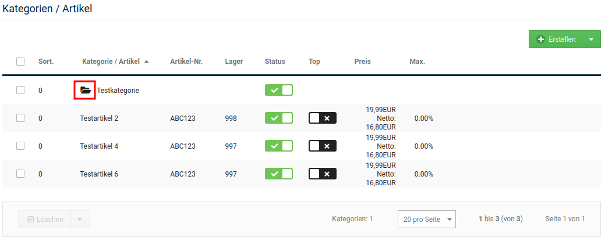
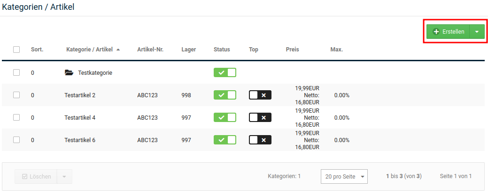
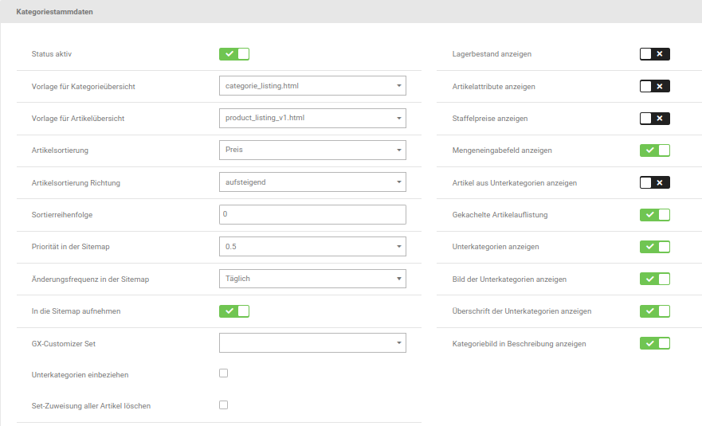
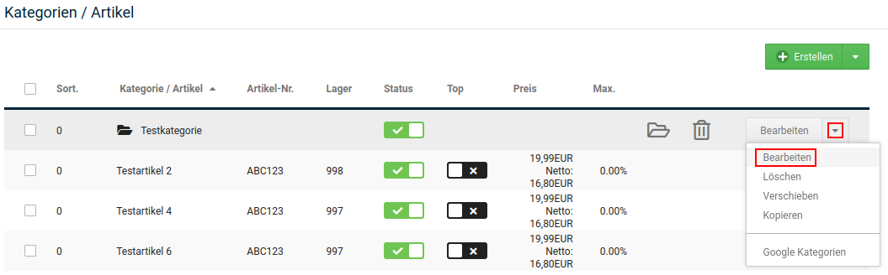

# Kategorien 

## Kategorie anlegen {#kategorien_kategorie_anlegen}

In der Artikel- und Kategorieübersicht unter _**Artikel \> Artikel/Kategorien**_ kannst du neue Kategorien über die Schaltfläche _**Erstellen \> Kategorie**_ hinzufügen. Neue Kategorien werden immer in der Kategorie angelegt, die in der Übersicht aufgelistet wird. Im Listenfeld _**Gehe zu**_ oberhalb der Artikel- und Kategorieliste wird dir die aktive Kategorie angezeigt.

!!! note "Hinweis"

	 Wechsele zunächst in die gewünschte Oberkategorie, wenn du Unterkategorien anlegen möchtest.

!!! note "Hinweis"

	 Über die Drodown-Funktion der Schaltfläche _**Erstellen**_ kannst du auswählen, ob du einen Artikel oder eine Kategorie auswählen möchtest.

	 

	 Der Button hat eine Standard-Funktion. Befinden sich keine Kategorien im Shop, wird beim Klick ohne Verwendung des Dropdowns die Maske zum Erstellen einer Kategorie geöffnet; ansonsten die Maske zum Anlegen eines Artikels.

!!! note "Hinweis" 
	 Um in eine Kategorie zu wechseln, klicke auf das schwarze Ordnersymbol vor dem Kategorienamen, oder wähle die gewünschte Kategorie aus der Liste _**Gehe zu**_ rechts in der Leiste am unteren Bildschirmrand aus.

In der Kategorie-Eingabemaske konfigurierst du die neue Kategorie.

1.  Trage im Feld _**Kategorie Name**_ einen Kategorienamen ein
2.  Aktiviere das Kontrollkästchen _**Status aktiv**_, wenn die Kategorie nach dem Anlegen sofort im Shop sichtbar sein soll
3.  Eine Übersicht über die Bedeutung der Felder in der Kategorie-Eingabemaske findest du in der Tabelle _**Übersicht über die Kategorie-Eingabemaske**_
4.  Klicke auf _**Speichern**_, um die neue Kategorie anzulegen

!!! note "Hinweis" 
	 Nach dem Hinzufügen einer Kategorie müssen die Caches für _**Artikel- und Kategoriezuordnungen**_, _**Modulinformationen**_ und die _**Seitenausgabe**_ unter _**Toolbox \> Cache**_ gelöscht bzw. neu erzeugt werden.

!!! note "Hinweis" 
	 Alle Felder in der Eingabemaske sind optional und sollten nur verwendet werden, wenn die entsprechende Information zur Verfügung steht.

|Feldname|Beschreibung|
|--------|------------|
|Kategorie Name|der Name der Kategorie, der im Kategorie-Menü verwendet werden soll|
|Kategorie Überschrift|wenn angegeben, abweichende Überschrift für die Kategorieseite der Kategorie|
|Status aktiv|wenn aktiviert, wird die Kategorie im Shop angezeigt|
|Vorlage für Kategorieübersicht|HTML-Vorlage für die Kategorieseite, wenn Unterkategorien mit angezeigt werden|
|Vorlage für Artikelübersicht|HTML-Vorlage für die Kategorieseite ohne Unterkategorien|
|Artikelsortierung|Wert, der für die Sortierung der Artikel verwendet wird \(_**Sortierreihenfolge**_ für die manuelle Sortierung über die Artikel-Eingabemaske\)|
|Sortierreihenfolge|Reihenfolge für die Anzeige der Kategorie in Menüs und in der Kategorieübersicht|
|Lagerbestand anzeigen|wenn aktiviert, wird in der Listenansicht der Lagerbestand der Artikel angezeigt|
|Artikelattribute anzeigen|wenn aktiviert, wird in der Listenansicht die Auswahl der Artikelattribute angezeigt|
|Staffelpreise anzeigen|wenn aktiviert, werden in der Listenansicht die Staffelpreise angezeigt|
|Mengeneingabefeld anzeigen|wenn aktiviert, wird in der Listenansicht das Mengeneingabefeld neben der Schaltfläche _**In den Warenkorb**_ angezeigt|
|In die Sitemap aufnehmen|wenn aktiviert, wird die Kategorie in die Sitemap für Suchmaschinen aufgenommen|
|Priorität in der Sitemap|steuert, wie wichtig der Eintrag in der Sitemap für die Suchmaschinen ist \(1: sehr wichtig bis 0: unwichtig\)|
|Änderungsfrequenz in der Sitemap|Vorgabe, wie oft die Sitemap-Einträge der Suchmaschinen aktualisiert werden sollten. Die tatsächliche Änderungsfrequenz hängt von der Suchmaschine ab|
|GX-Customizer Set|fügt allen Artikeln der Kategorie ein GX-Customizer Set hinzu \(siehe Kapitel _**GX-Customizer**_\)|
|Unterkategorien einbeziehen|fügt allen Artikeln der Kategorie inklusive aller Unterkategorien ein GX-Customizer Set hinzu \(siehe Kapitel _**GX-Customizer**_\)|
|Set-Zuweisung aller Artikel löschen|wenn aktiviert, werden GX-Customizer Set-Zuweisungen aus Artikeln entfernt, wenn kategorieweite Sets verwendet werden|
|Artikel aus Unterkategorien anzeigen|wenn aktiviert, werden auch Artikel aus Unterkategorien in der Artikelliste angezeigt|
|Gekachelte Artikelauflistung|wenn aktiviert, wird die Kategorie zuerst in der gekachelten Ansicht angezeigt \(Grundeinstellung: nicht aktiviert, Kategorien werden in der Listenansicht angezeigt\)|
|Unterkategorien anzeigen|wenn aktiviert, werden die Unterkategorien der aktuellen Kategorie aufgelistet|
|Bild der Unterkategorien anzeigen|wenn aktiviert, werden die Kategoriebilder der Unterkategorien angezeigt|
|Überschrift der Unterkategorien anzeigen|wenn aktiviert, werden die Kategorie-Überschriften der Unterkategorien angezeigt|

Im Abschnitt _**Kategorie-Filter**_ kannst du Artikel-Filter zur Auswahl in den Artikeln der Kategorie festlegen. Nähere Informationen zu Artikel-Filtern findest du im Kapitel _**Artikel-Filter**_.

Unter _**Kategorie Teaser-Slider**_ kannst du einen Teaser-Slider auswählen, der auf der Kategorieseite angezeigt wird. Hierzu muss der Slider vorher unter _**Darstellung \> Teaser-Slider**_ bzw. _**Inhalte \> Teaser-Slider**_ angelegt worden sein. Weitere Informationen hierzu findest du im Kapitel _**Teaser-Slider**_.

### Kategoriedetails {#kategorien_kategorie_anlegen_kategoriedetails}

Für jede im Backend aktivierte Sprache wird ein Bereich _**Kategoriedetails**_ angezeigt. Hier stehen die folgenden Einstellungen zur Verfügung:

|Feldname|Beschreibung|
|--------|------------|
|Kategorie Name|Name der Kategorie|
|Kategorie Überschrift|Überschrift, die auf der Kategorieseite angezeigt wird|
|Kategorie Beschreibung|Kategoriebeschreibung, die oben auf der Kategorieseite angezeigt wird|
|Kategorie Beschreibung unten|Kategoriebeschreibung, die unten auf der Kategorieseite angezeigt wird|
|Meta Title|Titel der Seite für die Meta-Informationen \(siehe Kapitel _**Meta-Angaben**_\)|
|Meta Description|Beschreibung der Kategorie für die Meta-Informationen \(siehe auch Kapitel _**Meta-Angaben**_\)|
|Meta Keywords|Schlagwörter, die von Suchmaschinen berücksichtigt werden können. Angabe als kommagetrennte Liste \(ohne Leerzeichen\), siehe auch Kapitel _**Meta-Angaben**_|
|URL Keywords|Bestandteil des Links zur Kategorie, wenn der Gambio SEO Boost verwendet wird, muss mindestens 3 Zeichen lang sein|
|URL Rewrite|Feld zur Angabe einer alternativen URL, siehe Kapitel _**URL Rewrite**_|

!!! danger "Achtung"

	 URL Keywords dürfen weder Leerzeichen, noch Umlaute oder Sonderzeichen enthalten. Wir empfehlen das Feld leer zu lassen, es wird von Shop automatisch befüllt.

### Bilder {#kategorien_kategorie_anlegen_bilder}

Es können folgende Bilder eingerichtet werden:

-   _**Kategorieicon**_ - wird im vertikalen Kategoriemenü angezeigt
-   _**Kategoriebild**_ - wird oberhalb der oberen Kategoriebschreibung, sowie in übergeordneten Kategorien \(sofern aktiviert\) angezeigt
-   _**Vorschaubild für soziale Medien \(og:image\)**_

Für das Kategoriebild kann zudem ein _**Alternativtext**_ angegeben werden.

!!! note "Hinweis"

	 Die Bilder werden über den Dateimanager \(Responsive Filemanager\) hochgeladen. Siehe Kapitel _**Auswahl des Bildes mit dem Responsive Filemanager**_.

## Kategorie bearbeiten {#kategorien_kategorie_bearbeiten}

Zum Bearbeiten von Kategorien, klicke in der Artikel- und Kategorieübersicht auf den Namen der Kategorie und klicke in der zugehörigen Zeile auf die Schaltfläche _**Bearbeiten**_.

Nimm die gewünschten Änderungen an den Konfigurationsfeldern der Kategorie vor. Eine Übersicht über die Bedeutung der Felder in der Kategorie-Eingabemaske findest du in der Tabelle _**Übersicht über die Kategorie-Eingabemaske**_.