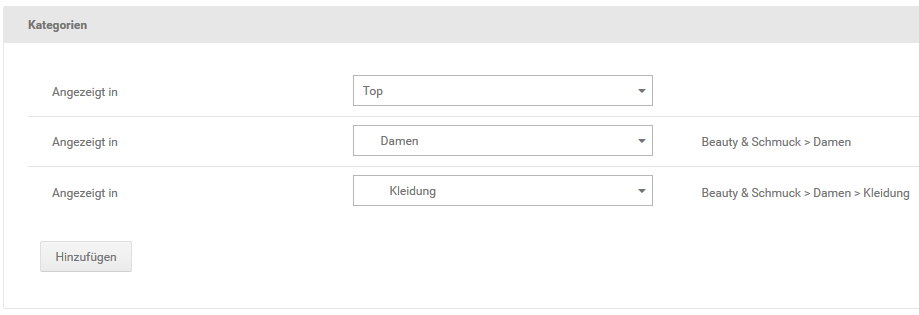
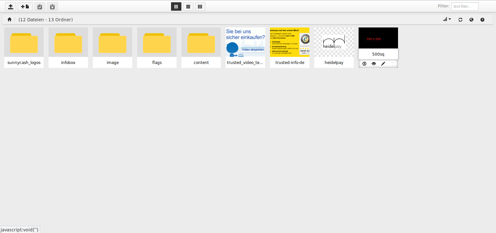

# Artikel

## Artikel anlegen {#artikel_artikel_anlegen}

Neue Artikel kannst du in der Artikel- und Kategorieübersicht unter _**Artikel \> Artikel/Kategorien**_ hinzufügen. Neue Artikel werden immer in der Kategorie angelegt, die in der Übersicht aufgelistet wird. Im Listenfeld _**Gehe zu**_ oberhalb der Artikel- und Kategorieliste wird dir die aktive Kategorie angezeigt.

!!! note "Hinweis" 
	 Um in eine Kategorie zu wechseln, klicke auf das schwarze Ordnersymbol vor dem Kategorienamen, oder wähle die gewünschte Kategorie aus der Liste _**Gehe zu**_ rechts in der Leiste am unteren Bildschirmrand aus.

!!! note "Hinweis"

	 Über die Drodown-Funktion der Schaltfläche _**Erstellen**_ kannst du auswählen, ob du einen Artikel oder eine Kategorie auswählen möchtest.

	 

	 Der Button hat eine Standard-Funktion. Befinden sich keine Kategorien im Shop, wird beim Klick ohne Verwendung des Dropdowns die Maske zum Erstellen einer Kategorie geöffnet; ansonsten die Maske zum Anlegen eines Artikels.

1.  Klicke in der Artikel- und Kategorieübersicht auf _**Erstellen \> Artikel**_
2.  Trage den Artikelnamen in das Feld _**Artikelname**_ ein
3.  Trage den Artikelpreis in das Feld _**Artikelpreis**_ ein

    Beachte, dass Preise grundsätzlich mit einem Punkt als Dezimaltrennzeichen angegeben werden müssen \(Beispiel: 12.95 für 12,95 EUR\)!

4.  Wähle aus der Liste _**Steuerklasse**_ die Steuerklasse für deinen Artikel aus
5.  Eine Übersicht über die Bedeutung der Felder in der Artikel-Eingabemaske findest du in der Tabelle _**Übersicht über die Artikel-Eingabemaske**_
6.  Klicke auf _**Speichern**_, um den neuen Artikel zu speichern

!!! note "Hinweis" 
	 Alle Felder in der Eingabemaske ohne Grundeinstellung sind optional und sollten nur verwendet werden, wenn die entsprechende Information zur Verfügung steht.

!!! note "Hinweis" 
	 Die einzelnen Bereich der Artikelmaske können mit Klick auf das Minus-Icon minimiert und über das Plus-Icon maximiert werden. Wenn also ein hier aufgeführter Bereich nicht angezeigt wird, klicke am rechten Ende der grauen Leiste auf das Plus-Icon.

### Kategorien {#artikel_artikel_anlegen_kategorien}

Im Bereich _**Kategorien**_ wird aufgeführt in welchen Kategorien der Artikel verlinkt ist, der gerade bearbeitet wird. Hierüber können auch Verweise auf weitere Kategorien hinzugefügt werden.

Je nach Anzahl der verlinkten Kategorien werden diese entweder als Liste von _**Dropdown**_-Menüs oder als sogenanntes _**Multiselect**_-Element angezeigt.

Mit einem Klick auf _**Hinzufügen**_ wird ein neues _**Dropdown**_ am unteren Ende der Liste angezeigt, über das eine Kategorie angelegt werden kann.

Wird das _**Multiselect**_ angezeigt, kann durch einen Mausklick eine einzelene Kategorie direkt ausgewählt werden.

In aller Regel sollen jedoch zusätzliche Kategorien verlinkt werden. Hierzu können die gewünschten Einträge mit gedrückter _**STRG**_-Taste angeklickt werden. Die Auswahl mehrerer, direkt untereinanderstehender Einträge ist mit gedrückter _**SHIFT**_-Taste möglich.

### Artikelstammdaten {#artikel_artikel_anlegen_artikelstammdaten}

|Feldname|Beschreibung|
|--------|------------|
|Artikelstatus|wenn _**aktiv**_, wird der Artikel im Shop angezeigt|
|Artikel-Nr.|frei vergebbare Artikelnummer des Artikels|
|Artikelanzahl|lagernde Menge des Artikels|
|Artikelgewicht \(kg\)|Gewicht des Artikels in Kilogramm mit vier Dezimalstellen \( . ist Trennzeichen\)|
|Lieferstatus|Lieferstatus des Artikels \(siehe Kapitel _**Lieferstatus**_\)|
|Artikelhersteller|Hersteller des Artikels; muss zunächst unter _**Artikel \> Hersteller**_ angelegt werden \(siehe Kapitel _**Hersteller**_\)|
|VPE|Verpackungseinheit des Grundpreises \*|
|VPE Wert|Umrechnungsfaktor für die Berechnung des Grundpreises \*|
|Mengeneinheit|die ausgewählte Mengeneinheit wird neben dem Mengeneingabe-Feld auf der Artikel-Detailseite, im Warenkorb und auf der Bestellbestätigung angezeigt; Einheiten müssen zunächst unter _**Artikel \> Mengeneinheiten**_ angelegt werden|
|Mindestbestellmenge \(muss \> 0 sein\)|Mindestmenge, die Kunden bestellen müssen; darf nicht 0 sein \(Grundeinstellung: 1\)|
|Mögliche Mengenstaffelung \(muss \> 0 sein\)|mögliche Schritte in der Bestellmenge; darf nicht 0 sein \(Grundeinstellung: 1\)|
|Barcode/EAN|Europäische Artikelnummer des Artikels|
|Versandkosten|Versandkostenzuschlag für den Artikel|
|Als Empfehlung anzeigen \(Startseite\)|wenn aktiviert, wird der Artikel im Abschnitt _**Unsere Empfehlungen**_ auf der Startseite angezeigt|
|"Woanders günstiger?"- Modul anzeigen|wenn aktiviert, wird das Kontaktformular _**Woanders günstiger?**_ unterhalb der Schaltfläche In den Warenkorb eingebunden|
|Lagerbestand anzeigen|wenn aktiviert, wird die Artikelanzahl auf der Artikel-Detailseite angezeigt|
|Gewicht anzeigen|wenn aktiviert, wird das Artikelgewicht auf der Artikel-Detailseite angezeigt|
|In die Sitemap aufnehmen|wenn aktiviert, wird der Artikel in die Sitemap für Suchmaschinen aufgenommen|
|Veröffentlichungsdatum anzeigen|wenn aktiviert, wird das Erscheinungsdatum auf der Artikel-Detailseite unterhalb der Artikelbeschreibung eingeblendet|
|Anzeige VPE|wenn aktiviert, wird der Grundpreis auf der Artikel-Detailseite unterhalb des Artikelpreises angezeigt \*|
|Erscheinungsdatum|das Erscheinungsdatum für vorbestellbare Artikel|
|Sortierreihenfolge|Priorität für die Anzeige in der Kategorieübersicht \(je kleiner der Wert, desto weiter oben/vorne die Anzeige; benötigt weitere Konfiguration in der Kategorie, siehe Kapitel _**Kategorien anlegen/bearbeiten**_\)|
|Sortierreihenfolge \(Startseite\)|Priorität für die Anzeige auf der Startseite \(je kleiner der Wert, desto weiter oben/vorne die Anzeige; benötigt keine weitere Konfiguration\)|
|Priorität in der Sitemap|steuert, wie wichtig der Eintrag in der Sitemap für die Suchmaschinen ist \(1.0: sehr wichtig bis 0.0: unwichtig\)|

\* Nähere Informationen zu Verpackungseinheiten findest du im Kapitel _**Verpackungseinheiten**_.

!!! note "Hinweis" 
	 Bitte beachte: Diese Darstellung entspricht der Grundkonfiguration des Shopsystems. Zusatzfunktionen und Drittanbietermodule können die Darstellung der Artikel-Eingabemaske beeinflussen. Nähere Informationen zu hier nicht dokumentierten Eingabefeldern findest du in der Anleitung des jeweiligen Moduls.

### Erweiterte Konfiguration {#artikel_artikel_anlegen_erweiterte_konfiguration}

|Feldname|Beschreibung|
|--------|------------|
|Vorlage für Artikeldetailseite|HTML-Vorlage für die Artikel-Detailseite \(Grundeinstellung: standard.html\)|
|Vorlage für Artikelattribute|HTML-Vorlage für Artikelattribute auf der Artikel- Detailseite \(Grundeinstellung: product\_options\_dropdown.html\)|
|Vorlage für Artikelattribute in Übersicht|HTML-Vorlage für Artikelattribute in der Kategorieübersicht \(Grundeinstellung: product\_options\_dropdown.html\)|
|Artikeltyp|legt fest, ob der Artikel ein Standardartikel, ein Downloadartikel oder eine Dienstleistung ist; damit der Kunde bei Downloads und Dienstleistungen ggf. auf das Widerrufsrecht verzichten kann|
|Produkt Teaser-Slider|ausgewählter Teaser-Slider für den Artikel|
|Artikelpreisstatus|Käuflichkeit des Artikels; _**normal**_: Artikel ist käuflich, _**Preis auf Anfrage**_: Artikel kann nicht direkt in den Warenkorb gelegt werden, _**nicht käuflich**_: Artikelpreis wird angezeigt, der Artikel kann jedoch nicht gekauft werden|
|Hermes ProfiPaketService|Auswahl der Paketklasse \(Hermes-Versandmodul\)|
|GX-Customizer Set|das ausgewählte GX-Customizer Set zum Individualisieren von Artikeln wird auf der Artikel-Detailseite eingebunden \(siehe Kapitel GX-Customizer\)|
|Verfallsdatum|Verfallsdatum des Artikels, wird z.B. beim Google Artikelexport verwendet|
|Zustand \(Google Export Pflicht\)|Pflichtfeld für Google Artikelexport, Einstellung über ein Dropdown \(neu / gebraucht / erneuert\)|
|Ab 18|wenn aktiviert, wird der Artikel als ab 18 Artikel ausgewiesen; der Kauf von ab 18 Artikeln kann je Kundengruppe verboten werden \(siehe Kapitel _**Kundengruppen**_\)|
|G-Motion aktivieren|wenn aktiviert, kann das Modul zur Animation von Artikelbildern verwendet werden \(siehe Kapitel _**Artikelbilder**_, Abschnitt _**G-Motion verwenden**_\)|

!!! danger "Achtung"

	 _**G-Motion**_ wird vom _**Honeygrid**_-Template nicht mehr unterstützt.

|Feldname|Beschreibung|
|--------|------------|
|Kennzeichnung existiert|Angabe für Google Artikelexport, sollte gesetzt werden, wenn mindestens eines der folgenden Felder verwendet wird: _**EAN**_, _**UPC**_, _**JAN**_, _**ISBN**_|
|ISBN \(Internationale Standardbuchnummer\)|Internationale Standardbuchnummer des Artikels|
|UPC \(Universal Product Code\)|Universeller Produktcode des Artikels|
|MPN \(Manufacturer Part Number\)|Herstellernummer des Artikels|
|JAN \(Japanese Article Number\)|Japanische Artikelnummer des Artikels|
|Marke|Marke des Artikels, wird z.B. beim Google Artikelexport verwendet|
|Geschlecht|Für welches Geschlecht ist der Artikel vorgesehen, wird z.B. beim Google Artikelexport verwendet|
|Altersgruppe|Für welche Altersgruppe ist der Artikel vorgesehen, wird z.B. beim Google Artikelexport verwendet|

!!! note "Hinweis" 
	 Bitte beachte: Diese Darstellung entspricht der Grundkonfiguration des Shopsystems. Zusatzfunktionen und Drittanbietermodule können die Darstellung der Artikel-Eingabemaske beeinflussen. Nähere Informationen zu hier nicht dokumentierten Eingabefeldern findest du in der Anleitung des jeweiligen Moduls.

### Zusatzfelder {#artikel_artikel_anlegen_zusatzfelder}

Über Zusatzfelder können weitere Informationen zu einem Artikel gespeichert werden. Die Angaben werden hauptsächlich für den Export zu Preisportalen verwendet, können jedoch auch auf der Artikel-Detailseite ausgegeben werden. Jedes Zusatzfeld hat eine Bezeichnung und einen Wert.

!!! note "Hinweis" 
	 Die Anzeige der Zusatzfelder kann unter _**Einstellungen / Layout & Design / Artikeldetailseite**_ an- und abgeschaltet werden. Setze bzw. entferne hierzu den Haken _**Zusatzfelder auf Detailseite aktivieren**_ und bestätige die Änderung mit einem Klick auf _**Speichern**_.

Um ein Zusatzfeld anzulegen, klicke auf die Schaltfläche _**Hinzufügen**_. Es werden pro im Shop verwendete Sprache jeweils ein Feld für _**Bezeichnung**_ und _**Wert**_ angezeigt. Nach der Eingabe kann das Zusatzfeld mit Klick auf _**Speichern**_ oder _**Übernehmen**_ übernommen werden.

Nach dem Speichern kann das gleiche Zusatzfeld in den anderen Artikeln des Shops ebenfalls mit einem Wert belegt werden.

Mit einem Klick auf das Mülltonnen-Symbol kann ein Zusatzfeld gelöscht werden. Es wird eine Sicherheitsabfrage angezeigt, klicke auf _**Löschen**_, um das Entfernen des Zusatzfelds zu bestätigen. Mit Klick auf _**Schließen**_ wird das Löschen abgebrochen, ohne das Zusatzfeld zu entfernen.

!!! danger "Achtung"

	 Das Löschen eines Zusatzfelds findet in **allen** Artikeln statt, auch wenn diese mit einem Wert belegt sind. Wenn du die Verwendung des Zusatzfelds in einem einzelnen Artikel verhindern möchtest, sollten stattdessen die Einträge unter _**Wert**_ entfernt werden.

### Artikel-Filter {#artikel_artikel_anlegen_artikel_filter}

Im Abschnitt Filterauswahl kannst du Artikel-Filter für deinen neuen Artikel festlegen. Nähere Informationen zu Artikel-Filtern findest du im Kapitel _**Artikel-Filter**_.

### Google Kategorie {#artikel_artikel_anlegen_google_kategorie}

Über _**Google Kategorie**_ kann der Artikel der internen Taxonomie von Google Shopping zugeordnet werden, wenn dieser zu Google Shopping exportiert wird. Die Auswahl hat auf die Kategorien des Shops keinen Einfluss.

Über die Schaltfläche _**Kategorie hinzufügen**_ kann dem Artikel eine Google Kategorie zugeordnet werden. Es werden hierbei nacheinander verschiedene Dropdown-Menüs angezeigt, aus der die jeweiligen Kategorien und Unterkategorien ausgewählt werden können. Klicke erneut auf _**Hinzufügen**_, um die Auswahl zu bestätigen. Über _**Abbrechen**_ wird der Vorgang beendet, ohne die Google Kategorie hinzuzufügen.

Eine bestehende Google Kategorie kann mit Klick auf das Bleistift-Symbol bearbeitet werden. Wird der Haken in der Box _**Löschen**_ gesetzt, wird die Google Kategorie beim nächsten Klick auf _**Speichern**_ oder _**Aktualisieren**_ wieder entfernt.

### Artikeldetails {#artikel_artikel_anlegen_artikeldetails}

!!! note "Hinweis" 
	 Für jede im Shop angelegte Sprache \(standardmäßig Deutsch und Englisch\) gibt es einen eigenen Bereich für die Artikeldetails.

Der Bereich _**Artikeldetails**_ dient hauptsächlich zum Festlegen des Inhalts der Artikeldetailseite. Es können folgende Einstellungen gemacht werden:

-   _**Artikelname**_: der Name des Artikels, welcher im Shop angezeigt wird
-   _**Artikelbeschreibung**_: die detaillierte Beschreibung des Artikels, welche direkt auf der Artikeldetailseite angezeigt wird
-   _**Tabs**_: Artikeltabs dienen zum Anzeigen zusätzlicher Inhalte auf der Artikeldetailseite, siehe Kapitel _**Artikeltabs**_
-   _**Kurzbeschreibung**_: diese Beschreibung wird auf den Artikelseiten \(Kategorie- und Suchergebnisseiten\) angezeigt, wenn diese in der gelisteten Ansicht dargestellt werden
-   _**Wesentliche Merkmale \(Bestellzusammenfassung\)**_: diese Beschreibung wird auf der letzten Seite des Bestellvorgangs zum Artikel angezeigt
-   _**Herstellerlink**_: Link zum Hersteller des Artikels
-   _**Zusatzbegriffe für Suche**_: Liste von Suchbegriffen \(kommagetrennt, ohne Leerzeichen\), können von der Shopsuche, aber nicht von Suchmaschinen, gefunden werden, werden nicht auf der Artikeldetailseite angezeigt
-   _**URL Keywords**_: Bestandteil des Links zum Artikel, wenn der Gambio SEO Boost verwendet wird, muss mindestens 3 Zeichen lang sein

!!! danger "Achtung"

	 _**URL Keywords**_ dürfen weder Leerzeichen, noch Umlaute oder Sonderzeichen enthalten. Wir empfehlen das Feld leer zu lassen, es wird von Shop automatisch befüllt.

-   _**URL Rewrite**_: Feld zur Angabe einer alternativen URL, siehe Kapitel _**URL Rewrite**_
-   _**Meta Title**_: Titel der Seite für die Meta-Informationen \(siehe Kapitel _**Meta-Angaben**_\)
-   _**Meta Keywords**_: Schlagwörter, die von Suchmaschinen berücksichtigt werden können. Angabe als kommagetrennte Liste \(ohne Leerzeichen\), siehe auch Kapitel _**Meta-Angaben**_
-   _**Meta Description**_: Beschreibung des Artikels für die Meta-Informationen \(siehe auch Kapitel _**Meta-Angaben**_\)

!!! note "Hinweis" 
	 Die Eingabe der Artikelbeschreibung, Kurzbeschreibung und wesentlichen Merkmale erfolgt über den _**CK-Editor**_. Eine Übersicht über die einzelnen Funktionen findest du im Kapitel _**CK-Editor**_.

	 Über die Schaltfläche _**Editor wechseln**_ kann auf einen alternativen HTML-Editor mit Zeilennummerangabe umgeschaltet werden.

### Artikelbilder {#artikel_artikel_anlegen_artikelbilder}

siehe Kapitel _**Artikelbilder**_

### Kundengruppe {#artikel_artikel_anlegen_kundengruppe}

!!! note "Hinweis" 
	 Der Bereich _**Kundengruppe**_ wird nur angezeigt, wenn unter _**Einstellungen / Kunden / Kunden**_ der _**Kundengruppencheck**_ aktiviert ist.

Über die Einstellung Kundengruppe kann festgelegt werden welche Kundengruppe einen Artikel sehen und aufrufen kann. Ist der Haken für eine Kundengruppe nicht gesetzt, wird dieser in Kategorien, Suchergebnissen und sonstigen Artikelseiten \(z.B. _**Unsere Empfehlungen**_\) nicht angezeigt. Auch wenn der Link zum Artikel aus anderer Quelle bekannt sein sollte, kann dieser über eine Kundengruppe ohne Haken nicht aufgerufen werden.

Wird der Haken für _**Alle**_ gesetzt, werden nach dem nächsten Klick auf _**Speichern**_ oder _**Aktualisieren**_ die Rechte für alle Kundengruppen vergeben.

### Preisoptionen {#artikel_artikel_anlegen_preisoptionen}

Im Bereich _**Preisoptionen**_ stehen folgende Einstellungen zur Verfügung

-   _**Artikelpreis**_: der Preis des Artikels in der eingestellten Währung
-   _**Rabatt**_: möglicher Rabatt auf den Artikel in Prozent \(siehe Kapitel _**Artikelrabatt**_\)
-   _**Steuerklasse**_: Steuerklasse des Artikels, bestimmt den verwendeten Steuersatz \(siehe Kapitel _**Steuer**_\)

Zudem steht für jede Kundengruppe außer _**Admin**_ \(typischerweise _**Gast**_, _**Neuer Kunde**_ und _**Händler**_\) je ein Eingabefeld für einen eigenen Kundengruppenpreis zur Verfügung. Über das dahinterstehende + kann zudem ein Staffelpreis für die jeweilige Kundengruppe eingerichtet werden \(siehe Kapitel _**Staffelpreise**_\).

Wird der Kundengruppenpreis nicht verwendet, wird der reguläre Artikelpreis angezeigt und berechnet.

## Artikel bearbeiten {#artikel_artikel_bearbeiten}

Zum Bearbeiten von Artikeln, klicke zunächst in der Artikel- und Kategorieübersicht auf den Namen des Artikels und anschließend auf die Schaltfläche _**Bearbeiten**_.

Nimm die gewünschten Änderungen an den Konfigurationsfeldern des Artikels vor. Eine Übersicht über die Bedeutung der Felder in der Artikel-Eingabemaske findest du in der Tabelle _**Übersicht über die Artikel-Eingabemaske**_.

## Artikelbilder {#artikel_artikelbilder}

Die Anzahl der verwendeten Artikelbilder ist für jeden Artikel frei festlegebar. Standardmäßig ist nur ein Eintrag für das Haupt-Artikelbild vorhanden. Klicke auf _**Bilder hinzufügen**_ um ein weiteres Bild einrichten zu können.

!!! note "Hinweis" 
	 Die Anzahl der Bilder pro Artikel ist bis maximal 1000 Bilder beschränkt.
	 
### Auswahl des Bildes mit dem Responsive Filemanager

Befindet sich das Bild bereits auf dem Server, kann es direkt ausgewählt werden:

Um das Bild hochzuladen, klicke bitte auf die in der Abbildung rot umrandete Schaltfläche.

Es öffnet sich der Dialog _**Standard Hochladen**_. Klicke nun auf die, in der Abbildung gezeigte, grüne Schaltfläche _**Dateien hinzufügen**_, um den Dialog zur Auswahl der Datei auf deinem Rechner aufzurufen oder ziehe diese z.B. direkt aus dem Dateiordner deines Rechners in den weißen Bereich.

Ist die Bild-Datei hochgeladen, wird neben der Vorschau ein Häkchen angezeigt.

Die Datei kann nun über einen Mausklick ausgewählt werden.

### Artikelbild löschen

Wenn du ein Artikelbild nicht mehr verwenden möchtest, lösche es in der Artikel-Eingabemaske unter _**Artikel \> Artikel/Kategorien**_. Aktiviere im Abschnitt _**Artikelbilder**_ das Kontrollkästchen _**Löschen**_ bei jedem Artikelbild, das nicht mehr verwendet werden soll. Klicke auf _**Speichern**_ oder _**Aktualisieren**_, um die ausgewählten Artikelbilder unwiderruflich zu löschen.

### G-Motion verwenden

Mit G-Motion werden starre Artikelbilder animiert. Bei der Animation kannst du zwischen Schwenk, Zoom und einer Kombination aus Schwenk und Zoom auswählen. G-Motion-Bilder werden ausschließlich auf der Artikel-Detailseite angezeigt.

!!! note "Hinweis" 
	 Die Zoom-Funktion auf der Artikel-Detailseite kann bei G-Motion-Bildern nicht verwendet werden! G-Motion wird vom _**Honeygrid**_ **nicht** unterstützt!

1.  Aktiviere die Einstellung _**G-Motion aktivieren**_
2.  Aktiviere bei den Artikelbildern das Kontrollkästchen _**Als G-Motion-Bild nutzen**_, für die du die Animation einrichten möchtest
3.  Bewege den grünen Kreis auf dem Artikelbild unter _**Animationspositionen**_ auf den Anfangspunkt des Schwenks
4.  Bewege den roten Kreis auf dem Artikelbild unter _**Animationspositionen**_ auf den Endpunkt des Schwenks
5.  Wenn du keinen Schwenk einrichten möchtest, trage in den grün und rot eingerahmten Feldern _**Schwenk von**_ und _**nach**_ die Werte **50% 50%** ein
6.  Wähle aus der Liste _**Zoom-Faktor von**_ den Vergrößerungsfaktor am Startpunkt des Schwenks aus
7.  Wähle aus der Liste _**nach**_ den Vergrößerungsfaktor am Endpunkt des Schwenks aus
8.  Wenn du keinen Zoom einrichten möchtest, wähle in beiden Listen den Wert _**1,0x**_ aus
9.  Trage in das Feld _**Animationsdauer des Bildes**_ die Dauer der zuvor gewählten Animation in Sekunden ein

    Wenn du mehr als ein G-Motion-Bild verwendest, werden die G-Motion-Bilder nacheinander abgespielt. Die Reihenfolge, in der die einzelnen Bilder abgespielt werden, kannst du im Feld _**Sortierung**_ eintragen.

10. Klicke auf _**Speichern**_ oder _**Aktualisieren**_, um die Änderungen zu übernehmen.

!!! danger "Achtung"

	 Wenn das Kontrollkästchen _**Als Artikelbild verwenden**_ bei allen Artikelbildern deaktiviert wird, werden in Artikellisten, wie beispielsweise Kategorieseiten, für diesen Artikel keine Artikelbilder angezeigt.

## Artikeltabs

Über Tabs können zusätzliche Informationen zum Artikel im Bereich der Artikelbeschreibung angezeigt werden. Die einzelnen Bereiche lassen sich über die Überschriften in der Leiste auswählen und anzeigen.

### Tabs anlegen

Um einen zusätzlichen Tab anzulegen, bearbeite den entsprechenden Artikel unter _**Artikel \> Artikel / Kategorien**_. Unterhalb des CK-Editors \(Texteingabefeld\) für die Artikelbeschreibung findest du den Bereich _**Tabs**_. Klicke auf _**Tab hinzufügen**_, um einen neuen Tab anzulegen, es öffnet sich ein neues Fenster. Die obere Zeile dient zum Festlegen der Überschrift, das Texteingabefeld darunter zum Hinterlegen des Inhaltes. Genauere Informationen zu den Funktionen des Eingabefeldes erhältst du im Kapitel _**CK-Editor**_.

Mit Klick auf _**Abbrechen**_ wird das Anlegen des Tabs unterbrochen und alle Änderungen daran verworfen. Mit Klick auf _**Übernehmen**_ wird der Tab erzeugt. Auf diese Weise können alle benötigten Tabs angelegt werden.

Abschließend muss die Änderung im Artikel gespeichert werden, klicke hier auf _**Aktualisieren**_ oder _**Speichern**_. Anderenfalls werden die erzeugten Tabs nach dem Verlassen der Artikelkonfiguration wieder verworfen.

### Tabs bearbeiten und löschen

Angelegte Tabs können nachträglich bearbeitet werden. Bearbeite hierzu den Artikel, wie bereits beschrieben und scrolle zum Bereich _**Tabs**_, unterhalb der Artikelbeschreibung. Die Tabs werden untereinander aufgeführt, auf der rechten Seite dieser Liste findest du zwei Symbole: einen Bleistift und einen Mülleimer. Über das Stift-Symbol lässt sich der Tab bearbeiten, es öffnet sich das bekannte Eingabefenster mit dem Inhalt des Tabs.

Über den Mülleimer kann der Tab gelöscht werden. Zuvor wird eine Sicherheitsabfrage geöffnet, mit Klick auf _**Löschen**_ bestätigst du das Entfernen des Tabs. Über _**Abbrechen**_ wird der Löschvorgang abgebrochen.

Wie auch beim Anlegen, müssen die Änderungen sowohl beim Bearbeiten als auch beim Löschen von Tabs im Artikel gespeichert werden. Klicke hierzu auf _**Aktualisieren**_ oder _**Speichern**_.

### Tabs im Artikel

Sobald mindestens ein Tab angelegt ist, wird die Artikelbeschreibung über der Leiste angezeigt und die Überschrift _**Artikelbeschreibung**_ verschwindet. Der nun frei gewordene Platz enthält die angelegten Tabs, sie können über die jeweilige Überschrift in der Leiste ausgewählt werden. Der derzeit aktive Tab wird über ein Pfeilsymbol angezeigt, das auf die zugehörige Überschrift weist. Wurde nur ein Tab angelegt, ist dieser standardmäßig aktiv und wird dauerhaft angezeigt.

## Verpackungseinheiten & Mengeneinheiten

Für Grundpreispflichtige Artikel berechnet das Shopsystem die Grundpreise automatisch über die Verpackungseinheiten. Über die Mengeneinheiten werden frei konfigurierbare Mengeneinheiten hinter die Stückzahlen der Artikel im Bestellprozess angezeigt. Die Verpackungseinheiten und Mengeneinheiten arbeiten voneinander unabhängig und können kombiniert werden.

### Verpackungseinheiten 

Mit Verpackungseinheiten \(VPE\) wird angegeben in welchen Einheiten ein Artikel verkauft wird, wie z.B. Stück, Liter, Kilogramm usw. Diese Angabe wird für die Grundpreisangabe benötigt.

Unter _**Artikel \> Verpackungseinheiten**_ können neue Verpackungseinheiten angelegt und bestehende Verpackungseinheiten bearbeitet oder entfernt werden.

!!! note "Hinweis"

	 Bei der Installation des Shops werden standardmäßig keine Verpackungseinheiten hinzugefügt, sie müssen also händisch angelegt werden.

#### Verpackungseinheiten anlegen

Um eine Verpackungseinheit anzulegen, gehe im Gambio Admin unter _**Artikel \> Verpackungseinheiten**_.

Klicke hier in der rechten, oberen Ecke auf die Schaltfläche _**Erstellen**_

Es öffnet sich das Eingabefenster zum Anlegen einer neuen Verpackungseinheit. Trage hier den Namen der Einheit für die im Shop vorhandenen Sprachen ein und bestätige die Eingabe mit einem Klick auf _**Hinzufügen**_. Über _**Abbrechen**_ kann das Dialogfenster geschlossen werden, ohne die Einheit anzulegen. Wenn du vor dem Anlegen den Haken für _**Standard**_ setzt, wird die neue Einheit als Standard-Verpackungseinheit definiert.

#### Verpackungseinheiten bearbeiten

Um eine Verpackungseinheit zu bearbeiten, gehe unter _**Artikel \> Verpackungseinheiten**_ und bewege den Mauszeiger in die Zeile der Verpackungseinheit, die du bearbeiten möchtest.

Klicke hier auf das Bleistift-Symbol, um die Eingabemaske zum Bearbeiten zu öffnen.

Es kann jeweils der Name der Verpackungseinheit pro Sprache angepasst werden. Zudem kann eine Verpackungseinheit nachträglich als Standard definiert oder diese Festlegung wieder entfernt werden.

Bestätige die Änderungen mit Klick auf _**Aktualisieren**_. Über _**Abbrechen**_ kannst du das Dialogfenster verlassen, ohne die gemachten Einstellungen zu übernehmen.

#### Verpackungseinheien löschen

Um eine Verpackungseinheit zu löschen, gehe unter _**Artikel \> Verpackungseinheiten**_ und bewege den Mauszeiger in die Zeile der Verpackungseinheit, die du löschen möchtest.

Klicke auf das Mülltonnen-Symbol, um die Verpackungseinheit zu entfernen.

Es wird eine Sicherheitsabfrage angezeigt. Bestätige mit einem Klick auf _**Löschen**_, dass du die Verpackungseinheit wirklich entfernen möchtest. Über einen Klick auf _**Abbrechen**_ kann der Vorgang abgebrochen werden.

!!! note "Hinweis"

	 Die Standard-Verpackungseinheit kann nicht gelöscht werden, daher wird für sie kein Mülltonnen-Symbol angezeigt.

#### Verpackungseinheiten auswählen

Die Verpackungseinheit wird im Artikel ausgewählt und eingestellt. Gehe hierzu unter _**Artikel \> Artikel/Kategorien**_ und bearbeite den gewünschten Artikel. Die notwendigen Einstellungen können im Bereich _**Artikelstammdaten**_ vorgenommen werden.

Verwende hier das Dropdown _**VPE**_ um die gewünschte Verpackungseinheit auszuwählen.

#### Festlegen des VPE Werts

Der VPE Wert legt fest, wie viele Einheiten der Grundeinheit \(z.B. Stück, Liter, Kilogramm\) mit dem Artikel verkauft werden.

Bei einer 1,5-Liter-Flasche wäre die Verpackungseinheit Liter und der VPE Wert 1.5, bei einer 500 Gramm Packung Mehl und der Verpackungseinheit Kilogramm wäre der VPE Wert entsprechend 0.5 usw. Für die Berechnung des Grundpreises gilt:

Artikelpreis / VPE Wert = Grundpreis

Trage den Wert in das Feld _**VPE Wert**_ in der Artikelmaske ein.

!!! danger "Achtung"

	 Bitte beachte, dass Kommazahlen mit einem Punkt als Dezimaltrenner angegeben werden müssen.

Zudem muss der Haken für _**Anzeige VPE**_ gesetzt werden.

!!! example "Beispiel"

	 Beispiel: Sechserpack eines Produkts

	 Gehen wir davon aus, dass du ein Produkt in einem Gebinde von jeweils sechs Stück zu 7,99 Euro verkaufst. In diesem Fall wähle die Verpackungseinheit _**Stück**_ aus und trage als _**VPE Wert**_ 6 ein.

	 

	 Der Grundpreis errechnet sich wie folgt:

	 7,99 / 6 = 1,331666667 =\> 1,33 Euro pro Stück

	 

!!! example "Beispiel"

	 Beispiel: Glasflasche 0,75 Liter

	 Hier möchten wir den Grundpreis pro Liter angeben. Wir wählen für _**VPE**_ den Eintrag _**Liter**_ aus und tragen den Faktor 0.75 als _**VPE Wert**_ ein.

	 

	 Bei einem Verkaufspreis von 49 Cent errechnet sich der Grundpreis entsprechend:

	 0,49 / 0,75 = 0,653333333 =\> 0,65 Euro pro Liter

	 

!!! example "Beispiel"
	 Beispiel: Meterware, die in Stücken zu 2,5 Meter verkauft wird
	 
	 Es soll Meterware in vordefinierten Längen verkauft werden. Wir wählen für _**VPE**_ entsprechend den Eintrag _**m**_ und tragen die Länge 2.5 als _**VPE Wert**_ ein.
	 
	 
	 
	 10,00 / 2,5 = 4,00 Euro pro Meter
	 
	 

### Mengeneinheiten

1.  Lege im Gambio Admin unter _**Artikel \> Mengeneinheiten**_ die benötigten Mengeneinheiten an
2.  Wähle unter _**Artikel \> Artikel/Kategorien**_ in der Eingabemaske des gewünschten Artikels aus der Liste _**Mengeineheit**_ die gewünschte Mengeneinheit aus
3.  Klicke am Ende der Eingabemaske auf _**Speichern**_ oder _**Aktualisieren**_, um die Änderungen an den Mengeneinheiten zu übernehmen

## Hersteller

1.  Lege unter _**Artikel \> Hersteller**_ die benötigten Hersteller an
2.  Klicke auf _**Erstellen**_
3.  Trage den Namen des Herstellers in das Feld _**Herstellername**_ ein
4.  Wenn du ein Logo des Herstellers anzeigen lassen möchtest, lade das Logo über das Dateifeld _**Herstellerbild**_ hoch
5.  Trage im Feld _**Hersteller URL**_ die Internetadresse des Herstellers ein
6.  Klicke auf _**Speichern**_, um den Hersteller zu speichern
7.  Wähle unter _**Artikel \> Artikel/Kategorien**_ in der Eingabemaske des gewünschten Artikels aus der Liste _**Artikelhersteller**_ den Hersteller des Artikels aus
8.  Klicke am Ende der Eingabemaske auf _**Speichern**_ oder _**Aktualisieren**_, um die Änderungen am Hersteller des Artikels zu übernehmen

## Artikel kopieren

Artikel lassen sich unter _**Artikel \> Artikel / Kategorien**_ kopieren. Markiere die Artikel, die du kopieren möchtest, indem du in den zugehörigen Boxen die Haken setzt. In der Leiste unter der Auflistung wird nun der Dropdown-Button angezeigt. Klicke auf der rechten Seite des Buttons auf den nach unten weisenden Pfeil und anschließend auf _**Kopieren**_.

Es wird der Bereich _**Kopieren nach**_ in einem neuen Fenster angezeigt. Im oberen Teil dieser Spalte findest du eine Auflistung der Artikel, die kopiert werden sollen. Darunter ist der Bereich _**Mehrfach**_, hier ist der komplette Kategorie-Baum deines Shops aufgeführt. Durch Anhaken der entsprechenden Boxen werden die Zielkategorien gewählt, in die die Artikel kopiert werden sollen.

Im Bereich _**Einfach**_ kann als Ziel nur eine Kategorie ausgewählt werden.

!!! note "Hinweis" 
	 Wenn unter _**Mehrfach**_ ein oder mehr Haken gesetzt sind, wird die Einstellung unter _**Einfach**_ komplett ignoriert. Wenn _**Einfach**_ verwendet werden soll, darf unter _**Mehrfach**_ kein Haken gesetzt sein.

Im Bereich _**Kopiermethode**_ wird festgelegt, ob der Artikel verlinkt oder dupliziert werden soll. Beide Methoden ermöglichen es, Artikel an mehreren Stellen im Shop sichtbar zu machen. Die Auswahl unterscheidet sich folgendermaßen:

Verlinken

-   Der Artikel ist nur ein Mal im Shop vorhanden
-   Änderungen, die an einem Artikel vorgenommen werden, wirken sich auf alle anderen Vorkommen des Artikels aus

Duplizieren

-   Der Artikel ist mehrfach im Shop vorhanden
-   Änderungen wirken sich nur auf einen Artikel aus, die anderen Vorkommen des Artikels bleiben unverändert

Verlinken ist immer dann von Vorteil, wenn Artikel in identischer Form an mehreren Stellen vorkommen sollen. Änderungen müssen nur an einem Artikel vorgenommen werden, dies verhindert, dass bei mehreren Änderungen an mehreren Artikeln Details vergessen werden. Duplizieren kann verwendet werden, wenn verschiedene Abwandlungen eines Artikels angelegt werden sollen, die unabhängig voneinander sind.

Unter _**Kopieroptionen für Artikel**_ kann eingestellt werden ob

-   Attribute
-   Sonderangebote
-   Cross Selling

übernommen werden sollen.

Mit Klick auf _**Kopieren**_ wird der Kopiervorgang gestartet. Am Ende des Kopiervorganges wird jeweils die unterste, ausgewählte Kategorie aus der Liste angezeigt.