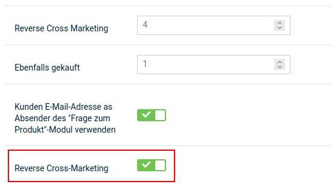

# Zusatzfunktionen

## Cross Selling

Cross Selling ist eine Marketing-Funktion, mit der du einem Artikel weitere Artikel als Empfehlung hinzufügst. Die Empfehlungen werden im Shopbereich unterhalb der Artikelbeschreibung angezeigt.

")

### Artikelempfehlung hinzufügen

1.  Markiere den Artikel, zu dem du Empfehlungen hinzufügen möchtest
2.  Klicke auf _**Cross Selling**_
3.  Trage im Feld _**Produktsuche**_ eine Artikelnummer oder einen Artikelnamen ein, den du zum gewählten Artikel empfehlen möchtest und klicke auf _**Suchen**_
4.  Aktiviere das Kontrollkästchen in der Spalte _**Hinzufügen**_ bei den gefundenen Artikeln, die du zum gewählten Artikel empfehlen möchtest
5.  Klicke auf _**Speichern**_

### Artikelempfehlung löschen

1.  Markiere den Artikel, aus dem du Empfehlungen löschen möchtest
2.  Klicke in der rechten Spalte auf _**Cross Selling**_
3.  Aktiviere das Kontrollkästchen in der Spalte _**Löschen**_ bei den Empfehlungen, die du löschen möchtest
4.  Klicke auf _**Speichern**_ und bestätige das Speichern der Änderungen mit _**OK**_

### Automatische Rückverknüpfung

Artikelempfehlungen werden in der Grundeinstellung des Shopsystems automatisch in beide Richtungen verknüpft. Im empfohlenen Artikel wird der ursprüngliche Artikel auf der Artikel-Detailseite unter _**Dieses Produkt ist kompatibel zu**_ angezeigt. Die automatische Rückverknüpfung kannst du im Gambio Admin deines Shops unter _**Einstellungen / Layout / Design / Artikeldetailseite**_ deaktivieren. Ändere die Option bei _**Reverse Cross-Marketing**_ auf ✖ und speichere die Änderung.

Wenn du die automatische Rückverknüpfung deaktiviert hast und die Funktion reaktivieren möchtest, ändere die Option bei _**Reverse Cross-Marketing**_ auf ✔ und speichere die Änderung.

## Cross-Marketing Gruppen

Mit Hilfe von Cross-Marketing Gruppen können Cross Selling Artikel mit einem Gruppen-Bezeichner versehen werden.

!!! note "Hinweis"

	 Cross-Marketing Gruppen sind rein optische Textauszeichnungen. Es ist z.B. standardmäßig nicht möglich, Gruppen von Cross Selling Artikeln einem anderen Artikel zuzuordnen.

### Cross-Marketing Gruppe anlegen

Um eine Cross-Marketing-Gruppe anzulegen, gehe im Gambio Admin unter _**Artikel \> Cross-Marketing Gruppen**_ und klicke auf die grüne Schaltfläche _**Erstellen**_.

Du kannst den Gruppennamen jeweils pro im Shop vorhandener Sprache eintragen.

Bestätige die Eingabe mit einem Klick auf _**Einfügen**_. Über _**Abbrechen**_ kannst du die Eingabemaske wieder verlassen, ohne die Eingabe zu übernehmen.

### Cross-Marketing Gruppe bearbeiten

Um eine Cross-Marketing Gruppe zu bearbeiten, wähle diese unter _**Artikel \> Cross-Marketing Gruppen**_ aus und klicke auf die Schaltfläche _**Bearbeiten**_, in der rechten, unteren Bildschirmecke. Klicke auf _**Aktualisieren**_. um die Änderungen zu übernehmen. Über _**Abbrechen**_ verlässt du die Eingabemaske wieder, ohne die Eingaben zu speichern.

### Cross-Marketing Gruppe löschen

Um eine Cross-Marketing Gruppe zu löschen, wähle diese unter _**Artikel \> Cross-Marketing Gruppen**_ aus und klicke auf die Schalftlfäche _**Löschen**_ in der rechten, unteren Bildschirmecke. Bestätige die Sicherheitsabfrage mit einem erneuten Klick auf _**Löschen**_, um die Cross-Marketing Gruppe zu entfernen. Über _**Abbrechen**_ verlässt du den Dialog, ohne die Gruppe zu löschen.

### Cross-Marketing Gruppe einstellen

Cross-Marketing Gruppen können nach dem Hinzufügen, beziehungsweise beim Bearbeiten, von Cross Selling Artikeln eingestellt werden.

Wähle hierzu den gewünschten Eintrag aus dem Dropdownmenü _**Gruppe**_ aus, setze ggf. den Haken für _**hinzufügen**_ und bestätige mit _**Speichern**_ respektive Aktualisieren.

## Downloadartikel bis Shopversion 4.4

### Einleitung

!!! abstract "Definitionen"
	 Es werden die folgenden Begriffe verwendet:
	 
	 - _**Attribut**_: 
		- Eigenart eines Artikels, wie _Farbe_ oder _Größe_
		- wird über das Attributsystem (Artikelattribute) des Shops eingerichtet
		- bei der Einrichtung von Downloadartikeln wird das Attribut _**downloads**_ benötigt
	 - _**Optionswert**_: 
		- Ausprägung der Eigenart eines Artikels, wie _blau_ oder _XL_
		- wird über das Attributsystem (Artikelattribute) des Shops eingerichtet
	 - _**Anzeigeart**_:
		- Art und Weise wie ein Attribut bzw. die Auswahl der Optionswerte im Artikel angezeigt wird
		- Attribute können als _**Dropdown**_,  _**Bild**_, _**Radio**_ (Radio Button), _**Text**_ oder _**Eingerahmter Text**_ dargestellt werden

Über Downloadartikel können Dateien zum Kauf angeboten werden. Hierbei wird in Shops bis einschließlich Version _**4.4**_ das Attributsystem zur Umsetzung verwendet. 

!!! danger "Achtung"

	 Damit Downloadartikel erstellt und im Shop verwendet werden können, muss unter _**Module > Modul-Center**_ das Modul _**Artikelattribute**_ installiert werden.

### Attribut downloads anlegen

Um Download-Artikel erstellen zu können, muss unter _**Artikel > Artikelattribute**_ das Attribut _**downlods**_ angelegt worden sein. Gibt es dieses Attribut bereits, fahre bitte direkt mit dem Anlegen des Optionswerts fort.

Gehe hierzu wie folgt vor:

!!! check "Anlegen des Attributs _**downloads**_"
	 1. trage den Namen _**downloads**_ als _**Artikelmerkmal-Bezeichung**_ ein
	 2. wähle bei Bedarf eine andere _**Anzeigeart**_ aus
	 3. klicke auf _**Einfügen**_
	 
!!! danger "Achtung"
	 Bitte achte genau auf die Schreibweise! Der Name des Attributs muss klein geschrieben sein und auf s enden, also _**downloads**_, **nicht** _**Downloads**_ oder _**Download**_.

### Optionswert anlegen

Über den Optionswert wird dem Artikel die Datei hinzugefügt, welche der Kunde nach dem Kauf herunterladen soll.

Gehe hierzu wie folgt vor:

!!! check "Anlegen eines Optionswerts für das Attribut _**downloads**_ "
	 1. wähle im Dropdown das Attribut _**downloads**_ aus
	 2. trage den Namen des Optionswerts ein, wie er im Shop angezeigt werden soll
	 3. wenn du die _**Anzeigeart**_ _**Bild**_ verwendest, lade das Bild hoch, das für den Download angezeigt werden soll, bzw. wähle es über den Dateimanager aus
	 4. klicke auf _**Einfügen**_
	 
!!! note "Hinweis"
	 An dieser Stelle wird die Datei für den Download noch nicht hinterlegt. Über den Dateidialog kann lediglich das Bild hochgeladen bzw. ausgewählt werden, das im Artikel angezeigt wird, wenn die _**Anzeigeart**_ _**Bild**_ im Attribut eingestellt ist.
	 

### Einstellungen im Artikel vornehmen

Zusätzlich müssen im Artikel weitere Einstellungen vorgenommen werden, damit dieser als Downloadartikel verwendet werden kann. Bearbeite diesen hierzu unter _**Artikel > Artikel/Kategorien**_ und scrolle zunächst zur Maske _**Erweiterte Konfiguration**_. Hier muss der _**Artikeltyp**_ auf _**Download**_ eingestellt werden:

Zudem sollte unter _**Preisoptionen**_ die _**Steuerklasse**_ _**elektronisch erbrachte Leistung**_ eingestellt werden:

!!! danger "Achtung"
	 Wir können im Rahmen des Handbuchs nur die technische Seite der Einrichtung beschreiben. Bei Fragen zu steuerlichen oder rechtlichen Belangen, wende dich bitte an deinen Steuerberater respektive Rechtsbeistand.
	 

### Zuweisen des Optionswerts

Über das Zuweisen des Optionswerts wird dem Downloadartikel auch die entsprechende Datei zugeordnet. Rufe hierzu die Attributverwaltung auf, dies kannst du z.B. über die Dropdown-Schaltfläche aus der Artikelmaske tun:

Beim ersten Aufruf ist die Ansicht der Optionswerte noch eingeklappt. Klicke auf das Symbol mit dem Pluszeichen, um die verfügbaren Optionswerte des Attributs _**downloads**_ auszuklappen:

Nun kannst du den gewünschten Optionswert auswählen. Setze hierzu den Haken in das Kästchen, neben dem Namen des Optionswerts, damit dieser dem Artikel zugewiesen werden kann:

Nach dem Setzen des Hakens ist es möglich die notwendigen Einstellungen vorzunehmen:

!!! check "Nimm folgende Einstellungen vor"
	 1. lade die zu verkaufende Datei hoch
	 2. lege die Anzahl der möglichen Downloads im Feld _**Mögl. Downloads**_ fest
	 3. lege die Downloadzeit (wie lange soll die Datei nach einer Bestellung zum Download zur Verfügung stehen?) in Tagen im Feld _** Downloadzeit (Tage)**_ fest
	 4. wenn du den Bestand für Downloadartikel prüfst, trage unter _**Lager**_ den entsprechenden Bestand ein

!!! note "Hochladen von Dateien"
	 1. rufe den Dateimanager über die Schaltfläche zum Hochladen auf:
	 
	 2. es werden dir die ggf. schon auf dem Server liegenden Dateien angezeigt, klicke auf den Button in der linken, oberen Ecke um eine Datei auf deinem Rechner auszuwählen:
	 
	 3. klicke hier auf die grüne Schaltfläche:
	 

!!! note "Hinweis"
	 Es können einem Artikel auch mehrere Optionswerte des Attributs _**downloads**_  und damit mehrere Dateien zugeordnet werden. Es kann jedoch _pro Artikel_ nur _eine Datei zur Zeit_ bestellt werden. Möchte ein Kunde mehrere Varianten eines Artikels, z.B. ein E-Book oder Musikstück in verschiedenen Dateiformaten, bestellen, so muss dieser den Artikel mehrfach in den Warenkorb legen und hierbei den jeweiligen Download über das Attribut _**downloads**_ entsprechend auswählen.

### Downloadoptionen

In den Downloadoptionen, unter _**Einstellungen / Artikel & Kategorien**_ im Gambio Admin, gibt es allgemeine Einstellungen für das Bereitstellen von Downloadartikeln. Wichtig in diesem Bereich sind vor allem die Punkte _**Ausgeschlossene Zahlungsmodule**_ und _**Download-Bestellstatus**_. Hierüber solltest du festlegen welche Zahlungsmodule deinen Kunden für das Bestellen von Downloadartikeln nicht zur Verfügung stehen sollen bzw. bei welchen Bestellstatus ein Herunterladen der bestellten Artikel möglich ist. Bitte achte bei letzterem besonders darauf, dass einzelne Zahlungsmodule eigene Bestellstatus für den erfolgreichen Bestellabschluss verwenden können; diese müssen ebenfalls hinzugefügt werden, damit dein Kunde die bestellte(n) Datei(en) nach Zahlungsabschluss erhalten kann. 

Eine Beschreibung findest du in den nachfolgenden Tabellen.

!!! note "Hinweis"

	 Dieser Bereich verwendet ein erweitertes Dropdown-Menü zur Auswahl von Einträgen.

	 

	 Klappe das Dropdown wie gewohnt über das nach unten weisende Dreieck-Symbol aus. Bereits ausgewählte Einträge werden grau hinterlegt angezeigt.

	 

	 Beim Hovern werden Einträge, die ausgewählt werden können, grün hinterlegt. Einträge die bereits ausgewählt sind und abgewählt werden können, werden rot hinterlegt.

	 

	 Einträge können auch durch Klick auf das _**x**_ hinter dem Namen wieder entfernt werden.

|Feldname|Beschreibung|
|--------|------------|
|Download von Artikeln erlauben|Hierdurch wird die Downloadartikel-Funktion aktiviert. Setze diese Einstellung, wenn du Downloadartikel anbieten möchtest.|
|Download durch Weiterleitung|Über diese Einstellung kann eine Browser-Umleitung für Artikeldownloads eingeschaltet werden. Diese Einstellung ist standardmäßig nicht gesetzt.|

!!! danger "Achtung"
	 Bitte aktiviere diese Funktion nur, wenn du dir absolut sicher bist, dass sie benötigt wird. Anderenfalls kann das Herunterladen von Dateien durch diese Einstellung beeinträchtigt oder unmöglich gemacht werden.

	 Auf Nicht-Linux/Unix Systemen sollte diese Einstellung ausgeschaltet sein.

|Feldname|Beschreibung|
|--------|------------|
|Ausgeschlossene Zahlungsmodule|Nicht erlaubte Zahlungsweisen für Downloadartikel.|
|Download-Bestellstatus|Bestellstatus für die Downloads freigegeben sind.|

## Downloadartikel ab Shopversion 4.5

### Einleitung

!!! abstract "Definitionen"
	 Es werden die folgenden Begriffe verwendet:
	 

	  - _**Option**_:
		- Werteauswahl, die einem Artikel ganz oder teilweise zugewiesen werden kann
		- Downloadartikel werden über Optionen umgesetzt
	  - _**Wert**_:
		- Auswahl innerhalb einer Option
		- Es können Artikeln einzelne Werte aus Optionen zugewiesen werden
	  - _**Downloadoption**_:
		- Option, die für das Einrichten eines Downloadartikels zugewiesen wird
	  - _**Drag & Drop**_:
		- Ziehen/Verschieben eines Elements durch Anklicken und Gedrückthalten der Maustaste
	  - _**Hovern**_:
		- Der Mauszeiger befindet sich über einem Element
	 - _**Backend**:_
		- Gambio Admin und seine Bestandteile, über die der Shop administriert wird

Über Downloadartikel können Dateien zum Kauf angeboten werden, hierzu kommen ab Version _**4.5**_ Optionen zum Einsatz. 

!!! note "Hinweis"
	 Es werden für Downloads und Downloadoptionen weitestgehend die gleichen Masken und Einstellungen wie für Optionen und Zusatzoptionen verwendet. Genaueres hierzu sowie eine Beschreibung der verwendeten Masken findest du im Kapitel _Optionen_.

Unter _**Artikel > Optionen**_ im Gambio Admin können neue Optionen angelegt werden: 

### Option anlegen / bearbeiten

 hinzufügen**_ unter _**Artikel > Optionen**_ im Gambio Admin")

In der Übersicht werden bereits angelegte Optionen angezeigt. Klicke auf _**Option(en) hinzufügen**_, um eine neue Option für einen Download anzulegen.

Es öffnet sich der Dialog _**Neue Option hinzufügen**_ mit den folgenden Einstellungen: 

| Feldname                | Beschreibung                                                 |
| ----------------------- | ------------------------------------------------------------ |
| **[Landesflagge]**      | schaltet die Maske um, damit Einstellungen für mehrere Sprachen im Shop vorgenommen werden können |
| _**Bezeichnung**_       | Name, unter dem der Download (Downloadoption) im Artikel angezeigt wird |
| _**Admin Bezeichnung**_ | Name, unter dem der Download (Downloadoption) im Gambio Admin angezeit wird   |
| _**Anzeigetyp**_        | Art, wie der Download (Wert) im Artikel dargestellt werden soll (_**Eingerahmter Text**_, _**Dropdown**_, _**Bild**_, _**Radio**_(button), _**Text**_) |

Fülle die Felder aus bzw. nimm die Einstellungen vor. Mit einem Klick auf _**Speichern**_ kann die Option angelegt werden. Über _**Abbrechen**_ kannst du den Dialog schließen, ohne die Option anzulegen.

!!! note "Hinweis"

	 Es müssen Einstellungen für alle im Backend des Shops aktivierten Sprachen vorgenommen werden, damit eine Option erstellt werden kann. Für jede Sprache kann im Dialog eine eigene Eingabemaske ausgewählt werden. Klicke hierzu auf den jeweiligen Reiter mit dem Symbol der Landesflagge.

Über die Schaltfläche _**Option(en) hinzufügen**_ können weitere Optionen angelegt werden.

Für jede Option stehen verschiedene Aktionen zur Verfügung. Diese werden als Symbole angezeigt, wenn du den Mauszeiger über den jeweiligen Eintrag bewegst:

Es stehen von links nach rechts folgende Aktionen zur Verfügung:

- **[Name der Option] _hinzufügen_**: fügt der Option einen neuen Wert hinzu
- _**Option bearbeiten**_: öffnet den Dialog zum Bearbeiten der Option
- _**Option sortieren**_: erlaubt das Sortieren der Option in der Übersicht durch _Drag & Drop_
- _**Löschen**_: entfernt die Option nach Anzeige einer Sicherheitsabfrage

### Wert anlegen / bearbeiten

Klicke bei einer Option auf das _**+**_-Symbol, um einen Wert hinzuzufügen. Es öffnet sich folgendes Dialogfenster:

| Feldname            | Beschreibung                                                 |
| ------------------- | ------------------------------------------------------------ |
| **[Landesflagge]**  | schaltet die Maske um, damit Einstellungen für mehrere Sprachen im Shop vorgenommen werden können |
| _**Bezeichnung**_   | Name des Werts, der im Artikel angezeigt wird                |
| _**Bild**_          | ist in der Option die _**Anzeigeart**_ _**Bild**_ eingestellt, wird das hier hochgeladene Bild für den Wert angezeigt |
| _**Artikelnummer**_ | Artikelnummer des Werts                                      |
| _**Gewicht**_       | Gewicht des Werts, für Downloadartikel nicht relevant        |
| _**Bruttopreis**_         | Aufpreis der auf den Artikelpreis aufgeschlagen wird         |

!!! note "Hinweis"
	 Es müssen Einstellungen für alle im Backend des Shops aktivierten Sprachen vorgenommen werden, damit ein Wert angelegt werden kann. Für jede Sprache kann im Dialog eine eigene Eingabemaske ausgewählt werden. Klicke hierzu auf den jeweiligen Reiter mit dem Symbol der Landesflagge.

!!! note "Hinweis"
	 Im Wert wird noch keine Datei für den Download festgelegt. Dies findet erst nach der Zuweisung des Werts zu einem Artikel statt.

Nimm die Einstellungen vor und klicke auf _**Erstellen**_, um den Wert der jeweiligen Option hinzuzufügen. Über _**Abbrechen**_ verlässt du den Dialog, ohne den Wert anzulegen.

Mit einem Klick auf den Eintrag einer Option kann diese ausgeklappt werden, um die angelegten Werte anzuzeigen.

Für jeden Wert stehen die Aktionen _**Wert bearbeiten**_, _**Wert sortieren**_ und _**Löschen**_ zur Verfügung. Sie werden als Symbole angezeigt:

Um eine Option oder einen Wert zu sortieren, klicke hierzu das Icon  an und halte die linke Maustaste gedrückt. Ziehe anschließend den Eintrag an die gewünschte Stelle und lasse die Maustaste wieder los.

### Wert zuweisen

Unter _**Artikel > Artikel/Kategorien**_ können Optionen einem Artikel als Downloadoptionen zugewiesen werden. Hierzu kannst du wahlweise den Artikel bearbeiten oder die Dropdownschaltfläche in der Übersicht der Kategorie verwenden. In der Artikelmaske kannst du den Reiter _**Downloads**_ am oberen Rand der Maske anklicken.

!!! note "Hinweis"
	 Bitte beachte, dass der Artikel zuerst gespeichert werden muss, bevor ein Wert zugeordnet werden kann. Verwende hierzu den Dropdown-Button und wähle _**Aktualisieren**_ aus, damit du die Artikelmaske beim Speichern nicht verlässt.

Beim Aufruf von _**Downloads**_ für einen Artikel ohne zugewiesene Werte gelangst du zu folgender Seite:

Klicke auf _**Downloadoption(en) zuweisen**_, um dem betreffenden Artikel die Option mit seinem Wert zuzuweisen:

Es öffnet sich ein Dialogfenster, über das du Werte zuweisen kannst. Klicke die gewünschte Option an, um sie aufzuklappen. Der Wert wird hierbei automatisch angehakt:

Über die dunkelblaue _**>**_-Schaltfläche kannst du den Wert für die Zuweisung auswählen:

Bestätige die Zuweisung mit einem Klick auf _**Zuweisen & Speichern**_. Über _**Abbrechen**_ kannst du den Dialog schließen, ohne die Zuweisung vorzunehmen.

Wurde einem Artikel mindestens eine Downloadoption zugewiesen, wird die zugehörige Übersicht angezeigt. Über die grüne Schaltfläche _**Option(en) hinzufügen**_ können nachträglich weitere Downloadoptionen ergänzt werden.

Durch Klick auf die Downloadoption kannst du den Eintrag aufklappen und so den zugewiesenen Wert konfigurieren:

Einem Artikel können mehrere Downloadoptionen zugewiesen werden, auch mehrere Werte sind möglich:

### Downloadoptionen konfigurieren

Um den Download für den Artikel einzustellen, muss der zugehörige Wert bearbeitet werden. Klappe hierzu die Downloadoption auf, um den Wert anzuzeigen:

Bearbeite den Wert mit einem Klick auf das Bleistiftsymbol:

Es öffnet sich die Maske zum Bearbeiten des zugewiesenen Werts:

In der Maske zum Bearbeiten des Werts befinden sich für den Downloadartikel folgende Einstellungen:

| Feldname                  | Beschreibung                                                 |
| ------------------------- | ------------------------------------------------------------ |
| _**Datei**_               | Dialog zum Hochladen/Auswählen der zu verkaufenden Datei     |
| _**Mögl. Downloads**_     | wie oft kann ein Kunde die Datei herunterladen? |
| _**Downloadzeit (Tage)**_ | wie lange soll die Datei dem Kunden zum Download zur Verfügung stehen? |
| _**Auf Lager**_           | Einstellung des Lagerstands, falls die Bestandsprüfung für Downloadartikel aktiviert ist |

!!! note "Hinweis"
	 Du kannst die Bestandsprüfung für Downloadartikel im Gambio Admin unter _**Einstellungen / Artikel & Kategorien / Lagerverwaltung**_ über den Haken _**Überprüfen des Downloadartikel-Bestandes**_ an- und abschalten.

Klicke zum Hochladen der Datei, die du verkaufen möchtest, auf _**Datei wählen**_. Es öffnet sich der Dateimanager, aus dem du die hochgeladenen Dateien auswählen kannst. Sind, wie in der unten stehenden Abbildung, noch keine Dateien für den Download vorhanden, kannnst du sie über den Button links oben hochladen.

Es öffnet sich der Dialog _**Base upload**_, klicke hier auf die grüne Schaltfläche:

Es öffnet sich ein Dialog, über den du die Datei auf deinem Computer auswählen kannst. Anschließend wird diese in den Shop hochgeladen:

Sobald die Übertragung abgeschlossen ist, wird dies durch ein Häkchen neben dem Eintrag angezeigt. Klicke auf den Dateinamen, um die Datei auszuwählen:

Nach dem Hochladen erscheint der Dateiname im Feld _**Datei**_. Über den Button _**Datei wählen**_ kannst du eine andere Datei hochladen oder auswählen, um die aktuelle Datei auszutauschen. Mit Klick auf die rote _**x**_-Schaltfläche kann die Zuweisung der Datei zum Downloadartikel wieder entfernt werden. 

!!! note "Hinweis"
	 Durch das Entfernen der Zuweisung der Datei wird die Datei selbst nicht gelöscht. Sie steht weiterhin im Shop zur Verfügung und kann erneut einem Downloadartikel zugewiesen werden. 

Trage anschließend unter _**Mögl. Downloads**_ und _**Downloadzeit (Tage)**_ entsprechende Werte größer als 0 ein. Wenn du den Lagerstand für Downloadartikel prüfst (zu finden unter _**Einstellungen / Artikel & Kategorien / Lagerverwaltung**_: _**Überprüfen des Downloadartikel-Bestandes**_), sollte das Feld _**Auf Lager**_ ebenfalls auf diese Weise gefüllt werden. 

!!! danger "Achtung"
	 Wenn die Anzahl der Downloads und die Downloadzeit nicht fetsgelegt wird, kann der Kunde die bestellten Inhalte nicht herunterladen.

### Einstellungen im Artikel vornehmen

Zusätzlich müssen im Artikel weitere Einstellungen vorgenommen werden, damit dieser als Downloadartikel verwendet werden kann. Klicke hierzu auf den Reiter _**Allgemein**_, um direkt zur Artikelmaske zu wechseln und scrolle zunächst zum Abschnitt _**Erweiterte Konfiguration**_. Hier muss der _**Artikeltyp**_ auf _**Download**_ eingestellt werden:

Zudem sollte unter _**Preisoptionen**_ die _**Steuerklasse**_ _**elektronisch erbrachte Leistung**_ eingestellt werden:

!!! danger "Achtung"
	 Wir können im Rahmen des Handbuchs nur die technische Seite der Einrichtung beschreiben. Bei Fragen zu steuerlichen oder rechtlichen Belangen, wende dich bitte an deinen Steuerberater respektive Rechtsbeistand.

### Downloadoptionen

In den Downloadoptionen, unter _**Einstellungen / Artikel & Kategorien**_ im Gambio Admin, gibt es allgemeine Einstellungen für das Bereitstellen von Downloadartikeln. Wichtig in diesem Bereich sind vor allem die Punkte _**Ausgeschlossene Zahlungsmodule**_ und _**Download-Bestellstatus**_. Hierüber solltest du festlegen, welche Zahlungsmodule deinen Kunden für das Bestellen von Downloadartikeln nicht zur Verfügung stehen sollen bzw. bei welchen Bestellstatus ein Herunterladen der bestellten Artikel möglich ist. Bitte achte bei letzterem besonders darauf, dass einzelne Zahlungsmodule eigene Bestellstatus für den erfolgreichen Bestellabschluss verwenden können; diese müssen ebenfalls hinzugefügt werden, damit dein Kunde die bestellte(n) Datei(en) nach Zahlungsabschluss erhalten kann. 

Eine Beschreibung findest du in den nachfolgenden Tabellen.

!!! note "Hinweis"

	 Dieser Bereich verwendet ein erweitertes Dropdown-Menü zur Auswahl von Einträgen.
	
	 
	
	 Klappe das Dropdown wie gewohnt über das nach unten weisende Dreieck-Symbol aus. Bereits ausgewählte Einträge werden grau hinterlegt angezeigt.
	
	 
	
	 Beim Hovern werden Einträge, die ausgewählt werden können, grün hinterlegt. Einträge die bereits ausgewählt sind und abgewählt werden können, werden rot hinterlegt.
	
	 
	
	 Einträge können auch durch Klick auf das _**x**_ hinter dem Namen wieder entfernt werden.

| Feldname                       | Beschreibung                                                 |
| ------------------------------ | ------------------------------------------------------------ |
| Download von Artikeln erlauben | Hierdurch wird die Downloadartikel-Funktion aktiviert. Setze diese Einstellung, wenn du Download-Artikel anbieten möchtest. |
| Download durch Weiterleitung   | Über diese Einstellung kann eine Browser-Umleitung für Artikeldownloads eingeschaltet werden. Diese Einstellung ist standardmäßig nicht gesetzt. |

!!! danger "Achtung"
	 Bitte aktiviere diese Funktion nur, wenn du dir absolut sicher bist, dass sie benötigt wird. Anderenfalls kann das Herunterladen von Dateien durch diese Einstellung beeinträchtigt oder unmöglich gemacht werden.

	 Auf Nicht-Linux/Unix Systemen sollte diese Einstellung ausgeschaltet sein.

| Feldname                       | Beschreibung                                       |
| ------------------------------ | -------------------------------------------------- |
| Ausgeschlossene Zahlungsmodule | Nicht erlaubte Zahlungsweisen für Downloadartikel. |
| Download-Bestellstatus         | Bestellstatus für die Downloads freigegeben sind.  |

## Artikel-Filter

### Einleitung

!!! abstract "Definitionen"

	 Es werden die folgenden Begriffe verwendet:
	 
	 - _**Filterauswahl**_:
	 	- beschreibt ein grundlegendes Merkmal, nach dem gefiltert werden kann, wie _Größe_, _Farbe_, _Länge_, _Ausstattung_ usw. 
	 - _**Filterwerte**_ und _**Auswahlwerte**_: 
	 	- beschreiben die tatsächliche Ausprägung des betreffenden Merkmals, wie _XL_, _blau_, _110 cm_, _Klimaanlage_ usw.
	 	- sind Bestandteil einer Filterauswahl
	 - _**Filter-Set**_: 
	 	- beschreibt eine Kombination von Filterwerten, meist aus verschiedenen Filterauswahlen, die einem Artikel zugewiesen sind
	 	- Artikeln können mehrere Filter-Sets zugewiesen werden, die untereinander unabhängig sind, um verschiedene Varianten des Artikels abzubilden, z.B. Texttilien, bei denen bestimmte Größen nicht in allen Farben angeboten werden
	 - _**Filter**_: 
	 	- beschreibt die Zuordnung von Filterauswahlen zu einer Seite, auf der Besucher nach Merkmalen filtern können
	 	- können sowohl auf der Startseite als auch auf Kategorieseiten angelegt werden

Über Filter können Artikel unabhängig von Kategorien oder Suchbegriffen im Shop gefunden und aufgelistet werden. Hierzu werden den Artikeln sogenannte _**Filtewerte**_ bzw. _**Auswahlwerte**_ zugeordnet. Zusammengehörige Filterwerte sind Teil einer _**Filterauswahl**_. Ein oder mehrere Filterauswahlen können zu einem _**Filter**_, wie z.B. dem Startseitenfilter oder dem Kategoriefilter, zusammengestellt werden. Die Kombination von Filterwerten innerhalb eines Artikels wird als _**Filter-Set**_ bezeichnet.

!!! example "Beispiel"

	 Du verkaufst Kleidung in verschiedenen Größen (S, M, L, XL) und Farben (rot, grün, blau). _Größe_ und _Farbe_ sind mögliche _**Filterauswahlen**_, _S_, _M_, _L_ und _XL_ bzw. _rot_, _grün_ und _blau_ entsprechend mögliche _**Auswahlwerte**_. 

	 

	 Du bietest einen Artikel in zwei verschiedenen Varianten an. Die Variante in der _**Farbe**_ _blau_ wird in den _**Größen**_ _M_ und _S_; die Variante in der _**Farbe**_ _rot_ in den _**Größen**_ _L_ und _XL_ angeboten.

	 

	 Die Filterauswahlen _**Farbe**_ und _**Größe**_ sind z.B. in einem Kategoriefilter enthalten.

	 

	 Zusätzlich zu den Auswahlwerten kann nach dem Artikelpreis gefiltert werden.

### Beschreibung der Masken zur Einrichtung von Artikel-Filtern

#### Masken unter Artikel > Artikel-Filter

##### Filterauswahl (neu) 

**_ unter _**Artikel > Artikel-Filter**_ ")

| Feldname                | Beschreibung                                                 |
| ----------------------- | ------------------------------------------------------------ |
| _**alle Sprachen**_     | blendet Eingabefelder für alle im Shop eingerichteten Sprachen ein |
| _**aktuelle Sprache**_ | blendet nur das Eingabefeld für die aktuell im Gambio Admin verwendete Sprache  ein |
| **[Landesflagge]**      | Name der Filterauswahl                                       |
| _**Anlegen**_           | erstellt eine Filterauswahl mit dem eingegebenen Namen       |

##### Filter Einstellungen 

| Feldname                        | Beschreibung                                                 |
| ------------------------------- | ------------------------------------------------------------ |
| _**Filterdeaktivierung**_       | wie soll mit Filterauswahlen verfahren werden, bei denen durch eine vorherige Auswahl von Filtewerten selbst keine Werte mehr auswählbar sind? |
|                                 | _**ausblenden**_: Filterauswahl wird ausgeblendet            |
|                                 | _**anzeigen**_: es wird die Meldung _**Es wurden keine passenden Filterwerte gefunden.**_ angezeigt. |
| _**"Preis von"-Feld anzeigen**_ | ist der Haken gesetzt, wird das Feld _**Preis von**_ des standardmäßigen Preisfilters angezeigt |
| _**"Preis bis"-Feld anzeigen**_ | ist der Haken gesetzt, wird das Feld _**Preis bis**_ des standardmäßigen Preisfilters angezeigt |
| _**Speichern**_                 | speichert die in der Maske vorgenommenen Einstellungen       |

##### Filterauswahl (eingerichtete) 

**_ unter _**Artikel > Artikel-Filter**_ ")

Ein Klick auf den Namen der Filterauswahl öffnet die Maske _**Auswahlwerte**_ für die jeweilige Filterauswahl.

##### Auswahlwerte

| Feldname / Filterauswahlname (gewählt) | Beschreibung                                              |
| -------------------------------------- | --------------------------------------------------------- |
| **[Landesflagge]**                     | Name der Filterauswahl                                    |
| _**löschen**_                          | löscht die gesamte Filterauswahl                          |
| _**interner Name**_                    | Name der Filterauswahl für die Verwendung im Gambio Admin |

| Feldbname / Neuer Auswahlwert | Beschreibung                                                 |
| ----------------------------- | ------------------------------------------------------------ |
| **[Landesflagge]**            | Name des neuen Auswahlwertes                                  |
| _**Speichern**_               | speichert die Änderungen in dieser und der darüberstehenden Maske |

| Feldname / Auswahlwerte (eingerichtet) | Beschreibung                                       |
| -------------------------------------- | -------------------------------------------------- |
| **[Landesflagge]**                     | Name des jeweiligen Auswahlwertes                    |
| **[Sortierung]**                       | Reihenfolge des Auswahlwertes in der Filterauswahl |
| _**löschen**_                          | löscht den jeweiligen Auswahlwert                  |
| _**Speichern**_                        | speichert die Änderungen in dieser Maske           |

##### Filterauswahl Startseite 

| Feldname                             | Beschreibung                                                 |
| ------------------------------------ | ------------------------------------------------------------ |
| _**Aktivieren**_                     | ist der Haken gesetzt, wird der Startseitenfilter angezeigt  |
| _**Hinzufügen**_                     | fügt die im nebenstehenden Dropdown eingestellte Filterauswahl dem Startseitenfilter hinzu |
| _**Auswahlmodus**_                   | auf welche Weise sollen Filterwerte ausgewählt werden können?     |
|                                      | _**Standard**_: alle Filterauswahlen werden zu Anfang angezeigt |
|                                      | _**Stufenweise**_: nur die erste Filterauswahl in der Sortierung wird zu Anfang angezeigt, erst nach der Auswahl eines Filterwerts erscheint die in der Sortierung nächste Filterauswahl |
| _**Filterwertdeaktivierung**_        | wie soll mit Filterwerten verfahren werden, die durch eine vorherige Auswahl selbst nicht mehr wählbar sind? |
|                                      | _**ausblenden**_: nicht mehr wählbare Filterwerte werden ausgeblendet |
|                                      | _**deaktivieren**_: nicht mehr wählbare Filterwerte werden ausgegraut |
| _**Globaler Startseitenfilter**_     | ist der Haken gesetzt, wird der Startseitenfilter auch in Kategorien angezeigt, bei denen kein eigener Kategoriefilter aktiviert ist |
| _**Persistenter Startseitenfilter**_ | ist der Haken gesetzt, werden die im Startseitenfilter vorgenommenen Einstellungen weitestmöglich auch für andere Seiten übernommen |
| _**AND**_                            | ist der Haken gesetzt, wird die jeweilige Filterauswahl UND-verknüpft |

!!! danger "Achtung"

	 Das Deaktivieren des globalen Startseitenfilters schaltet nicht gleichzeitig den persistenten Startseitenfilter ab. Ist der Haken für _**Persistenter Startseitenfilter**_ gesetzt, kann dies auch ohne aktivierten Startseitenfilter Auswirkungen auf die Filter des Shops haben.

!!! note "Hinweis"
	 Sind die Filterauswahlen UND-verknüpft, besteht eine Abhängigkeit zwischen den Filterwerten. D.h. es lässt sich nur gleichzeitig nach Farbe rot und Größe M filtern, wenn es mindestens einen Artikel gibt, dem diese Auswahlwerte zugeordnet sind.

| Feldname         | Beschreibung                                                 |
| ---------------- | ------------------------------------------------------------ |
| _**Sortierung**_ | legt die Reihenfolge der Filterauswahl im Filter fest        |
| _**Vorlage**_    | wie soll die Filterauswahl angezeigt werden?                 |
|                  | _**dropdown.html**_:  |
|                  | _**checkboxes.html**_:  |
|                  | _**link_list.html**_:  |
|                  | _**multiselect.html**_: Vorlage wird nicht mehr verwendet und voraussichtlich in einer zukünftigen Version entfernt |
| _**Löschen**_    | ist der Haken gesetzt, wird die Filterauswahl beim Speichern aus dem Filter entfernt |
| _**Speichern**_ | speichert die vorgenommenen Einstellungen                    |

#### Masken beim Bearbeiten von Kategorien

| Feldname                        | Beschreibung                                                 |
| ------------------------------- | ------------------------------------------------------------ |
| _**Kategorie-Filter anzeigen**_ | ist der Haken gesetzt, wird der Kategoriefilter angezeigt    |
| _**Auswahlmodus**_             | auf welche Weise sollen Filterwerte ausgewählt werden? |
|                                 | _**Standard**_: alle Filterauswahlen werden zu Anfang angezeigt |
|                                 | _**Stufenweise**_: nur eine Filterauswahl wird zu Anfang angezeigt, erst nach der Auswahl eines Filterwerts erscheint eine weitere Filterauswahl|
| _**Filterwertdeaktivierung**_ | wie soll mit Filterwerten verfahren werden, die durch eine vorherige Auswahl selbst nicht mehr wählbar sind? |
|                                      | _**ausblenden**_: nicht mehr wählbare Filterwerte werden ausgeblendet |
|                                      | _**deaktivieren**_: nicht mehr wählbare Filterwerte werden ausgegraut |
| _**Name (Interner Name)**_     | Name des Filters in der Auswahl, der interne Name wird im Shop nicht angezeigt |
| _**AND**_                      | ist der Haken gesetzt, wird der jeweilige Filter UND-verknüpft |

!!! note "Hinweis"
	 Sind die Filterauswahlen UND-verknüpft, besteht eine Abhängigkeit zwischen den Filterwerten. D.h. es lässt sich nur gleichzeitig nach Farbe rot und Größe M filtern, wenn es mindestens einen Artikel gibt, dem diese Auswahlwerte zugeordnet sind.

| Feldname         | Beschreibung                                                 |
| ---------------- | ------------------------------------------------------------ |
| _**Sortierreihenfolge**_       | legt die Reihenfolge der Filterauswahl im Kategoriefilter fest |
| _**Vorlage**_                  | wie soll die Filterauswahl angezeigt werden? |
|                  | _**dropdown.html**_:  |
|                  | _**checkboxes.html**_:  |
|                  | _**link_list.html**_:  |
|                  | _**multiselect.html**_: Vorlage wird nicht mehr verwendet und voraussichtlich in einer zukünftigen Version entfernt |
| _**Löschen**_ | ist der Haken gesetzt, wird die Filterauswahl beim Speichern aus dem Kategoriefilter entfernt |
| _**Hinzufügen**_ | die im Dropdown ausgewählte Filterauswahl wird dem Kategoriefilter hinzugefügt |
| _**Speichern**_ | speichert die vorgenommenen Einstellungen ab |

#### Masken beim Bearbeiten von Artikeln

##### Filterauswahl

| Feldname                                                     | Beschreibung                          |
| ------------------------------------------------------------ | ------------------------------------- |
| **[bearbeiten]**  | Bearbeiten des Filter-Sets            |
| **[löschen]**   | Löschen des Filter-Sets               |
| _**Hinzufügen**_                                             | Hinzufügen eines weiteren Filter-Sets |

###### Filter-Set bearbeiten

| Feldname                            | Beschreibung                                                 |
| ----------------------------------- | ------------------------------------------------------------ |
| _**-- Neuen Filter hinzufügen --**_ | Dropdown zur Auswahl einer zusätzlichen Filterauswahl, die hinzugefügt werden soll |
| _**Abbrechen**_                     | schließt den Dialog, ohne vorgenommene Änderungen zu speichern |
| _**Speichern**_                     | speichert die Änderungen, ohne den Dialog zu schließen       |
| _**Speichern & Schließen**_         | speichert die Änderungnen und schließt den Dialog             |

###### Filter-Set löschen

| Feldname        | Beschreibung                         |
| --------------- | ------------------------------------ |
| _**Abbrechen**_ | Dialog schließen ohne Set zu löschen |
| _**Löschen**_   | Filter-Set endgültig löschen         |

### Erstellen und Zuordnen von Artikel-Filtern

Damit im Shop nach Artikeln gefiltert werden kann, sind drei wesentliche Einrichtungsschritte notwendig:

- Filterauswahlen mit Auswahlwerten anlegen
- Auswahlwerte den Artikeln in Form von Filter-Sets zuordnen
- Für die Startseite und/oder Kategorien Filter aus Filterauswahlen erstellen

#### Anlegen von Filterauswahlen

**_ zum Anlegen von Filterauswahlen")

Im Bereich _**Filterauswahl (neu)**_ können neue Filterauswahlen angelegt werden. Über die Links _**alle Sprachen**_ bzw. _**aktuelle Sprache**_ können die Eingabefelder für die verschiedenen Sprachen des Shops ein- bzw. ausgeblendet werden. Trage den Namen der Filterauswahl ein und bestätige mit einem Klick auf _**Speichern**_.

!!! note "Hinweis"
	 Die Links _**alle Sprachen**_ bzw. _**aktuelle Sprache**_ schalten die Eingabefelder für alle Bereiche der Eingabemaske unter _**Artikel > Artikel-Filter**_ an bzw. aus.

Gehe wie folgt vor:

!!! check "Anlegen von Filterauswahlen"
	 1. wenn du mehrere Sprachen verwendest, klicke auf _**alle Sprachen**_
	 2. trage neben die Landesflagge(n) den/die Namen der Filterauswahl ein, wie du ihn/sie im Shop anzeigen möchtest
	 3. klicke auf _**Anlegen**_.

#### Anlegen von Auswahlwerten

**_ ausgewählt")

Unter _**Filterauswahl (eingerichtete)**_ stehen die angelegten Filterauswahlen zur Verfügung. Wähle eine Filterauswahl aus, um Auswahlwerte hierfür zu erstellen. Unter _**Auswahlwerte**_ kann im Feld _**Neuer Auswahlwert**_ der Name des Filterwerts eingetragen werden. Direkt hinter dem Namensfeld kann eine Zahl für die Sortierung des Filterwerts eingetragen werden.

Zudem kann für die Filterauswahl ein _**interner Name**_ eingetragen werden.

!!! example "Beispiel"

	 Du verkaufst in deinem Shop Bekleidung und Schuhe, möchtest aber dass deine Kunden in beiden Fällen nach _**Größe**_ filtern können. Du legst also eine Filterauswahl _**Größe**_ mit internem Namen _**Konfektionsgröße**_ und eine Filterauswahl _**Größe**_ mit internem Namen _**Schuhgröße**_ an.

	 

Gehe wie folgt vor:

!!! check "Anlegen von Auswahlwerten"

	 1. klicke die gewünschte Filterauswahl unter _**Filterauswahl (eingerichtete)**_ an
	 2. trage bei Bedarf einen internen Namen ein
	 3. trage den Namen des Auswahlwerts ein, so wie er im Shop angezeigt werden soll
	 4. klicke auf _**Speichern**_.
	 5. wiederhole die Schritte 3 und 4, bis du alle gewünschten Auswahlwerte angelegt hast

Angelegte Filterwerte werden unter _**Auswahlwerte (eingerichtet)**_ angezeigt.

#### Zuweisen von Auswahlwerten zum Artikel

Um einem Artikel Filterwerte zuzuordnen, bearbeite diesen zunächst unter _**Artikel > Artikel/Kategorien**_. In der Artikelmaske findest du den hierfür vorgesehenen Bereich zwischen den Abschnitten _**Zusatzfelder**_ und _**Google Kategorie**_. 

Auswahlwerte können unabhängig oder abhängig voneinander zugeordnet werden. 

!!! example "Beispiel"

	 

	 Es befindet sich jeweils nur Filterwerte aus einer Filterauswahl in jedem Filter-Set. Der Artikel kann beim Filtern nach einer beliebigen Kombination der einzelnen Filterwerte aus den jeweiligen Sets gefunden werden.

	 

	 Es befinden sich Filterwerte aus mehreren Filterauswahlen in einem Set. Wird nach der _**Farbe**_ _blau_ gefiltert, wird der Artikel nicht gefunden, wenn gleichzeitig nach der _**Größe**_ (Konfektionsgröße) _L_ gefiltert wird, da sich der Filterwert nicht im selben Filter-Set befindet.

##### Zuweisen von unabhängigen Auswahlwerten

!!! check "Zuweisen von unabhängigen Auswahlwerten"
	 1. klicke in der Artikelmaske unter _**Filterauswahl**_ auf _**Hinzufügen**_ 
	 2. wenn die gewünschte Filterauswahl noch nicht angezeigt wird, wähle sie aus dem Dropdown _**-- Neuen Filter hinzufügen --**_ aus 
	 3. wähle aus einer der Filterauswahlen die gewünschten Filterwerte aus und klicke auf _**Speichern & Schließen**_. 
	 4. wiederhole die Schritte 1 bis 3 für alle weiteren Filterwerte aus anderen FIlterauswahlen.

##### Zuweisen von abhängigen Auswahlwerten

!!! check "Zuweisen von abhängigen Auswahlwerten (Filter-Sets)"
	 1. klicke in der Artikelmaske unter _**Filterauswahl**_ auf _**Hinzufügen**_ 

	 2. wenn die gewünschte Filterauswahl noch nicht angezeigt wird, wähle sie aus dem Dropdown _**-- Neuen Filter hinzufügen --**_ aus 

	 3. wiederhole Schritt 2, bis alle für den Artikel relevanten Filterauswahlen angezeigt werden

	 4. wähle aus den angezeigten Filterauswahlen die gewünschten Filterwerte aus und klicke auf _**Speichern & Schließen**_. 

   

#### Erstellen eines Kategoriefilters

Innerhalb von Kategorien kann festgelegt werden welche Filterauswahlen angezeigt werden sollen. 

Wähle die gewünschte Filterauswahl über das Dropdown aus und klicke auf _**Hinzufügen**_.

Die Filterauswahlen sind standardmäßig UND-verknüpft. D.h. es werden nur Artikel angezeigt, die die eingestellten Auswahlwerte aus allen Filterauswahlen enthalten. Um dies auf ODER zu ändern, sodass Artikel auch angezeigt werden, wenn diese nur einen der Auswahlwerte enthalten, entferne die jeweiligen Haken unter _**AND**_.

!!! example "Beispiel"
	 Ein Kunde stellt im Filter die Größe _**XL**_ und die Farbe _**rot**_ ein. Sind die Haken für _**AND**_ gesetzt, werden nur Artikel angezeigt, denen gleichzeitig die Auswahlwerte _**XL**_ und _**rot**_ zugeorndet sind. Sind die Haken nicht gesetzt, werden alle Artikel der Größe _**XL**_ angezeigt, auch wenn sie andere Farben als _**rot**_ haben. Gleichzeitig werden alle roten Artikel angezeigt, auch wenn sie andere Größen als _**XL**_ haben.

Setze den Haken für _**Kategorie-Filter anzeigen**_, damit der eingestellte Filter innerhalb der Kategorie verwendet wird.
	 

#### Einstellen des Startseitenfilters

Für die Startseite des Shops kann ebenfalls ein Artikel-Filter eingestellt werden. 

Die Filterauswahl kann über das Dropdown ausgewählt und mit der Schaltfläche _**Hinzufügen**_ dem Startseitenfilter angefügt werden.

Wie beim Kategoriefilter sind die einzelnen Filterauswahlen UND-verknüpft, solange die Haken für _**AND**_ gesetzt sind.

Über die Einstellung _**Globaler Startseitenfilter**_ wird der Filter auch auf anderen Seiten verwendet, auf denen kein eigener Filter aktiviert ist. Wird zusätzlich der Haken _**Persistenter Startseitenfilter**_ gesetzt, werden die Filter-Einstellungen des Startseitenfilters beim Seitenwechsel weitestmöglich übernommen.

!!! danger "Achtung"

	 Das Deaktivieren des globalen Startseitenfilters schaltet nicht gleichzeitig den persistenten Startseitenfilter ab. Ist der Haken für _**Persistenter Startseitenfilter**_ gesetzt, kann dies auch ohne aktivierten Startseitenfilter Auswirkungen auf die Filter des Shops haben.