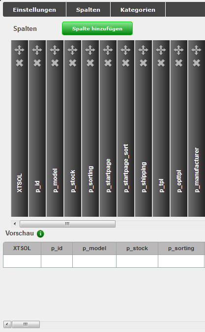
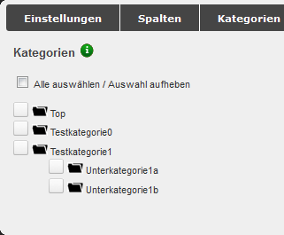
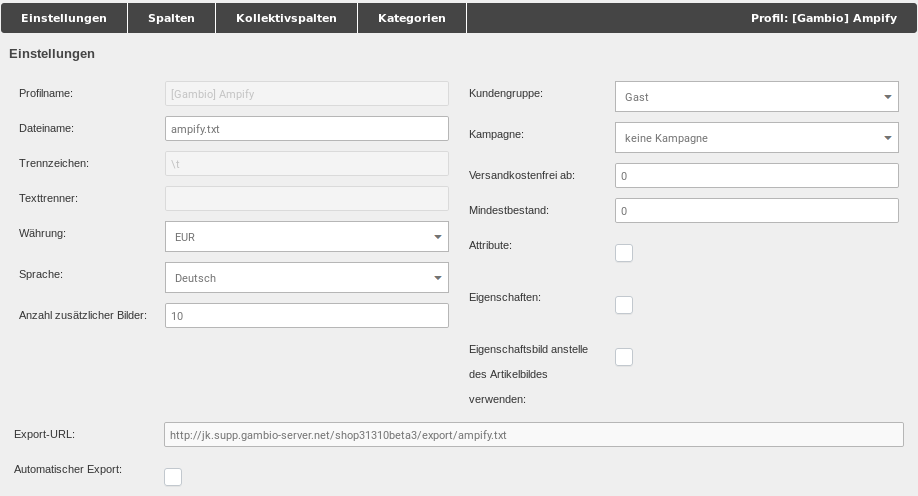
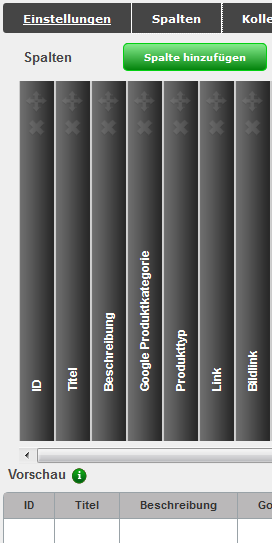
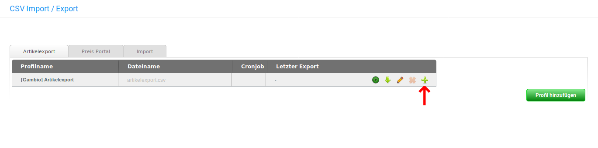
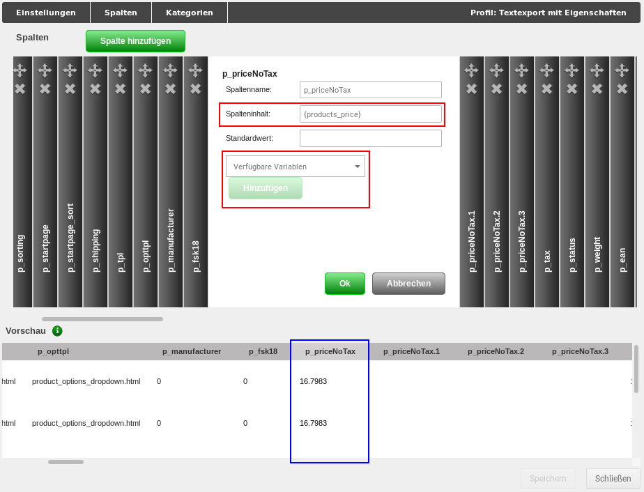
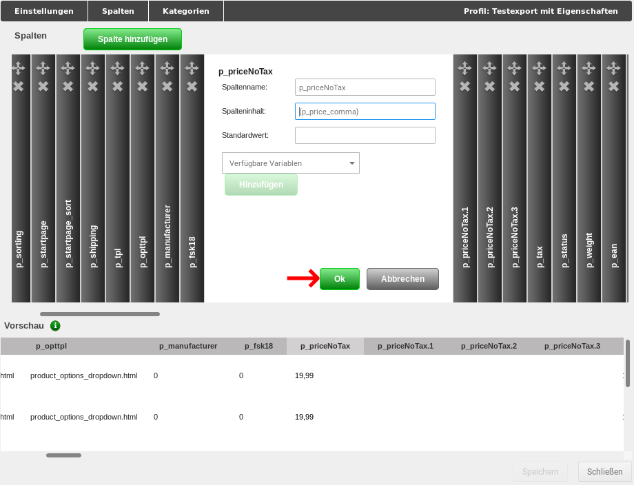
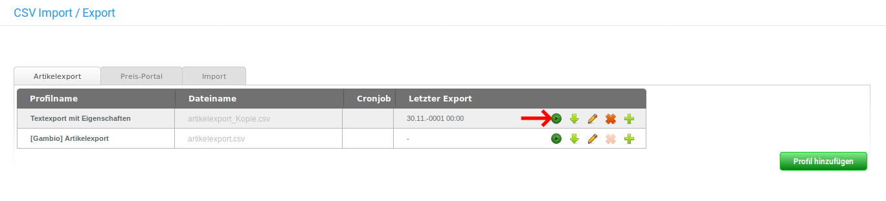
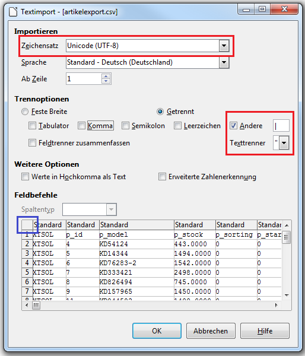
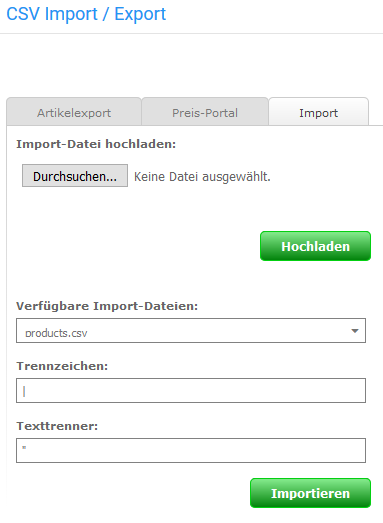

# Import/Export

Über den Menüpunkt _**Import / Export \> Artikeldaten**_ bzw. _**Artikel \> Import/Export**_ können neben dem Export zu Preis-Suchmaschinen und -Portalen auch reguläre CSV Exporte nach eigenen Profilen vorgenommen und Importe durchgeführt werden.

!!! note "Hinweis" 
	 Exporte und Importe sind auf die Dateiformate _**.csv**_ bzw. _**.txt**_ beschränkt. Hierbei muss immer der Zeichensatz _**UTF-8 ohne BOM**_ \(BOM steht für Byte Order Mark\) verwendet werden. Der Einsatz anderer Zeichencodierungen kann zu Problemen beim Import oder fehlerhaften Einträgen in der Datenbank führen.

Die einzelnen Bereiche können über die Reiter _**Artikelexport**_, _**Preis-Portal**_ und _**Import**_ ausgewählt werden.

## Export

Über die Reiter _**Artikelexport**_ und _**Preis-Portal**_ können Artikel aus dem Shop heraus exportiert werden. In den meisten Fällen werden die Artikel in eine sogenannte CSV-Datei geschrieben, die mit einem Tabellenkalkulationsprogramm geöffnet und bearbeitet werden kann.

!!! note "Hinweis"
	 _**CSV**_ \(Character Separated Values\) steht für _**zeichengetrennte Werte**_. Für CSV-Dateien besteht kein einheitliches Format, da das Trennzeichen nicht innerhalb der Spaltentexte vorkommen darf und CSV-Dateien für eine Vielzahl von Anwendungszwecken genutzt werden. Da auch Spalten-Namen nicht einheitlich normiert sind, können sich CSV-Dateien von zwei verschiedenen Programmen grundlegend voneinander unterscheiden.

	 Das _**Trennzeichen**_ und das _**Texterkennungszeichen**_ für den Export kannst du unter _**Import/Export \> Artikeldaten**_ bzw. _**Artikel \> Import/Export**_ konfigurieren, wenn du das Profil bearbeitest. Für den Import können beide Zeichen im Reiter _**Import**_ festgelegt werden. Wenn keine Änderungen vorgenommen wurden, werden Exporte mit einer Pipe \(\|,Senkrechtstrich\) als Trennzeichen und einem doppelten Anführungszeichen \("\) als Texttrenner/Texterkennungszeichen angelegt und Importe anhand derselben Einstellungen vorgenommen.

	 Exporte und Importe sind auf die Dateiformate _**.csv**_ bzw. _**.txt**_ beschränkt. Hierbei muss immer der Zeichensatz _**UTF-8 ohne BOM**_ \(BOM steht für Byte Order Mark\) verwendet werden.

Wenn du den Menüpunkt _**Import/Export \> Artikeldaten**_ bzw. _**Artikel \> Import/Export**_ das erste Mal aufrufst, findest du im Reiter _**Artikelexport**_ das Standard-Export-Profil _**\[Gambio\] Artikelexport**_. Über die Profile werden die Einstellungen für den Export verwaltet. Du kannst beliebig viele Profile für unterschiedliche Exporte anlegen und diese ganz nach deinen Wünschen anpassen. Zunächst gehen wir von einem Export aller Artikel aus.

Du kannst wahlweise das Standard-Profil bearbeiten, um deine Einstellungen vorzunehmen oder durch einen Klick auf das Plus-Zeichen eine Kopie dieses Profils anlegen. Wenn du das Profil zuerst kopierst, hast du immer eine Sicherung der Original-Konfiguration vorliegen.

Um das Profil zu konfigurieren klicke bitte auf das Bleistift-Symbol, es öffnet sich das gewählte Profil mit geöffnetem Reiter _**Einstellungen**_.

!!! note "Hinweis" 
	 Wenn du ein vorgegebenes Profil bearbeitest, sind bestimmte Einstellungsmöglichkeiten standardmäßig ausgegraut und lassen sich nicht anpassen. Wenn du diese Einstellungen ändern möchtest, empfehlen wir eine Kopie des Profils anzulegen, indem du in der Übersicht auf das grüne Pluszeichen klickst.

Hier kannst du zunächst den Namen des Profils und den Dateinamen deiner Export-Datei anpassen. Wichtig ist, dass die Dateiendung _**.csv**_ hierbei erhalten bleibt. Die Einstellungen für Trennzeichen und Texttrenner können im Normalfall beibehalten werden. Wenn du Eigenschaften verwendest und die zugewiesenen Eigenschaften-Kombinationen mit exportieren möchtest, setze bitte den Haken bei _**Eigenschaften**_. Wenn du Änderungen vorgenommem hast, müssen diese mit einem Klick auf _**Speichern**_ bestätigt werden, bevor du den aktuellen Reiter verlässt.

Wechsele nun in den Reiter _**Kategorien**_. Bevor du einen Export vornehmen kannst, müssen die Kategorien ausgewählt werden, aus denen die Artikel exportiert werden sollen. Setze hierzu hinter die jeweiligen Kategorien und Unterkategorien die Haken. Wahlweise kannst du auch über die oberste Checkbox _**Alle auswählen / Auswahl aufheben**_ alle Kategorien auf ein Mal anhaken. Bestätige auch diese Änderung mit einem Klick auf _**Speichern**_.

Wechsele abschließend in den Reiter _**Spalten**_. Hier sollten nun in der Vorschau-Ansicht einige deiner Artikel angezeigt werden. Wenn du zuvor den Haken für _**Eigenschaften**_ gesetzt hast, müssen nun die einzelnen Felder festgelegt werden. Wenn du keine Eigenschaften-Kombinationen exportieren möchtest, kannst du diesen Schritt einfach überspringen.

Scrolle hierzu mit dem oberen Scrollbalken ganz nach rechts, sodass die graue Box _**Eigenschaften**_ in der oberen Hälfte des Fensters angezeigt wird und klicke darauf. Wähle im Bereich _**Eigenschaftsauswahl**_ die Eigenschaften aus, dessen Kombinationen du mit exportieren willst. Um mehrere Eigenschaften auszuwählen, kannst du wahlweise die Strg- oder Shift-Taste gedrückt halten, während du diese anklickst. Wiederhole das Gleiche im Feld _**Kombinationsdaten**_, im Normalfall sollten hier alle Einträge ausgewählt werden. Bestätige die Auswahl mit einem Klick auf _**OK**_ und speichere die Änderung.

Die Grundeinstellungen, die vor dem ersten Export mit einem neuen Profil vorgenommen werden sollten, sind nun abgeschlossen. Verlasse die Profilansicht mit einem Klick auf _**Schließen**_. Über die Schaltflächen _**Profil exportieren**_ bzw. _**Exportieren und herunterladen**_ kannst du den Export durchführen.

Eine genaue Beschreibung der möglichen Einstellungen findest du in den nachfolgenden Abschnitten.

### CSV-Artikelexport

Die Export-Profile sind in einer Tabelle aufgeführt, in der _**Profilname**_, _**Dateiname**_, _**Cronjob**_ und _**Letzter Export**_ aufgelistet sind. Vor dem ersten Export wird der zugehörige Dateiname grau angezeigt, die Datei wurde noch nicht auf dem Server angelegt. Für jeden Eintrag stehen der Reihe nach die Schaltflächen _**Profil exportieren**_, _**Exportieren und herunterladen**_, _**Profil bearbeiten**_, _**Profil löschen**_ und _**Profil kopieren**_ zur Verfügung. Standardmäßig ist hier das Profil _**\[Gambio\] Artikelexport**_ vorhanden.

	  
#### Profil exportieren

Beim Klick auf die Schaltfläche _**Profil exportieren**_ werden die Artikel nach den Einstellungen im jeweiligen Profil \(siehe _**Profil bearbeiten**_\) in die angegebene Datei im Verzeichnis _**export**_ exportiert. Hierbei wird ein Dialogfenster angezeigt, in dem der aktuelle Fortschritt des Exportes angezeigt wird. Über einen Klick auf die Schaltfläche _**Abbrechen**_ kann der Export vorzeitig beendet werden. Nach Abschluss des Exports kann der Dialog über einen Klick auf _**Schließen**_ verlassen werden.
	  
#### Profil exportieren und herunterladen

Diese Funktion unterscheidet sich nur unwesentlich von dem vorherigen Export. Nach Abschluss des Exportvorganges kann die Datei auf den lokalen Rechner heruntergeladen werden.

#### Profil bearbeiten

Über einen Klick auf _**Profil bearbeiten**_ können die Einstellungen zu dem jeweiligen Profil aufgerufen werden. Es öffnet sich ein Fenster, das standardmäßig mit dem ausgewählten Reiter _**Einstellungen**_ angezeigt wird. Weitere Reiter sind _**Spalten**_ und _**Kategorien**_. Es stehen die Eingabefelder

-   _**Profilname**_: der Name des aktuellen Profils
-   _**Dateiname**_: der Dateiname der Exportdatei
-   _**Trennzeichen**_: das verwendete Trennzeichen \(standardmäßig Pipe: \|\)
-   _**Texttrenner**_: der verwendete Texttrenner \(standardmäßig doppeltes Anführungszeichen "\)

zur Verfügung.

Darunter befinden sich Checkboxen für _**Eigenschaften**_ und _**Automatischer Export**_. Wird die Box _**Eigenschaften**_ angehakt, können die dem Artikel zugeordneten Eigenschaften-Kombinationen mit exportiert werden.

!!! note "Hinweis" 
	 Die Einstellungen zu den einzelnen Eigenschaften können im Reiter _**Spalten**_ vorgenommen werden, wenn der Haken gesetzt ist. Dort erscheint dann die Spalte _**Eigenschaften**_. Details hierzu findest du im Abschnitt _**Spalten**_ dieses Kapitels.

Ist der Haken für _**Automatischer Export**_ gesetzt, erscheinen die Optionen zum Einrichten des automatischen Exports über einen sogenannten Cronjob. Es können wahlweise die verschiedenen Wochentage an- bzw. abgewählt werden, für die eine Startzeit \(jeweils zur vollen Stunde\) aus dem Dropdown-Menü ausgewählt werden kann oder es kann ein Intervall von einer bis 12 Stunden gewählt werden. Ein so eingestellter automatischer Export wird durch ein Uhr-Symbol in der Spalte _**Cronjob**_ angezeigt.

##### Spalten

Die Anzeige für den Reiter _**Spalten**_ ist in zwei Teile gegliedert. Der obere Bereich stellt die Spalten der Export-Datei in der Art eines Bücherregals dar, über die Scrollleiste können die "Bücher" hin und her geschoben werden. Mit einem Klick auf den "Buchrücken" kann die Spalte bearbeitet werden. Der obere Teil des "Buchrückens" ist mit einem Pfeilkreuz und einem _**x**_ versehen. Über das Pfeilkreuz kann die Spalte mit Klicken und Halten der linken Maustaste verschoben werden. Mit einem Klick auf das _**x**_ kann die Spalte gelöscht werden, dies muss über eine Abfrage bestätigt werden. Über _**Spalte hinzufügen**_ wird eine neue Spalte am Ende der Tabelle angefügt.

Beim Bearbeiten und Anlegen von Spalten sind folgende Eingaben möglich:

-   Spaltenname
-   Spalteninhalt
-   Standardwert

Der Spalteninhalt entspricht einer Variable \(Platzhalter für Dateneintrag\) im Shop. Diese kann über das Dropdown-Menü _**Verfügbare Variablen**_ festgelegt werden. Hier werden alle Möglichkeiten mit ihrer Beschreibung aufgelistet. Bitte beachte, dass diese ausschließlich aus **Artikeln und Kategorien** bezogen werden! Nach Auswahl des Eintrags kann der zugehörige Variablenname mit Klick auf _**Hinzufügen**_ eingetragen werden. Bestätige die Änderung mit Klick auf _**OK**_, über _**Abbrechen**_ werden die Änderungen verworfen.

Wenn Eigenschaften beim Export berücksichtigt werden, steht als letzter Eintrag die Spalte _**Eigenschaften**_ zur Verfügung. Die einzelnen Eigenschaften können im Bereich _**Eigenschaftenauswahl**_ durch Anklicken ausgewählt werden.

!!! note "Hinweis" 
	 Wir empfehlen alle Eigenschaften und alle Kombinationsdaten zu exportieren.

Die Kombinationen im Artikel werden über die _**Kombinationsdaten**_ ausgewählt. Diese sind der Reihe nach:

-   _**products\_properties\_combis\_id**_: ID der Kombinationen pro Artikel
-   _**combi\_sort\_order**_: die Sortierreihenfolge der Kombination
-   _**combi\_model**_: die Artikelnummer der Kombination
-   _**combi\_ean**_: die EAN der Kombination
-   _**combi\_quantity**_: der Lagerstand der Kombination
-   _**combi\_shipping\_status\_id**_: der zugeordnete Lieferstatus der Kombination
-   _**combi\_weight**_: das eingetragene Gewicht der Kombination
-   _**combi\_price**_: der eingetragene Preis der Kombination
-   _**combi\_price\_type**_: wird der eingetragene Aufpreis verwendet?

    calc = Preis aus Eigenschaften berechnen

    fix = Kombinationsfestpreis

-   _**combi\_vpe\_id**_: die Verpackungseinheit der Kombination
-   _**combi\_vpe\_value**_: der Wert im Bezug auf den Grundpreis

Das untere Drittel dieses Fensters dient zur Vorschau der Export-Datei.

!!! note "Hinweis" 
	 Diese Ansicht wird standardmäßig leer angezeigt. Es müssen zunächst die Kategorien im Reiter _**Kategorien**_ ausgewählt werden, bevor hier eine Vorschau erfolgt.

##### Kategorien

Über Auswahl des Reiters _**Kategorien**_ können die Kategorien für den Export ausgewählt bzw. eingeschränkt werden. Setze hierzu den Haken vor die Kategorien, dessen Artikel du exportieren möchtest. Über einen Klick auf das Ordner-Symbol können die Unterkategorien der jeweiligen Kategorie angezeigt werden.

Durch Setzen des Hakens _**Alle auswählen / Auswahl aufheben**_ können wahlweise alle Kategorien gewählt bzw. vom Export ausgeschlossen werden.

Wenn du Änderungen in einem Reiter vorgenommen hast und in einen anderen Reiter wechselst, werden diese nicht übernommen. Vor dem Wechsel wirst du in einem Dialog gefragt, ob die gemachten Änderungen verworfen werden sollen. Klicke auf _**Verwerfen**_ wenn die Änderungen nicht übernommen werden sollen, du wechselst anschließend in den ausgewählten Reiter. Mit Klick auf _**Abbrechen**_ gelangst du wieder in den Reiter zurück.

Für jeden Reiter kannst du die Änderungen mit Klick auf _**Speichern**_ sichern. Mit Klick auf _**Schließen**_ wird die Bearbeitung des Profils abgebrochen. Bei ungespeicherten Änderungen findet erneut eine Abfrage zum Verwerfen der Änderungen statt.

#### Profil löschen

Mit einem Klick auf das rote _**x**_ kann ein angelegtes Profil gelöscht werden. Es erscheint ein Abfragedialog, in dem das Entfernen des Profils bestätigt werden muss. Das Löschen des Profils _**\[Gambio\] Artikelexport**_ ist nicht möglich. Das _**x**_ wird in diesem Fall halbtransparent angezeigt.

#### Profil kopieren

Über das grüne Plus-Zeichen kann ein Profil kopiert werden. Dies geschieht ohne gesonderte Abfrage, das Profil wird mit dem Zusatz _**Kopie**_ im Profilnamen aufgeführt.

#### Funktionen der Profilseite

Unterhalb der Auflistung kann über die Schaltfläche _**Profil hinzufügen**_ ein neues Profil erzeugt werden. Es stehen die gleichen Konfigurationsmöglichkeiten zur Verfügung wie im Reiter _**Einstellungen**_ für die Funktion _**Profil bearbeiten**_.

Ist für mindestens ein Profil der automatische Export eingestellt, werden die Schaltflächen _**Cronjob fortsetzen**_ und _**Cronjob-URL anzeigen**_ eingeblendet. Die automatischen Exporte werden im Status _**pausiert**_ angelegt. Über _**Cronjob fortsetzen**_ werden die eingestellten Cronjobs aktiviert. Dies ist dadurch zu erkennen, dass die Uhren-Symbole in der Spalte _**Cronjob**_ nicht mehr halbtransparent angezeigt werden. Wenn der Mauszeiger über das Symbol bewegt wird, erscheinen Datum und Uhrzeit des nächstens Exports.

Ein aktiver automatischer Export kann über _**Cronjob abbrechen**_ oder _**Cronjob pausieren**_ wieder inaktiv geschaltet werden.

Hierbei ist zu beachten, dass beim Abbrechen die CSV-Datei eines teilweise vorgenommenen Exports gelöscht wird. Ist der Cronjob pausiert, kann der Export über _**Cronjob fortsetzen**_ wieder aufgenommen werden. Die zugehörige Datei wird beibehalten und weiter beschrieben.

Über _**Cronjob-URL anzeigen**_ wird die URL zum Ausführen des Exports angezeigt. Diese URL muss in einen neu eingerichteten Cronjob bei deinem Hosting-Provider eingetragen werden. Weitere Details zu den Einstellungen erhältst du, wenn du auf das grüne Info-Symbol am Ende der Cronjob-URL klickst.

### Preis-Portal

Artikel-Exporte zu Preisportalen können über den Reiter _**Preis-Portal**_ vorgenommen werden. Die Export-Profile sind in einer Tabelle aufgeführt, in der _**Profilname**_, _**Dateiname**_, _**Cronjob**_ und _**Letzter Export**_ aufgelistet sind. Vor dem ersten Export wird der zugehörige Dateiname grau angezeigt, die Datei wurde noch nicht auf dem Server angelegt. Für jeden Eintrag stehen von links nach rechts die Schaltflächen _**Profil exportieren**_, _**Exportieren und herunterladen**_ , _**Profil bearbeiten**_ , _**Profil löschen**_ und _**Profil kopieren**_ zur Verfügung.

#### Profil exportieren

Beim Klick auf die Schaltfläche _**Profil exportieren**_ werden die Artikel nach den Einstellungen im jeweiligen Profil \(siehe _**Profil bearbeiten**_\) in die angegebene Datei im Verzeichnis _**export**_ exportiert. Hierbei wird ein Dialogfenster angezeigt, in dem der aktuelle Fortschritt des Exportes angezeigt wird. Über Klick auf die Schaltfläche _**Abbrechen**_ kann der Export vorzeitig beendet werden. Nach Abschluss des Exports kann der Dialog über Klick auf _**Schließen**_ verlassen werden.

#### Profil exportieren und herunterladen

Diese Funktion unterscheidet sich nur unwesentlich von dem vorherigen Export. Nach Abschluss des Exportvorganges kann die Datei auf den lokalen Rechner heruntergeladen werden.

#### Profil bearbeiten

Über einen Klick auf _**Profil bearbeiten**_ können die Einstellungen zu dem jeweiligen Profil aufgerufen werden. Es öffnet sich ein Fenster, das standardmäßig mit dem ausgewählten Reiter _**Einstellungen**_ angezeigt wird. Weitere Reiter sind _**Spalten**_, _**Kollektivspalten**_ und _**Kategorien**_. Zudem wird in der oberen Leiste der Name des ausgewählten Profils angegeben.

!!! note "Hinweis"
	 Je nach Profil können die änderbaren Einstellungen abweichen. Wenn ein Teil der Konfiguration nicht geändert werden kann, wird dieser ausgegraut dargestellt. Um alle Einstellungen anpassen zu können, empfehlen wir das gewünschte Profil zu kopieren und die Kopie zu bearbeiten.

##### Einstellungen

Es stehen die folgenden Bereiche zur Verfügung:

|Feldname|Beschreibung|
|--------|------------|
|Profilname|der Name des Profils|
|Dateiname|der Name der Exportdatei|
|Trennzeichen|Spalten-Trennzeichen|
|Texttrenner|Texttrenner-Zeichen|
|Währung|zu exportierende Währung|
|Sprache|die zu verwendende Sprache|
|Anzahl zusätzlicher Bilder|wie viele zusätzliche Bilder sollen \(neben dem ersten bzw. Haupt-Artikelbild\) exportiert werden?|
|Kundengruppe|die Kundengruppe, dessen Preise verwendet werden sollen. Wähle _**Gast**_ aus, wenn du für die gewünschte Kundengruppe nicht in allen Artikeln Kundengruppenpreise hinterlegt hast!|
|Kampagne|angelegte Kampagne, die verwendet werden soll|
|Versandkostenfrei ab|ab welchem Warenwert sollen deine Artikel versandkostenfrei versendet werden?|
|Mindestbestand|Gib hier ein, wie oft ein Artikel auf Lager sein muss, damit er beim Export berücksichtigt wird|
|Attribute|Attribute berücksichtigen \(werden als eigenständige Artikel exportiert\)|
|Eigenschaften|Eigenschaften berücksichtigen \(werden als eigenständige Artikel exportiert\)|
|Eigenschaftsbild anstelle des Artikelbildes verwenden:|Das Bild der jeweiligen Eigenschaften-Kombination wird anstelle des Haupt-Artikelbilds exportiert|
|Export-URL|Aus diesem Feld kann der Link zur Export-Datei herauskopiert werden|

!!! note "Hinweis" 
	 Das Feld _**Versandkostenfrei ab**_ ist standardmäßig mit 0 vorbelegt. Wird hier keine Änderung vorgenommen, werden eingetragene **Versandkosten** im Artikel **nicht berücksichtigt**.

Darunter befindet sich die Checkbox _**Automatischer Export**_. Ist der Haken gesetzt, erscheinen die Optionen zum Einrichten des automatischen Exports über einen sogenannten Cronjob. Es können wahlweise die verschiedenen Wochentage an- bzw. abgewählt werden, für die eine Startzeit \(jeweils zur vollen Stunde\) aus dem Dropdown-Menü ausgewählt werden kann oder es kann ein Intervall von einer bis 12 Stunden gewählt werden. Ein so eingestellter automatischer Export wird durch ein Uhr-Symbol in der Spalte _**Cronjob**_ angezeigt.

##### Spalten

Die Anzeige für den Reiter _**Spalten**_ ist in zwei Teile gegliedert. Der obere Bereich stellt die Spalten der Export-Datei in der Art eines Bücherregals dar, über die Scrollleiste können die "Bücher" hin und her geschoben werden. Mit einem Klick auf den "Buchrücken" kann die Spalte bearbeitet werden. Der obere Teil des "Buchrückens" ist mit einem Pfeilkreuz und einem _**x**_ versehen. Über das Pfeilkreuz kann die Spalte mit Klicken und Halten der linken Maustaste verschoben werden. Mit einem Klick auf das _**x**_ kann die Spalte gelöscht werden, dies muss über eine Abfrage bestätigt werden. Über _**Spalte hinzufügen**_ wird eine neue Spalte am Ende der Tabelle angefügt.

Beim Bearbeiten und Anlegen von Spalten sind folgende Eingaben möglich:

-   Spaltenname
-   Spalteninhalt
-   Standardwert

Der Spalteninhalt entspricht einer Variable \(Platzhalter für Dateneintrag\) im Shop. Diese kann über das Dropdown-Menü _**Verfügbare Variablen**_ festgelegt werden. Hier werden alle Möglichkeiten mit ihrer Beschreibung aufgelistet. Nach Auswahl des Eintrags kann der zugehörige Variablenname mit Klick auf _**Hinzufügen**_ eingetragen werden. Bestätige die Änderung mit Klick auf _**OK**_, über _**Abbrechen**_ werden die Änderungen verworfen.

!!! note "Hinweis" 
	 Im Bereich _**Preis-Portal**_ sind andere Variablen auswählbar als beim regulären Export. Bei Bedarf kann jedoch eine Variable von dort kopiert und als Spalteninhalt für ein Export- Profil aus dem Preis-Portal eingefügt werden, um auch diese Inhalte zu exportieren.

Das untere Drittel dieses Fensters dient zur Vorschau der Export-Datei.

!!! note "Hinweis" 
	 Diese Ansicht wird standardmäßig leer angezeigt. Es müssen zunächst die Kategorien im Reiter _**Kategorien**_ ausgewählt werden, bevor hier eine Vorschau erfolgt.

##### Kollektivspalten

Kollektivspalten dienen der Selektierung von Werten aus verschiedenen Quellen in einer Spalte. Dabei können mehrere Eigenschafts-, Attributs- und/oder Zusatzfeldnamen angegeben werden, aus denen der entsprechende Wert ausgewählt wird.

-   _**Spaltenname**_: Der Spaltenname entspricht der Überschrift in der exportierten CSV-Datei.
-   _**Eigenschaften/Attribute/Zusatzfelde**_r: Hier kannst du die Namen der Eigenschaften, Attribute und/oder Zusatzfelder, in Form einer ";"-separierten Liste, eintragen, aus denen der Wert gewählt werden soll \(z.B. Farbe;Lackfarbe;Wandfarbe\).
-   _**Standardwert**_: Dieser Wert wird als Spaltenwert verwendet, wenn kein passender Wert in den Eigenschaften, Attributen und Zusatzfeldern gefunden wurde.
-   _**Eig./Attr./Zus.**_: Mit diesen Checkboxen kannst du wählen, in welchen Quellen die Namen gesucht werden sollen. Wenn du beispielsweise keine Attribute nutzt, empfiehlt es sich, die entsprechende Checkbox zu deaktivieren. Dies dient der Steigerung der Performanz des Exports.

!!! note "Hinweis" 
	 Sollte es für die Selektierung des Spalteninhalts mehrere Treffer aus verschiedenen Quellen geben, so greift eine vorgegebene Priorisierung:

	 -   Eigenschaften \(höchste Priorität\)
	 -   Attribute
	 -   Zusatzfelder \(niedrigste Priorität\)

##### Kategorien

Über Auswahl des Reiters _**Kategorien**_ können die Kategorien für den Export ausgewählt bzw. eingeschränkt werden. Setze hierzu den Haken vor die Kategorien, dessen Artikel du exportieren möchtest. Über einen Klick auf das Ordner-Symbol können die Unterkategorien der jeweiligen Kategorie angezeigt werden.

Durch Setzen des Hakens _**Alle auswählen / Auswahl aufheben**_ können wahlweise alle Kategorien gewählt bzw. vom Export ausgeschlossen werden.

Wenn du Änderungen in einem Reiter vorgenommen hast und in einen anderen Reiter wechselst, werden diese nicht übernommen. Vor dem Wechsel wirst du in einem Dialog gefragt, ob die gemachten Änderungen verworfen werden sollen. Klicke auf _**Verwerfen**_ wenn die Änderungen nicht übernommen werden sollen, du wechselst anschließend in den ausgewählten Reiter. Mit einem Klick auf _**Abbrechen**_ gelangst du wieder in den Reiter zurück.

Für jeden Reiter kannst du die Änderungen mit Klick auf _**Speichern**_ sichern. Mit Klick auf _**Schließen**_ wird die Bearbeitung des Profils abgebrochen. Bei ungespeicherten Änderungen findet erneut eine Abfrage zum Verwerfen der Änderungen statt.

#### Profil löschen 

Mit einem Klick auf das rote _**x**_ kann ein angelegtes Profil gelöscht werden. Es erscheint eine Sicherheitsabfrage, in der das Entfernen des Profils bestätigt werden muss. Das Löschen von standardmäßig angelegten Profilen ist nicht möglich. Das _**x**_ wird in diesem Fall halbtransparent angezeigt.

#### Profil kopieren

Über das grüne Plus-Zeichen kann ein Profil kopiert werden. Dies geschieht ohne gesonderte Abfrage, das Profil wird mit dem Zusatz _**Kopie**_ im Profilnamen aufgeführt.

#### Funktionen der Profilseite

Unterhalb der Auflistung kann über die Schaltfläche _**Profil hinzufügen**_ ein neues Profil erzeugt werden. Es stehen die gleichen Konfigurationsmöglichkeiten zur Verfügung wie im Reiter _**Einstellungen**_ für die Funktion _**Profil bearbeiten**_.

Ist für mindestens ein Profil der automatische Export eingestellt, werden die Schaltflächen _**Cronjob fortsetzen**_ und _**Cronjob-URL**_ anzeigen eingeblendet. Die automatischen Exporte werden im Status _**pausiert**_ angelegt. Über _**Cronjob fortsetzen**_ werden die eingestellten Cronjobs aktiviert. Dies ist dadurch zu erkennen, dass die Uhren-Symbole in der Spalte _**Cronjob**_ nicht mehr halbtransparent angezeigt werden. Wenn der Mauszeiger über das Symbol bewegt wird, erscheinen Datum und Uhrzeit des nächstens Exports.

Ein aktiver automatischer Export kann über _**Cronjob abbrechen**_ oder _**Cronjob pausieren**_ wieder inaktiv geschaltet werden.

Hierbei ist zu beachten, dass beim Abbrechen die Export-Datei eines teilweise vorgenommenen Exports gelöscht wird. Ist der Cronjob pausiert, kann der Export über _**Cronjob fortsetzen**_ wieder aufgenommen werden. Die zugehörige Datei wird beibehalten und weiter beschrieben.

Über _**Cronjob-URL anzeigen**_ wird die URL zum Ausführen des Exports angezeigt. Diese URL muss in einen neu eingerichteten Cronjob bei deinem Provider eingetragen werden. Weitere Details zu den Einstellungen erhältst du, wenn du auf das grüne Info-Symbol am Ende der Cronjob-URL klickst.

### Vorbereiten und Durchführen eines CSV-Exports

In diesem Kapitel betrachten wir Schritt für Schritt wie ein Export vorbereitet und durchgeführt wird. Hierbei verwenden wir das Standard-Profil aus dem Reiter _**Artikelexport**_, die Schritte lassen sich jedoch auch ohne Weiteres auf den Bereich _**Preis-Portal**_ übertragen.

Als Beispiel nehmen wir an, dass wir Artikel aus der Kategorie _**Testkategorie**_ mit den zugeordneten Eigenschaften-Kombination exportieren und hierbei den exportierten Preis von Netto auf Brutto umstellen sowie dabei das Dezimal-Trennzeichen von Punkt auf Komma ändern möchten.

#### Schritt 1 - Profil duplizieren

Es ist immer eine gute Idee, eine Kopie des Standardprofils zu verwenden, auch wenn zunächst keine Änderungen daran vorgenommen werden sollen. Da wir jedoch bestehende Spalten anpassen wollen, ist es eine Notwendigkeit.

Wir rufen also im Gambio Admin den Menüpunkt _**Import/Export \> Artikeldaten**_ bzw. _**Artikel \> Import/Export**_ auf und gelangen direkt in den Abschnitt _**Artikelexport**_. Hier finden wir das Standardprofil. Über einen Klick auf das grüne Plus-Zeichen duplizieren wir das Profil.

Es wird mit einem neuen Namen in der Liste angelegt.

#### Schritt 2 - Profil bearbeiten

Über einen Klick auf das Bleistift-Symbol kann das Export-Profil bearbeitet werden. Es öffnet sich die Maske _**Einstellungen**_, hier nehmen wir folgende Änderungen vor:

-   Umbenennen des Profilnamens: _**Artikelexport Kopie**_ ist nicht gerade aussagekräftig. Um in absehbarer Zukunft nicht die Orientierung zu verlieren, tragen wir in das Feld _**Profilname**_ einen treffenderen Namen ein.
-   Anhaken der Eigenschaften: Da wir mit diesem Profil auch Eigenschaften-Kombinationen exportieren möchten, muss hier der Haken gesetzt werden. Nur so stehen uns am Ende die notwendigen Einstellugen zur Verfügung.

Bevor wir den Reiter wechseln, klicken wir auf _**Speichern**_.

#### Schritt 3 - Kategorien festlegen

Über den Reiter _**Kategorien**_ legen wir fest, aus welchen Kategorien Artikel exportiert werden sollen.

 im Reiter
        _**Kategorien**_")

Da wir in unserem Beispiel Artikel aus der _**Testkategorie**_ exportieren wollen, setzen wir den entsprechenden Haken.

Auch diesen Schritt bestätigen wir mit einem Klick auf _**Speichern**_.

#### Schritt 4 - Spalte bearbeiten

Der Bereich _**Spalten**_ hat eine zweigeteilte Ansicht. Oben sind die einzelnen Spalten mit ihren Namen wie Bücher in einem Regal aufgereiht. Über einen Klick auf den jeweiligen "Buchrücken" kann die zugehörige Spalte bearbeitet werden \(hierzu gleich mehr\).

Der Bereich darunter ist die Vorschau-Ansicht, in dem die ersten Einträge der Tabelle für jede Spalte dargestellt werden.

!!! note "Hinweis"

	 Wenn hier keine Einträge auftauchen, wurden wahrscheinlich noch keine Kategorien ausgewählt \(siehe _**Schritt 3**_\).

Mit den beiden horizontalen Scrollbalken \(siehe rote Markierungen in der Abbildung\) können beide Ansichten hin und her geschoben werden.

**Eine bestehende Spalte bearbeiten**

In Normalfall werden die Dezimalstellen bei Preisen und Gewichten mit einem Punkt getrennt. Wir wollen jedoch unsere Preise mit einem Komma statt einem Punkt als Dezimaltrenner exportieren. Zudem wollen wir keine Netto-Preise \(wie sie standardmäßig in der Datenbank gespeichert werden\) sondern Brutto-Preise exportieren.

!!! note "Hinweis"

	 Eine Auflistung der Spalten des Standardprofils mit ihrem Verwendungszweck findest du im nachfolgenden Kapitel _**Import**_ dieses Handbuchs.

Zunächst suchen wir im oberen Bereich der Seite die passende Spalte _**p\_priceNoTax**_:

Mit einem Klick auf den passenden "Buchrücken" öffnet sich die zugehörige Eingabemaske:

Entscheidend sind für uns das Feld _**Spalteninhalt**_ und das Dropdown _**Verfügbare Variablen**_. Variablen dienen als Platzhalter für den entsprechenden Inhalt in der Datenbank. Sie werden grundsätzlich mit geschweiften Klammern angegeben, in unserem Fall _**\{products\_price\}**_. Im unteren Bereich, der Vorschau-Ansicht, wird die zugehörige Spalte automatisch unter die Eingabemaske gerückt. Wir erkennen, dass es sich um den Netto-Preis mit einem Punkt als Dezimaltrenner handelt.

Um eine Variable zu ändern, müssen wir ihren Namen nicht händisch heraussuchen und eintragen. Stattdessen verwenden wir das Dropdown _**Verfügbare Variablen**_:

Hier suchen wir uns den passenden Eintrag heraus und klicken ihn an. Wenn man den Mauszeiger lange genug über den Eintrag hält, wird ein Tooltipp eingeblendet, der diesen genauer beschreibt.

Nachdem der Eintrag ausgewählt worden ist, kann er über die Schaltfläche _**Hinzufügen**_ in das Feld _**Spalteninhalt**_ eingetragen werden.

Beim Hinzufügen wird der alte Feldinhalt nicht ersetzt. Da nur der Brutto-Preis verbleiben soll, muss die alte Variable aus dem Feld _**Spalteninhalt**_ gelöscht werden - dies kann natürlich auch vor dem Hinzufügen der neuen Variable erfolgen.

Nachdem die neue Variable alleine steht, wird der Brutto-Preis wie vorgesehen angezeigt. Die Änderung kann mit Klick auf _**OK**_ bestätigt werden. Abschließend muss noch einmal auf _**Speichern**_ geklickt werden.

**Die Eigenschaften-Spalte bearbeiten**

Wurde im Reiter _**Einstellungen**_ der Haken für _**Eigenschaften**_ gesetzt, wird eine eigene Spalte für das Bearbeiten der Eigenschaften im Export-Profil angezeigt. Sie befindet sich ganz am rechten Ende des "Bücherregals". Man muss also ganz nach rechts scrollen, damit sie angezeigt wird.

Die Eingabemaske besteht aus zwei sogenannten Multi-Select-Elementen - _**Eigenschaftenauswahl**_ und _**Kombinationsdaten**_ - und einem Dropdown für die beim Export zu verwendende Sprache. Es sollten grundsätzlich alle Eigenschaften und alle Kombinationsdaten ausgewählt werden. Klicke hierzu jeweils den ersten Eintrag eines Multi-Select-Elements an und klicke danach mit gedrückter Shift-Taste auf den letzten Eintrag:

Anschließend kann die Auswahl mit _**Ok**_ bestätigt werden. Speichere alle Änderungen ab, bevor du den Dialog wieder schließt.

#### Schritt 5 - Export durchführen

Der Export kann über einen Klick auf das erste Icon gestartet werden.

Anschließend steht die Exportdatei über den Link in der Spalte _**Dateiname**_ zum Download zur Verfügung.

!!! note "Hinweis"

	 Wir empfehlen zum Bearbeiten von CSV-Dateien das Programm _**LibreOffice Calc**_. Im nachfolgenden Kapitel findest du einen Abschnitt, der die notwendigen Schritte zum Öffnen und Speichern von CSV-Dateien mit _**LibreOffice Calc**_ beschreibt.
	 
## Import

Über den Reiter _**Import**_ können CSV-Dateien aus einem anderen Shop oder aus einer externen Quelle in den Shop importiert und die Artikel so in den Shop geladen werden.

Besonders wenn du die CSV-Datei eines Drittanbieters verwendest, muss diese vor dem Import gegebenenfalls aufbereitet werden.

!!! danger "Achtung"

	 Es ist über den Artikelexport zwar möglich beliebige Spalten mit eigenen Namen anzulegen, jedoch können nur die Spalten importiert werden, die im Standard-Profil _**\[Gambio\] Artikelexport**_ vorgegeben sind.

	 Um einen erfolgreichen Import durchführen zu können, sind die Spalten _**XTSOL**_ sowie entweder _**p\_id**_ oder _**p\_model**_ als Pflichtangabe notwendig.

	 Wir empfehlen beide Spalten \(_**p\_id**_ und _**p\_model**_\) in der CSV-Datei anzugeben. Bei neu angelegten Artikeln sollte das Feld _**p\_id**_ leer gelassen werden, der Wert wird automatisch vergeben. Eine Artikelnummer für _**p\_model**_ kann angegeben werden, ist aber nicht zwangsläufig notwendig.

	 Die Angabe _**p\_model**_ ist dann erforderlich, wenn ein Artikel durch einen Import aktualisiert werden soll, die _**p\_id**_ hierzu aber nicht bekannt ist. Umgekehrt kann die _**p\_model**_ leer gelassen werden, wenn die _**p\_id**_ \(z.B. durch einen Export\) bekannt ist.

	 Zudem sollten, um Problemen in einzelnen Shopversionen vorzubeugen, die Spalten _**p\_shortdesc.en**_ und _**p\_shortdesc.de**_ in der CSV-Datei enthalten sein. Es reicht, wenn diese mit einem Leerzeichen o.ä. befüllt sind.

	 Wir empfehlen als Trennzeichen **\|** \(Pipe-Symbol/senkrechter Strich, erreichbar über ALT GR und <\) und Texterkennungszeichen/Texttrenner **"** \(doppeltes Anführungszeichen\) zu verwenden, wie in der Import-Maske voreingestellt.

	 Exporte und Importe sind auf die Dateiformate _**.csv**_ bzw. _**.txt**_ beschränkt. Hierbei muss immer der Zeichensatz _**UTF-8 ohne BOM**_ \(BOM steht für Byte Order Mark\) verwendet werden. Der Einsatz anderer Zeichencodierungen kann zu Problemen beim Import oder fehlerhaften Einträgen in der Datenbank führen.

!!! note "Hinweis" 
	 Beim Export von Artikeleigenschaften werden lediglich die Zuordnungen der Kombinationen zu den Artikeln durchgeführt. Durch den Import werden **keine neuen Eigenschaften** erzeugt. Diese müssen im Zielshop manuell angelegt und vorkonfiguriert werden.

!!! danger "Achtung"

	 Wenn du in deiner Import-Datei die Spalten _**gm\_min\_order**_ oder _**gm\_graduated\_qty**_ verwendest, müssen hier jeweils Werte **größer als 0** eingetragen werden.

Um eine CSV-Datei aufzubereiten, empfehlen wir diese mit einem Tabellenkalkulationsprogramm zu bearbeiten, bei dem es möglich ist sowohl das _**Trennzeichen**_ als auch das _**Texterkennungszeichen**_ bereits beim Öffnen der Datei festzulegen. Hierzu eignet sich z.B. die Tabellenkalkulation _**Calc**_ aus dem quelloffenen und kostenlosen Office-Paket _**LibreOffice**_.

Wenn beide Zeichen korrekt eingetragen worden sind, wird die CSV-Datei in einer Tabellenform dargestellt, die sich relativ komfortabel bearbeiten lässt.

### Aufbau des Import-Profils

!!! note "Hinweis" 
	 Für eine Aktualisierung deiner Artikel empfehlen wir zunächst einen Export mit dem unveränderten Standardprofil vorzunehmen. Die so erzeugte Datei kann als Ausgangspunkt für die gewünschten Änderungen verwendet werden.

	 Passe hierbei nur die Daten an welche durch den Export geändert werden sollen und belasse die restliche Datei unverändert. Das unsachgemäße Entfernen von Spalten kann zu Problemen beim Import führen.

Damit deine CSV-Datei erfolgreich importiert werden kann, müssen die Spalten einerseits richtig benannt sein und die jeweiligen Inhalte passend zugeordnet worden sein. Eine Übersicht über die standardmäßig verfügbaren Spalten findest du in der nachfolgenden Tabelle:

|Spaltenname|Beschreibung|zugeordnete Variable|
|-----------|------------|--------------------|
|XTSOL|Steuerzeichen für den Beginn einer Zeile, **Pflichtangabe**|-|
|p\_id|interne ID des Artikels; **Pflichtangabe**, wenn _**p\_model**_ nicht verwendet wird|\{products\_id\}|
|p\_model|dargestellte Artikelnummer des Artikels;**Pflichtangabe**, wenn p\_id nicht verwendet wird|\{products\_model\}|
|p\_stock|Lagerbestand|\{products\_quantity\}|
|p\_sorting|Sortierreihenfolge innerhalb der Kategorie \(siehe Kapitel _**Kategorien**_\)|\{products\_sort\}|
|p\_startpage|Artikel als Empfehlung auf der Startseite anzeigen, wenn 1|\{products\_startpage\}|
|p\_startpage\_sort|Sortierreihenfolge auf der Startseite|\{products\_startpage\_sort\}|
|p\_shipping|ID des Lieferstatus, \(siehe Kapitel Lieferstatus\)|\{products\_ shippingtime\}|
|p\_tpl|Name der Vorlagendatei für die Artikel- Detailseite|\{product\_template\}|
|p\_opttpl|Name der Vorlagendatei für die Artikelattribute auf der Artikel-Detailseite|\{options\_template\}|
|p\_manufacturer|ID des Herstellers|\{manufacturers\_id\}|
|p\_fsk18|Artikel als FSK18-Artikel deklarieren, wenn 1|\{products\_fsk18\}|
|p\_priceNoTax|Netto-Artikelpreis|\{products\_price\}|
|p\_priceNoTax.1|Netto-Artikelpreis für die Kundengruppe mit der ID 1 \(Standard: Gast\)|\{p\_personal\_offer\#1\}|
|p\_priceNoTax.2|Netto-Artikelpreis für die Kundengruppe mit der ID 2 \(Standard: Neuer Kunde\)|\{p\_personal\_offer\#2\}|
|p\_priceNoTax.3|Netto-Artikelpreis für die Kundengruppe mit der ID 3 \(Standard: Händler\)|\{p\_personal\_offer\#3\}|
|p\_tax|ID der Steuerklasse dieses Artikels|\{products\_tax\_class\_id\}|
|p\_status|Status des Artikels \[0/1\] \(0: inaktiv; 1: aktiv\)|\{products\_status\}|
|p\_weight|Gewicht in Kilogramm mit vier Nachkommastellen, punktgetrennt|\{products\_weight\}|
|p\_ean|Europäische Artikel Nummer|\{products\_ean\}|
|code\_isbn|Internationale Standard Buch-Nummer|\{code\_isbn\}|
|code\_upc|Universeller Produkt Code|\{code\_upc\}|
|code\_mpn|Hersteller Teile-Nummer \(manufacturer‘s part number\)|\{code\_mpn\}|
|code\_jan|Japanische Artikel-Nummer|\{code\_jan\}|
|brand\_name|Markenname|\{brand\_name\}|
|p\_disc|Rabatt auf den Artikelpreis|\{products\_discount\_allowed\}|
|p\_date\_added|Einstellungsdatum, das Datum muss in dem Format _**YYYY-MM-DD HH:MM:SS**_ \(z.B. _**2019-11-03 06:16:05**_\) angegeben werden.|\{products\_date\_added\}|
|p\_last\_modified|Änderungsdatum, das Datum muss in dem Format _**YYYY-MM-DD HH:MM:SS**_ \(z.B. _**2019-11-03 06:16:05**_\) angegeben werden.|\{products\_last\_modified\}|
|p\_date\_available|Erscheinungsdatum, das Datum muss in dem Format _**YYYY-MM-DD HH:MM:SS**_ \(z.B. _**2019-11-03 06:16:05**_\) angegeben werden.|\{products\_date\_available\}|
|p\_ordered|Menge des Artikels, die insgesamt bestellt worden ist|\{products\_ordered\}|
|nc\_ultra\_shipping\_ costs|Artikel-Versandkosten|\{nc\_ultra\_shipping\_costs\}|
|gm\_show\_date\_added|Veröffentlichungsdatum anzeigen \[0/1\] \(0: nicht anzeigen; 1: anzeigen\)|\{gm\_show\_date\_added\}|
|gm\_show\_price\_offer|„Woanders günstiger?“-Modul anzeigen \[0/1\] \(0: nicht anzeigen; 1: anzeigen\)|\{gm\_show\_price\_offer\}|
|gm\_show\_weight|Artikelgewicht anzeigen \[0/1\] \(0: nicht anzeigen; 1: anzeigen\)|\{gm\_show\_weight\}|
|gm\_show\_qty\_info|Lagerbestand anzeigen \[0/1\] \(0: nicht anzeigen; 1: anzeigen\)|\{gm\_show\_qty\_info\}|
|gm\_price\_status|Artikelpreisstatus \[0/1/2\] \(0: normal; 1:Preis auf Anfrage; 2: nicht käuflich\)|\{gm\_price\_status\}|
|gm\_min\_order|Mindestbestellmenge \[\>0\]|\{gm\_min\_order\}|
|gm\_graduated\_qty|Mögliche Mengenstaffelung \[\>0\]|\{gm\_graduated\_qty\}|
|gm\_options\_template|Name der Vorlagendatei für die Artikelattribute in der Artikelübersicht|\{gm\_options\_template\}|
|p\_vpe|ID der Verpackungseinheit \(siehe Kapitel Verpackungseinheiten\)|\{products\_vpe\}|
|p\_vpe\_status|VPE anzeigen \[0/1\] \(0: nicht anzeigen; 1: anzeigen\)|\{products\_vpe\_status\}|
|p\_vpe\_value|Wechselfaktor für den Grundpreis|\{products\_vpe\_value\}|
|p\_image.1|zusätzliches Artikelbild \(NUR der Dateiname , Beispiel: Testartikel.jpg\)|\{products\_image\#1\}|
|p\_image.2|zusätzliches Artikelbild \(NUR der Dateiname , Beispiel: Testartikel.jpg\)|\{products\_image\#2\}|
|p\_image.3|zusätzliches Artikelbild \(NUR der Dateiname , Beispiel: Testartikel.jpg\)|\{products\_image\#3\}|
|p\_image|Artikelbild \(NUR der Dateiname, Beispiel: Testartikel.jpg\)|\{products\_image\}|
|p\_name.en|Artikelname in der Sprache Englisch|\{products\_name.en\}|
|p\_desc.en|Beschreibung in der Sprache Englisch|\{products\_description.en\}|

!!! note "Hinweis"

	 Artikel-Tabs werden in der CSV-Datei zusammen mit der Artikelbeschreibung gespeichert. Tabs werden hierbei nach dem Muster _**\[TAB:Überschrift\]Inhalt des Tabs**_ an die Artikelbeschreibung angehängt.

|Spaltenname|Beschreibung|zugeordnete Variable|
|-----------|------------|--------------------|
|p\_shortdesc.en|Kurzbeschreibung in der Sprache Englisch|\{products\_short\_description.en\}|
|p\_checkout\_information.en|Wesentliche Merkmale in der Sprache Englisch|\{checkout\_information.en\}|
|p\_meta\_title.en|Meta-Titel in der Sprache Englisch|\{products\_meta\_title.en\}|
|p\_meta\_desc.en|Meta-Beschreibung in der Sprache Englisch|\{products\_meta\_description.en\}|
|p\_meta\_key.en|Meta-Keywords in der Sprache Englisch|\{products\_meta\_keywords.en\}|
|p\_keywords.en|Zusatzbegriffe für die Suche in der Sprache Englisch|\{products\_keywords.en\}|
|p\_url.en|Herstellerlink für den Artikel in der Sprache Englisch|\{products\_url.en\}|
|gm\_url\_keywords.en|URL-Keywords in der Sprache Englisch|\{gm\_url\_keywords.en\}|

!!! danger "Achtung"

	 _**URL Keywords**_ dürfen weder Leerzeichen, noch Umlaute oder Sonderzeichen enthalten.

|Spaltenname|Beschreibung|zugeordnete Variable|
|-----------|------------|--------------------|
|rewrite\_url.en|URL Rewrite-Eintrag für die Sprache Englisch|\{rewrite\_url.en\}|
|p\_name.de|Artikelname in der Sprache Deutsch|\{products\_name.de\}|
|p\_desc.de|Beschreibung in der Sprache Deutsch|\{products\_description.de\}|

!!! note "Hinweis"

	 Artikel-Tabs werden in der CSV-Datei zusammen mit der Artikelbeschreibung gespeichert. Tabs werden hierbei nach dem Muster _**\[TAB:Überschrift\]Inhalt des Tabs**_ an die Artikelbeschreibung angehängt.

|Spaltenname|Beschreibung|zugeordnete Variable|
|-----------|------------|--------------------|
|p\_shortdesc.de|Kurzbeschreibung in der Sprache Deutsch|\{products\_short\_description.de\}|
|p\_checkout\_information.de|Wesentliche Merkmale in der Sprache Deutsch|\{checkout\_information.de\}|
|p\_meta\_title.de|Meta-Titel in der Sprache Deutsch|\{products\_meta\_title.de\}|
|p\_meta\_desc.de|Meta-Beschreibung in der Sprache Deutsch|\{products\_meta\_description.de\}|
|p\_meta\_key.de|Meta-Keywords in der Sprache Deutsch|\{products\_meta\_keywords.de\}|
|p\_keywords.de|Zusatzbegriffe für die Suche in der Sprache Deutsch|\{products\_keywords.de\}|
|p\_url.de|Herstellerlink für den Artikel in der Sprache Deutsch|\{products\_url.de\}|
|gm\_url\_keywords.de|URL-Keywords in der Sprache Deutsch|\{gm\_url\_keywords.de\}|

!!! danger "Achtung"

	 _**URL Keywords**_ dürfen weder Leerzeichen, noch Umlaute oder Sonderzeichen enthalten.

|Spaltenname|Beschreibung|zugeordnete Variable|
|-----------|------------|--------------------|
|rewrite\_url.de|URL Rewrite-Eintrag fü die Sprache Deutsch|\{rewrite\_url.de\}|
|p\_cat.en|Kategorie-Verschachtelung für den Artikel in Englisch, Kategorien werden mit dem Größer-Zeichen getrennt|\{c\_path.en\}|
|p\_cat.de|Kategorie-Verschachtelung für den Artikel in Deutsch, Kategorien werden mit dem Größer-Zeichen getrennt|\{c\_path.de\}|

!!! example "Beispiel für Kategoriepfad"

	 Bekleidung Herren \> Hosen \> Jeans

!!! danger "Achtung"	 
	
	 Die Angabe der Kategorie-ID \(in eckigen Klammern\) ist für den Import nicht notwendig. Es muss immer der vollständige Kategorie-Pfad angegeben werden.

|Spaltenname|Beschreibung|zugeordnete Variable|
|-----------|------------|--------------------|
|google\_export\_ availability|Verfügbarkeit \(Pflichtfeld für Google Artikelexport\) \[auf lager / nicht auf lager / vorbestellt\]|\{p\_google\_export\_availability\}|
|google\_export\_ condition|Zustand \(Pflichtfeld für Google Artikelexport\) \[neu / gebraucht / erneuert\]|\{p\_google\_export\_condition\}|
|google\_category|Google Kategorie|\{p\_google\_category\}|
|p\_img\_alt\_text.en|Alternativtext für Hauptartikelbild in der Sprache Englisch|\{p\_gm\_alt\_text.en\}|
|p\_img\_alt\_text.1.en|Alternativtext für erstes zusätzliches Artikelbild in der Sprache Englisch|\{p\_gm\_alt\_text\#1.en\}|
|p\_img\_alt\_text.2.en|Alternativtext für zweites zusätzliches Artikelbild in der Sprache Englisch|\{p\_gm\_alt\_text\#2.en\}|
|p\_img\_alt\_text.3.en|Alternativtext für drittes zusätzliches Artikelbild in der Sprache Englisch|\{p\_gm\_alt\_text\#3.en\}|
|p\_img\_alt\_text.de|Alternativtext für Hauptartikelbild in der Sprache Deutsch|\{p\_gm\_alt\_text.de\}|
|p\_img\_alt\_text.1.de|Alternativtext für erstes zusätzliches Artikelbild in der Sprache Deutsch|\{p\_gm\_alt\_text\#1.de\}|
|p\_img\_alt\_text.2.de|Alternativtext für zweites zusätzliches Artikelbild in der Sprache Deutsch|\{p\_gm\_alt\_text\#2.de\}|
|p\_img\_alt\_text.3.de|Alternativtext für drittes zusätzliches Artikelbild in der Sprache Deutsch|\{p\_gm\_alt\_text\#3.de\}|
|p\_group\_permission.0|Kundengruppencheck, Zugriffsrecht für Kundengruppe mit der ID 0 \(Admin\) \[0/1\] \(0: nicht vergeben; 1: vergeben\)|\{p\_group\_permission\#0\}|
|p\_group\_permission.1|Kundengruppencheck, Zugriffsrecht für Kundengruppe mit der ID 1 \(Gast\) \[0/1\] \(0: nicht vergeben; 1: vergeben\)|\{p\_group\_permission\#1\}|
|p\_group\_permission.2|Kundengruppencheck, Zugriffsrecht für Kundengruppe mit der ID 2 \(Neuer Kunde\) \[0/1\] \(0: nicht vergeben; 1: vergeben\)|\{p\_group\_permission\#2\}|
|p\_group\_permission.3|Kundengruppencheck, Zugriffsrecht für Kundengruppe mit der ID 3 \(Händler\) \[0/1\] \(0: nicht vergeben; 1: vergeben\)|\{p\_group\_permission\#3\}|
|specials\_qty|Anzahl verfügbarer Sonderangebote pro Artikel|\{specials\_quantity\}|
|specials\_new\_products\_price|Sonderangebotspreis|\{specials\_new\_products\_price\}|
|expires\_date|Sonderangebot gültig bis, das Datum muss in dem Format _**YYYY-MM-DD HH:MM:SS**_ \(z.B. _**2019-11-03 06:16:05**_\) angegeben werden.|\{expires\_date\}|
|specials\_status|Sonderangebotsstatus \[1/0\] \(1: aktiv; 0: inaktiv\)|\{status\}|
|gm\_priority|Priorität in der Sitemap \[0.0 - 1.0\]|\{gm\_priority\}|
|gm\_changefreq|Änderungsfrequenz in der Sitemap \[never, yearly, monthly, weekly, daily, hourly, always\]|\{gm\_changefreq\}|
|gm\_sitemap\_entry|In die Sitemap aufnehmen \[0/1\] \(0: nicht in die Sitemap aufnehmen; 1: in die Sitemap aufnehmen\)|\{gm\_sitemap\_entry\}|
|p\_qty\_unit\_id|ID der Mengeneinheit|\{quantity\_unit\_id\}|
|p\_type|Artikeltyp \[1/2/3\] Standard, Download, Dienstleistung|\{product\_type\}|
|p\_property\_image\_list\_id|ID der für die Eigenschaften verwendeten Image List/Kollektion|\{p\_property\_image\_list\_id\}|

### Ergänzung des Import-Profils um Eigenschaften-Kombinationen

Wenn Eigenschaften-Kombinationen beim Import berücksichtigt werden sollen, können für die _**Kombinationsdaten**_ \(siehe auch Kapitel _**Export**_, Unterpunkt _**CSV-Artikelexport**_, _**Profil bearbeiten \> Spalten**_\) ausgewählt werden. Diese sind der Reihe nach:

-   _**products\_properties\_combis\_id**_: ID der Kombinationen pro Artikel
-   _**combi\_sort\_order**_: die Sortierreihenfolge der Kombination
-   _**combi\_model**_: die Artikelnummer der Kombination
-   _**combi\_ean**_: die EAN der Kombination
-   _**combi\_quantity**_: der Lagerstand der Kombination
-   _**combi\_shipping\_status\_id**_: der zugeordnete Lieferstatus der Kombination
-   _**combi\_weight**_: das eingetragene Gewicht der Kombination
-   _**combi\_price**_: der eingetragene Preis der Kombination
-   _**combi\_price\_type**_: wird der eingetragene Aufpreis verwendet?

    calc = Preis aus Eigenschaften berechnen

    fix = Kombinationsfestpreis

-   _**combi\_vpe\_id**_: die Verpackungseinheit der Kombination
-   _**combi\_vpe\_value**_: der Wert im Bezug auf den Grundpreis

!!! danger "Achtung"

	 Die _**products\_properties\_combis\_id**_ muss für jede Zeile einen anderen Wert erhalten. Idealerweise werden die IDs fortlaufend vergeben.

!!! note "Hinweis" 
	 Wir empfehlen einen Export mit allen Eingenschaften und Kombinationsdaten als Basis für einen Import zu verwenden bzw. bei einem Import grundsätzlich alle Eigenschaften und Kombinationsdaten anzugeben.

### Datei mit Tabellenkalkulation bearbeiten

#### Datei öffnen

CSV-Dateien können idealerweise mit einer Tabellenkalkulation geprüft und bearbeitet werden. Wir empfehlen zu diesem Zweck die kostenlose Software _**Calc**_ aus dem _**OpenOffice.org**_- oder _**LibreOffice**_-Paket.

Anhand von _**LibreOffice**_ möchten wir die Besonderheiten beim Öffnen und Abspeichern von CSV-Dateien kurz erläutern.

CSV-Dateien trennen die Datensätze mit vorher definierten Trennzeichen. Um die Daten als Tabelle darstellen zu können, müssen diese Zeichen bekannt sein und beim Öffnen eingestellt werden. Standardmäßig werden hierfür das Pipe-Symbol als Trennzeichen und das doppelte Anführungszeichen als Texterkennungszeichen/Texttrenner verwendet. Stelle diese beiden Zeichen bitte im Dialogfenster ein \(siehe Screenshot\).

Zudem muss der verwendete Zeichensatz festgelegt werden, damit auch Umlaute und Sonderzeichen korrekt dargestellt und erkannt werden können. Im Shop wird hierfür _**UTF-8 ohne BOM**_ verwendet. Stelle beim Öffnen ebenfalls sicher dass du eine Codierung nach _**UTF-8**_ als Zeichensatz einstellst.

Tabellenkalkulationen versuchen oftmals sogenannte Felddatentypen automatisch zu erkennen, um z.B. ein Datum entsprechend darzustellen. Bei einem CSV-Import dürfen die Daten jedoch nicht verändert werden. Um dies zu verhindern, klicke bitte in die linke obere Ecke der Beispieltabelle \(kleines blaues Kästchen\) um alle Felder zu markieren. Stelle anschließend den _**Spaltentyp**_ im Dropdown auf _**Text**_.

#### Datei speichern

Wenn du die CSV-Datei nach dem Vornehmen der Änderungen speicherst, können die Einstellungen für Zeichensatz und Trennzeichen durch die Standardwerte der Tabellenkalkulation überschrieben werden.

Unter LibreOffice Calc kannst du dies verhindern, indem du über _**Datei \> Speichern unter**_ vor dem Speichern die sogenannten _**Filtereinstellungen**_ bearbeitest. Setze im Dialog nun den Haken für das Bearbeiten der _**Filtereinstellungen**_.

Es werden dir nun nochmals die wichtigsten Einstellungen angezeigt. Stelle hierbei sicher, dass _**UTF-8**_ als Zeichensatz und die ursprünglichen Trennzeichen \(standardmäßig Pipe-Symbol und doppeltes Anführungszeichen\) verwendet werden.

!!! note "Hinweis" 
	 Um das Pipe-Symbol \| zu erhalten, drücke auf der Tastatur bitte gleichzeitig _**ALT GR**_ und < \(Spitze Klammer, links neben dem Y\).
	 
### Import durchführen

!!! danger "Achtung"

	 **Vor dem Durchführen eines CSV-Imports** sollte unbedingt eine **Sicherung der Datenbank** angelegt werden.

	 Du kannst dies wahlweise über die shopeigene Funktion unter _**Toolbox \> Datenbanksicherung**_ oder den Administrationsbereich deines Hosting-Anbieters vornehmen.

#### Import der Artikel

Den Import einer CSV-Datei kannst du unter _**Import/Export \> Artikeldaten**_ bzw. _**Artikel \> Import/Export**_ über den Reiter _**Import**_ vornehmen.

Unter _**Import-Datei hochladen**_ stehen die Schaltflächen _**Durchsuchen**_ und _**Hochladen**_ zur Verfügung um eine CSV-Datei auf dem lokalen Rechner auszuwählen und in das Import-Verzeichnis des Shops zu laden.

Die Dateien im Verzeichnis _**import**_ werden unter _**Verfügbare Import-Dateien**_ aufgeführt und können nach Auswahl im Dropdown-Menü importiert werden. Die Einstellungen für _**Trennzeichen**_ und _**Texttrenner**_ können vor dem Import festgelegt werden. Klicke auf _**Importieren**_ um den Import der ausgewählten Datei durchzuführen.

Alle weiteren Einstellungen, beispielsweise zu Eigenschaften, werden über das Export-Profil \(siehe _**Artikelexport**_\) vorgenommen und beim Importieren angewendet.

#### Import der Artikelbilder

Zu einem vollständigen Import gehören in aller Regel auch die Artikelbilder. Diese müssen händisch auf den FTP-Server hochgeladen werden. Lade die Bild-Dateien hierzu in den Unterordner

_**/images/product\_images/original\_images/**_

deines Shopverzeichnisses. Anschließend muss unter _**Darstellung \> Bild-Optionen \> Image Processing**_ bzw. _**Einstellungen / Layout & Design / Bildverarbeitung \(Image Processing\) **_ die Stapelverarbeitung ausgeführt werden, um die verwendeten Bilder für die Artikel zu erzeugen \(z.B. Info-Bild, Thumbnails usw.\).

