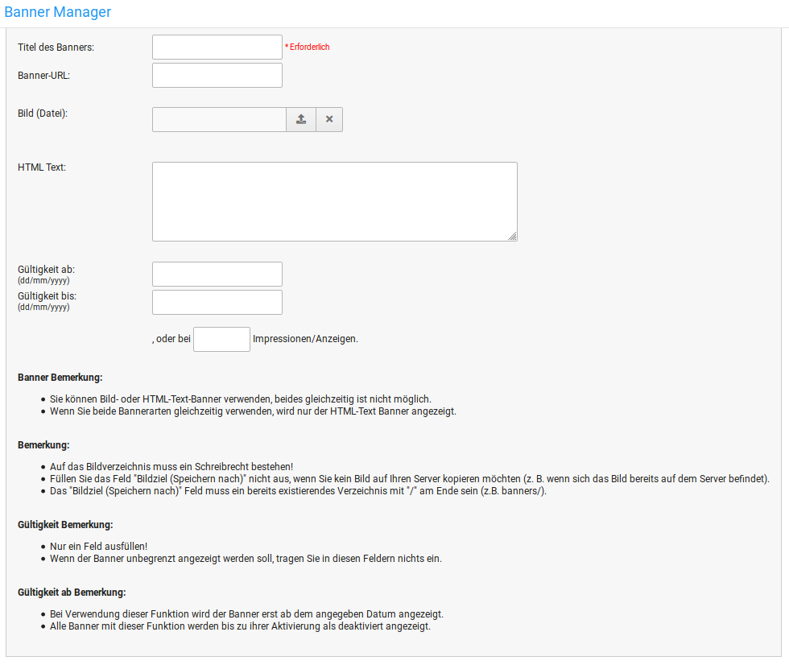

# Banner Manager

Über den Bannermanager kannst du eigene Banner oder Banner von Firmen, mit denen du zusammenarbeitest, in deinem Shop anzeigen lassen.

Der Shop unterscheidet bei den Bannern zwischen Bild-Bannern und HTML-Bannern.

Unabhängig vom gewünschten Banner-Typ vergibst du als erstes einen Titel für den neuen Banner. Dieser wird auf der Übersichtsseite des Bannermanagers als Name angezeigt. Für einen Bildbanner kannst du unter _**Banner-URL**_ die Zielseite des Banners mit führendem _**http://**_ bzw. _**https://**_ eingeben. Dies kann eine externe Webseite wie _**https://www.gambio.de/**_ oder eine Seite deines Shops sein wie zum Beispiel _**http://www.dein-shop.de/kategorie/artikel.html**_

Bei einem Bild-Banner wähle unter _**Bild \(Datei\)**_ die gewünschte Bannergrafik von deinem Computer aus, dass dann auf dem Server gespeichert wird. Wenn du die Banner per FTP in das Verzeichnis images/banner/ geladen hast, dann kannst du im ersten Eingabefeld den Namen der hochgeladenen Grafik angeben.

Wenn du eine Grafik über den Bannermanager hochlädst, kannst du im zweiten Eingabefeld einen neuen Namen angeben, unter dem die Datei auf dem Server gespeichert werden soll. Lasse dieses leer, um den Originalnamen der Grafik beizubehalten.

Für einen HTML-Banner kannst du den gewünschten HTML-Code in das Feld _**HTML-Text**_ eintragen.

Über die Felder _**Gültig ab**_ und _**Gültig bis**_ kannst du den Zeitraum festlegen, in dem der Banner im Shop angezeigt werden soll. Du kannst neben dem Zeitraum auch eine Anzahl festlegen, wie oft der Banner angezeigt werden soll.

