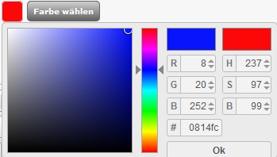
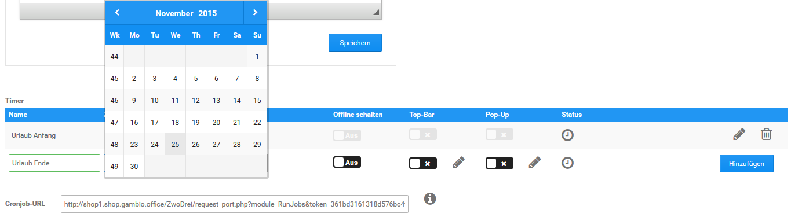

# Shop Online/Offline

Über den Menüpunkt _**Darstellung \> Shop online/offline**_ bzw. _**Inhalte \> Shop online/offline**_ kann eine sogenannte Offline-Seite dem Shop vorgeschaltet werden. Auf diese Weise ist es für Besucher und Kunden nicht möglich Inhalte des Shops zu sehen oder Bestellungen durchzuführen. Dies ist besonders dann nützlich wenn der Shop erstmalig eingerichtet oder umstrukturiert wird.

!!! danger "Achtung"

	 Bei Arbeiten am Shop sollte dieser unbedingt offline geschaltet werden. Geschieht dies nicht, werden dem Kunden z.B. unvollständige AGBs oder Testartikel angezeigt, die nicht lieferbar sind.

	 Hier besteht die Gefahr einer Abmahnung, ein einfacher Hinweis wie _**Dieser Shop ist nur zu Testtzwecken online.**_, ist **nicht ausreichend**.

Zudem hast du über die sogenannte Urlaubsschaltung die Möglichkeit ebenfalls eine Benachrichtigung einzublenden, ohne den Shop offline zu schalten. Bestellungen sind so weiterhin möglich, die Kunden können aber durch eine Textmitteilung z.B. darüber informiert werden, dass sich die Bearbeitung von Bestellungen verzögern kann.

## Shopstatus

Über den Schalter _**Aktueller Shopstatus**_ kann der Shop an bzw. aus geschaltet werden. Der aktuelle Status wird durch die Darstellung des Buttons angezeigt:

Wenn der Shop durch den Schalter _**Aktueller Shopstatus**_ offline geschaltet worden ist, wird das Fenster für die _**Offline Nachricht**_ angezeigt. Hier kann der Inhalt der Offline-Seite festgelegt werden.

Sobald du die Einstellung für den jeweiligen Status vorgenommen hast, klicke bitte auf _**Speichern**_, damit diese wirksam wird.

!!! danger "Achtung"

	 Es ist standardmäßig ein Inhalt für die Offline-Seite vorgegeben. Dieser enthält einen Link _**Login**_ der auf die Admin-Login-Seite des Shops verweist. Auf diese Weise kannst du dich in deinen Shop einloggen, wenn dieser Offline gestellt ist.

	 Sollte dieser Link auf deiner Seite nicht mehr angezeigt werden, kannst du diesen manuell aufrufen. Füge deiner Shopadresse hierzu einfach ein

	 _**/login\_admin.php**_

	 hinzu, sodass sie in der Adresszeile deines Browsers folgendermaßen aussieht:

	 _**http://www.shop.de/login\_admin.php**_

	 \(_**www.shop.de**_ muss hier durch deine Shop-Adresse ersetzt werden\)
	 
## Urlaubsschaltung

Die Nachricht der Urlaubsschaltung kann wahlweise in einer sogenannten TopBar erfolgen, hierbei wird der Hinweis in einer Leiste am oberen Rand des Shopfensters angezeigt, oder in einem Popup-Fenster. Klicke jeweils auf den Reiter _**Top-Bar**_ bzw. _**Pop-Up**_, um die jeweilige Einstellung vorzunehmen.

Für beide Varianten kann je ein individueller Text eingerichtet werden, verwende hierfür bitte die Eingabefenster _**TopBar Inhalt**_ bzw. _**Popup Inhalt**_. Über die Schalter _**Status TopBar**_ und _**Status Popup**_ kann die jeweilige Meldung an- bzw. abgeschaltet werden:

✔ Urlaubsschaltung aktiviert

✖ Urlaubsschaltung deaktiviert

Für die TopBar kann zudem noch die Hintergrundfarbe und der Anzeigemodus festgelegt werden.

Um die Farbe zu wählen, klicke bitte auf die Schaltfläche _**Farbe wählen**_. Es öffnet sich ein Auswahlfenster, in dem die Farbe entweder anhand des genauen Farbcodes eingegeben oder mit Hilfe eines Vorschaufensters ausgewählt wird. Klicke zum Bestätigen der Farbe bitte auf _**OK**_.

Über die Landesflaggen kann für jede Sprache ein individueller Inhalt angelegt werden. Sobald du die Einstellung für den jeweiligen Status vorgenommen hast, klicke bitte auf _**Speichern**_, damit diese wirksam wird.

## Zeitgesteuerter Statuswechsel

Sowohl der Shopstatus \(online/offline\) als auch die einzelnen Varianten der Urlaubsschaltung können zeitgesteuert geändert werden. Hierzu ist bei deinem Hosting-Anbieter die Einrichtung eines sogenannten Cronjobs notwendig. Die vorgesehene URL zur Einrichtung dieses Cronjobs kannst du aus dem Feld _**Cronjob-URL**_ am unteren Ende der Seite herauskopieren.

Um einen zeitgesteuerten Vorgang festzulegen trage bitte in das Eingabefeld _**Name**_ eine entsprechende Bezeichung ein. In der Spalte _**Zeit**_ kannst du den genauen Zeitpunkt einstellen, zu dem der Vorgang ausgelöst werden soll.

Welche Aktion durchgeführt werden soll, kann über die Checkboxen in den Spalten _**Offline schalten**_, _**Top-Bar**_ und _**Pop-Up**_ festgelegt werden. Setze hier jeweils die Einstellung, um die Funktion zu aktivieren bzw. entferne sie, um die Funktion wieder zu deaktivieren. Über das Bleistift-Symbol wird für den automatisierten Vorgang jeweils ein eigener Text festgelegt. Mit Klick auf _**Hinzufügen**_ wird der Vorgang angelegt.

!!! note "Hinweis" 
	 Lieferstatus und Artikelstatus können ebenfalls zeitgesteuert angepasst werden. Weitere Informationen hierzu findest du im Kapitel _**Timer**_.

Über das Bleistift-Symbol kann ein bestehender Vorgang bearbeitet werden. Nimm die gewünschten Änderungen vor und klicke auf _**Speichern**_, um diese zu übernehmen. Mit Klick auf _**Abbrechen**_ gelangst du zurück, ohne die Änderungen zu speichern.

Mit einem Klick auf das Mülltonen-Symbol kann ein bestehender Vorgang gelöscht werden.

In der Zeile Status kann der jeweilige Status eines angelegten Vorgangs eingesehen werden. Bewege hierzu den Mauszeiger über das angezeigte Symbol, es wird eine entsprechende Meldung angezeigt.

