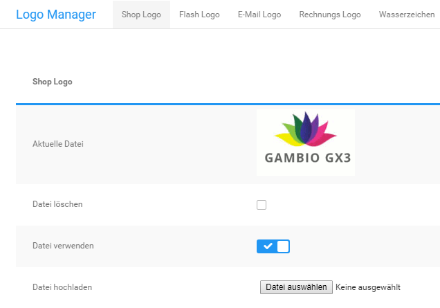

# Logo Manager

Das Shopsystem verwendet verschiedene Logos. Die vom System verwendeten Logos kannst du im Gambio Admin unter _**Einstellungen / Layout & Design / Logo Manager**_, nach Aufrufen der Seite, hochladen.

## Shop Logo

Das Shop Logo wird im Shopbereich wie in der Abbildung _**Shopbereich**_ eingebunden. Das Shop Logo kannst du im Gambio Admin unter _**Einstellungen / Layout & Design / Logo Manager**_, nach Aufrufen der Seite, auf der Registerkarte _**Shop Logo**_ hochladen.

1.  Wenn bereits ein Shop Logo eingestellt ist, aktiviere das Kontrollkästchen _**Datei löschen**_ und klicke auf _**Speichern**_
2.  Klicke bei _**Datei hochladen**_ auf _**Durchsuchen**_ bzw. _**Datei auswählen**_ \(je nach Browser\) und wähle das neue Shop Logo im Dialogfenster aus
3.  Klicke auf _**Speichern**_
4.  Aktiviere die Einstellung _**Datei verwenden**_
5.  Klicke auf _**Speichern**_, um das neue Shop Logo zu verwenden

## Flash Logo

Das Flash Logo wird im Shopbereich an der Position des Shop Logos wie in der Abbildung _**Shopbereich**_ eingebunden. Das Flash Logo kannst du im Gambio Admin unter _**Einstellungen / Layout & Design / Logo Manager**_, nach Aufrufen der Seite, auf der Registerkarte _**Flash Logo**_ hochladen.

!!! note "Hinweis" 
	 Das Flash Logo wird alternativ zum Shop Logo verwendet. Wenn du ein Flash Logo hochlädst, wird das Shop Logo nicht mehr angezeigt. Das Flash Logo muss im Dateiformat SWF vorliegen. **Das Flash Logo kann nur im EyeCandy verwendet werden**.

1.  Wenn bereits ein Flash Logo eingestellt ist, aktiviere das Kontrollkästchen _**Datei löschen**_ und klicke auf _**Speichern**_
2.  Klicke bei _**Datei hochladen**_ auf _**Durchsuchen**_ bzw. _**Datei auswählen**_ \(je nach Browser\) und wähle das neue Flash Logo im Dialogfenster aus
3.  Klicke auf _**Speichern**_
4.  Aktiviere das Kontrollkästchen _**Datei verwenden**_
5.  Klicke auf _**Speichern**_, um das neue Flash Logo zu verwenden

## E-Mail Logo

Das E-Mail Logo wird im Kopfbereich der Bestellbestätigungs-Mail eingebunden. Das E‑Mail Logo kannst du im Gambio Admin unter _**Einstellungen / Layout & Design / Logo Manager**_, nach Aufrufen der Seite, auf der Registerkarte _**E-Mail Logo**_ hochladen.

1.  Wenn bereits ein E‑Mail Logo eingestellt ist, aktiviere das Kontrollkästchen _**Datei löschen**_ und klicke auf _**Speichern**_
2.  Klicke bei _**Datei hochladen**_ auf _**Durchsuchen**_ bzw. _**Datei auswählen**_ \(je nach Browser\) und wähle das neue E‑Mail Logo im Dialogfenster aus
3.  Klicke auf _**Speichern**_
4.  Aktiviere das Kontrollkästchen _**Datei verwenden**_
5.  Klicke auf _**Speichern**_, um das neue E‑Mail Logo zu verwenden

## Rechnungs Logo

Das Rechnungs Logo wird auf der PDF-Rechnung und dem PDF-Lieferschein im oberen rechten Bereich eingebunden. Das Rechnungs Logo kannst du im Gambio Admin unter _**Einstellungen / Layout & Design / Logo Manager**_, nach Aufrufen der Seite, auf der Registerkarte _**Rechnungs Logo**_ hochladen.

!!! danger "Achtung"

	 Für das Rechnungs-Logo sollte **keine** Bild-Datei mit **Transparenz**-Effekten verwendet werden \(z.B. bei Bildern im _**PNG**_-Format\), da es sonst zu Fehlern kommen kann.

1.  Wenn bereits ein Rechnungs Logo eingestellt ist, aktiviere das Kontrollkästchen _**Datei löschen**_ und klicke auf _**Speichern**_
2.  Klicke bei _**Datei hochladen**_ auf _**Durchsuchen**_ bzw. _**Datei auswählen**_ \(je nach Browser\) und wähle das neue PDF Logo im Dialogfenster aus
3.  Klicke auf _**Speichern**_
4.  Aktiviere das Kontrollkästchen _**Datei verwenden**_
5.  Klicke auf Speichern, um das neue PDF Logo zu verwenden

!!! note "Hinweis" 
	 Die maximale Breite für das PDF Logo beträgt 10,5 Zentimeter bei 72 dpi, abzüglich des unter _**Shop Einstellungen \> Rechnung/Lieferschein**_ bzw. _**Einstellungen / System / Rechnung & Lieferschein**_, nach Klick auf _**aufrufen**_, konfigurierten Abstands vom rechten Seitenrand. Die Höhe für das PDF Logo ist nicht begrenzt.
	 
## Wasserzeichen

!!! note "Hinweis"
	 In aktuellen Shopversionen kann das Wasserzeichen nicht mehr konfiguriert werden.

## Favicon

Das Favicon wird in der Adressleiste des Browsers eingebunden, bei den meisten Browsern steht das Favicon links neben der URL. Das Favicon kannst du im Gambio Admin unter _**Einstellungen / Layout & Design / Logo Manager**_, nach Aufrufen der Seite, auf der Registerkarte _**Favicon**_ hochladen.

1.  Wenn bereits ein Favicon eingestellt ist, aktiviere das Kontrollkästchen _**Datei löschen**_ und klicke auf _**Speichern**_
2.  Klicke bei _**Datei hochladen**_ auf _**Durchsuchen**_ bzw. _**Datei auswählen**_ \(je nach Browser\) und wähle das neue Favicon im Dialogfenster aus
3.  Klicke auf _**Speichern**_
4.  Aktiviere das Kontrollkästchen _**Datei verwenden**_
5.  Klicke auf _**Speichern**_, um das neue Favicon zu verwenden

!!! note "Hinweis" 
	 Das Favicon muss im Windows ICO-Format vorliegen. Die Auflösung des Favicons muss 16x16 oder 32x32 Pixel betragen.
	 
## Apple Touch Icon

Das Apple Touch Icon kann unter _**Einstellungen / Layout & Design / Logo Manager**_, nach Aufrufen der Seite, wie folgt eingerichtet werden:

1.  Wenn bereits ein Apple Touch Icon eingestellt ist, aktiviere das Kontrollkästchen _**Datei löschen**_ und klicke auf _**Speichern**_
2.  Klicke bei _**Datei hochladen**_ auf _**Durchsuchen**_ bzw. _**Datei auswählen**_ \(je nach Browser\) und wähle das neue Apple Touch Icon im Dialogfenster aus
3.  Klicke auf _**Speichern**_
4.  Aktiviere das Kontrollkästchen _**Datei verwenden**_
5.  Klicke auf _**Speichern**_, um das neue Apple Touch Icon zu verwenden

!!! note "Hinweis"

	 Für Apple Touch Icons ist das PNG-Format vorgesehen. Die Bilddatei sollte quadratische Abmessungen haben.
	 
## Kategorie Icon

Das Kategorie Icon wird vor dem Kategorienamen in der Kategorienavigation im Menü links eingebunden. Das Kategorie Icon kannst du im Gambio Admin unter _**Einstellungen / Layout & Design / Logo Manager**_, nach Aufrufen der Seite, auf der Registerkarte _**Kategorie Icon**_ hochladen.

1.  Wenn bereits ein Kategorie Icon eingestellt ist, aktiviere das Kontrollkästchen _**Datei löschen**_ und klicke auf _**Speichern**_
2.  Klicke bei _**Datei hochladen**_ auf _**Durchsuchen**_ bzw. _**Datei auswählen**_ \(je nach Browser\) und wähle das neue Kategorie Icon im Dialogfenster aus
3.  Klicke auf _**Speichern**_, um das neue Kategorie Icon zu verwenden

!!! note "Hinweis" 
	 Das Kategorie Icon, das du unter _**Darstellung \> Logo Manager**_ bzw. _**Einstellungen / Layout & Design / Logo Manager**_, nach Aufrufen der Seite, hochlädst, wird verwendet, wenn du in der Kategorie selbst kein Icon hochlädst. Kategorie Icons, die direkt in einer Kategorie hochgeladen werden, überschreiben das Standard Icon, das du im Logo Manager hochlädst.
	
