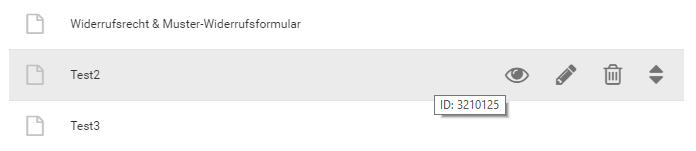
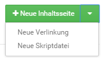
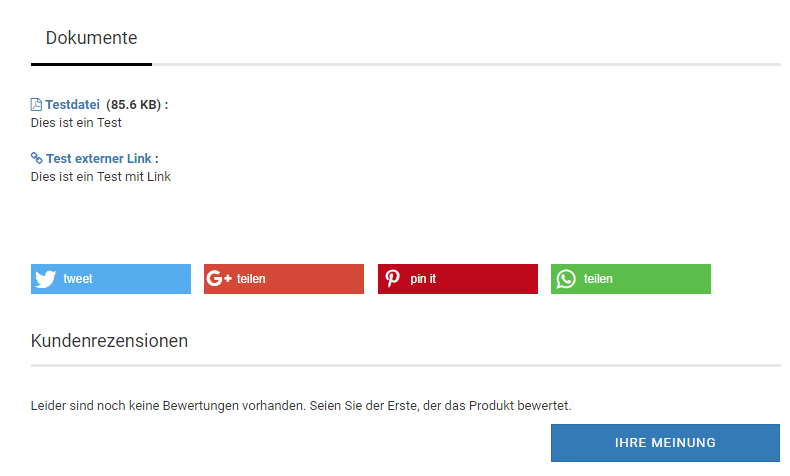

# Content Manager

Im Bereich _**Darstellung**_ bzw. _**Inhalte**_ des Gambio Admins findest du den Eintrag _**Content Manager**_, dort kannst du Informationsseiten für deinen Shop anlegen und bestehende Informationsseiten bearbeiten. Der Content Manager ist in drei Abschnitte aufgeteilt, die über einen Klick auf den jeweiligen Reiter ausgewählt werden können:

-   Seiten
-   Elemente
-   Artikelinhalte

## Seiten

Die hier angelegten Inhalte stellen eigenständige Seiten dar, die alleine für sich aufgerufen werden können. Der Shop bringt hier eine ganze Auswahl vorgegebener Seiten mit, die ihren eigenen Verwendungszweck haben, z.B. _**AGB**_, _**Impressum**_, _**Widerrufsrecht & Muster- Widerrufsformular**_ und dergleichen mehr.

!!! danger "Achtung"

	 Der eingetragene Text im Content _**Widerrufsrecht & Muster-Widerrufsformular**_ darf nicht angepasst werden, da hierüber einzelne Elemente für die Widerrufsbelehrung zusammengeführt werden \(siehe Kapitel _**Elemente**_, _**Verbraucherrechterichtlinie**_\).

### Aktionen zu einem Content

Um die möglichen Aktionen für einen Content anzuzeigen, bewege zunächst den Mauszeiger in die jeweilige Zeile des Contents. Es werden mehrere Symbole angezeigt, diese sind von links nach rechts: _**Vorschau**_, _**Bearbeiten**_, _**Löschen**_, _**Verschieben**_. Klicke das jeweilige Symbol an, um eine Aktion auszuführen.

!!! note "Hinweis" 
	 Bei vordefinierten Contents wird kein _**Löschen**_-Symbol angezeigt. Diese Contents können nicht entfernt werden, da der Shop diese benötigt.

**Vorschau aufrufen**

Bewege den Mauszeiger über das Augensymbol des gewünschten Contents und klicke mit der linken Maustaste darauf, um die Vorschau aufzurufen. Auf diese Weise kannst du einen Content betrachten, ohne die komplette Eingabemaske aufrufen zu müssen \(siehe _**Content bearbeiten**_\).

**Content bearbeiten**

Bewege den Mauszeiger über das Bleistift-Symbol des gewünschten Contents und klicke mit der linken Maustaste darauf, um diesen zu bearbeiten. Es öffnet sich die Eingabemaske des Contents, über die du die Änderungen vornehmen kannst \(siehe _**Eingabemaske**_\).

**Content löschen**

Bewege den Mauszeiger über das Mülltonnen-Symbol des zu löschenden Contents und klicke mit der linken Maustaste darauf, um diesen zu löschen. Es wird eine Sicherheitsabfrage angezeigt, in der Name und ID des Contents aufgeführt sind. Wenn du sicher bist dass der Content entfernt werden soll, klicke auf _**Löschen**_. Anderenfalls klicke auf _**Abbrechen**_ und der Dialog wird wieder geschlossen, ohne dass der Content gelöscht wird.

**Content verschieben**

Bewege den Mauszeiger über das Pfeilsymbol des gewünschten Contents, klicke und halte die linke Maustaste, um diesen in einen anderen Bereich zu verschieben. Ziehe so den Content nach oben oder unten in den gewünschten Bereich und lasse dort die linke Maustaste wieder los. Jeder Bereich hat seine eigene Funktion \(siehe _**Bereiche des Abschnitts Seiten**_\).

### Bereiche des Abschnitts Seiten

Über die Bereiche kann festgelegt werden in welchem Teil des Shops ein Content angezeigt wird \(siehe Kapitel _**Bereiche des Shopsystems**_\). Für Inhaltsseiten stehen die folgenden Bereiche zur Verfügung:

-   _**Hauptkategorien**_ - der Content wird als Eintrag in der horizontalen Menüleiste angezeigt
-   _**Sekundärnavigation**_ - der Content wird als Eintrag in der Sekundärnavigation angezeigt
-   _**Mehr über...**_ - der Content wird als Link in der ersten Spalte des Footers \(Mehr über\) angezeigt
-   _**Informationen Box**_ - der Content wird als Link in der Box _**Informationen**_ angezeigt
-   _**Weitere Seiten**_ - der Content wird nicht automatisch verlinkt

### Anlegen eines Contents

Über die grünen Schaltflächen kann ein neuer Content angelegt werden, der Content wird dem Bereich hinzugefügt, neben dem die Schaltfläche angezeigt wird \(siehe _**Bereiche des Abschnitts Seiten**_\) Verwende die Dropdown-Funktion um die Art des Contents auszuwählen, den du anlegen möchtest. Es steht die folgende Auswahl zur Verfügung:

-   _**Neue Inhaltsseite**_: eine normale Informationsseite, die Texte, Bilder, Tabellen und ähnliches enthalten kann
-   _**Neue Verlinkung**_: der Content wird als Link auf eine andere Seite verwendet. Dies kann sowohl eine andere Seite des Shops als auch eine externe Webseite sein
-   _**Neue Skriptdatei**_: der Content enthält z.B. eine HTML- oder TXT-Datei, welche als Inhalt verwendet wird

!!! note "Hinweis" 
	 Es können aus Sicherheitsgründen keine Skriptdateien mit ausführbarem Programmcode über den Dateimanager hochgeladen werden.

### Eingabemaske

 

Die Eingabemaske, welche beim Anlegen oder Bearbeiten eines Contents angezeigt wird, unterscheidet sich je nach der gewählten Seitenart. Bei einer Inhaltsseite steht die Eingabe über den CK-Editor unter _**Inhalt**_ im Vordergrund, während bei einer Verlinkung die eingetragene URL ausschlaggebend ist. Nachfolgend führen wir die verfügbaren Felder auf:

**Inhaltsseite**

|Feldname|Beschreibung|
|--------|------------|
|Seitenart|Art des Contents \(Inhaltsseite, Verlinkung, Skriptdatei\)|
|Content Teaser-Slider|Auswahl für Teaser-Slider, der auf der Content-Seite angezeigt wird|
|Sprachauswahl|klicke auf die jeweilige Landesflagge, um den Content für die gewünschte Sprache zu bearbeiten|
|Interner Name|Name der Seite, der im Content Manager angezeigt wird. Kann für vordefinierte Contents nicht geändert werden.|
|Name|Name der Seite, unter diesem Namen kann die Content-Seite im Shop aufgerufen werden|
|Überschrift|Überschrift der Seite, im Content wird diese Überschrift verwendet|
|sichtbar|ist die Einstellung aktiviert \(Häkchen-Symbol vor blauem Hintergrund\) kann die Seite aufgerufen werden|
|Inhalt|Inhalt der Seite, zur Eingabe wird standardmäßig der CK-Editor verwendet \(siehe Kapitel _**CK-Editor**_\)|
|Als Download|Datei, die zu diesem Content heruntergeladen werden kann \(für spezielle Anwendungsfälle, z.B. für das Widerrufsrecht\).|
|Meta Title|Meta-Titel der Seite, wird für die Anzeige im Browser-Tab und Suchmaschinen verwendet|
|Meta Keywords|Schlagwörter unter denen Suchmaschinen diese Seite finden sollen, Eingabe mit Komma getrennt, ohne Leerzeichen|
|Meta Description|freier Text zur Beschreibung der Seite, zur Verwendung von Suchmaschinen|
|URL Keywords|Teil-URL unter der die Seite im Shop aufgerufen werden kann, wird automatisch vergeben, muss mindestens 3 Zeichen lang sein|
|URL Rewrite|Feld zur Eingabe einer alternativen URL, siehe Kapitel _**URL Rewrite**_|
|In die Sitemap aufnehmen|Soll die Seite in die Sitemap \(für Suchmaschinen\) aufgenommen werden?|
|Priorität in der Sitemap|wie wichtig ist die Seite im Shop, Angabe von 0.0 \(weniger wichtig\) bis 1.0 \(sehr wichtig\)|
|Änderungsgfrequenz in der Sitemap|Vorgabe für Suchmaschinen in welchem Zeitintervall diese Seite auf Aktualisierungen geprüft werden sollte \(Wunschvorgabe, das tatsächliche Intervall liegt im Ermessen des Suchmaschinenbetreibers\)|
|Eintrag in robots. txt \(disallow\)|soll die Seite in der Robots-Datei für Suchmaschinen gesperrt werden?|
|Bild für soziale Medien \(og:image\)|Bild für soziale Medien, wird mit einem Open Graph Meta-Tag eingebunden|

**Verlinkung**

|Feldname|Beschreibung|
|--------|------------|
|Seitenart|Art des Contents \(Inhaltsseite, Verlinkung, Skriptdatei\)|
|Sprachauswahl|klicke auf die jeweilige Landesflagge, um den Content für die gewünschte Sprache zu bearbeiten|
|Interner Name|Name der Seite, der im Content Manager angezeigt wird. Kann für vordefinierte Contents nicht geändert werden.|
|Titel|Name der Seite, dieser Text wird im Shop als Link verwendet|
|Linkadresse|URL der aufzurufenden Seite, bei externen Seiten muss die komplette URL inklusive führenden _**http://**_ bzw. _**https://**_ angegeben werden, bei shopeigenen Seiten reicht die Angabe der Teil-URL \(z.B. /hauptkategorie/unterkategorie/artikel.html\)|
|sichtbar|ist die Einstellung aktiviert \(Häkchen-Symbol vor blauem Hintergrund\) kann die Seite aufgerufen werden|
|In neuem Fenster öffnen|ist der Haken gesetzt, wird der Link in einem neuen Tab bzw. neuem Fenster \(je nach Browser-Einstellung\) geöffnet, sinnvoll bei externen Seiten|

!!! note "Hinweis" 

	 Ist ein Unterordner Bestandteil deiner Shop- Adresse, z.B.

	 _**www.beispiel.de/shop**_

	 muss bei einem internen Link ebenfalls der Unterordner

	 _**/shop/**_

	 mit angegeben werden.

**Skriptdatei**

|Feldname|Beschreibung|
|--------|------------|
|Seitenart|Art des Contents \(Inhaltsseite, Verlinkung, Skriptdatei\)|
|Content Teaser-Slider|Auswahl für Teaser-Slider, der auf der Content-Seite angezeigt wird|
|Sprachauswahl|klicke auf die jeweilige Landesflagge, um den Content für die gewünschte Sprache zu bearbeiten|
|Interner Name:|Name der Seite, der im Content Manager angezeigt wird. Kann für vordefinierte Contents nicht geändert werden.|
|Titel|Name der Seite, unter diesem Namen kann die Content-Seite im Shop aufgerufen werden|
|sichtbar|ist die Einstellung aktiviert \(Häkchen-Symbol vor blauem Hintergrund\) kann die Seite aufgerufen werden|
|Inhalt|Inhalt der Seite, zusätzlich oder ersatzweise zum Skript, zur Eingabe wird standardmäßig der CK-Editor verwendet \(siehe Kapitel _**CK-Editor**_\)|
|Datei wählen|ruft den Dateimanager auf, über den die Datei hochgeladen oder ausgewählt werden kann|
|Als Download|Datei, die zu diesem Content heruntergeladen werden kann \(für spezielle Anwendungsfälle, z.B. für das Widerrufsrecht\).|
|Meta Title|Meta-Titel der Seite, wird für die Anzeige im Browser- Tab und Suchmaschinen verwendet|
|Meta Keywords|Schlagwörter unter denen Suchmaschinen diese Seite finden sollen, Eingabe mit Komma getrennt, ohne Leerzeichen|
|Meta Description|freier Text zur Beschreibung der Seite, zur Verwendung von Suchmaschinen|
|URL Keywords|Teil-URL unter der die Seite im Shop aufgerufen werden kann, wird automatisch vergeben, muss mindestens 3 Zeichen lang sein|
|URL Rewrite|Feld zur Eingabe einer alternativen URL, siehe Kapitel _**URL Rewrite**_|
|In die Sitemap aufnehmen|Soll die Seite in die Sitemap \(für Suchmaschinen\) aufgenommen werden?|
|Priorität in der Sitemap|wie wichtig ist die Seite im Shop, Angabe von 0.0 \(weniger wichtig\) bis 1.0 \(sehr wichtig\)|
|Änderungsgfrequenz in der Sitemap|Vorgabe für Suchmaschinen in welchem Zeitintervall diese Seite auf Aktualisierungen geprüft werden sollte \(Wunschvorgabe, das tatsächliche Intervall liegt im Ermessen des Suchmaschinenbetreibers\)|
|Eintrag in robots. txt \(disallow\)|soll die Seite in der Robots-Datei für Suchmaschinen gesperrt werden?|
|Bild für soziale Medien \(og:image\)|Bild für soziale Medien, wird mit einem Opern Graph Meta-Tag eingebunden|

Nimm die Eintragungen nach Bedarf vor. Mit einem Klick auf _**Speichern**_, speicherst du die Änderungen ab und verlässt die Eingabemaske. Über _**Aktualisieren**_ werden die Änderungen gespeichert, ohne jedoch die Eingabemaske zu verlassen. Mit _**Zurück**_ verlässt du die Eingabemaske, die zuletzt gemachten Änderungen werden verworfen.

## Elemente

Elemente sind Bestandteile einer anderen Seite. Zu den Seiten, welche mehrere Elemente verwenden, zählt vor allem die Startseite des Shops sowie der Content _**Widerrufsrecht & Muster-Widerrufsformular**_ \(siehe Kapitel _**Verbraucherrechterichtlinie**_\).

### Aktionen zu einem Content

Um die möglichen Aktionen für einen Content anzuzeigen, bewege zunächst den Mauszeiger in die jeweilige Zeile des Contents. Es werden mehrere Symbole angezeigt, diese sind von links nach rechts: _**Vorschau**_, _**Bearbeiten**_, _**Löschen**_. Klicke das jeweilige Symbol an, um eine Aktion auszuführen.

!!! note "Hinweis" 
	 Bei vordefinierten Contents wird kein _**Löschen**_-Symbol angezeigt. Diese Contents können nicht entfernt werden, da der Shop diese benötigt.

**Vorschau aufrufen**

Bewege den Mauszeiger über das Augensymbol des gewünschten Contents und klicke mit der linken Maustaste darauf, um die Vorschau aufzurufen. Auf diese Weise kannst du einen Content betrachten, ohne die komplette Eingabemaske aufrufen zu müssen \(siehe _**Content bearbeiten**_\).

**Content bearbeiten**

Bewege den Mauszeiger über das Bleistift-Symbol des gewünschten Contents und klicke mit der linken Maustaste darauf, um diesen zu bearbeiten. Es öffnet sich die Eingabemaske des Contents, über die du die Änderungen vornehmen kannst \(siehe _**Eingabemaske**_\).

**Content löschen**

Bewege den Mauszeiger über das Mülltonnen-Symbol des zu löschenden Contents und klicke mit der linken Maustaste darauf, um diesen zu löschen. Es wird eine Sicherheitsabfrage angezeigt, in der Name und ID des Contents aufgeführt sind. Wenn du sicher bist dass der Content entfernt werden soll, klicke auf _**Löschen**_. Anderenfalls klicke auf _**Abbrechen**_ und der Dialog wird wieder geschlossen, ohne dass der Content gelöscht wird.

### Bereiche des Abschnitts Elemente

Über die Bereiche kann festgelegt werden auf welcher Seite des Shops ein Content angezeigt wird. Für Elemente stehen die folgenden Seiten zur Verfügung:

-   _**Startseite**_ - der Content wird als Bestandteil der Startseite angzeigt \(siehe Kapitel _**Bereiche des Shopsystems**_\)
-   _**Header**_ - der Content wird für die Anzeige im Header verwendet \(siehe Kapitel _**Bereiche des Shopsystems**_\)
-   _**Footer**_ - der Content wird für die Anzeige im Footer verwendet \(siehe Kapitel _**Bereiche des Shopsystems**_\)
-   _**Boxen**_ - der Content wird als Box in der linken Spalte des Shops angezeigt
-   _**Widerruf**_ - der Content wird als Bestandteil der Seite _**Widerrufsrecht & Muster-Widerrufsformular**_ angezeigt
-   _**Sonstige**_ - der Content wird an einer anderen Stelle im Shop angezeigt

!!! note "Hinweis" 
	 Standardmäßig sind die folgenden Contents im Bereich _**Sonstige**_ angelegt:

	 _**Bestellzusammenfassung Information**_ - dieser Content wird auf der letzten Seite des Bestellvorgangs angezeigt, am unteren Ende, neben der Schaltfläche _**kostenpflichtig bestellen**_

	 _**Datenweitergabe an Transportunternehmen**_ - dieser Content wird auf der Seite _**Versand & Zahlung**_ im Bestellvorgang angezeigt

### Anlegen eines Contents

Über die grünen Schaltflächen kann ein neuer Content angelegt werden, der Content wird dem Bereich hinzugefügt, neben dem die Schaltfläche angezeigt wird \(siehe _**Bereiche des Abschnitts Elemente**_\) Verwende die Dropdown-Funktion um die Art des Contents auszuwählen, den du anlegen möchtest. Es steht die folgende Auswahl zur Verfügung:

-   _**Neue Inhaltsseite**_: eine normale Informationsseite, die Texte, Bilder, Tabellen und ähnliches enthalten kann
-   _**Neue Skriptdatei**_: der Content enthält z.B. eine HTML- oder TXT-Datei, welche als Inhalt verwendet wird

!!! note "Hinweis" 
	 Es können aus Sicherheitsgründen keine Skriptdateien mit ausführbarem Programmcode über den Dateimanager hochgeladen werden.

### Eingabemaske

Die Eingabemaske, welche beim Anlegen oder Bearbeiten eines Contents angezeigt wird, unterscheidet sich je nach der gewählten Seitenart. Bei einer Inhaltsseite steht die Eingabe über den CK-Editor unter _**Inhalt**_ im Vordergrund, während bei einer Verlinkung die eingetragene URL ausschlaggebend ist. Nachfolgend führen wir alle verfügbaren Felder auf:

**Inhaltsseite**

|Feldname|Beschreibung|
|--------|------------|
|Seitenart|Art des Contents \(Inhaltsseite, Skriptdatei\)|
|Sprachauswahl|klicke auf die jeweilige Landesflagge, um den Content für die jeweilige Sprache zu bearbeiten|
|Interner Name|Name des Elements im Content Manager|
|Überschrift|Überschrift des Elements auf der Seite|
|sichtbar|ist die Einstellung aktiviert \(Häkchen-Symbol vor blauem Hintergrund\) wird das Element angezeigt|
|Inhalt|Inhalt der Seite, zur Eingabe wird standardmäßig der CK-Editor verwendet \(siehe Kapitel _**CK-Editor**_\)|

**Skriptdatei**

|Feldname|Beschreibung|
|--------|------------|
|Seitenart|Art des Contents \(Inhaltsseite, Skriptdatei\)|
|Sprachauswahl|klicke auf die jeweilige Landesflagge, um den Content für die jeweilige Sprache zu bearbeiten|
|Interner Name|Name des Elements im Content Manager|
|Überschrift|Überschrift des Elements auf der Seite|
|sichtbar|ist die Einstellung aktiviert \(Häkchen-Symbol vor blauem Hintergrund\) wird das Element angezeigt|
|Datei wählen|ruft den Dateimanager auf, über den die Datei hochgeladen oder ausgewählt werden kann|

Nimm die Eintragungen nach Bedarf vor. Mit einem Klick auf _**Speichern**_ speicherst du die Änderungen ab und verlässt die Eingabemaske. Über _**Aktualisieren**_ werden die Änderungen gespeichert, ohne jedoch die Eingabemaske zu verlassen. Mit _**Zurück**_ verlässt du die Eingabemaske, die zuletzt gemachten Änderungen werden verworfen.

## Artikelinhalte

Artikelinhalte, auch Artikelcontents genannt, können einem Artikel als zusätzlicher Download zugeordnet werden. Dies eignet sich beispielsweise dazu zu einem Produkt eine PDF-Anleitung zum Download anbieten zu können.

!!! note "Hinweis" 
	 Im Gegensatz zu Download-Artikeln ist das Herunterladen dieser Dateien immer möglich. Der Artikel muss hierzu nicht bestellt werden.

### Aktionen zu einem Artikelinhalt

Um die möglichen Aktionen für einen Artikelcontent anzuzeigen, bewege zunächst den Mauszeiger in die jeweilige Zeile des Contents. Es werden mehrere Symbole angezeigt, diese sind von links nach rechts: _**Bearbeiten**_, _**Löschen**_. Klicke das jeweilige Symbol an, um eine Aktion auszuführen.

**Content bearbeiten**

Bewege den Mauszeiger über das Bleistift-Symbol des gewünschten Contents und klicke mit der linken Maustaste darauf, um diesen zu bearbeiten. Es öffnet sich die Eingabemaske des Contents, über die du die Änderungen vornehmen kannst \(siehe _**Eingabemaske**_\).

**Content löschen**

Bewege den Mauszeiger über das Mülltonnen-Symbol des zu löschenden Contents und klicke mit der linken Maustaste darauf, um diesen zu löschen. Es wird eine Sicherheitsabfrage angezeigt, in der Name und ID des Contents aufgeführt sind. Wenn du sicher bist dass der Content entfernt werden soll, klicke auf _**Löschen**_. Anderenfalls klicke auf _**Abbrechen**_ und der Dialog wird wieder geschlossen, ohne dass der Content gelöscht wird.

### Anlegen eines Artikelcontents

Über die grüne Schaltfläche kann ein neuer Artikelcontent angelegt werden. Verwende die Dropdown-Funktion um die Art des Contents auszuwählen, den du anlegen möchtest. Es steht die folgende Auswahl zur Verfügung:

-   _**Neue Datei**_: der Artikelcontent enthält eine Datei, die auf dem FTP-Server abgelegt wird
-   _**Neuer Link**_: der Artikelcontent enthält einen Link auf das gewünschte Ziel

!!! note "Hinweis" 
	 Es können aus Sicherheitsgründen keine Skriptdateien mit ausführbarem Programmcode über den Dateimanager hochgeladen werden.

### Eingabemaske

**Datei**

|Feldname|Beschreibung|
|--------|------------|
|Content-Typ|Art des Artikelcontents \(Datei, Link\)|
|Interner Name|Name des Artikelcontents im Content Manager|
|Anzeigen in|Auswahl der Artikel dem der Artikelcontent zugeordnet werden soll|
|Sprachauswahl|klicke auf die jeweilige Landesflagge, um den Content für die jeweilige Sprache zu bearbeiten|
|Titel oder Dateiname|Text der als Link zur Datei im Artikel angezeigt wird|
|Datei wählen|Aufruf des Dateimanagers um die Datei auszuwählen|
|Inhalt|freier Text zur Beschreibung der Datei|

**Link**

|Feldname|Beschreibung|
|--------|------------|
|Content-Typ|Art des Artikelcontents \(Datei, Link\)|
|Interner Name|Name des Artikelcontents im Content Manager|
|Anzeigen in|Auswahl der Artikel dem der Artikelcontent zugeordnet werden soll|
|Sprachauswahl|klicke auf die jeweilige Landesflagge, um den Content für die jeweilige Sprache zu bearbeiten|
|Titel oder Dateiname|Text der als Link zur angegebenen URL im Artikel angezeigt wird|
|Linkadresse|URL zum gewünschten Ziel des Artikelcontents|
|Inhalt|freier Text zur Beschreibung des verlinkten Inhalts|

Wähle im Bereich _**Artikel**_ den gewünschten Artikel aus, um den Artikelcontent zuzuordnen. Über _**Hinzufügen**_ kann die Auswahl für einen weiteren Artikel ergänzt werden. Über einen Klick auf das Mülltonnen-Symbol kann eine überzählige Auswahl wieder entfernt werden.

Nimm die Eintragungen nach Bedarf vor. Mit einem Klick auf _**Speichern**_ speicherst du die Änderungen ab und verlässt die Eingabemaske. Über _**Aktualisieren**_ werden die Änderungen gespeichert, ohne jedoch die Eingabemaske zu verlassen. Mit _**Zurück**_ verlässt du die Eingabemaske, die zuletzt gemachten Änderungen werden verworfen.

