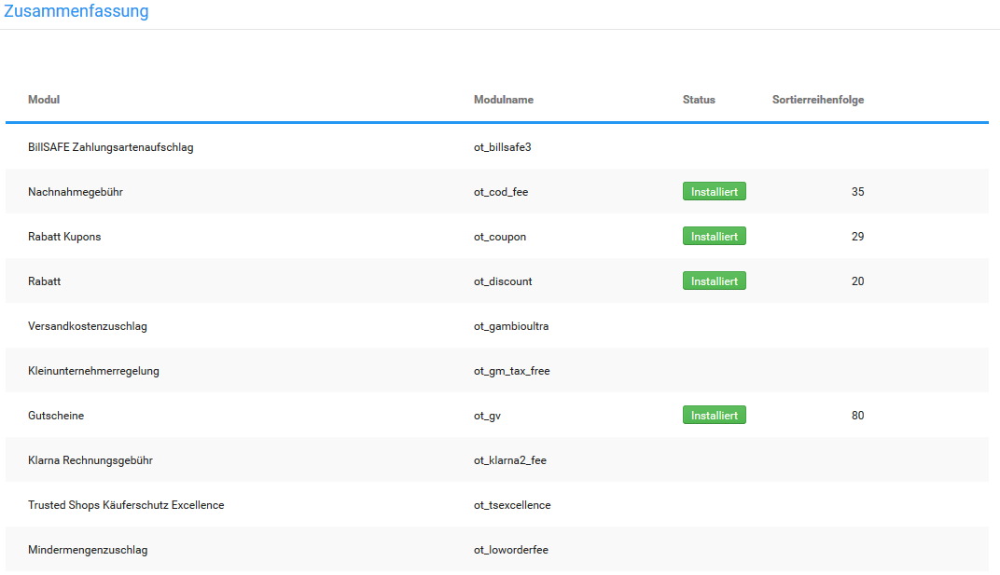
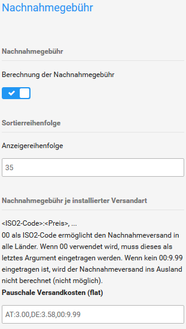
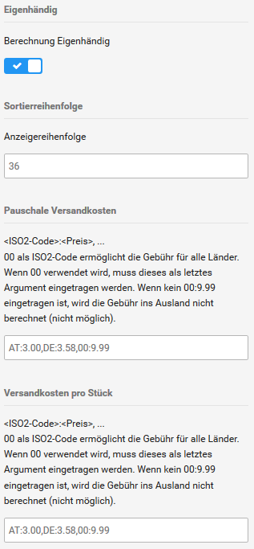
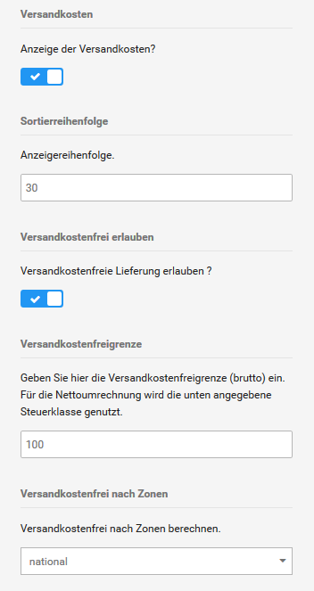
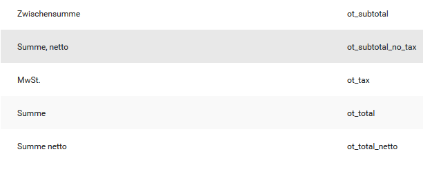

# Zusammenfassung

## Rabatte

### Rabatt Kupons

Das Modul _**Rabatt Kupons**_ wird benötigt, um Rabatt Kupons bei der Summenberechnung zu berücksichtigen.

### Rabatt

Das Modul _**Rabatt**_ wird benötigt, um Kundengruppenrabatte bei der Summenberechnung zu berücksichtigen.

### Gutscheine

Das Modul _**Gutscheine**_ wird benötigt, um Gutscheine bei der Summenberechnung zu berücksichtigen.

### Vorkasse Rabatt

Mit dem Modul _**Vorkasse Rabatt**_ gibst du einen Rechnungsrabatt auf bestimmte Zahlungsweisen.

#### Installation

Das Modul kann unter _**Module \> Zusammenfassung**_ installiert werden,

!!! danger "Achtung"

	 Sobald eine Rabattstaffel angelegt wurde, müssen dafür zwingend auch Zahlungsweisen benannt werden, es kann sonst zu Problemen im Bestellvorgang kommen.

#### Konfiguration

|Feldname|Beschreibung|
|--------|------------|
|Rabatt anzeigen|Hier wird das Modul aktiviert, bzw. deaktiviert.|
|Sortierreihenfolge|Die Sortierreihenfolge wirkt sich auf die Berechnung der Einzelposten in der Bestellzusammenfassung aus. Änderungen sollten daher nach Möglichkeit unterlassen werden. Der Standardwert lautet hier 49.|
|Erste Rabattstaffel|Hier kann die erste Rabattstaffel hinterlegt werden. Mit 100:4 werden für Bestellungen ab 100 Euro 4% Rabatt gewährt. Diese Rabattstaffel bezieht sich auf die Zahlungsmodule, die unter _**Erste Zahlungsart**_ angegeben wurden.|
|Zweite Rabattstaffel|Hier kann die zweite Rabattstaffel hinterlegt werden. Mit 100:4 werden für Bestellungen ab 100 Euro 4% Rabatt gewährt. Diese Rabattstaffel bezieht sich auf die Zahlungsmodule, die unter _**Zweite Zahlungsart**_ angegeben wurden.|
|Erste Zahlungsart|Hier wird die Zahlungsart, auf die sich der Rabatt beziehen soll, anhand des Modulnamens hinterlegt. Für Rechnung müsste also _**invoice**_ hinterlegt werden. Die Namen der Module finden sich unter _**Module \> Zahlungsweisen \> Sonstige**_ in Klammern hinter den Modulnamen. Es können mehrere Zahlungsweisen für einen Rabatt hinterlegt werden, wenn diese kommagetrennt und ohne Leerzeichen angegeben werden, z.B. _**paypal,cod**_.|
|Zweite Zahlungsart|Siehe _**Erste Zahlungsart**_.|
|Inklusive Versandkosten|Gibt an, ob die Versandkosten mit rabattiert werden sollen oder ob nur der reine Warenwert der Rabattierung zugrunde gelegt werden soll|
|Inklusive USt|Legt fest, ob eine Neuberechnung der Umsatzsteuer nach Rabattierung erfolgen soll. Dies würde die Steuer reduzieren.|
|Erlaubte Zonen|Hier kann die Anzeige des Modules auf bestimmte Länder eingegrenzt werden. Die Eingabe _**DE,AT,CH**_ sorgt dafür, dass das Modul nur für Deutschland, Österreich und die Schweiz angezeigt wird.|
|Steuerklasse|Hier wird ausgewählt, von welchem Steuersatz ausgegangen werden soll. Der Rabattbetrag enthält dann also anteilig Mehrwertsteuer. Wird keine Steuerklasse ausgewählt, enthält der Rabattbetrag dementsprechend auch keinen Steueranteil.|

## Gebühren

Mit den folgenden Modulen bildest du Gebühren in der Bestellzusammenfassung ab. Die Module findest du im Gambio Admin deines Shops unter _**Module \> Zusammenfassung**_.

### Nachnahmegebühr

Das Modul zur Berechnung der Nachnahmegebühr kannst du im Gambio Admin deines Shops unter _**Module \> Zusammenfassung**_ installieren.

1.  Wähle in der Modul-Liste das Modul _**Nachnahmegebühr**_ aus
2.  Klicke in der rechten Spalte auf _**Installieren**_
3.  Klicke in der rechten Spalte auf _**Bearbeiten**_
4.  Nimm die Konfiguration des Moduls anhand der Tabelle Konfiguration des Moduls _**Nachnahmegebühr**_ vor
5.  Klicke in der rechten Spalte auf _**Aktualisieren**_, um die Änderungen zu speichern

|Feldname|Beschreibung|
|--------|------------|
|Nachnahmegebühr|Bei ✔ wird das Modul in der Bestellzusammenfassung und auf der Rechnung ausgewiesen und berechnet \[✔\]|
|Sortierreihenfolge|legt fest, an welcher Position in der Bestellzusammenfassung das Modul ausgegeben wird, dies wirkt sich auf die Berechnung aus \[35\]|
|Nachnahmegebühr je installierter Versandart|enthält die Nachnahmegebühren je Versandart im Format ISO2:Gebühren\(netto, Beispiel: DE:2.35\); alle nicht separat aufgebrachten Länder werden mit dem Universalcode _**00**_ zusammengefasst|
|Steuerklasse|eine Liste der konfigurierten Steuerklassen; die Gebühr wird anhand der gewählten Steuerklasse berechnet|
|Übermittlungsentgeld je installierter Versandart|Es kann zusätzlich noch ein Übermittlungsentgeld erhoben werden. Die Konfiguration der Gebühren erfolgt genauso wie bei der Nachnahmegebühr.|

### Versandkostenzuschlag 

Mit dem Modul _**Versandkostenzuschlag**_ kannst du einen Zuschlag auf die regulären Versandkosten berechnen. Die Höhe des Zuschlags legst du je Artikel fest. Das Modul für den Versandkostenzuschlag kann im Gambio Admin deines Shops unter _**Module \> Zusammenfassung**_ installiert werden.

1.  Wähle in der Modul-Liste das Modul _**Versandkostenzuschlag**_ aus
2.  Klicke in der rechten Spalte auf _**Installieren**_
3.  Klicke in der rechten Spalte auf _**Bearbeiten**_
4.  Nimm die Konfiguration des Moduls anhand der Tabelle _**Konfiguration des Moduls Versandkostenzuschlag**_ vor
5.  Klicke in der rechten Spalte auf _**Aktualisieren**_, um die Änderungen zu speichern

|Feldname|Beschreibung|
|--------|------------|
|Versandkostenzuschlag anzeigen|bei ✔ wird das Modul in der Bestellzusammenfassung und auf der Rechnung ausgewiesen und berechnet \[✔\]|
|Sortierreihenfolge|legt fest, an welcher Position in der Bestellzusammenfassung das Modul ausgegeben wird \[31\]|
|Bezeichnung|der Name, mit dem das Modul in der Bestellzusammenfassung ausgegeben wird \[Sperrgutzuschlag\]|
|Details zum Versandkostenzuschlag|bei ✔ werden die zu berechnenden Zuschläge einzeln aufgeschlüsselt \[✔\]|
|Versandkostenzuschlag für Zonen berechnen|legt fest, ob der Zuschlag nur bei nationalen, nur bei internationalen oder bei allen Bestellungen erhoben wird|
|Steuerklasse|eine Liste der konfigurierten Steuerklassen; die Gebühr wird anhand der gewählten Steuerklasse berechnet|

### Mindermengenzuschlag 

Mit dem Modul _**Mindermengenzuschlag**_ kannst du einen Zuschlag auf Bestellungen, deren Warenwert unter einem festgelegten Schwellenwert liegt, berechnen. Das Modul für den Mindermengenzuschlag kann im Gambio Admin deines Shops unter _**Module \> Zusammenfassung**_ installiert werden.

1.  Wähle in der Modul-Liste das Modul _**Mindermengenzuschlag**_ aus
2.  Klicke in der rechten Spalte auf _**Installieren**_
3.  Klicke in der rechten Spalte auf _**Bearbeiten**_
4.  Nimm die Konfiguration des Moduls anhand der Tabelle _**Konfiguration des Moduls Mindermengenzuschlag**_ vor
5.  Klicke in der rechten Spalte auf _**Aktualisieren**_, um die Änderungen zu speichern

|Feldname|Beschreibung|
|--------|------------|
|Mindermengenzuschlag anzeigen|Bei ✔ wird das Modul in der Bestellzusammenfassung und auf der Rechnung ausgewiesen und berechnet \[✔\]|
|Sortierreihenfolge|legt fest, an welcher Position in der Bestellzusammenfassung das Modul ausgegeben wird \[4\]|
|Mindermengenzuschlag erlauben|Bei ✔ wird der konfigurierte Zuschlag berechnet \[✔\]|
|Mindermengenzuschlag für Bestellungen unter|Schwellenwert, bis zu dem der Zuschlag berechnet wird|
|Zuschlag|Höhe des zu berechnenden Zuschlags|
|Mindermengenzuschlag nach Zonen berechnen|legt fest, ob der Zuschlag nur bei nationalen, nur bei internationalen oder bei allen Bestellungen erhoben wird|
|Steuerklasse|eine Liste der konfigurierten Steuerklassen; die Gebühr wird anhand der gewählten Steuerklasse berechnet|

### Eigenhändig

Wenn du Ware versendest, die eigenhändig vom Empfänger entgegengenommen werden muss, kannst du bei deinem Versandunternehmen die Option _**Eigenhändig**_ buchen. Die Kosten für die eigenhändige Zustellung werden im Shop mit dem Modul _**Eigenhändig**_ berechnet. Das Modul installierst du im Gambio Admin deines Shops unter _**Module \> Zusammenfassung**_.

1.  Wähle in der Modul-Liste das Modul _**Eigenhändig**_ aus
2.  Klicke in der rechten Spalte auf _**Installieren**_
3.  Klicke in der rechten Spalte auf _**Bearbeiten**_
4.  Nimm die Konfiguration des Moduls anhand der Tabelle _**Konfiguration des Moduls Eigenhändig**_ vor
5.  Klicke in der rechten Spalte auf _**Aktualisieren**_, um die Änderungen zu speichern

|Feldname|Beschreibung|
|--------|------------|
|Eigenhändig|Bei ✔ wird das Modul in der Bestellzusammenfassung und auf der Rechnung ausgewiesen und berechnet \[✔\]|
|Sortierreihenfolge|legt fest, an welcher Position in der Bestellzusammenfassung das Modul ausgegeben wird \[36\]|
|\[Versandart\]|enthält die Gebühren je Versandart im Format ISO2:Gebühren\(netto, Beispiel: DE:2.35\); alle nicht separat aufgebrachten Länder werden mit dem Universalcode _**00**_ zusammengefasst|
|Steuerklasse|eine Liste der konfigurierten Steuerklassen; die Gebühr wird anhand der gewählten Steuerklasse berechnet|

### Versandkosten

Das Modul _**Versandkosten**_ berechnet im Shop die Versandkosten, die du unter _**Module \> Versandarten**_ hinterlegt hast. Das Versandkosten-Modul ist nach der Installation des Shopsystems bereits vorinstalliert.

1.  Wähle in der Modul-Liste das Modul _**Versandkosten**_ aus
2.  Klicke in der rechten Spalte auf _**Bearbeiten**_
3.  Nimm die _**Konfiguration des Moduls**_ anhand der Tabelle _**Konfiguration des Moduls Versandkosten**_ vor
4.  Klicke in der rechten Spalte auf _**Aktualisieren**_, um die Änderungen zu speichern

|Feldname|Beschreibung|
|--------|------------|
|Versandkosten|Bei ✔ wird das Modul in der Bestellzusammenfassung und auf der Rechnung ausgewiesen und berechnet \[✔\]|
|Sortierreihenfolge|legt fest, an welcher Position in der Bestellzusammenfassung das Modul ausgegeben wird \[30\]|
|Versandkostenfrei erlauben|bei ✔ werden die Versandkosten ab einem separat konfigurierten Rechnungsbetrag direkt vom Versandkostenmodul erstattet \[✖\]|
|Versandkostenfrei für Bestellungen ab|Schwellenwert, ab dessen Erreichen die Versandkosten erstattet werden|
|Versandkostenfrei nach Zonen|legt fest, ob die Versandkosten nur bei nationalen, nur bei internationalen oder bei allen Bestellungen erstattet werden|
|Steuerklasse|eine Liste der konfigurierten Steuerklassen; die Gebühr wird anhand der gewählten Steuerklasse berechnet|

## Summen

Mit den folgenden Modulen bildest du in der Bestellzusammenfassung die Zwischensummen und das Total ab. Die Module findest du im Gambio Admin deines Shops unter _**Module \> Zusammenfassung**_.

!!! danger "Achtung"

	 Diese Module sind für die korrekte Berechnung der Bestellsummen zwingend erforderlich! Nimm Änderungen an diesen Modulen nur unter Anweisung des Gambio Support-Teams vor.

### Zwischensumme

Das Modul _**Zwischensumme**_ ist für die Berechnung und Anzeige der Zwischensumme des Warenwerts zuständig. Je nach Konfiguration in der Kundengruppe, berechnet das Modul die Netto- oder die Brutto-Zwischensumme. Die Zwischensumme wird direkt nach der Artikelliste der Bestellung ausgewiesen.

### Summe, netto

Das Modul _**Summe, netto**_ ist für die Berechnung und Anzeige der Nettoendsumme für Kundengruppen zuständig, in denen die Preisanzeige im Shop exklusive Steuern konfiguriert ist. Die Nettoendsumme wird im Summenblock vor der Steuer ausgewiesen.

### MwSt.

Das Modul _**MwSt.**_ ist für die Berechnung und Anzeige der in einer Bestellung enthaltenen Steuer zuständig.

### Summe

Das Modul _**Summe**_ ist für die Berechung und Anzeige der Bruttoendsumme zuständig. Bei Bestellungen von Kunden aus Kundengruppen, in denen die Preisanzeige im Shop exklusive Steuern konfiguriert ist, wird die Bruttosumme nur angezeigt, wenn in der Kundengruppe das Ausweisen der Steuern auf der Rechnung aktiviert ist.

### Summe netto

Das Modul _**Summe netto**_ ist für die Berechnung und Anzeige der Nettosumme für Kundengruppen zuständig, in denen die Preisanzeige im Shop inklusive Steuern konfiguriert ist. Die Nettosumme wird im Summenblock nach der enthaltenen Steuer ausgewiesen.

## Rechtliches 

### Kleinunternehmerregelung

Das Modul _**Kleinunternehmerregelung**_ wird verwendet, wenn anstatt der enthaltenen Umsatzsteuer der Hinweis auf die Befreiung gemäß der Kleinunternehmerregelung ausgegeben wird. Die Kleinunternehmerregelung wird anstelle des Moduls _**MwSt.**_ im Summenblock ausgegeben.

