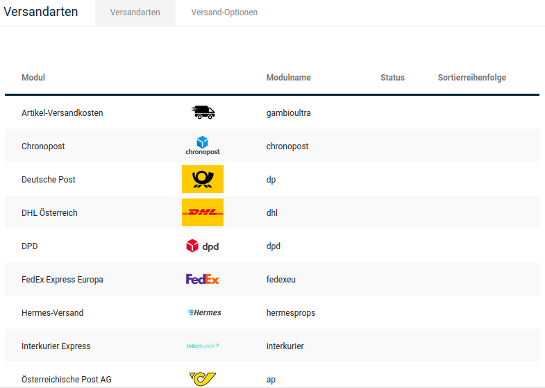
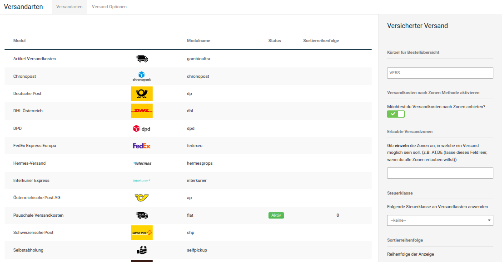
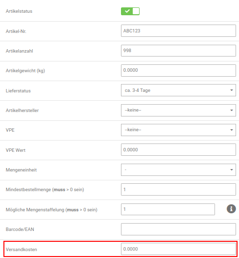

# Versandarten

Im Gambio Admin unter _**Module \> Versandarten**_ stehen dir verschiedene Module zur Verfügung, mit denen du deine Versandkosten konfigurieren kannst.

!!! note "Hinweis" 
	 Bitte beachte, dass die bei den Modulen für bestimmte Versanddienstleister hinterlegten Versandkosten unter Umständen nicht aktuell sind, da diese nur als Beispiel dienen.

## Gewichtbasiert {#versandarten_gewichtbasiert}

Im Grundumfang des Systems stehen hauptsächlich Versandarten zur Verfügung, über die die Versandkosten anhand des Gesamtgewichts der Bestellung ermittelt werden. Einige Versandarten bieten mehrere Zonen für die Versandkosten-Staffelung an, sodass die Versandkosten für unterschiedliche Lieferzonen konfiguriert werden können.

Die Versandkosten werden im Feld _**Versandkosten**_, beziehungsweise bei Versand nach Zonen im Feld _**Zone \[x\] Versandkosten**_ kommagetrennt und ohne Leerzeichen im Format _**Gewicht\_bis:Versandkosten**_ hinterlegt. Die nachfolgende Übersicht enthält Feldnamen und Beschreibungen, die für alle gewichtbasierten Module gelten.

|Feldname|Beschreibung|
|--------|------------|
|Versandkosten \[…\] Methode aktivieren|Wenn aktiviert wird das Modul bei der Wahl der Versandart angeboten|
|Erlaubte Versandzonen|Wenn verwendet, wird das Modul bei der Wahl der Versandart nur für die Zonen angeboten, die kommagetrennt hinterlegt sind|
|Steuerklasse|Die Steuerklasse, nach der die Versandkosten versteuert werden sollen|
|Sortierreihenfolge|Anzeigereihenfolge bei der Wahl der Versandart|
|Zone \[1,...,n\] Länder|Kommagetrennte Liste der zweistelligen ISO Codes der Länder aus der Zone \[1,...,n\]|
|Zone \[1,...,n\] Versandkosten|Kommagetrennte Liste der Versandkosten für Zone \[1,...,n\] im Format _**GewichtBis:Kosten**_ \(Beispiel: 4:2.5 =\> 2.50 EUR bis 4 kg\)|
|Zone \[1,...,n\] Handling Gebühren|Handlinggebühren für den Versand in die Zone \[1,...,n\]|

!!! note "Hinweis" 
	 Gewichtbasierte Versandmodule, die für bestimmte Transportunternehmen entwickelt wurden, enthalten spezielle Felder, die nur für dieses Unternehmen relevant sind. Informationen zu der Bedeutung der einzelnen Felder kannst du dem Angebot des Transportunternehmens entnehmen.

### Beispielhafte Konfiguration eines gewichtbasierten Moduls {#versandarten_gewichtbasiert_beispielhafte_konfiguration}

!!! note "Hinweis" 
	 Alle aufgelisteten Versandkosten und Gewichtsangaben sind rein fiktiv und werden nur für dieses Beispiel verwendet.

In diesem Beispiel gehen wir davon aus, du möchtest Waren in mehrere Länder versenden und die Kosten richten sich nach dem Versandgewicht. Zudem bestehen für verschiedene Länder verschiedene Versandkosten.

Hier bietet sich ein zonenbasiertes Modul an, wie etwa _**Unversicherter Versand \(zones\)**_. Gehe im Gambio Admin deines Shops unter _**Module \> Versandarten**_ und wähle das Modul _**Unversicherter Versand \(zones\)**_ aus der Liste aus, sodass die zugehörige Zeile blau markiert ist. Klicke auf die Schaltfläche _**Installieren**_, sofern noch nicht geschehen. Nun ist das Modul bereit und kann konfiguriert werden.

Klicke auf _**Bearbeiten**_, um die Einstellungen für das Modul vorzunehmen. Wir gehen davon aus, dass neben Deutschland in die Schweiz, nach Österreich und Großbritannien versendet werden soll.

!!! example "Beispiel"

	 |Deutschland:|Österreich:|
	 |------------|-----------|
	 |bis 5 Kilo Gewicht: 3.49 Euro|bis 5 Kilo Gewicht: 4.50 Euro|
	 |bis 10 Kilo Gewicht: 7.55 Euro|bis 10 Kilo Gewicht: 8.50 Euro|
	 |bis 15 Kilo Gewicht: 10.59 Euro| |
	 |alles darüber: 14.50 Euro| |

	 |Großbritannien:|Schweiz:|
	 |---------------|--------|
	 |bis 5 Kilo Gewicht: 7.50 Euro|bis 5 Kilo Gewicht: 4.50 Euro|
	 |bis 10 Kilo Gewicht: 10.50 Euro|bis 10 Kilo Gewicht: 8.50 Euro|
	 |alles darüber: 20.50 Euro| |

Der erste Schritt liegt im Festlegen der Versandzonen. Zuallererst tragen wir die Ländercodes im Feld _**Erlaubte Versandzonen**_ ein:

DE,CH,AT,GB

Damit schränken wir die Nutzung des Moduls ein, sodass der Versand mit diesem Modul nur in diese Länder möglich ist.

!!! danger "Achtung"

	 Bitte stelle sicher, dass alle Länder, in die du versenden möchtest, unter _**Einstellungen / Sprachen, Länder, Steuern / Länder**_, nach Aufrufen der Seite, aktiviert sind.

Dann folgt das Verteilen der Länder auf die eigentlichen Versandzonen. Da wir für Österreich und die Schweiz identische Versandkosten annehmen, können beide Länder in eine Zone eingetragen werden. Zusammengefasst sieht dies folgendermaßen aus:

!!! example "Beispiel"

	 _**Zone 1 Länder**_

	 DE

	 _**Zone 2 Länder**_

	 CH,AT

	 _**Zone 3 Länder**_

	 GB

Nun können die Versandkosten für jede Zone nach Gewicht gestaffelt werden:

!!! example "Beispiel"

	 _**Zone 1 Versandkosten**_

	 5:3.49,10:7.55,15:10.59,999999:14.5

	 _**Zone 2 Versandkosten**_

	 5:4.5,10:8.5

	 _**Zone 3 Versandkosten**_

	 5:7.5,10:10.5,999999:20.5

In den Zonen 1 und 3 sind als letzte Staffel fiktive Obergrenzen angegeben, um die Vorgabe _**alles darüber**_ abzudecken. Hierbei wird davon ausgegangen, dass 999999 Kilo Gewicht bei keiner Bestellung erreicht wird.

!!! note "Hinweis"

	 Die fiktive Staffelung kann auch verwendet werden, um pauschale Versandkosten für mehrere Zonen zu definieren. Hierbei wird eine Staffel mit dem fiktiven Wert angelegt:

	 999999:5

	 würde für 5 Euro pauschale Versandkosten stehen.

!!! danger "Achtung"

	 Beim Eintragen der Staffelungen dürfen **.** und **,** nicht verwechselt werden. Der Punkt dient als Dezimaltrennzeichen, etwa zwischen Kilo und Gramm oder Euro und Cent. Das Komma wird verwendet, um die einzelnen Staffeln voneinander zu trennen:

	 5**.**5:7**.**49**,**10**.**5:9**.**72

## Kostenbasiert {#versandarten_kostenbasiert}

Neben den gewichtbasierten Versandarten können über das Modul _**Versand nach Preis/Gewicht**_ die Versandkosten anhand des Gesamtwertes des Warenkorbs berechnet werden.

Installiere das Versandmodul _**Versand nach Preis/Gewicht**_. Aktiviere unter _**Versandkosten Methode**_ die Option _**Preis**_. Trage unter _**Versandkosten**_ die Versandkosten kommagetrennt und ohne Leerzeichen im Format _**Warenwert\_bis:Versandkosten**_ ein.

### Beispielhafte Konfiguration des kostenbasierten Versandmoduls {#versandarten_kostenbasiert_beispielhafte_konfiguration}

Beim Modul _**Versandkosten nach Preis/Gewicht \(table\)**_ lässt sich die Staffelung prinzipiell wie im Modul _**Unversicherter Versand \(zones\)**_ definieren. Allerdings besteht hier die Wahlmöglichkeit, zwischen Staffelung nach Gewicht \(wie im vorherigen Kapitel beschrieben\) und Preis. Zudem gibt es in diesem Modul nicht die Aufteilung in verschiedene Zonen, die eingetragene Staffelung gilt für alle Länder unter _**Erlaubte Versandzonen**_. Trage hier die Ländercodes aller Länder ein, für die diese Versandart zur Verfügung stehen soll. Wir gehen in diesem Beispiel von Versandkosten nach Bestellwert aus.

Wähle unter _**Versandkosten Methode**_ die Einstellung _**Preis**_, nun wird für die Staffelung statt des Gewichtes der Bestellwert in der eingestellten Währung \(beispielsweise Euro\) verwendet. Nehmen wir an, du möchtest bis 50 Euro Bestellwert 3.50 Euro Versandkosten berechnen. Bis 75 Euro sollen 5.66 Euro berechnet werden und ab 125 Euro 7.99 Euro. Verwende hierzu folgende Staffelung:

50:3.5,75:5.66,125:7.99

!!! note "Hinweis" 
	 Die eingetragene Staffelung kann eins zu eins für Gewichte übernommen werden, ändere hierzu die _**Versandkosten Methode**_ von _**Preis**_ nach _**Gewicht**_. Statt der eingestellten Währung wird nun das Versandgewicht verwendet.
	 
## Versandkostenfrei {#versandarten_versandkostenfrei}

Für kostenfreie Lieferungen stehen dir zwei Methoden zur Verfügung:

### Versandart Versandkostenfrei {#versandarten_versandkostenfrei_versandart}

Unter _**Module \> Versandarten**_ findest du das Modul _**Versandkostenfrei**_. In dieses trägst du den gewünschten Mindestbestellwert ein. Bis zum Erreichen des Mindestbestellwerts gibt das Versandmodul eine Meldung aus, dass der Versand ab dem konfigurierten Betrag kostenfrei erfolgt. Der Kunde kann nach Erreichen des Mindestbestellwerts zwischen normalem Versand und kostenlosem Versand wählen.

### Zusammenfassung-Modul Versandkosten {#versandarten_versandkostenfrei_zusammenfassungsmodul}

Unter _**Module \> Zusammenfassung**_ findest du das Modul _**Versandkosten**_. Bearbeite die Konfiguration dieses Moduls und aktiviere die Option _**Versandkostenfrei erlauben**_. Trage in das Feld _**Versandkostenfrei für Bestellungen ab**_ den gewünschten Mindestbestellwert für kostenfreie Sendungen ein und bestimme unter _**Versandkostenfrei nach Zonen**_ die Zonen, für die der kostenfreie Versand berücksichtigt werden soll. Anders als das Versandkostenmodul blendet diese Funktion bei Erreichen des konfigurierten Mindestbestellwerts alle anderen Versandarten bis auf Selbstabholung aus und informiert den Kunden, dass die Bestellung versandkostenfrei verschickt wird. Vor Erreichen des Schwellenwertes wird der Kunde bei dieser Methode nicht über den Schwellenwert informiert.

Wenn du für das In- und Ausland jeweils einen unterschiedlichen Schwellenwert für kostenlose Lieferungen anbieten möchtest, kannst du beide Module kombinieren.

## Weitere {#versandarten_weitere}

Neben den gewicht- und kostenbasierten Versandarten stehen weitere Versandarten mit Sonderfunktionen zur Verfügung.

### Artikel-Versandkosten {#versandarten_weitere_artikel_versandkosten}

Im Artikel-Versandkosten-Modul werden die grundsätzlichen Versandkosten gewichtbasiert nach Zonen berechnet. Zusätzlich zu den gewichtbasierten Versandkosten werden die in der Artikel-Eingabemaske hinterlegten Versandkosten aus den Artikeln des Warenkorbs berechnet. Die Versandkosten werden dabei nicht je Position, sondern je Artikel berechnet.

!!! note "Hinweis" 
	 Die Artikel-Versandkosten sollten nicht gemeinsam mit dem Zusammenfassungs-Modul _**Versandkostenzuschlag**_ verwendet werden. Beide Module arbeiten mit dem _**Versandkosten**_- Feld der Artikel-Eingabemaske, die zusätzlichen Versandkosten werden bei gleichzeitiger Verwendung doppelt berechnet.

!!! danger "Achtung"

	 Bei der Verwendung des Moduls Artikelversandkosten sollte in jedem Fall eine Staffelung eingetragen werden. Anderenfalls kann es im Bestellvorgang zu einer Fehlermeldung kommen und das Modul ist nicht verfügbar.

	 Hierzu kann eine fiktive Staffelung verwendet werden, die die Versandkosten nicht verändert, z.B.

	 9999999:0

#### Beispielhafte Konfiguration des Artikel-Versandkosten-Moduls {#versandarten_weitere_artikel_versandkosten_beispielhafte_konfiguration}

Wir gehen in unserem Beispiel davon aus dass für alle Artikel abweichende Versandkosten pro Stück verwendet werden sollen. Dabei soll berücksichtigt werden, dass für den gesamten Versand bis 31 Kilo Gewicht jedoch mindestens 5 Euro Versandkosten berechnet werden sollen. Dies gilt für alle Versandländer, diese sind in _**Zone 1 Länder**_ eingetragen.

Nehmen wir der Einfachheit halber an, du hast 3 Artikel: _**Apfelkuchen**_, _**Buchstabensuppe**_ und _**Citrusfrüchte**_. Für _**Apfelkuchen**_ sollen pro Exemplar 2.50 Euro Versand berechnet werden, für _**Buchstabensuppe**_ 3.50 Euro und _**Citrusfrüchte**_ 4.50 Euro. Diese Versandkosten wurden in den Artikeln \(_**Artikel \> Artikel / Kategorien**_, Schaltfläche _**Bearbeiten**_\) hinterlegt.

Um den Mindestversand zu gewährleisten, legen wir für _**Zone 1 Versandkosten**_ mit folgender Staffelung pauschale Versandkosten bis 31 Kilo fest:

31:2.5

Die Versandkosten pro Exemplar der verschiedenen Artikel und der eingetragenen Staffelung im Modul werden addiert. Als Beispiel folgende Bestellung:

!!! example "Beispiel"

	 |Artikel|Anzahl|Einzelversand|Gesamtversand|
	 |-------|------|-------------|-------------|
	 |Apfelkuchen|2|2.50 Euro|5.00 Euro|
	 |Buchstabensuppe|3|3.50 Euro|10.50 Euro|
	 |Citrusfrüchte|1|4.50 Euro|4.50 Euro|
	 |Versand bis 31 kg| | |2.50 Euro|
	 |**Summe**| | |22.50 Euro|

### Pauschale Versandkosten {#versandarten_weitere_pauschale_versandkosten}

Bei der Versandart _**Pauschale Versandkosten**_ wird bei jeder Bestellung eine Versandkostenpauschale berechnet. Die Pauschale ist unabhängig vom Bestellgewicht, der Anzahl der Artikel und dem Warenwert.

### Versandkosten pro Stück {#versandarten_weitere_versandkosten_pro_stueck}

Mit der Versandart _**Versandkosten pro Stück**_ wird ein pauschaler Versandkostenwert für jeden Artikel berechnet, der im Warenkorb liegt.

## Liste der Versandarten {#versandarten_liste_der_versandarten}

|Versandart \(Modulname\)|Typ|
|------------------------|---|
|Artikel-Versandkosten \(gambioultra\)|gewichtbasiert, Zonen, weitere|
|Chronopost Zone Rates \(chronopost\)|gewichtbasiert, Zonen|
|Deutsche Post \(dp\)|gewichtbasiert, Zonen|
|DHL Österreich \(dhl\)|gewichtbasiert, Zonen|
|DPD \(dpd\)|gewichtbasiert, Zonen|
|FedEx Express Europa \(fedexeu\)|gewichtbasiert, Zonen|
|Interkurier Express \(interkurier\)|gewichtbasiert, Zonen|
|Österreichische Post AG \(ap\)|gewichtbasiert, Zonen|
|Pauschale Versandkosten \(flat\)|weitere|
|Schweizerische Post \(chp\)|gewichtbasiert, Zonen|
|Selbstabholung \(selfpickup\)|weitere|
|United Parcel Service Express \(upse\)|gewichtbasiert, Zonen|
|United Parcel Service Standard \(ups\)|gewichtbasiert, Zonen|
|Unversicherter Versand \(zones\)|gewichtbasiert, Zonen|
|Versandkosten nach Preis/Gewicht \(table\)|gewichtbasiert, kostenbasiert|
|Versandkosten pro Stück \(item\)|weitere|
|Versandkostenfrei \(freeamount\)|versandkostenfrei|
|Versicherter Versand \(zonese\)|gewichtbasiert, Zonen|
