# Zahlungsweisen

Im Gambio Admin deines Shops unter Module \> Zahlungsweisen stehen dir verschiedene Zahlungsweisen und Schnittstellenmodule für Zahlungsdienstleister zur Verfügung.

Der Bereich _**Zahlungsweisen**_ teilt sich in das_** Gambio Payment Hub**_ und _**Sonstige**_ auf. Unter _**Gambio Payment Hub**_ werden die Hub-basierten Zahlungsmodule angezeigt, unter _**Sonstige**_ die vom Shop selbst bereitgestellten Module.

!!! note "Hinweis"
	 Für die Schnittstellenmodule der Zahlungsdienstleister benötigst du ein Konto beim jeweiligen Zahlungsdienstleister.

## Gambio Payment Hub

Das _**Gambio Payment Hub**_ stellt verschiedene Zahlungsweisen über eine shopeigene Schnittstelle zu einem Server zur Verfügung. Die Zahlungsmodule werden hierbei an zentraler Stelle bereitgestellt und gepflegt. Auf diese Weise können immer die aktuellsten Module verwendet werden, ohne dass der Shop selbst upgedatet werden muss.

### Hub Anmeldung

Für die Nutzung des Gambio Payment Hubs muss der Shop am Hub angemeldet werden. Die Anmeldung kannst du im _**Gambio Admin**_ unter _**Gambio Hub \> Account**_ vornehmen.

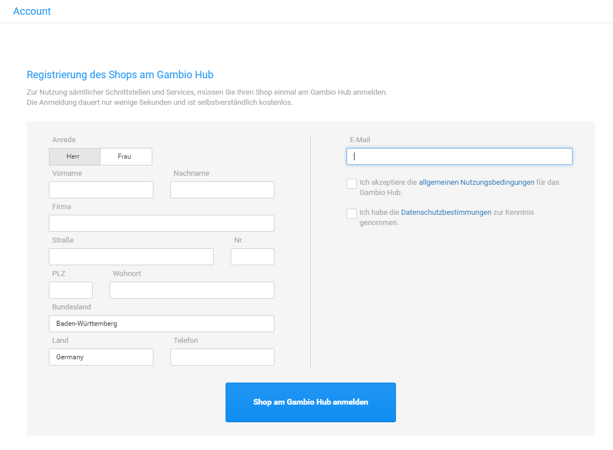

### Installieren und Einrichten von Modulen

Um eine Zahlungsweise zu verwenden, bewege den Mauszeiger in die jeweilige Zeile und klicke auf den Button _**Installieren**_. Das Modul wird installiert und du gelangst direkt in die Einrichtungsmaske des jeweiligen Moduls. Aus der Übersicht heraus kann diese mit einem Klick auf das Bleistift-Symbol aufgerufen werden.

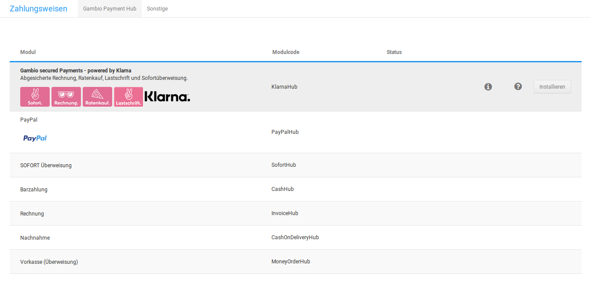

!!! note "Hinweis" 
	 Wenn noch keine Anmeldung am Gambio Hub vorgenommen worden ist, wird an dieser Stelle die Registrierungseite angezeigt.

### SOFORT Überweisung \(SofortHub\) 

Installiere das Modul _**SOFORT Überweisung**_ um Zahlungen über SOFORT Überweisung im Shop zu ermöglichen.

**_")

**_")

Es stehen die folgenden Einstellungen zur Verfügung:

|Feldname|Beschreibung|
|--------|------------|
|Aktiviert|Haken setzen, um Modul im Bestellvorgang anzuzeigen|
|Kürzel für Bestellübersicht|Kürzel in der Spalte _**Zahlung**_ unter _**Bestellungen \> Bestellungen**_|
|Erlaubte Länder|Bestellung für diese Länder erlauben, Angabe als zweistelliger ISO-Code, durch Komma getrennt \(z.B. DE,AT,CH\)|
|Erlaubte Sprachen|nur in diesen Sprachen kann bestellt werden, durch Komma getrennte Sprachcodes \(z.B. de,en\)|
|Erlaubte Währungen|nur in diesen Währungen kann bestellt werden, durch Komma getrennt \(z.B. EUR,USD\)|
|Erlaubter Bestellwert|Maximaler Bestellwert. Bestellungen über diesem Betrag werden nicht erlaubt.|
|Konfigurationsschlüssel|Konfigurationsschlüssel aus deinen Projekteinstellungen auf _**SOFORT.com**_|
|Bestellstatus festlegen|Bestellungen, die mit diesem Modul getätigt werden, auf diesen Status setzen|
|Bestellstatus festlegen: Geld nicht eingegangen|Bestellungen ohne Geldeingang auf diesen Status setzen|
|Bestellstatus festlegen: schwebende Zahlung|Bestellungen mit schwebendem Zahlstatus auf diesen Status setzen|
|Bestellstatus festlegen: Zahlung eingegangen|Bestellungen bei Geldeingang auf diesen Status setzen|
|Bestellstatus festlegen: Rückzahlung erfolgt|Bestellungen bei Rückzahlung auf diesen Status setzen|
|Bestellstatus festlegen: nicht nachverfolgbar|Bestellungen auf diesen Status setzen wenn der Zahlungsverlauf nicht verfolgt werden kann \(mangels Händlerkonto bei der Deutschen Handelsbank\).|
|Verwendungszweck 1|Inhalt der ersten Zeile des Verwendungszwecks|
|Verwendungszweck 2|Inhalt der zweiten Zeile des Verwendungszwecks der Überweisung. 

!!! note "Mögliche Platzhalter für _**Verwendungszweck 2**_:"
	 - \{\{order\_id\}\}
	 - \{\{order\_date\}\}
	 - \{\{customer\_id\}\}
	 - \{\{customer\_name\}\}
	 - \{\{customer\_company\}\}
	 - \{\{transaction\_id\}\}

|Feldname|Beschreibung|
|--------|------------|
|Käuferschutz aktiviert|veraltete Funktion, muss deaktiviert sein|

!!! danger "Achtung"

	 Der SOFORT Überweisung _**Käuferschutz**_ steht seitens SOFORT nicht mehr zur Verfügung. Der Haken **darf nicht gesetzt sein**, sonst kommt es zu Fehlern in der Kommunikation mit SOFORT.

	 Die Einstellung wird in einer kommenden Version entfernt.

Bestätige vorgenommene Einstellungen mit einem Klick auf _**Speichern**_. Über _**Zurück**_ kannst du die Einrichtungsmaske verlassen ohne die Änderungen zu übernehmen. Über _**Deinstallieren**_ kannst du die Zahlungsweise deinstallieren.

!!! note "Hinweis" 
	 Wenn du eine Zahlungsweise nicht mehr anbieten möchtest, kann diese auch durch Entfernen des Hakens _**Aktiviert**_ aus dem Bestellvorgang entfernt werden.
	 
### Barzahlung \(CashHub\)

Installiere das Modul _**Barzahlung**_ um Barzahlungen bei Selbstabholung im Shop zu ermöglichen.

**_")

Es stehen die folgenden Einstellungen zur Verfügung:

|Feldname|Beschreibung|
|--------|------------|
|Aktiviert|Haken setzen, um Modul im Bestellvorgang anzuzeigen|
|Kürzel für Bestellübersicht|Kürzel in der Spalte _**Zahlung**_ unter _**Bestellungen \> Bestellungen**_|
|Erlaubte Länder|Bestellung für diese Länder erlauben, Angabe als zweistelliger ISO-Code, durch Komma getrennt \(z.B. DE,AT,CH\)|
|Erlaubte Sprachen|nur in diesen Sprachen kann bestellt werden, durch Komma getrennte Sprachcodes \(z.B. de,en\)|
|Erlaubte Währungen|nur in diesen Währungen kann bestellt werden, durch Komma getrennt \(z.B. EUR,USD\)|
|Erlaubter Bestellwert|Erlaubter Bestellwert|
|Bestellstatus festlegen|Bestellungen, die mit diesem Modul getätigt werden, auf diesen Status setzen|

Bestätige vorgenommene Einstellungen mit einem Klick auf _**Speichern**_. Über _**Zurück**_ kannst du die Einrichtungsmaske verlassen ohne die Änderungen zu übernehmen. Über _**Deinstallieren**_ kannst du die Zahlungsweise deinstallieren.

!!! danger "Achtung"

	 Die Zahlungsweise steht im Bestellvorgang nur zur Verfügung, wenn _**Selbstabholung**_ als Versandart installiert und vom Kunden ausgewählt worden ist.

!!! note "Hinweis" 
	 Wenn du eine Zahlungsweise nicht mehr anbieten möchtest, kann diese auch durch Entfernen des Hakens _**Aktiviert**_ aus dem Bestellvorgang entfernt werden.
	 
### Rechnung \(InvoiceHub\)

Installiere das Modul _**Rechnung**_ um Zahlungen per Rechnung im Shop zu ermöglichen.

**_")

Es stehen die folgenden Einstellungen zur Verfügung:

|Feldname|Beschreibung|
|--------|------------|
|Aktiviert|Haken setzen, um Modul im Bestellvorgang anzuzeigen|
|Kürzel für Bestellübersicht|Kürzel in der Spalte _**Zahlung**_ unter _**Bestellungen \> Bestellungen**_|
|Erlaubte Länder|Bestellung für diese Länder erlauben, Angabe als zweistelliger ISO-Code, durch Komma getrennt \(z.B. DE,AT,CH\)|
|Erlaubte Sprachen|nur in diesen Sprachen kann bestellt werden, durch Komma getrennte Sprachcodes \(z.B. de,en\)|
|Erlaubte Währungen|nur in diesen Währungen kann bestellt werden, durch Komma getrennt \(z.B. EUR,USD\)|
|Erlaubter Bestellwert|Erlaubter Bestellwert|
|Bestellstatus festlegen|Bestellungen, die mit diesem Modul getätigt werden, auf diesen Status setzen|

Bestätige vorgenommene Einstellungen mit einem Klick auf _**Speichern**_. Über _**Zurück**_ kannst du die Einrichtungsmaske verlassen ohne die Änderungen zu übernehmen. Über _**Deinstallieren**_ kannst du die Zahlungsweise deinstallieren.

!!! note "Hinweis" 
	 Wenn du eine Zahlungsweise nicht mehr anbieten möchtest, kann diese auch durch Entfernen des Hakens _**Aktiviert**_ aus dem Bestellvorgang entfernt werden.
	 
### Nachnahme \(CashOnDeliveryHub\)

Installiere das Modul _**Nachnahme**_ um Zahlungen per Nachnahme im Shop zu ermöglichen.

**_")

Es stehen die folgenden Einstellungen zur Verfügung:

|Feldname|Beschreibung|
|--------|------------|
|Aktiviert|Haken setzen, um Modul im Bestellvorgang anzuzeigen|
|Kürzel für Bestellübersicht|Kürzel in der Spalte _**Zahlung**_ unter _**Bestellungen \> Bestellungen**_|
|Erlaubte Länder|Bestellung für diese Länder erlauben, Angabe als zweistelliger ISO-Code, durch Komma getrennt \(z.B. DE,AT,CH\)|
|Erlaubte Sprachen|nur in diesen Sprachen kann bestellt werden, durch Komma getrennte Sprachcodes \(z.B. de,en\)|
|Erlaubte Währungen|nur in diesen Währungen kann bestellt werden, durch Komma getrennt \(z.B. EUR,USD\)|
|Erlaubter Bestellwert|Erlaubter Bestellwert|
|Bestellstatus festlegen|Bestellungen, die mit diesem Modul getätigt werden, auf diesen Status setzen|

Bestätige vorgenommene Einstellungen mit einem Klick auf _**Speichern**_. Über _**Zurück**_ kannst du die Einrichtungsmaske verlassen ohne die Änderungen zu übernehmen. Über _**Deinstallieren**_ kannst du die Zahlungsweise deinstallieren.

!!! note "Hinweis" 
	 Wenn du eine Zahlungsweise nicht mehr anbieten möchtest, kann diese auch durch Entfernen des Hakens _**Aktiviert**_ aus dem Bestellvorgang entfernt werden.
	 
### Vorkasse \(Überweisung\) \(MoneyOrderHub\) 

Installiere das Modul _**Vorkasse \(Überweisung\)**_ um Zahlungen per Vorkasse im Shop zu ermöglichen.

      (MoneyOrderHub)**_")

Es stehen die folgenden Einstellungen zur Verfügung:

|Feldname|Beschreibung|
|--------|------------|
|Aktiviert|Haken setzen, um Modul im Bestellvorgang anzuzeigen|
|Zahlungsabgleich mit GiroConnect|Haken setzen, um den Zahlungsabgleich mit GiroConnect zu aktivieren|
|Kürzel für Bestellübersicht|Kürzel in der Spalte _**Zahlung**_ unter _**Bestellungen \> Bestellungen**_|
|Erlaubte Länder|Bestellung für diese Länder erlauben, Angabe als zweistelliger ISO-Code, durch Komma getrennt \(z.B. DE,AT,CH\)|
|Erlaubte Sprachen|nur in diesen Sprachen kann bestellt werden, durch Komma getrennte Sprachcodes \(z.B. de,en\)|
|Erlaubte Währungen|nur in diesen Währungen kann bestellt werden, durch Komma getrennt \(z.B. EUR,USD\)|
|Erlaubter Bestellwert|Erlaubter Bestellwert|
|Bestellstatus festlegen|Bestellungen, die mit diesem Modul getätigt werden, auf diesen Status setzen|
|Zahlbar an|An wen sollen Zahlungen erfolgen?|

Bestätige vorgenommene Einstellungen mit einem Klick auf _**Speichern**_. Über _**Zurück**_ kannst du die Einrichtungsmaske verlassen ohne die Änderungen zu übernehmen. Über _**Deinstallieren**_ kannst du die Zahlungsweise deinstallieren.

!!! note "Hinweis"
	 Wenn du eine Zahlungsweise nicht mehr anbieten möchtest, kann diese auch durch Entfernen des Hakens _**Aktiviert**_ aus dem Bestellvorgang entfernt werden.
	 
### GiroConnect

#### Einleitung

_**GiroConnect**_ ist eine Erweiterung für das _**Vorkasse**_-Modul \(MoneyOrderHub\). Mit GiroConnect können über das Vorkasse-Modul eingegangene Bestellungen automatisch anhand von Summe, Name und Bestellnummer mit den entsprechenden Geldeingängen auf dem Bankkonto abgeglichen und der Bestellstatus automatisch geändert werden.

#### Installation 

GiroConnect wird über die Module _**Vorkasse \(MoneyOrderHub\)**_ und _**Rechnung \(InvoiceHub\)**_ des Gambio Payment Hubs aktiviert. Die Module können im Gambio Admin unter _**Module \> Zahlungsweisen**_ im Reiter _**Gambio Payment Hub**_ installiert werden. Bitte beachte, dass GiroConnect nur in Shops mit aktuellem Hub-Connector zur Verfügung steht. Der Hub-Connector kann unter _**Toolbox \> AutoUpdater**_ bzw. den Menüpunkt _**Gambio Store**_ im Gambio Admin aktualisiert werden.

Klicke auf die Schaltfläche _**Installieren**_, um die Installation des Moduls vorzunehmen.

#### Anmeldung und Konfiguration

Nach der Aktivierung von GiroConnect kann das Anmeldeverfahren begonnen werden.

##### Ihre Daten

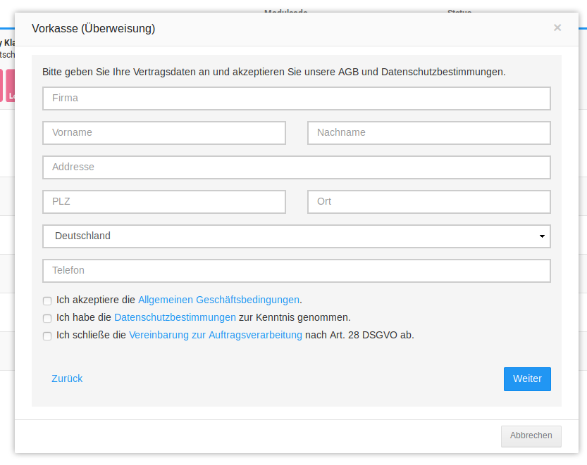

Zuerst werden die Adressdaten des Shopbetreibers abgefragt. Fülle die Felder aus wie angegeben und setze jeweils die Haken in die drei Boxen am unteren Ende des Formulars, um die jeweilige Angabe zu bestätigen. Über einen Klick auf den blauen Link kannst du das zugehörige Dokument anzeigen lassen.

Bestätige mit Klick auf _**Weiter**_. Über _**Abbrechen**_ kannst du den Anmeldevorgang wieder verlassen. Mit _**Zurück**_ gelangst du jeweils zum vorherigen Schritt.

##### Shop

Nun muss der Login des Administratorkontos des Gambio Shops angegeben werden. Diese Daten werden benötigt, damit der GiroConnect-Service die Bestelldaten des Shops auslesen und den Bestellstatus aktualisieren kann. Gib die für das Admin-Konto verwendete E-Mail-Adresse und das zugehörige Passwort ein, bevor du über _**Weiter**_ bestätigst.

##### Bank

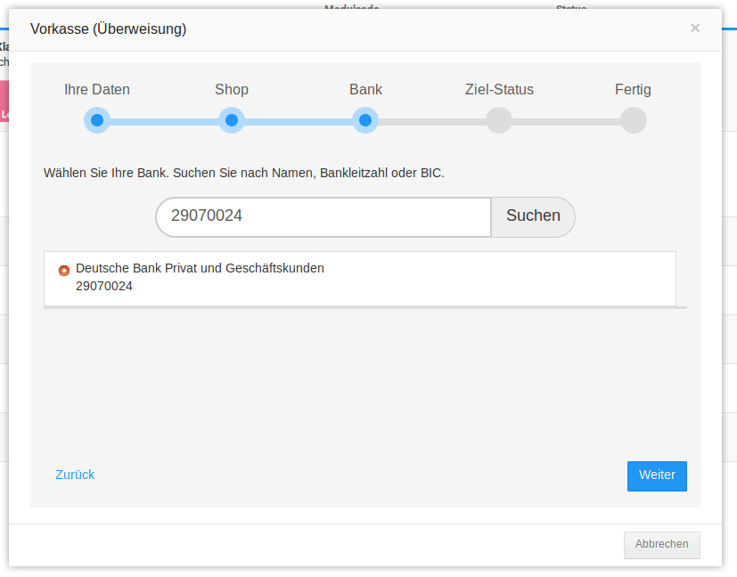

In diesem Reiter kann die Bank ausgewählt werden. Es kann nach _**Name**_, _**Bankleitzahl**_ oder _**BIC**_ gesucht werden. Die Bank wird dann unter dem Suchfeld aufgeführt.

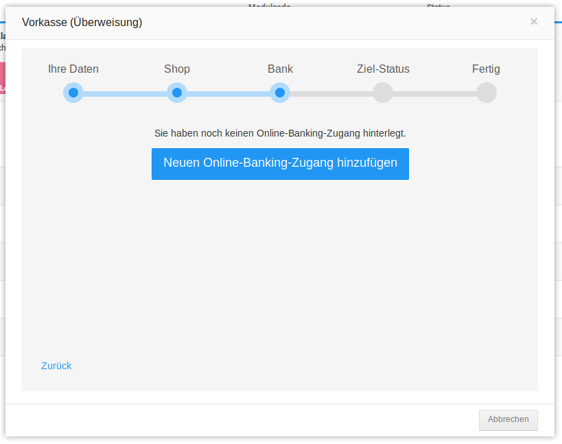

Anschließend erfolgt das Hinterlegen des Bankkontos. Klicke zuerst auf _**Neuen Online-Banking-Zugang**_ hinzufügen und dann auf _**Formular öffnen**_.

Es öffnet sich ein neues Fenster, über das die Bankdaten abgerufen werden können. Im ersten Schritt werden die Nutzungsbedingungen akzeptiert.

Trage anschließend die Zugangsdaten ein, die sich je nach Bank in ihrer Art \(Kontonummer/Benutzer\) unterscheiden können.

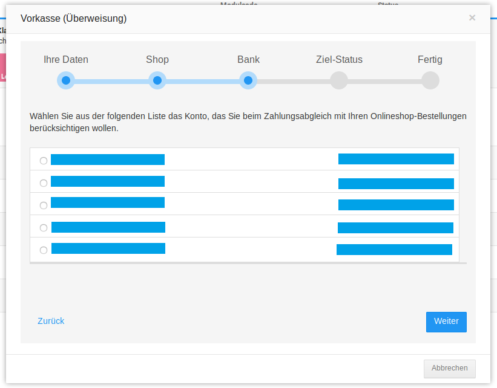

Das Fenster schließt sich wieder und du gelangst zurück zum Anmeldefenster, in dem die erfolgreiche Eingabe der Bankverbindung bestätigt wird. Mit Klick auf _**Weiter**_ kommst du zur Auswahl des Kontos.

##### Ziel-Status

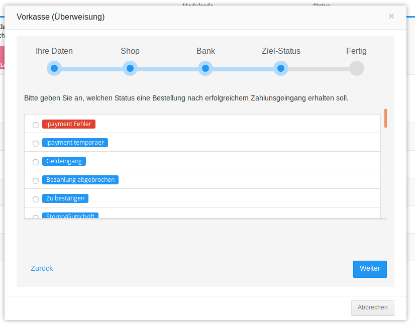

Über den Bereich Ziel-Status wird festgelegt, welcher Bestellstatus gesetzt werden soll, wenn eine Zahlung eingegangen ist. Es kann jeder im Shop verfügbare Bestellstatus ausgewählt werden. Bei Bedarf kannst du auch im Vorfeld einen eigenen Status hierfür anlegen.

##### Abschluss

Nach Abschluss der Konfiguration werden die Zahlungsmodule _**Vorkasse \(Überweisung\)**_ und _**Rechnung**_ mit dem Icon für _**GiroConnect**_ versehen.

Im Menü _**Bestellungen**_ des Gambio Admin steht nun der Eintrag _**Zahlungsabgleich**_ zur Verfügung.

#### Zahlungsabgleich

Bei Aufruf des Menüpunkts _**Bestellungen \> Zahlungsabgleich**_ werden zuerst die Daten aktualisiert, unter Umständen wird erneut PIN/Kennwort zum hinterlegten Bankkonto abgefragt. Liegen noch keine Zahlungen und Vorkasse-Bestellungen vor, enthält die Seite nur Hilfetexte.

Linke Seite

-   Auf der linken Seite werden alle Bestellungen aufgelistet, die mit GiroConnect getätigt wurden und die noch unbezahlt sind.
-   Zugeordnete Zahlungen werden in den Bestellungen angezeigt. Grüne Zahlungseingänge sind fest zugeordnet; orangene sind lediglich Zuordnungsmöglichkeiten und können mehrere pro Bestellung sein.
-   Zuordnungsvorschläge werden automatisiert nach dem Datenabruf gemacht. Bewege Zahlungseingänge von der rechten Seite per Drag&Drop auf die Bestellungen, um sie manuell zuzuordnen.
-   Klicke auf das X in einer Bestellung, um sie zu löschen. Mit Klick auf das X bei zugeordneten Zahlungseingängen kannst du die Zuordnung lösen.
-   Mit "Bestellungen aktualisieren" änderst du den Status von zugeordneten Bestellungen ab. Es werden nur Bestellungen berücksichtigt, in denen das Häkchen gesetzt wurde. Die Bestellungen gelten dann als erledigt und werden an dieser Stelle nicht mehr aufgeführt.

Rechte Seite

-   Auf der rechten Seite werden dir Zahlungseingänge angezeigt, die noch nicht automatisch fest zugeordnet werden konnten.
-   Bewege Zahlungseingänge per Drag&Drop auf eine passende Bestellung um sie zuzuordnen.
-   Klicke auf das X, um einen Zahlungseingang zu löschen, wenn dieser für Bestellungen nicht relevant ist.

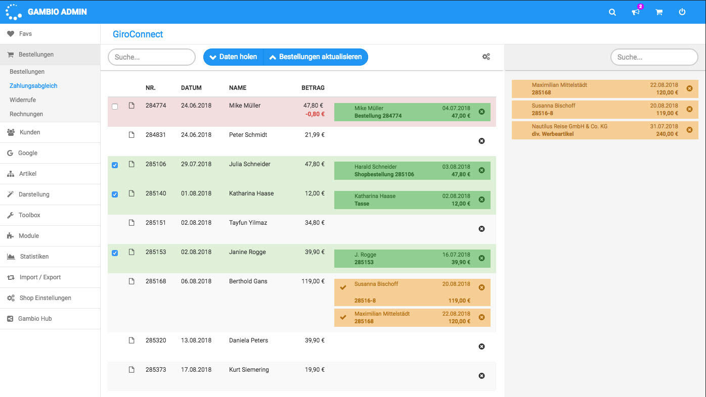

-   Bestellnr. 284774, rot hinterlegt: die Zahlung ist grün hinterlegt, wurde also zugewiesen. Man kann erkennen, dass der Bestellwert 47,80 Euro betrug, aber nur 47 Euro bezahlt wurden. Es liegt daher eine Unterzahlung von 0,80 Euro vor, die dort auch ausgewiesen wird.
-   Bestellnr. 285106, grün hinterlegt: Die Zahlung konnte problemlos zugeordnet werden und stimmt in allen Angaben - Name, Bestellnummer und Summe - mit den Bestelldaten überein.
-   Bestellnr. 285168, orange hinterlegt: Für die Bestellung von Herrn Gans kommen zwei Zahlungen in Frage, bei denen die Bestellnummer und der Betrag nicht identisch sind, aber ähnlich. Der Shopbetreiber kann die richtige Zahlung nun aus der rechten Spalte links auf die Bestellung ziehen, um der Bestellung eine der Zahlungen zuzuordnen.
-   Bestellnr. 285320, nicht farbig hinterlegt: für diese Bestellung gibt es noch keine vorgeschlagenen Zahlungseingänge.

#### Weitere Einstellungen

Ist GiroConnect eingerichtet, findet man dort einen weiteren Tab _**Weitere Einstellungen**_, der wiederrum auf 6 Tabs aufgeteilt ist.

Im Tab _**Shopbetreiber**_ können die Adressdaten nachträglich geändert und ggf. korrigiert werden.

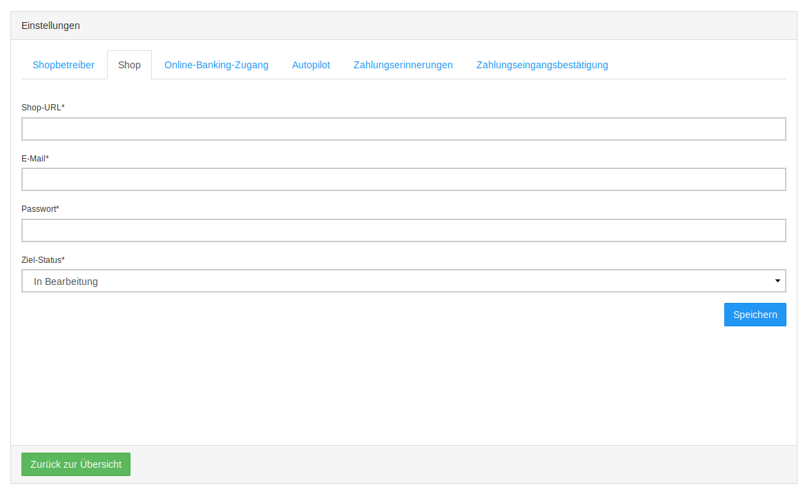

Im Tab _**Shop**_ können die Login-Daten geändert werden, falls ein anderes Administratorkonto für den Abgleich verwendet werden soll. Auch eine Änderung der Shop-URL \(z.B. nach Domainänderungen\) oder des gewünschten Zielstatus bei abgeglichenen Bestellungen ist möglich.

Im Falle einer Kontoänderung können im Tab _**Online-Banking-Zugang**_ die Daten bearbeitet oder PIN und Zugang gelöscht werden.

Der _**Autopilot**_ ist für den automatisierten Zahlungsabgleich zuständig. Die Zahlungen können bei aktiviertem Autopiloten einer Bestellung komplett zugeordnet werden, wenn die Daten für eine eindeutige Zuordnung ausreichen. Dieser Hintergrunddienst ist standardmäßig aus und muss daher erst über den Button _**Hintergrunddienst aktivieren**_ gestartet werden.

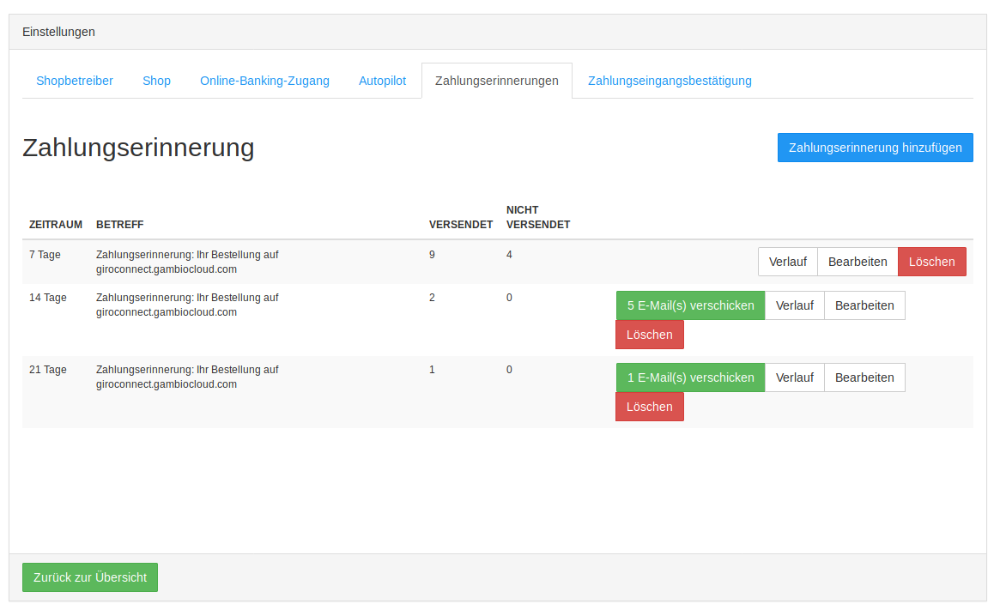

Es können Vorlagen für Zahlungserinnerungen eingerichtet werden, die manuell oder automatisch an säumige Kunden versendet werden können. In dieser Übersicht werden die angelegten Vorlagen aufgeführt und die Anzahl der offenen und versendeten Mails genannt. Auch können über die Schaltfläche _**Zahlungserinnerung hinzufügen**_ weitere Vorlagen angelegt werden.

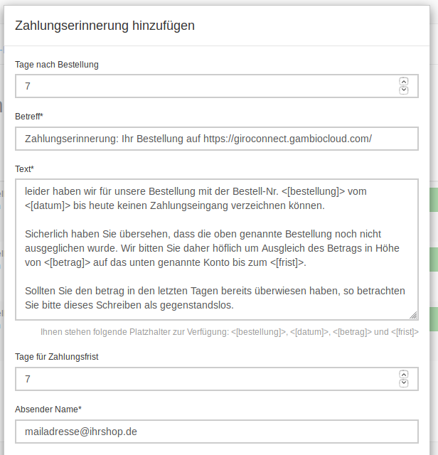

Beim Anlegen oder Ändern einer Vorlage öffnet sich ein neues Fenster, das den Standardtext für Zahlungserinnerungen enthält. Dieser kann beliebig angepasst werden. Zur Verfügung stehen die Platzhalter _**<\[bestellung\]\>**_ \(Bestellnummer\), _**<\[datum\]\>**_ \(Bestelldatum\), _**<\[betrag\]\>**_ \(Zahlbetrag\) und _**<\[frist\]\>**_ \(Zahlungsfrist\). Auch der Betreff kann frei geändert werden. Unter _**Tage für Zahlungsfrist**_ kann eingestellt werden, wieviele Tage nach Bestelleingang eine Mail versendet werden soll. Bei _**Automatisch senden**_ kann ausgewählt werden, ob die Mails automatisch versendet werden sollen. Soll vor dem Versand noch selektiert werden, darf diese Option nicht gewählt sein.

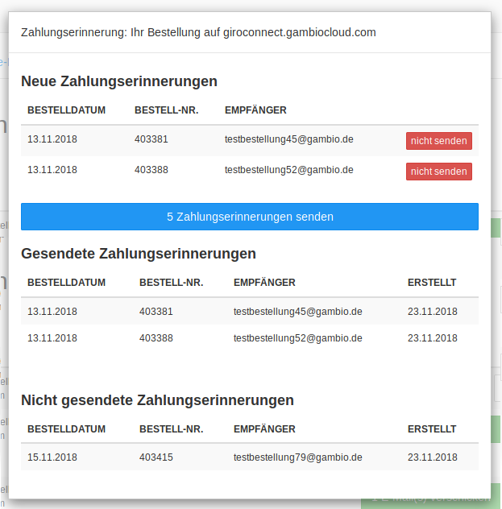

Im Verlauf der Zahlungserinnerungen wird aufgeführt, welche Zahlungserinnerungen noch nicht ausgeführt, welche versendet und welche vom Versand ausgenommen wurden.

Es können automatisch Zahlungseingangsbestätigungen an den Kunden versendet werden. Genau wie bei den Zahlungserinnerungen gibt es eine Übersicht mit der Anzahl der offenen und versandten Mails und es lassen sich die Vorlagen anpassen.

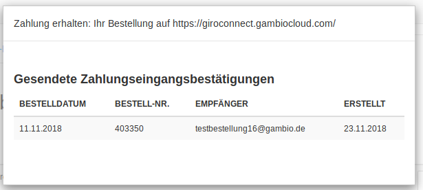

Beil Klick auf _**Verlauf**_ öffnet sich eine Liste der Mails.

### PayPal und PayPal PLUS per Gambio Hub

#### Installation

Die Zahlungsweise kann unter _**Module \> Zahlungsweisen**_ im Reiter Gambio Payment Hub installiert werden. Wähle hierzu den Eintrag _**Mit PayPal die beliebtesten Zahlarten Ihrer Kunden aus einer Hand**_ \(PayPal2Hub\) aus, indem du den Mauszeiger darüber bewegst und klicke auf die Schaltfläche _**Installieren**_. Es öffnet sich der Dialog zur Ersteinrichtung.

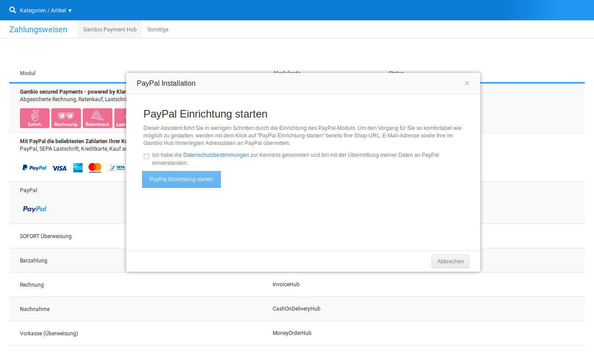

#### Ersteinrichtung

Über den Ersteinrichtungsdialog wird wird der Shop mit deinem PayPal-Konto verknüpft.

Klicke zunächst auf die Schaltfläche _**Jetzt anmelden**_.

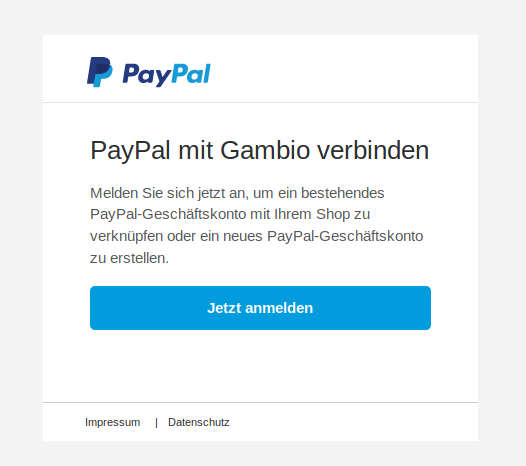

Du gelangst zum Dialog _**Erste Schritte**_. Gebe hier deine E-Mail-Adresse an und wähle das Land aus, in dem der Shop ansässig ist. Je nachdem, ob bereits ein PayPal-Geschäftskonto mit dieser Adresse besteht, wirst du entsprechend weitergeleitet. Wenn du noch kein PayPal-Geschäftskonto besitzt, folge den Schritten im Abschnitt _**Einrichten eines PayPal-Geschäftskontos**_, anderenfalls fahre mit dem Abschnitt _**Anmeldung mit einem bestehenden PayPal-Geschäftskonto**_ fort.

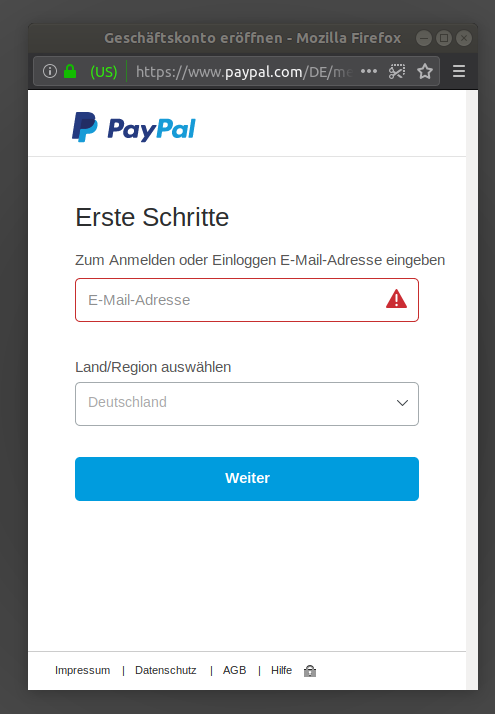

##### Einrichten eines PayPal-Geschäftskontos

!!! note "Hinweis"

	 Die nachfolgenden Schritte sind nur notwendig, wenn du noch kein PayPal-Geschäftskonto besitzt. Fahre ansonsten mit den Schritten unter _**Anmeldung mit einem bestehenden PayPal-Geschäftskonto**_ fort.

Um ein PayPal-Geschäftskonto einzurichten, klicke auf die graue Schaltfläche _**Neu anmelden**_ und fülle die nachfolgenden Felder aus.

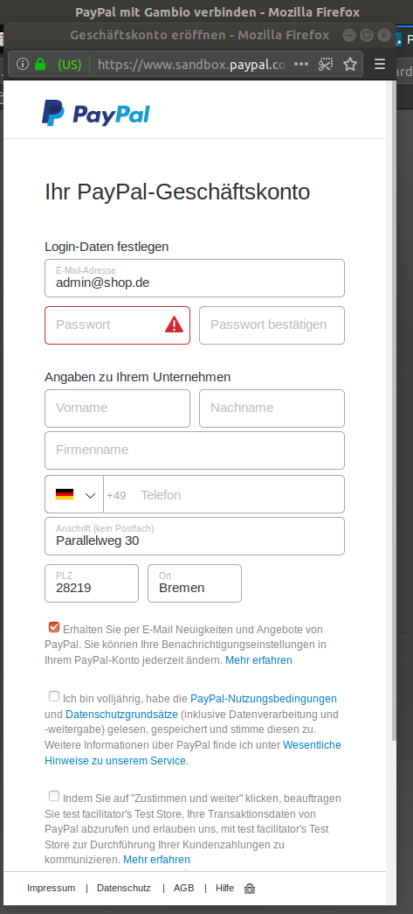

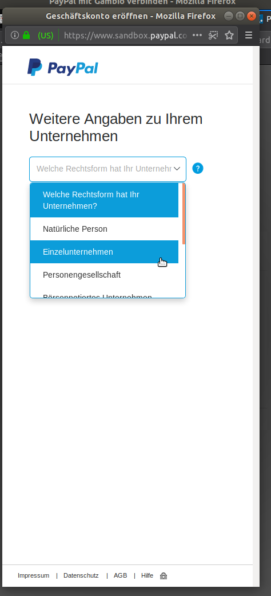

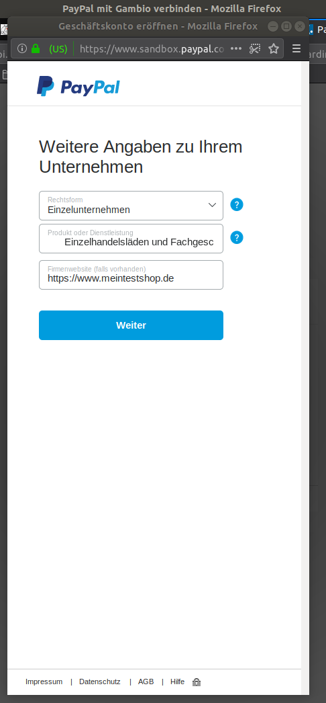

Dies schließt neben Adressdaten auch Details zur Rechtsform deines Unternehmens und der Art des Angebots ein.

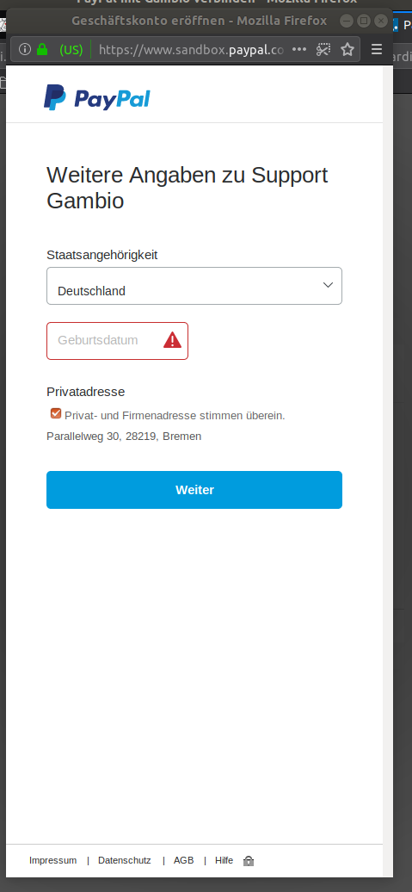

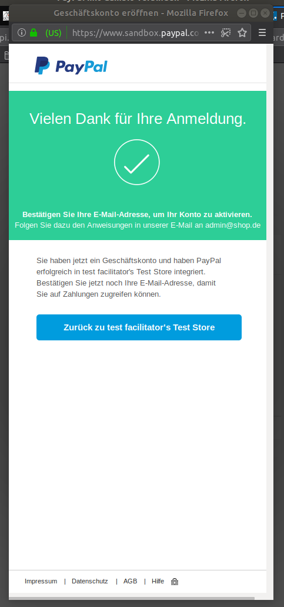

Schließe die Angaben ab und bestätige im letzten Schritt deine E-Mail-Adresse, bevor du über die blaue Schaltfläche in den Shop zurückkehrst.

##### Anmeldung mit einem bestehenden PayPal-Geschäftskonto

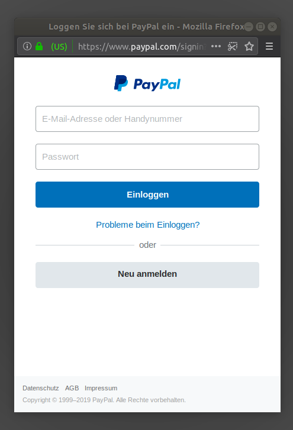

Melde dich anschließend mit deiner E-Mail-Adresse und deinem Passwort bei PayPal an.

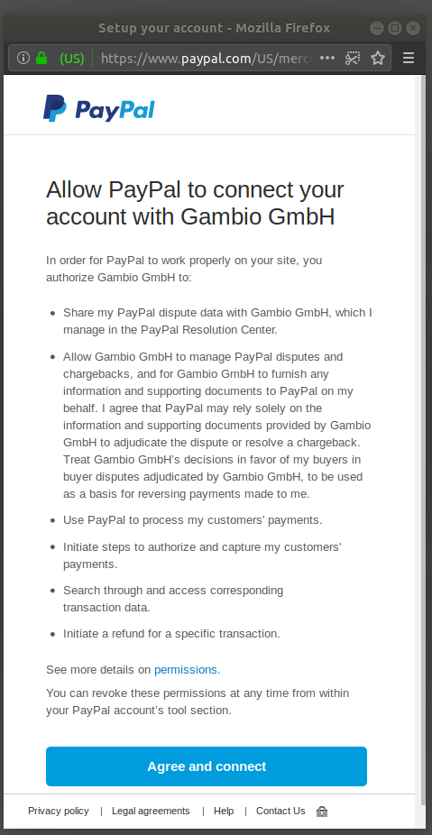

Stimme der Verbindung des Shops mit PayPal zu. Der Button _**Agree and connect**_ ist am unteren Ende der Seite, ggf. musst du nach unten scrollen, um ihn zu sehen.

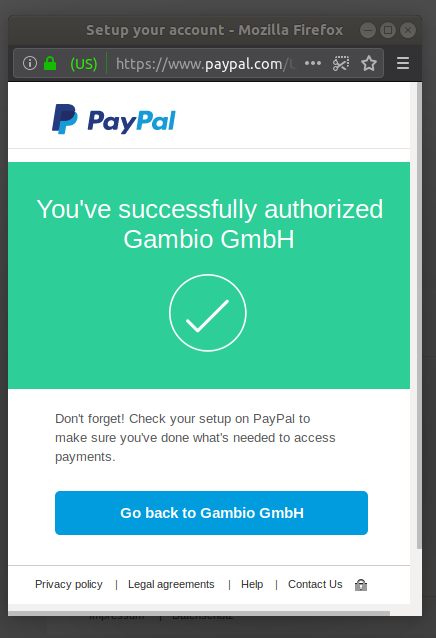

Die erfolgreiche Anmeldung wird mit einer Meldung bestätigt.

Im Gambio Admin wird das Zahlungsmodul nun als installiert angezeigt. Über einen Klick auf das Bleistift-Symbol - welches angezeigt wird, wenn du den Mauszeiger über den Moduleintrag bewegst - kannst du weitere Einstellungen vornehmen.

#### Weitere Einstellungen

##### Allgemeine Einstellungen

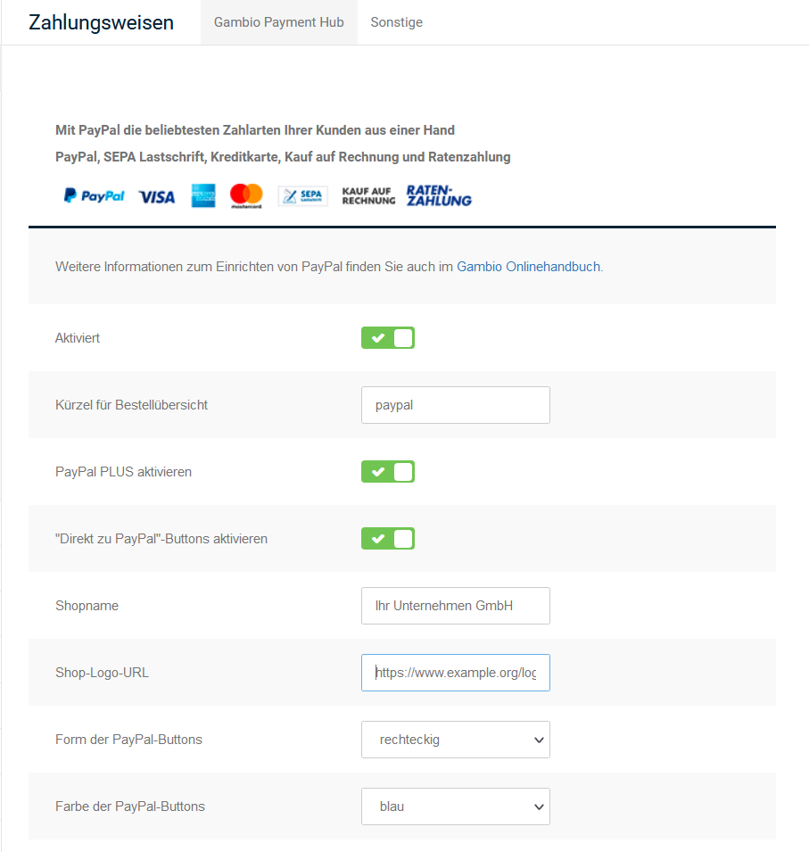

|Feldname|Beschreibung|
|--------|------------|
|Aktiviert|Zeigt an, ob das Zahlungsmodul aktiviert ist|
|Kürzel für Bestellübersicht|Hier kann angegeben werden, wie die Zahlungsweise in der Bestellübersicht genannt werden soll.|
|Paypal PLUS aktivieren|Wenn eine Freischaltung für Paypal PLUS vorliegt, können die PLUS-Zahlungsweisen hierüber aktiviert werden.|
|_**Direkt zu Paypal**_-Buttons aktivieren|Hierüber können die Buttons _**Direkt zu Paypal**_ aktiviert werden. An welchen Stellen diese Buttons angezeigt werden sollen, kann im Expertenmodus näher definiert werden.|
|Shopname|Der Name des Shops, der auf den Paypal-Seiten angezeigt werden soll.|
|Shop-Logo-URL|Das Shop-Logo, das auf den Paypal-Seiten angezeigt werden soll.|
|Form der Paypal-Buttons|Zur Form der _**Direkt zu Paypal**_-Buttons stehen hier _**eckig**_ und _**abgerundet**_ zur Auswahl.|
|Farbe der Paypal-Buttons|Aus folgenden Farben kann für die _**Direkt zu Paypal**_-Buttons gewählt werden: _**gold**_, _**silber**_, _**blau**_ und _**schwarz**_.|

|Feldname|Beschreibung|
|--------|------------|
|Erlaubte Länder|Hier kann über die Angabe von Länderkürzeln nach ISO2 \(z.B. DE,AT,CH\) die Verwendung des Moduls auf diese Länder eingeschränkt werden. Bleibt das Feld leer, erfolgt keine Einschränkung.|
|Erlaubte Sprachen|Hier kann über die Angabe von Sprachkürzeln \(z.B. de,en\) die Verwendung des Moduls auf diese Sprachen eingeschränkt werden. Bleibt das Feld leer, erfolgt keine Einschränkung.|
|Erlaubte Währungen|Einschränkung auf bestimmte Währungen \(z.B. EUR,USD\). Bleibt das Feld leer, erfolgt keine Einschränkung.|
|Erlaubter Bestellwert|Maximaler Bestellwert, bis zu dem das Modul verwendet werden darf. Ab der dort eingetragenen Summe wird das Modul im Bestellvorgang ausgeblendet.|

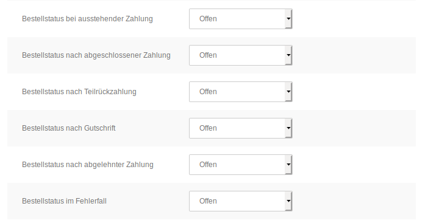

Zudem kann, je nachdem in welchem Zustand die Zahlung einer Bestellung sich befindet, eingestellt werden welcher Bestellstatus dafür vergeben werden soll.

###### PayPal Ratenzahlung

Wenn du das aktuelle _**PayPal2Hub**_ Zahlungsmodul nutzt, ist eine einfache Integration der Hinweisbanner ohne manuelle Arbeiten bereits vorbereitet und wie in der untenstehenden Abbildung zu konfigurieren.

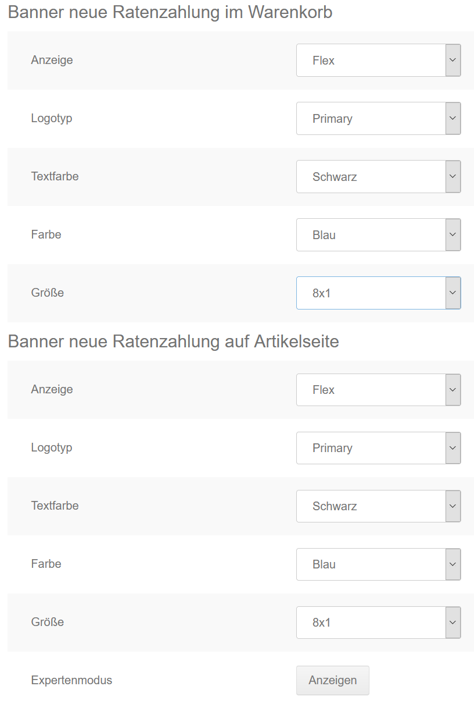

Folgende Einstellungen stehen zur Verfügung:

|Feldname|Beschreibung|
|--------|------------|
|Anzeige|aktivieren der Banner Anzeige als _**flex**_ oder kompakteres _**text**_-Layout|
|Logotyp|welche Art Logo soll im Banner dargstellt werden?|
|Textfarbe|Textfarbe im Banner|
|Farbe|Hintergrundfarbe des Banners|
|Größe|Größe und Aufteilung des Banners|

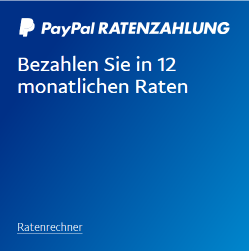

Ganz unten befindet sich der Button für den Expertenmodus, über den noch weitere Einstellungen möglich sind. Klicke hierzu auf _**Anzeigen**_.

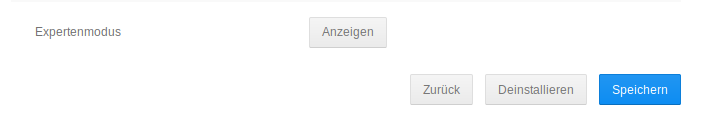

Über die Schaltfläche _**Zurück**_ kannst du die Bearbeitung abbrechen, ohne die Änderungen an den Einstellungen zu speichern. Mit einem Klick auf _**Speichern**_ werden diese übernommen. Mit Klick auf _**Deinstallieren**_ kann das Modul deinstalliert werden.

##### Expertenmodus

Über den Expertenmodus sind weitergehende Einstellungen möglich.

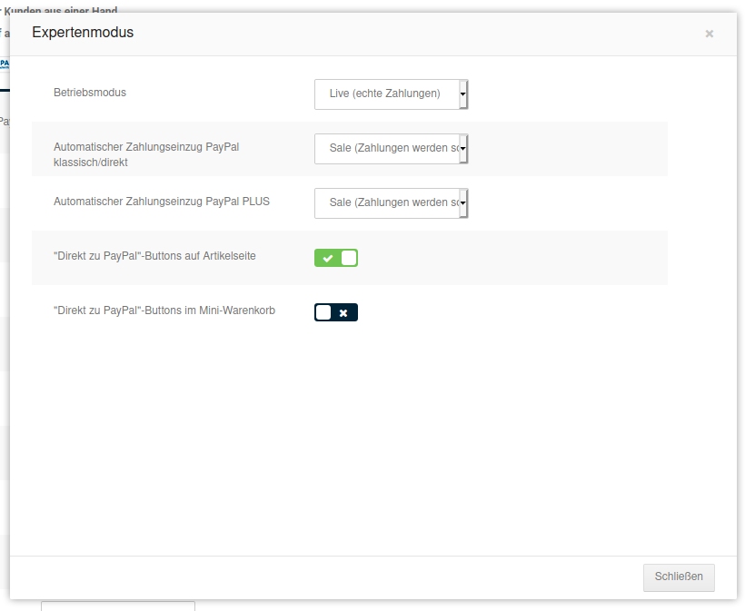

|Feldname|Beschreibung|
|--------|------------|
|Automatischer Zahlungseinzug Paypal klassisch/direkt|Legt fest, ob Zahlungen bei _**Direkt zu Paypal**_- und _**Paypal klassisch**_-Transaktionen sofort beim Kunden eingezogen oder nur reserviert werden sollen.|
|Automatischer Zahlungseinzug PayPal PLUS|Legt fest, ob Zahlungen bei Verwendung der PLUS-Zahlungsweisen sofort beim Kunden eingezogen oder nur reserviert werden sollen.|
|_**Direkt zu PayPal**_-Buttons auf Artikelseite|Blendet den _**Direkt zu PayPal**_-Button auf der Artikelseite ein.| 

!!! danger "Achtung"

	 Die _**Direkt zu PayPal**_-Buttons sind auf der Artikeldetailseite nur bei Artikeln ohne Eigenschaften, Attribute und GX-Customizer sichtbar.

|Feldname|Beschreibung|
|--------|------------|
|_**Direkt zu PayPal**_-Buttons im Mini-Warenkorb|Blendet den _**Direkt zu PayPal**_-Button zusätzlich im Mini-Warenkorb ein.|

### Gambio secured Payments - powered by Klarna

Über das Modul Gambio _**secured Payments - powered by Klarna**_ sind abgesicherte Zahlungen möglich. Hierbei stehen die Zahlungsweisen Lastschrift, Rechnung, Ratenkauf und Sofortüberweisung zur Verfügung.

#### Eventuell nötige Updates

Zur Verwendung der Klarna-Zahlungsmodule ist eine aktuelle Version des _**Gambio Hub Connectors**_ erforderlich. Dieser sollte daher unbedingt über den _**Gambio Store**_ \(Eintrag _**Gambio Store**_ im Menü des Gambio Admin\) auf dem neusten Stand gehalten werden.

In älteren Shopversionen kannst du den AutoUpdater nachinstallieren. Lade hierzu das entsprechende Paket über den folgenden Link herunter:

https://www.gambio.de/mTbX2

Auch wenn du kein aktives Kundenkonto bei Gambio besitzt, wird dir bei Fragen oder Problemen mit dem Update gerne weitergeholfen, schreibe hierzu als Gambio Kunde ein Supportticket über das Gambio Kundenportal oder, falls kein Kundenkonto besteht, eine Mail mit deinem Anliegen an info@gambio.de

#### Gambio Hub Anmeldung

Sofern du noch nicht am Gambio Hub angemeldet bist, führe nun im Backend deines Gambio Shops die Anmeldung durch. Klicke hierzu auf den Menüpunkt Gambio Hub im linken Menü des Adminbereichs deines Shops. Die Anmeldung findet schnell und einfach aus dem Shop heraus statt und ist sofort wirksam.

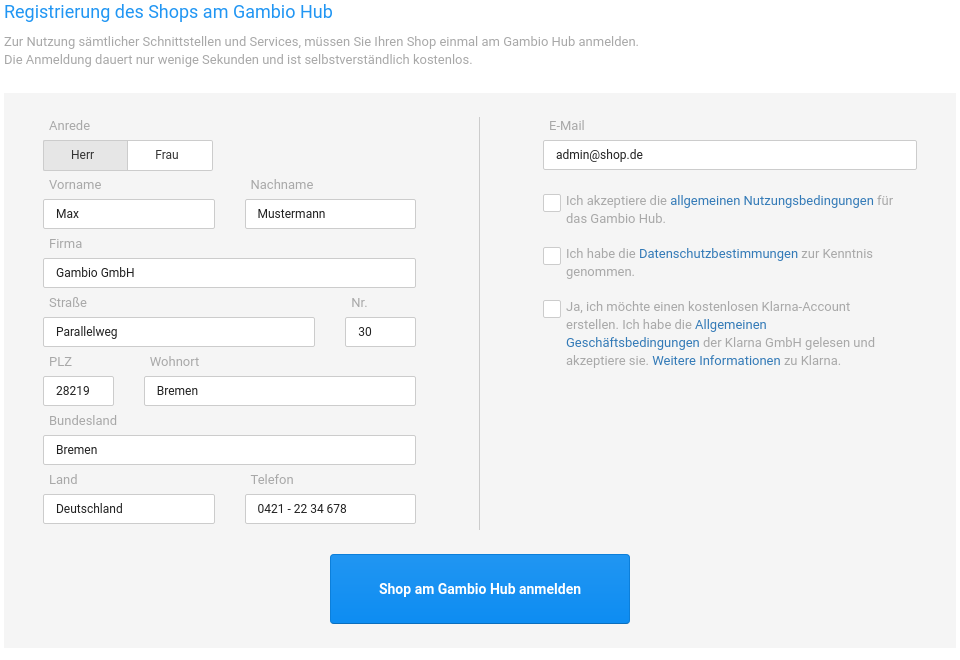

Die Nutzung des Gambio Hubs ist dauerhaft kostenfrei und auch für Shopbetreiber ohne aktives Kundenkonto bei Gambio möglich. Bei erfolgreicher Anmeldung leuchtet das Gambio Hub Badge in der Fußleiste des Shops grün auf.

Solltest du Fragen zu oder Probleme mit diesem Schritt haben, hilft dir auch hier der Gambio-Support gerne weiter, nutze dazu die in vorigem Schritt beschriebenen Kontaktmöglichkeiten, um mit Gambio in Kontakt zu treten.

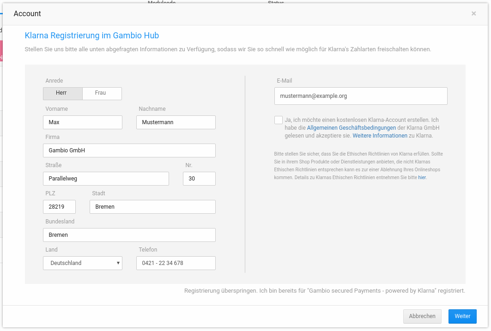

Die Anmeldung bei Klarna kann zusammen mit der Hub Anmeldung durchgeführt werden. Setze hierzu einfach den Haken bei _**Ja, ich möchte einen kostenlosen Klarna-Account erstellen**_. Diese Einstellung ist optional.

!!! note "Hinweis"
	 Über die Links im zweiten Absatz der Checkbox kannst du die _**Allgemeinen Geschäftsbedingungen**_ von Klarna anzeigen lassen und _**Weitere Informationen**_ aufrufen.

!!! note "Hinweis"
	 Die Anmeldung bei Klarna kann auch später aus dem Bereich _**Module \> Zahlungsweisen \> Gambio Payment Hub**_ vorgenommen werden.
	 
#### Klarna Anmeldung / Onboarding 

Der erste Schritt der Klarna Anmeldung besteht in der Angabe deines Unternehmens. Wähle hierzu zunächst deine Branche aus, der Rest des Formulars wird nach und nach eingeblendet.

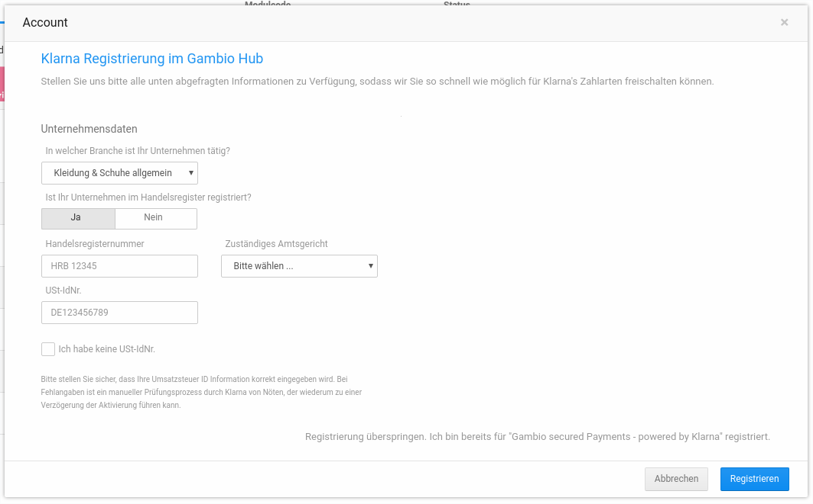

!!! note "Hinweis"
	 Leider steht der Service von Klarna für die Branche _**Tabak**_ derzeit nicht zur Verfügung.

Bitte wähle aus, ob dein Unternehmen im Handelsregister verzeichnet ist. Ist dies nicht der Fall, wird das Eingabeformular entsprechend angepasst, sodass die Privatadresse des Inhabers angegeben werden kann.

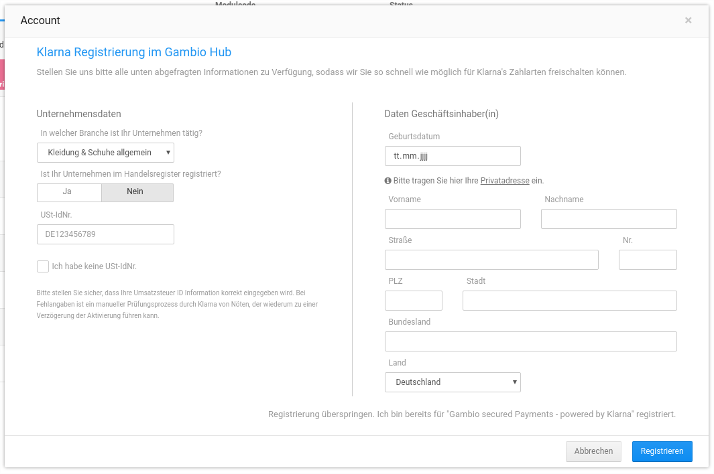

!!! danger "Achtung"

	 Es ist hier explizit die _**Privatadresse**_ vorgesehen. Bitte gib **nicht** die Adresse deiner Geschäftsräume an!

Fülle die Felder aus wie angegeben. Bestätige die Angaben mit einem Klick auf Registrieren. Über Abbrechen kannst du das Formular verlassen, ohne die Daten an Klarna zu übermitteln.

Das Onboarding besteht aus drei Abschnitten:

-   Aktivierung
-   Zahlungen
-   Auszahlungen

Die Aktivierung ist mit der Klarna Anmeldung abgeschlossen.

  

Im Abschnitt _**Zahlungen**_ wird der Shop von Seiten Klarna überprüft, dies kann etwas dauern. Nach der erfolgreichen Überprüfung können im Shop Zahlungen über Klarna durchgeführt werden.

!!! danger "Achtung"

	 An dieser Stelle des Onboardings erfolgen noch keine Auszahlungen an den Shopbetreiber. Es werden lediglich Zahlungen von Kunden akzeptiert und seitens Klarna vorgehalten.

Um Auszahlungen bei Klarna zu beantragen, muss der sogenannte _**Know-your-customer**_ Fragebogen ausgefüllt werden. Klicke hierzu auf _**Auszahlungen erhalten**_.

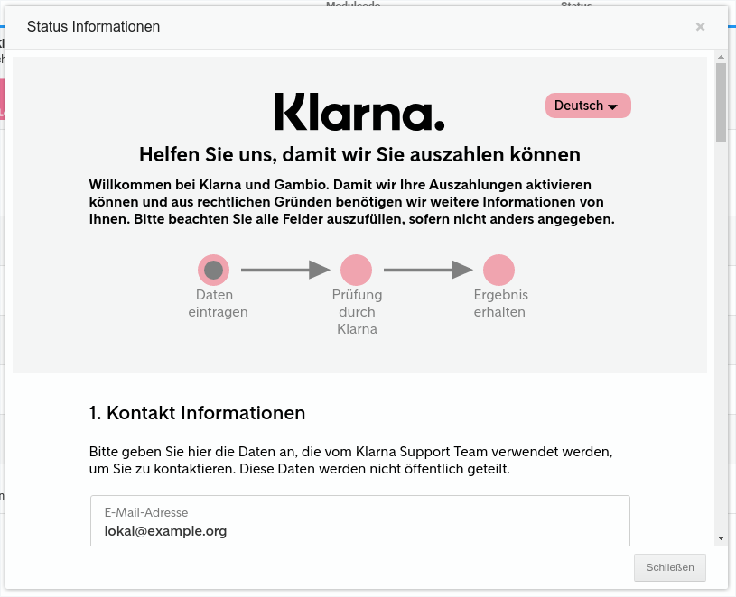

Sobald die Prüfung des Fragebogens abgeschlossen ist, bist du erfolgreich bei Klarna registriert.

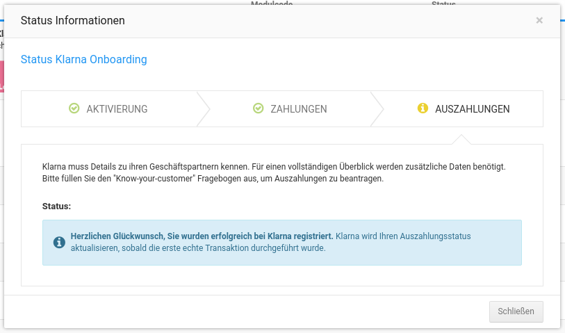

!!! note "Hinweis"
	 Die abschließende Prüfung von Klarna erfolgt erst nach den ersten Live-Bestellung regulärer Kunden. Erst dann ist das Onboarding abgeschlossen.

Bis das Onboarding abgeschlossen ist, wird das Klarna Modul mit einem gelben Status-Symbol gekennzeichet, dass je nach Status des Oboardings mit _**Aktivierung erwartet**_ bzw. _**Installiert**_ betitelt ist.

Erst wenn das Symbol grün dargestellt wird, erfolgen Auszahlungen seitens Klarna.

#### Installation

Das Modul kann im Gambio Admin unter _**Module \> Zahlungsweisen \> Gambio Payment Hub**_ installiert werden. Bewege hierzu deinen Mauszeiger über den Eintrag, es wird die Schaltfläche _**Installieren**_ angezeigt.

	  
#### Konfiguration {#gambio_secured_payments_konfiguration}

Die Konfigurationsseite des Moduls kann dann über das Stift-Symbol geöffnet werden. Gehe hierzu unter _**Module \> Zahlungsweisen \> Gambio Payment Hub**_ und bewege den Mauszeiger über den Eintrag _**Gambio secured Payments - powered by Klarna**_, bis das StiftIcon angezeigt wird und klicke darauf.

Aktiviere das Modul mit der entsprechenden Option ganz oben.

!!! danger "Achtung"

	 Die Prüfung der Registrierung durch Klarna kann nur erfolgen wenn das Modul aktiv und im Livebetrieb ist. Der Shop darf nicht im Wartungsmodus bzw. offline geschaltet sein.

In den Einstellungen stehen die folgenden Bereiche zur Verfügung:

##### Allgemeine Konfiguration

|Option|Erläuterung|
|------|-----------|
|Aktiviert|Setze diesen Haken, um das Modul zu aktivieren.|
|Erlaubte Länder|Gib hier die ISO-Codes der Länder an, für die das Klarna-Modul zur Verfügung stehen soll. Die Angabe mehrerer Länder muss kommagetrennt, in Großbuchstaben und ohne Leerzeichen erfolgen, z.B.: _**DE,AT**_. Nach der Registrierung bei Klarna stehen die Klarna-Zahlungsweisen Kunden aus Deutschland und Österreich zur Verfügung. Weitere Länder können über den Klarna-Support freigeschaltet werden.|
|Erlaubte Sprachen|Gib hier an, in welcher Sprache das Modul angezeigt werden soll. Standardmäßig stehen hier nur Deutsch und Englisch zur Verfügung. Auch die Sprachen werden kommagetrennt und ohne Leerzeichen angegeben, jedoch in Kleinbuchstaben, z.B.: _**de,en**_|
|Erlaubte Währungen|In dieser Währung werden Zahlungen über Klarna ausgeführt. Aktuell sind nur Zahlungen in _**EUR**_ und _**CHF**_ möglich.|

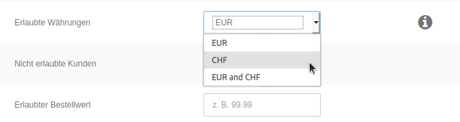

|Option|Erläuterung|
|------|-----------|
|Nicht erlaubte Kunden|Du kannst hier bestimmte Kunden von der Bestellung über das Klarna-Modul ausschließen, indem du die E-Mail-Adressen der Kundenkonten kommagetrennt und ohne Leerzeichen hinterlegst, z.B.: _**max@example.org,gina@example.org**_. Diese Kunden können dann nicht über dieses Klarna-Modul bestellen.|
|Erlaubter Bestellwert|Der maximal erlaubte Bestellwert, anzugeben mit Punkt als Dezimaltrenner. Es genügt eine Angabe wie 99.99, eine Währung muss nicht angegeben werden.|
|Erlaubter Minimum Bestellwert|Mindestbestellwert; wird das Feld leer gelassen, ist das Minimum nicht beschränkt.|
|Bestellstatus: neue Bestellung|Wähle hier den Bestellstatus aus, den neue Bestellungen erhalten sollen. Hier ist der Status _**Versendet**_ voreingestellt. Erfolgt die Versandmeldung über eine angeschlossene Software wie eine Warenwirtschaft, sollte dieser Status beibehalten werden.|
|Bestellstatus: versendete Bestellung|Hier wählst du den Bestellstatus aus, bei dem Klarna automatisch benachrichtigt werden soll, dass die Bestellung versendet worden ist.|
|Betriebsmodus|Es stehen die Modi _**Live**_ für den produktiven Betrieb sowie _**Playground**_ für den Testbetrieb zur Verfügung. Für den Testbetrieb werden, anders als bisher, keine gesonderten Daten benötigt; weder für den Shopbetreiber noch für den Käufer. Wird für eine Testbestellung eine Bankleitzahl benötigt, muss jedoch die Bankleitzahl 888 888 88 \(Testbestellungen DE\), bzw. 0000 \(Testbestellungen AT\) verwendet werden.|

!!! note "Hinweis"

	 Wähle zwischen dem Live- und dem Testbetrieb \(Playground-Betrieb\). Verwende den Playground-Betrieb ausschließlich für Testbestellungen und stelle das Modul anschließend wieder auf den Live-Betrieb, um auszuschließen, dass Kunden im Playground-Betrieb darüber bestellen.

|Option|Erläuterung|
|------|-----------|
|Einbindung der Rechtstexte|Steuert für welche Ausgangslage Rechtstexte in den Shop übernommen werden sollen:
|  |Verkauf nach Deutschland und Österreich
|  |Verkauf nach Deutschland
|  |Verkauf nach Österreich
|  |eigenständige Einbindung \(Texte werden nicht automatisch übernommen\)

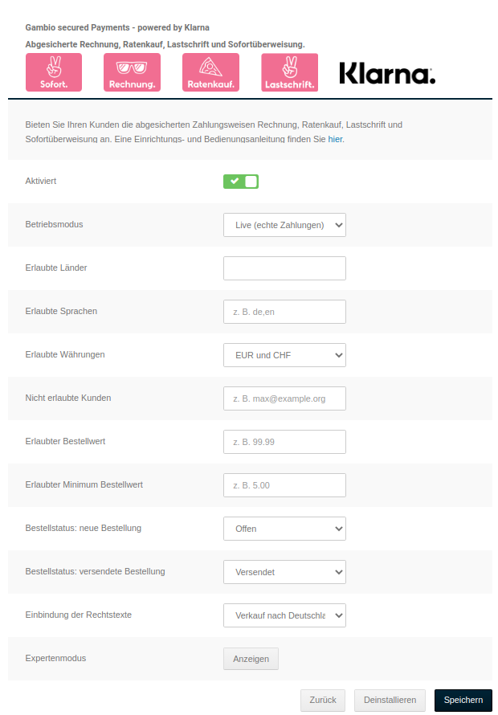

Über die Schaltfläche _**Expertenmodus**_ gelangst du in die weiteren Einstellungen zu Zahlungsweisen und Gestaltung.

##### Expertenmodus

**Klarna Zahlungweisen**

Hier kannst du die gewünschten Klarna-Zahlungsweisen auswählen. Zur Auswahl stehen hier:

-   Klarna Pay now - Lastschrift
-   Klarna Pay now - Sofortüberweisung
-   Klarna Pay now - Kreditkarte, Lastschrift, Sofortüberweisung
-   Klarna Pay later - Rechnung
-   Klarna Slice it - Ratenkauf

!!! note "Hinweis"

	 Das Aktivieren von _**Klarna Pay now - Kreditkarte, Lastschrift, Sofortüberweisung**_ deaktiviert die separat zu- bzw. abschaltbaren Zahlungsweisen _**Klarna Pay now - Lastschrift**_ und _**Klarna Pay now - Sofortüberweisung**_, da diese dort bereits enthalten sind.

	 Für das Anbieten von Kreditkartenzahlungen ist eine Freischaltung von Klarna erforderlich.

Zudem kannst du das Debug Logging aktivieren. Dies sollte im Livebetrieb nur zur Fehleranalyse aktiviert sein. Bitte beachte, dass dieses Log für die Prüfung benötigt wird, sollte es zu Problemen kommen. Diese Logs sind dann im Shop unter _**Toolbox \> Logs anzeigen**_ zu finden.

Schlussendlich kannst du die _**Automatische Statusaktualisierung**_ aktivieren. Hierüber werden Bestellstatusänderungen mit Klarna abgeglichen, wenn diese über eine externe Software oder Module erfolgen. So ist es nicht mehr notwendig, dies nachträglich über die Maske im Shop an Klarna zu melden.

!!! note "Hinweis"

	 Bitte beachte, dass die _**Automatische Statusaktualisierung**_ noch nicht von allen Programmen bzw. Schnittstellen unterstützt wird. Module wie _**DHL Geschäftskundenversand**_, _**Hermes**_ oder _**Shipcloud**_ bieten dies jedoch bereits an.

**Klarna Farbeinstellungen**

Du kannst hier verschiedene Farbeinstellungen vornehmen. Klicke auf den Kasten rechts hinter der Farbe, um eine andere Farbe auszuwählen und diese zu übernehmen. Der Farbwähler kann je nach Browser unterschiedlich aussehen. Die Screenshots wurden im Testbetrieb erstellt, so dass hier die Kennzeichnung _**Testdrive**_ zu sehen ist. Im Livebetrieb wird diese Kennzeichnung nicht zu sehen sein.

Werden deine Farbeinstellungen nicht direkt im Shop übernommen, so gehe in den Warenkorb, klicke auf das Aktualisieren-Icon hinter der Bestellmenge und gehe dann im Bestellvorgang weiter zur Zahlungsweisenseite. Nun sollte die Änderung übernommen worden sein.

!!! note "Hinweis" 
	 Es werden die Farben aus dem aktiven Style des _**Honeygrid**_-Templates geladen und so vorbelegt. Ist kein aktiver Style vorhanden, werden Standardfarben aus dem Modul herangezogen.

|Option|Erläuterung|Abbildung|
|------|-----------|---------|
|Rahmenfarbe|Hiermit ist der Rahmen um die nicht ausgewählten Ratenoptionen bei Klarna Ratenkauf gemeint \(rot dargestellt\).|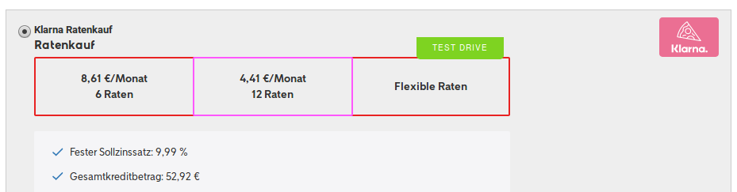|
|Rahmenfarbe Ausgewählt|Hiermit ist der Rahmen um die ausgewählte Ratenoption bei Klarna Ratenkauf gemeint \(pink dargestellt\).||
|Buttonfarbe|Diese Option hat aktuell keinen Einfluss auf die Darstellung.| |
|Buttontextfarbe|Diese Option hat aktuell keinen Einfluss auf die Darstellung.| |
|Farbe Checkbox|Hintergrund des ausgewählten Radio-Buttons bei Klarna Rechnung \(orange dargestellt\)||
|Farbe aktive Auswahl|Inhalt des ausgewählten Radio-Buttons bei Klarna Rechnung \(die schwarze Füllung im orangen Kreis\)||
|Detailfarbe|Ändert die Farbe der Aufzählungszeichen vor den Zahlungsdetails \(Listenpunkte/Haken, rot dargestellt\) Die Änderung wirkt sich auf alle Klarna-Zahlungsweisen aus.|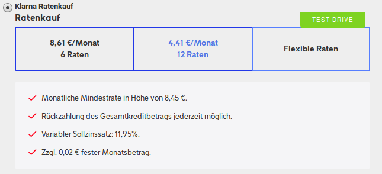|
|Farbe Kopfzeile|Legt die Farbe der Kopfzeile fest, die es aktuell aber nur in der Zahlungsweise _**Ratenkauf**_ gibt. \(rot dargestellt\).||
|Linkfarbe|Legt die Farbe für den Link Weitere Informationen fest \(rot dargestellt\). Die anderen Links werden hiervon jedoch nicht beeinflusst.||
|Textfarbe|Diese Einstellung ändert die Farbe der meisten Texte in den Klarna-Zahlungsweisen, wie z.B. die Titel der Zahlungsoptionen sowie den Inhalt der Aufzählungen der Konditionen rot dargestellt\).|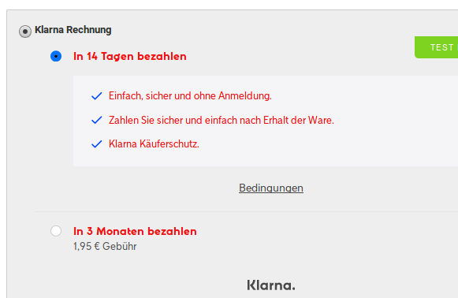|
|Sekundärtextefarbe|Ändert die Farbe der Sekundärtexte wie die Vertragsbedingungen und den Zinssatz \(rot dargestellt\).|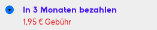|
|Rahmenradius|Legt fest, wie rund die Ecken der Auswahlbox bei Klarna Ratenkauf sein sollen. Man sieht in der Abbildung sehr schön, wie stark die Ecken abgerundet sind.|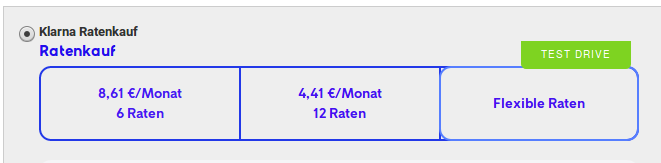|
|Button _**Zurücksetzen**_|Mit diesem Button kannst du die Einstellungen auf die Standardwerte zurücksetzen. Hierzu muss im Honeygrid-Template jedoch ein Style aktiviert sein.| |

##### Klarna Logos

Im Bereich _**Klarna Logos**_ der Experteneinstellungen steht dir eine Auswahl an Logos und Badges zur Verfügung. Diese können beispielsweise in einen Content, wie z.B. eine der Footer-Spalten, eingebunden werden. Um das Logo zu verwenden, kopiere bitte den unter dem zugehörigen Bild angezeigten Logo-Link.

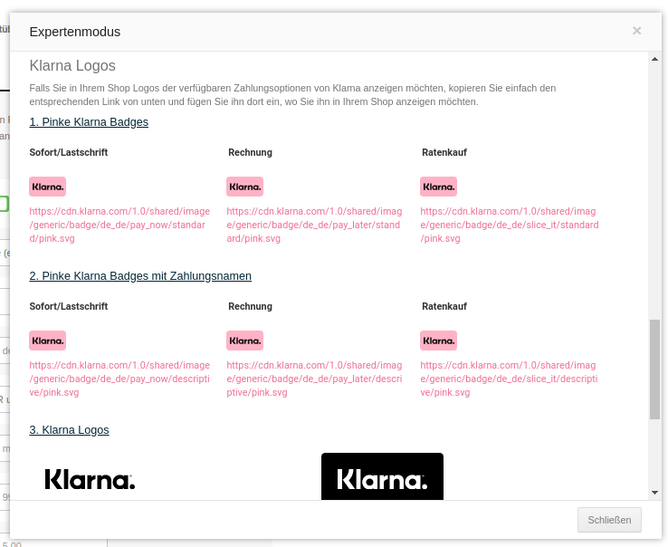

##### Kürzel für die Bestellübersicht

Für die Darstellung in der Bestellübersicht kann für jede Zahlungsweise ein eigenes Kürzel vergeben werden.

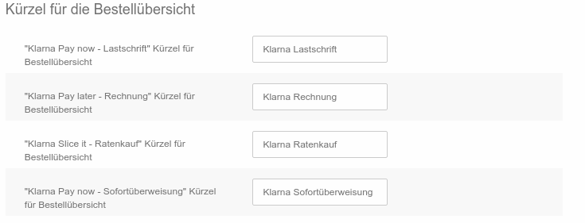

#### Bestellablauf im Shop

##### Darstellung der Module im Bestellvorgang

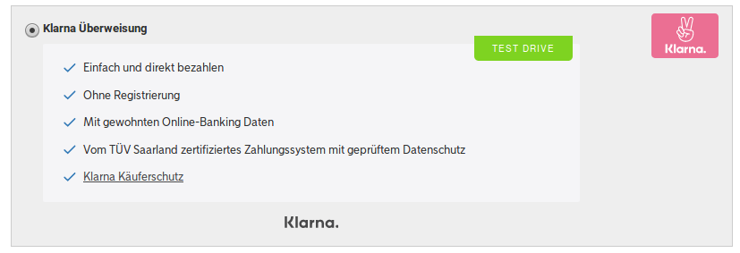

##### Bestellweg

Nach Auswahl einer Klarna Zahlungsweise muss der Kunde zuerst sein Geburtsdatum und die Mobiltelefonnummer angeben, danach wird der Bestellprozess fortgeführt. Die Abfrage erscheint nur wenn diese Daten bisher noch nicht im Shop erfasst wurden. Wichtig ist, dass der Kunde den Nutzungsbedingungen zustimmt.

Auf der letzten Seite der Bestellung wird die gewählte Zahlungsweise dann noch einmal aufgeführt und kann vom Kunden im Zweifelsfall noch mal geändert werden

#### Abwicklung der Bestellung

##### Bestellungen einsehen

Erfolgte Bestellungen findest du in der normalen Bestellübersicht im Gambio Admin unter _**Bestellungen \> Bestellungen**_. Du kannst diese wie andere Bestellungen auch einsehen.

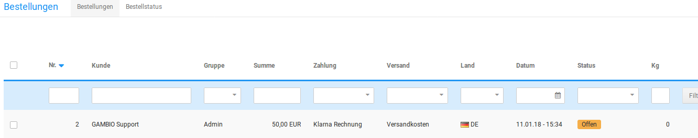

##### Bestellungen bearbeiten

Aktuell können bei Bestellungen über Klarna nur die Artikel bearbeitet werden. Die Versandkosten können verändert werden, wenn man die Bearbeitung der Artikel abschließt, ohne beim Speichern den Haken bei _**Nachbearbeitung beenden und Bestellung neu berechnen**_ zu setzen. Es erscheint dann ein Popup, in dem die Versandkosten angepasst werden können. Auf die gleiche Weise können der Bestellung auch Gutscheine und Rabatt Kupons hinzugefügt werden, sofern das Gutscheinsystem im Shop aktiv ist.

Bei allen Änderungen gilt aber, dass diese nur möglich sind, wenn der Bestellwert dadurch nicht erhöht wird. Die Summe darf durch die Bearbeitung nur gleich bleiben oder reduziert werden.

Findet die Bearbeitung erst nach der Bestätigung durch Klarna statt, wird automatisch eine Rückzahlung eingeleitet. Wird der Betrag der Bestellung verringert, wird dies als Rückzahlung in den Klarna-Logdaten der Bestellung vermerkt. Die Log-Daten sind daher die erste Stelle, die geprüft werden sollte, wenn es zu einem Problem kam.

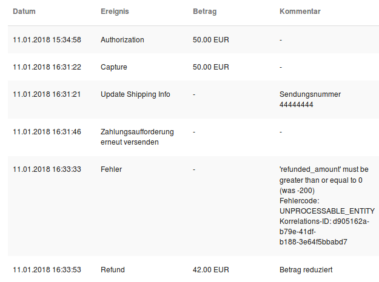

Nachfolgend erläutern wir einige Logeinträge, die du in den Log-Daten finden könntest. Bitte beachte, dass diese nur Beispiele darstellen und keinen Anspruch auf Vollständigkeit erheben.

|Ereignis|Erläuterung|
|--------|-----------|
|Authorize|Log-Daten direkt nach Eingang der Bestellung. Die Bestellung wurde bei Klarna angelegt.|
|Capture|Die Bestellung wurde bei Klarna als versandt erfasst.|
|Update Shipping Info|Es wurde eine Sendungsnummer hinzugefügt. Eine hinzugefügte Sendungsnummer ist jedoch erst in den Log-Daten sichtbar, wenn das Capture erfolgt ist.|
|Zahlungsaufforderung erneut versenden|Die Zahlungsaufforderung kann erneut an den Kunden versendet werden.|
|Fehler|In unserem Beispiel haben wir die Bestellung überarbeitet und vor dem Speichern der neuen Beträge schon eine Neuberechnung angestoßen. Hierdurch war die Rückzahlungssumme 0, was zu der Meldung führte.|
|Refund|Wir haben die Testbestellung im Betrag reduziert, was als Rückzahlung, bzw. Ausbuchung _**refund**_ vermerkt wird.|

!!! danger "Achtung"

	 Beachte bei der Bearbeitung, dass nach der Übernahme deiner Änderungen der Haken bei _**Nachbearbeitung beenden und Bestellung neu berechnen**_ gesetzt und anschließend auf _**Schließen**_ geklickt werden muss, damit die Bestellwerte korrekt neu berechnet und die geänderten Summen an Klarna übertragen werden können!

##### Rechnungsstellung

Die Rechnungsstellung kann normal über den Shop erfolgen. Die erstellten Rechnungen enthalten einen entsprechenden Hinweis, der den Kunden zusätzlich darüber informiert, dass die Zahlung an Klarna zu erfolgen hat. Um Missverständnissen vorzubeugen, werden Bankdaten des Händlers für Klarna Zahlungen automatisch ausgeblendet.

##### Versand melden

Der Versand kann über eine Bestellstatusänderung an Klarna gemeldet werden. Wähle hierzu in der Bestellübersicht oder in der Bestelldetailseite den Punkt Bestellstatus ändern. Wähle den Status, den du in der Konfiguration als gewünschten Bestellstatus für versendete Bestellungen angegeben hast und du wirst ein weiteres Auswahlfeld _**Klarna benachrichtigen**_ erhalten. Um den Versand an Klarna zu melden, muss der Haken hier gesetzt werden.

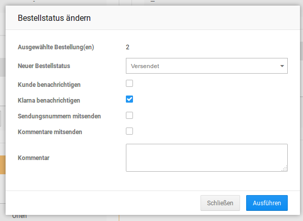

!!! note "Hinweis" 
	 Beachte, dass die Versandmeldung im Regelfall innerhalb des sogenannten Authorisierungszeitraums \(28 Tage\) nach der Bestellung erfolgen muss. Ohne Versandmeldung erfolgt keine Zahlungsaufforderung an den Kunden und es wird kein Geld an den Händler ausgezahlt.

	 

	 Über die Schaltfläche _**Authorisierungszeitraum verlängern**_ kann bei Bedarf ein späteres Datum für die Authorisierung angefordert werden. Der Zeitraum verlängert sich auf 28 Tage nach Anforderung \(Klick auf die Schaltfläche\).

!!! danger "Achtung"

	 Sofern die _**Automatische Statusaktualisierung**_ in den Experteneinstellungen **nicht aktiviert** worden ist, muss der Versand zwingend über die Funktion im Shop gemeldet werden. Wird die Statusänderung auf anderem Wege vorgenommen, erfolgt **keine Versandmeldung** an Klarna und somit **keine Auszahlung**!

##### Sendungsnummer an Klarna senden

Soll die Sendungsnummer ebenfalls an Klarna übermittelt werden, so kannst du diese in die Bestellung eintragen und dann _**Klarna benachrichtigen**_ auswählen. Die Sendungsnummer wird bei der Versandmeldung dann ebenfalls an Klarna übertragen. Klarna hat so die Möglichkeit, bei ausstehenden oder vermissten Sendungen bei der Lösung des Problems mitzuwirken.

!!! note "Hinweis"

	 Das Hinterlegen der Sendungsnummer allein stellt keine Versandmeldung dar. Im vorherigen Abschnitt _**Versand melden**_ findest du die notwendigen Schritte um Klarna zu benachrichtigen.

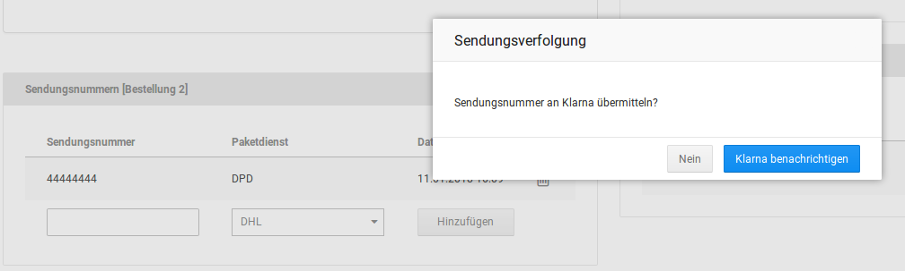

##### Bestellung stornieren

Auch beim Stornieren einer Klarna-Bestellung kannst du genauso verfahren, wie du es gewohnt bist. Wähle _**Stornieren**_, setze den Haken bei _**Klarna benachrichtigen**_ und fahre wie gewohnt fort. Wird die Bestellung nach der Versandmeldung storniert, wird auch hier eine Rückzahlung eingeleitet, ansonsten erfolgt ein normaler Storno.

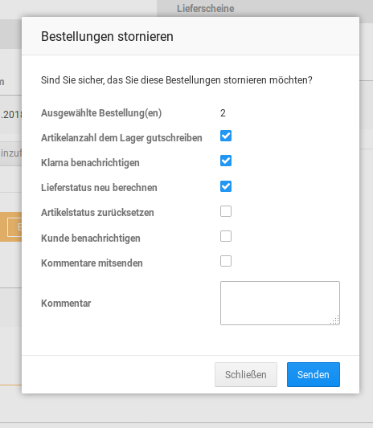

##### Klarna Settlements

Unter _**Gambio Hub \> Klarna Settlements**_ können erfolgte Auszahlungen von Klarna an den Shopbetreiber eingesehen werden. Hierüber können dann die Gebühren, Einzüge und Rückerstattungen pro Bestellung geprüft werden.

Über die Einstellungen links oben lässt sich der Zeitraum festlegen, zu dem die Settlements ausgegeben werden sollen. Mit einem Klick auf die _**Payment Ref**_ können weitere Details zur jeweiligen Zahlung aufgerufen werden.

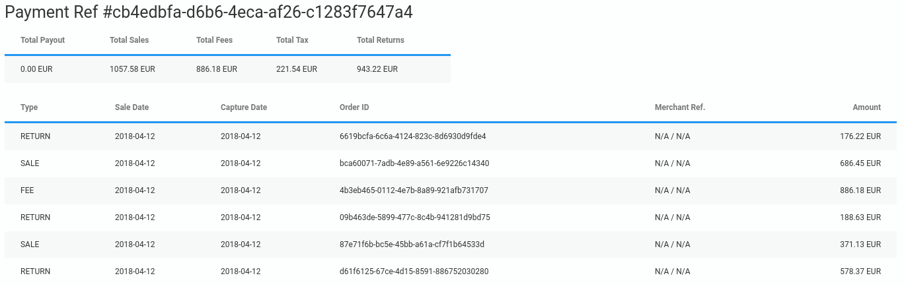

#### Funktionstests

##### Vorbereitende Schritte

Um die Funktion des Moduls zu prüfen, öffne die Konfigurationseite des Moduls und schalte den Betriebsmodus auf Playground. In diesem Modus werden keine echten Zahlungen durchgeführt, sondern lediglich simuliert.

##### Prüfen der Funktion

Lege eine neue Bestellung mit Klarna als Zahlungsmethode an, indem du dich als Testkunde in deinen Shop einloggst und im Bestellvorgang eine deiner neuen Zahlungsweisen auswählst.

Achte darauf einen Privatkunden zu verwenden, also ohne gewerbetreibend-Status und mit leerem Firma/Firmenname-Feld, da die Zahlungsweisen sonst nicht sichtbar wären.

Setze nun den Bestellstatus der Bestellung auf versendet, so dass die Bestellung an Klarna gemeldet wird und die Folgeprozesse \(Rechnungsstellung und Auszahlung\) angestoßen werden können.

Storniere nun die Bestellung.

Laufen all diese Schritte fehlerfrei ab, ist die Integration des Zahlungsmoduls in deinem Shop erfolgreich abgeschlossen.

Bei Fragen oder Problemen in diesen Schritten wende dich bitte über die bekannten Kontaktmöglichkeiten an Klarna, um die offenen Punkte zu klären.

### easyCredit

#### Verfügbarkeit

Das easyCredit-Modul ist verfügbar ab Shopversion _**3.9**_ und der Connectorversion _**1.17.x**_.

#### Installation

Das Modul kann, nach der Aktualisierung des Hub-Connectors über den _**Gambio Store**_, unter _**Module \> Zahlungsweisen**_ installiert werden. Wähle hierzu den Moduleintrag aus der Liste aus und klicke auf _**Installieren**_.

#### Konfiguration

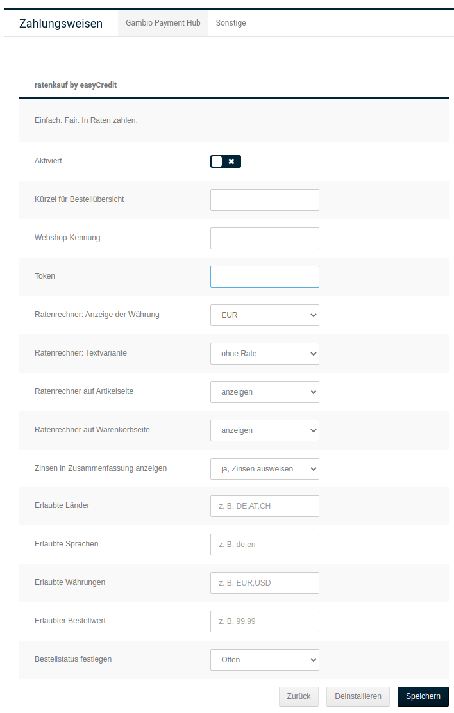

Folgende Einstellungen stehen auf der Konfigurationsseite zur Verfügung:

|Feldname|Beschreibung|
|--------|------------|
|Aktiviert|Ist der Haken gesetzt, wird das Modul im Bestellvorgang verwendet.|
|Kürzel für Bestellübersicht|Hier kann ein Kürzel angegeben werden, welches in der Bestellübersicht in der Auflistung angezeigt wird, um Bestellungen über dieses Modul zu kennzeichnen.|
|Webshop-Kennung|Die _**Kennung**_ erhältst du von easyCredit.|

!!! note "Hinweis zur Webshop-Kennung" 
	 Die Kennung hat das Format **1.de.1111.1**, dies schlüsselt sich wie folgt auf:-   1. Stelle = Hier stehen eine 1 oder eine 2
	 -   2. Stelle = Hier steht ein Sprach- oder Länderkürzel, z.B. _**de**_
	 -   3. Stelle = Besteht aus einer 4-stelligen, rein numerischen Zeichenfolge
	 -   4. Stelle = Besteht aus einer einzelnen Ziffer

|Feldname|Beschreibung|
|--------|------------|
|Token|Das Token erhältst du von easyCredit, es besteht aus einer 16-stelligen Abfolge von Klein- und Großbuchstaben sowie Ziffern.|
|Ratenrechner: Anzeige der Währung|Diese Einstellung hat keine Funktion mehr.|
|Ratenrechner: Textvariante|Diese Einstellung hat keine Funktion mehr.|
|Ratenrechner auf Artikelseite|Hier kann gewählt werden, ob der Ratenrechner auf der Artikelseite verlinkt werden soll.|
|Ratenrechner im Warenkorb|Hier kann gewählt werden, ob der Ratenrechner im Warenkorb verlinkt werden soll.|
|Zinsen in Zusammenfassung anzeigen|Hier kann gewählt werden, ob die Zinsen auf der letzten Seite der Bestellung ausgewiesen werden sollen. In der Abbildung sieht man einen Teil der letzten Bestellseite, im oberen Bereich wird die gewählte Zahlungsweise ausgegeben, unten im Summenblock werden bei Aktivierung dieser Funktion dann zusätzlich die Zinsen sowie die Gesamtsumme inklusive Zinsen ausgewiesen. Wir haben die eingefügten Informationen zur Deutlichmachung in der Abbildung rot umrandet.|
|Erlaubte Länder|Hier kann das Länderkürzel nach ISO2 hinterlegt werden, also in Großbuchstaben und ohne Leerzeichen, z.B. _**DE,AT,CH**_|
|Erlaubte Sprachen|Hier kann die erlaubte Sprache festgelegt werden, ebenfalls nach ISO2, hier jedoch in Kleinbuchstaben, z.B. _**de,en**_|
|Erlaubte Währungen|Werden im Shop mehrere Währungen angeboten, kann hier ausgewählt werden, welche verwendet werden dürfen, z.B. _**EUR,USD**_|
|Erlaubter Bestellwert|Erlaubt das Festlegen eines maximalen Bestellwertes. Der Ratenkauf über easyCredit ist nur von einem Warenwert von 200 bis 10.000 Euro möglich, es ist daher wenig sinnvoll, einen geringeren Betrag als 200 Euro einzutragen.|
|Bestellstatus festlegen|Hier kann der Bestellstatus gewählt werden, welchen eingehende Bestellungen über das easyCredit-Modul erhalten sollen.|

!!! note "Hinweis"

	 Widget bezeichnet die Anzeige für easyCredit im Artikel bzw. Warenkorb.

####

##### Anzeige des Widgets in der Preisbox auf der Artikeldetailseite

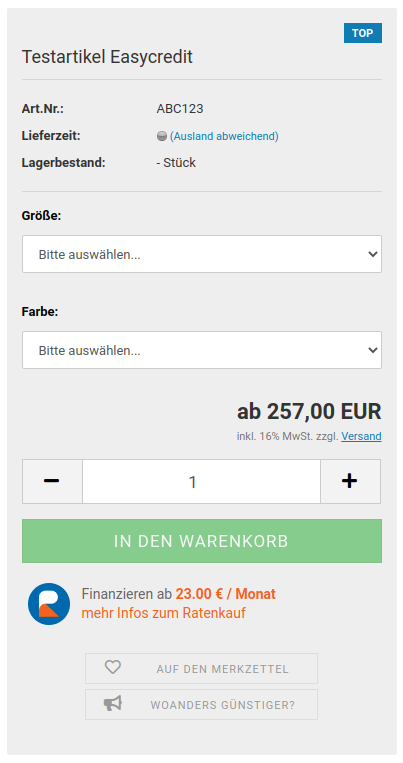

##### Anzeige des Widgets im Warenkorb

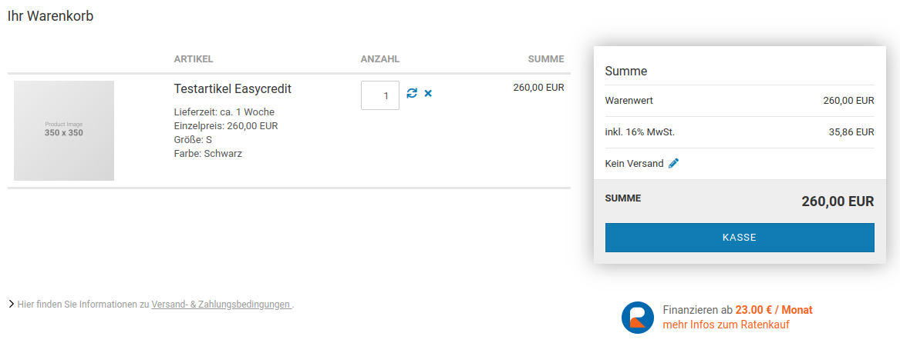

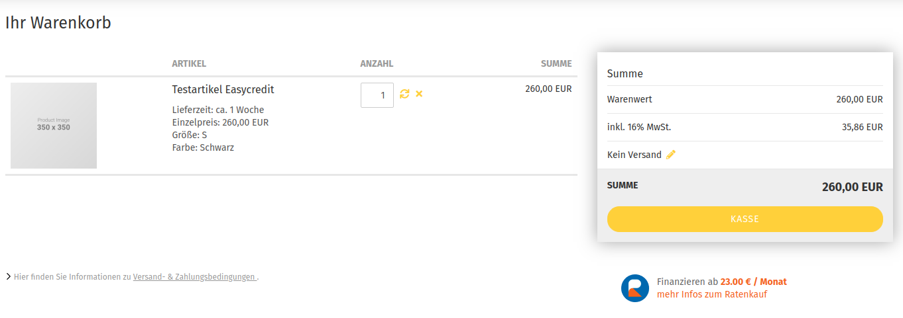

##### Anzeige des Ratenrechners

Klickt man auf den Link im Widget, öffnet sich der Ratenrechner.

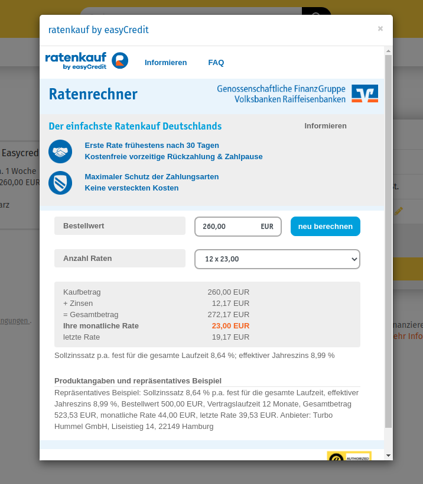

#### Ablauf im Bestellvorgang

##### Darstellung des Moduls vor der Prüfung durch easyCredit

!!! danger "Achtung"

	 Versand- und Rechnungsadresse müssen identisch sein! Werden unterschiedliche Adressen verwendet, kann easyCredit nicht ausgewählt werden, man erhält diese Anzeige:

	 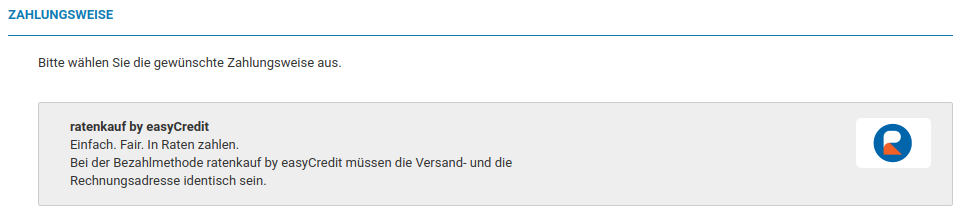

")

##### Durchlaufen des easyCredit-Anfragebogens

Es erfolgt eine Prüfung durch easyCredit, ob Ratenzahlung möglich ist.

!!! note "Hinweis"

	 Die Screenshots enthalten einen Hinweis auf den Testbetrieb. Dieser ist im Livebetrieb nicht vorhanden.

|Schritt|Anzeige|
|-------|-------|
|Ratenübersicht|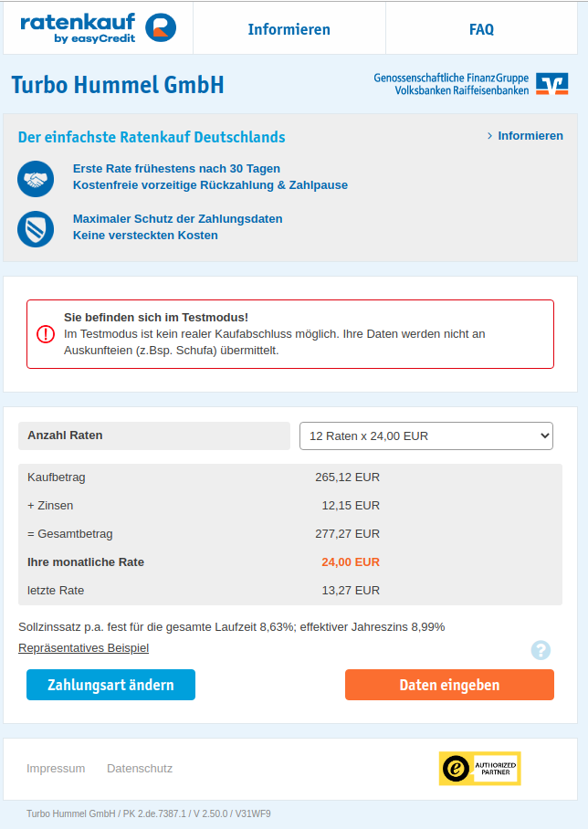|
|Dateneingabe||
|Zustimmungen||
|Nach positiver Prüfung||

##### Anzeige des Moduls nach positiver Prüfung

##### Summenblock mit Zinsen für die Ratenzahlung

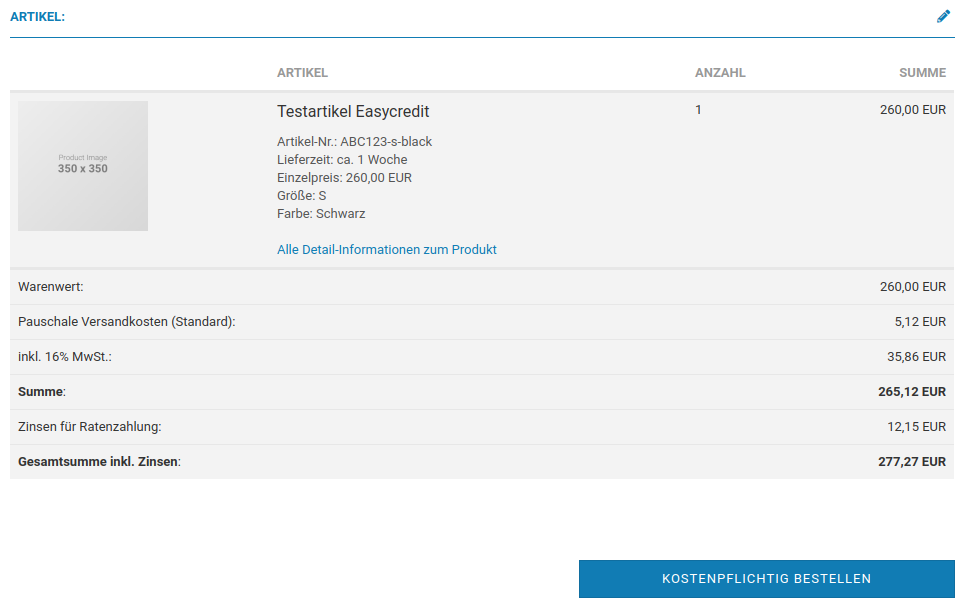

#### Weitere Behandlung der Bestellung

In den Bestelldetails der easyCredit-Bestellung findet sich nun ein Block mit Zahlungsinformationen. Hierüber kann die Lieferung oder auch Rückgaben und komplette Widerrufe an easyCredit übermittelt werden.

!!! note "Hinweis"

	 Eine easyCredit-Bestellung kann nicht nachträglich bearbeitet und die Werte darin geändert werden!

#### Informationen des Zahlungsdienstleisters {#easycredit_informationen_des_zahlungsdienstleisters}

Infoseite des Anbieters: https://www.easycredit-ratenkauf.de/gambio-aktion

## Sonstige

Unter _**Module \> Zahlungsweisen \> Sonstige**_ werden Zahlungsmodule bereitgestellt, die keine Verbindung zum _**Gambio Hub**_ benötigen.

### Vorkasse

Bei der Zahlung per Vorkasse wird deinem Kunden nach dem Aufgeben der Bestellung in der Bestellbestätigung deine Kontoverbindung und eine Zahlungsaufforderung übermittelt. Der Versand der Ware erfolgt bei dieser Zahlungsweise in der Regel nach der Gutschrift auf deinem Konto.

1.  Wähle unter _**Module \> Zahlungsweisen \> Sonstige**_ das Modul _**Vorkasse/Überweisung**_ aus
2.  Klicke in der rechten Spalte auf _**Installieren**_
3.  Klicke in der rechten Spalte auf _**Bearbeiten**_
4.  Nimm die Konfiguration des Moduls anhand der Tabelle _**Konfiguration der Zahlungsweise Vorkasse**_ vor
5.  Klicke auf _**Aktualisieren**_, um die Änderungen an der Konfiguration zu übernehmen

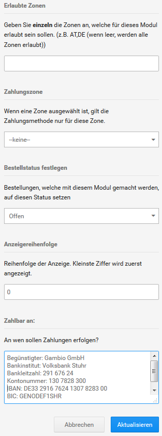

|Feldname|Beschreibung|
|--------|------------|
|Vorkasse/Überweisung Modul aktivieren|Bei ✔ kann der Kunde die Zahlungsweise im Bestellvorgang auswählen \[✔\]|
|Erlaubte Zonen|kommagetrennte Liste der zweistelligen ISO-Codes für Länder, aus denen die Zahlungsweise verwendet werden darf \(alle Länder bei keinem Eintrag\)|
|Zahlungszone|Steuerzone, aus der die Zahlungsweise verwendet werden darf \(überschreibt _**Erlaubte Zonen**_\) \[--keine--\]|
|Bestellstatus festlegen|Bestellstatus, der einer Bestellung mit dieser Zahlungsweise nach Eingang zugewiesen wird \[Standard\]|
|Anzeigereihenfolge|Reihenfolge, in der installierte Zahlungsmodule im Bestellprozess angezeigt werden \(je größer die Zahl, desto weiter unten wird das Modul angezeigt\); einmaliger Wert je Modul \[0\]|
|Zahlbar an|Bankverbindung, an die die Überweisung zu richten ist|

!!! note "Hinweis" 
	 Das Zahlungsmodul _**Vorkasse**_ wendet sich vorrangig an Zahlungen aus dem Land, aus dem du deinen Shop betreibst. Wenn du die Zahlung per Vorkasse auch international anbieten möchtest, verwende zusätzlich das Modul _**EU-Standard Bank Transfer**_.

|Feldname|Beschreibung|
|--------|------------|
|Allow Bank Transfer Payment|Bei ✔ kann der Kunde die Zahlungsweise im Bestellvorgang auswählen \[✔\]|
|Erlaubte Zonen|kommagetrennte Liste der zweistelligen ISO-Codes für Länder, aus denen die Zahlungsweise verwendet werden darf \(alle Länder bei keinem Eintrag\)|
|Bank Name|Name der Bank \[---\]|
|Bank Location|Sitz der Bank \[---\]|
|Bank Account name|Name des Kontoinhabers \[---\]|
|Bank Account No.|Kontonummer \[---\]|
|Bank Account IBAN|IBAN Kontonummer \[---\]|
|Bank BIC|Internationale Bankenkennung \[---\]|
|Bank Sort Code|Bankleitzahl \[---\]|
|Module Sort order of display \(Anzeigereihenfolge\)|Reihenfolge, in der installierte Zahlungsmodule im Bestellprozess angezeigt werden \(je größer die Zahl, desto weiter unten wird das Modul angezeigt\); einmaliger Wert je Modul \[0\]|

### Rechnung

Bei der Zahlung per Rechnung legst du dem Kunden der ausgelieferten Ware eine Rechnung mit Zahlungsziel und Kontoverbindung bei. Bei dieser Zahlungsweise erhält der Kunde erst die Ware und nimmt dann die Zahlung vor.

1.  Wähle unter _**Module \> Zahlungsweisen \> Sonstige**_ das Modul _**Rechnung**_ aus
2.  Klicke in der rechten Spalte auf _**Installieren**_
3.  Klicke in der rechten Spalte auf _**Bearbeiten**_
4.  Nimm die Konfiguration des Moduls anhand der Tabelle _**Konfiguration der Zahlungsweise Rechnung**_ vor
5.  Klicke auf _**Aktualisieren**_, um die Änderungen an der Konfiguration zu übernehmen

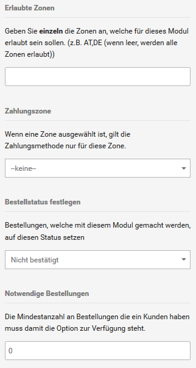

|Feldname|Beschreibung|
|--------|------------|
|Rechnungsmodul aktivieren|Bei ✔ kann der Kunde die Zahlungsweise im Bestellvorgang auswählen \[✔\]|
|Erlaubte Zonen|kommagetrennte Liste der zweistelligen ISO-Codes für Länder, aus denen die Zahlungsweise verwendet werden darf \(alle Länder bei keinem Eintrag\)|
|Zahlungszone|Steuerzone, aus der die Zahlungsweise verwendet werden darf \(überschreibt _**Erlaubte Zonen**_\) \[--keine--\]|
|Bestellstatus festlegen|Bestellstatus, der einer Bestellung mit dieser Zahlungsweise nach Eingang zugewiesen wird \[Standard\]|
|Notwendige Bestellungen|Anzahl der notwendigen Bestellungen, bevor Kunden im Bestellvorgang die Zahlungsweise auswählen dürfen|
|Anzeigereihenfolge|Reihenfolge, in der installierte Zahlungsmodule im Bestellprozess angezeigt werden \(je größer die Zahl, desto weiter unten wird das Modul angezeigt\); einmaliger Wert je Modul \[0\]|

!!! note "Hinweis" 
	 Zahlung per Rechnung ist beim Versand an Behörden oder an Händler eine häufig genutzte Zahlungsweise. Wie du die Zahlung per Rechnung auf bestimmte Kundengruppen eingrenzt, erfährst du im Kapitel _**Kundengruppen**_.

### Nachnahme

Bei der Zahlung per Nachnahme bezahlt der Kunde die Ware direkt bei der Zustellung beim ausliefernden Postboten. Nach der erfolgten Zustellung erhältst du den vom Kunden an den Zusteller gezahlten Rechnungsbetrag vom zustellenden Unternehmen.

1.  Wähle unter _**Module \> Zahlungsweisen \> Sonstige**_ das Modul _**Nachnahme**_ aus
2.  Klicke in der rechten Spalte auf _**Installieren**_
3.  Klicke in der rechten Spalte auf _**Bearbeiten**_
4.  Nimm die Konfiguration des Moduls anhand der Tabelle _**Konfiguration der Zahlungsweise Nachnahme**_ vor
5.  Klicke auf _**Aktualisieren**_, um die Änderungen an der Konfiguration zu übernehmen

|Feldname|Beschreibung|
|--------|------------|
|Kürzel für Bestellübersicht|Kürzel dass für die Zahlungsweise in der Bestellübersicht angezeigt wird|
|Nachnahme Modul aktivieren|Bei ✔ kann der Kunde die Zahlungsweise im Bestellvorgang auswählen \[✔\]|
|Erlaubte Zonen|kommagetrennte Liste der zweistelligen ISO-Codes für Länder, aus denen die Zahlungsweise verwendet werden darf \(alle Länder bei keinem Eintrag\)|
|Zahlungszone|Steuerzone, aus der die Zahlungsweise verwendet werden darf \(überschreibt _**Erlaubte Zonen**_\) \[--keine--\]|
|Bestellstatus festlegen|Bestellstatus, der einer Bestellung mit dieser Zahlungsweise nach Eingang zugewiesen wird \[Standard\]|
|Anzeigereihenfolge|Anzeigereihenfolge Reihenfolge, in der installierte Zahlungsmodule im Bestellprozess angezeigt werden \(je größer die Zahl, desto weiter unten wird das Modul angezeigt\); einmaliger Wert je Modul \[0\]|
|Warenkorb Obergrenze|Maximaler Bestellbetrag, bis zu dem per Nachnahme bestellt werden kann|
|Ausschließende Versandarten|Legt fest, bei welchen Versandarten Nachnahme nicht zur Verfügung steht|

!!! note "Hinweis" 
	 Für die Zahlung per Nachnahme fällt beim zustellenden Unternehmen in der Regel eine Bearbeitungsgebühr an. Wie du die Nachnahmegebühr deinem Kunden in Rechnung stellst, erfährst du im Kapitel _**Zusammenfassung \> Gebühren**_.

### SEPA-Lastschriftverfahren

Bei der Zahlungsweise _**SEPA-Lastschriftverfahren**_ übermittelt dein Kunde dir mit Absenden der Bestellung seine Bankdaten mit dem Einverständnis, dass du den fälligen Rechnungsbetrag von seinem Bankkonto abbuchst.

1.  Wähle unter _**Module \> Zahlungsweisen \> Sonstige**_ das Modul _**SEPA-Lastschriftverfahren**_ aus
2.  Klicke in der rechten Spalte auf _**Installieren**_
3.  Klicke in der rechten Spalte auf _**Bearbeiten**_
4.  Nimm die Konfiguration des Moduls anhand der Tabelle _**Konfiguration der Zahlungsweise SEPA-Lastschriftverfahren**_ vor
5.  Klicke auf _**Aktualisieren**_, um die Änderungen an der Konfiguration zu übernehmen

!!!danger "Achtung"

	 Um Lastschriften bei deiner Bank einreichen zu können ist bei den meisten Banken ein spezielles Konto erforderlich. Ob du Lastschriftaufträge einreichen kannst, erfährst du direkt bei deiner Bank.

|Feldname|Beschreibung|
|--------|------------|
|Sepa Zahlungen erlauben|Bei ✔ kann der Kunde die Zahlungsweise im Bestellvorgang auswählen \[✔\]|
|Gläubiger-ID|Gib in dieses Feld deine Gläubiger-ID ein|
|Mandat-Formular senden?|Bei ✔ wird das Mandat-Formular mit der Bestellbestätigung zusammen versendet \[✖\]|
|Mandat-Referenz separat mitteilen|Bei ✔ wird im SEPA-Mandet die zugehörige Referenz nicht eingetragen, sondern durch den Hinweis WIRD SEPARAT MITGETEILT ersetzt. \[✖\]|
|Erlaubte Zonen|kommagetrennte Liste der zweistelligen ISO-Codes für Länder, aus denen die Zahlungsweise verwendet werden darf \(alle Länder bei keinem Eintrag\)|
|Zahlungszone|Steuerzone, aus der die Zahlungsweise verwendet werden darf \(überschreibt _**Erlaubte Zonen**_\) \[--keine--\]|
|Bestellstatus festlegen|Bestellstatus, der einer Bestellung mit dieser Zahlungsweise nach Eingang zugewiesen wird \[Standard\]|
|Anzeigereihenfolge|Reihenfolge, in der installierte Zahlungsmodule im Bestellprozess angezeigt werden \(je größer die Zahl, desto weiter unten wird das Modul angezeigt\); einmaliger Wert je Modul \[0\]|
|Bankdaten prüfen?|Bei ✔ werden die im Bestellprozess vom Kunden eingegebenen Bankdaten überprüft \[✔\]|
|Datenbanksuche für die BLZ verwenden?|Bei ✔ kann die Bankleitzahl anhand des Banknamens gesucht werden \[✔\]|
|Fax Bestätigung erlauben|Bei ✔ wird der Kunde aufgefordert, die Fax Bestätigung auszufüllen und Ihnen zuzusenden \[✖\]|
|Notwendige Bestellungen|Anzahl der notwendigen Bestellungen, bevor Kunden im Bestellvorgang die Zahlungsweise auswählen dürfen|

!!! note "Hinweis" 
	 Dein Kunde muss der Belastung seines Bankkontos durch dich explizit zustimmen. Ob das Absenden der Bestellung mit den Bankdaten als Einverständnis ausreicht, erfrage bitte bei deinem Rechtsberater. Aktiviere im Zweifelsfall die zusätzliche Faxbestätigung.

### Barzahlung bei Abholung

Die Zahlungsweise _**Barzahlung**_ ist im Shopbereich ausschließlich in Verbindung mit der Versandart _**Selbstabholung**_ auswählbar. Bei der Zahlungsweise _**Barzahlung**_ bezahlt der Kunde die Ware bei Abholung aus deinem Lager oder deiner Filiale in bar.

1.  Wähle unter _**Module \> Zahlungsweisen \> Sonstige**_ im Aufklappmenü _**Weitere Zahlungsweisen \> Klassische Zahlungsweisen**_ das Modul _**Barzahlung**_ aus
2.  Klicke in der rechten Spalte auf _**Installieren**_
3.  Klicke in der rechten Spalte auf _**Bearbeiten**_
4.  Nimm die Konfiguration des Moduls anhand der Tabelle _**Konfiguration der Zahlungsweise Barzahlung**_ vor
5.  Klicke auf _**Aktualisieren**_, um die Änderungen an der Konfiguration zu übernehmen

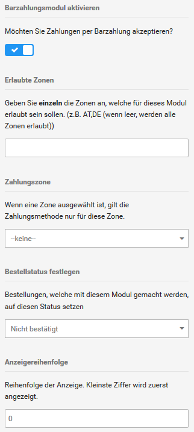

|Feldname|Beschreibung|
|--------|------------|
|Barzahlungsmodul aktivieren|Bei ✔ kann der Kunde die Zahlungsweise im Bestellvorgang auswählen \[✔\]|
|Erlaubte Zonen|kommagetrennte Liste der zweistelligen ISO-Codes für Länder, aus denen die Zahlungsweise verwendet werden darf \(alle Länder bei keinem Eintrag\)|
|Zahlungszone|Steuerzone, aus der die Zahlungsweise verwendet werden darf \(überschreibt _**Erlaubte Zonen**_\) \[--keine--\]|
|Bestellstatus festlegen|Bestellstatus, der einer Bestellung mit dieser Zahlungsweise nach Eingang zugewiesen wird \[Standard\]|
|Anzeigereihenfolge|Reihenfolge, in der installierte Zahlungsmodule im Bestellprozess angezeigt werden \(je größer die Zahl, desto weiter unten wird das Modul angezeigt\); einmaliger Wert je Modul \[0\]|

### PayPal und PayPal Plus

In Shops ab der Versionsreihe 2.4 ist standarmäßig das Modul _**PayPal und PayPal Plus \(paypal3\)**_ enthalten. Hierüber kann nicht nur die PayPal-seitige REST \(REprensentational State Transfer\)-Schnittstelle verwendet werden, sondern auch die neuen PayPal Plus Funktionsmerkmale.

#### Installieren des Moduls zur Verwendung im Shop

 unter Module > Zahlungsweisen >
      Sonstige")

Um _**PayPal**_ als Zahlungsweise zu installieren, rufe im Administrationsbreich des Shops den Menüpunkt _**Module \> Zahlungsweisen \> Sonstige**_ auf. Markiere das Modul, sodass es blau hinterlegt ist und klicke anschließend auf die Schaltfläche _**Installieren**_.

 unter Module >
      Zahlungsweisen > Sonstige, nach der Installation")

|Feldname|Beschreibung|
|--------|------------|
|Kürzel für Bestellübersicht|Kürzel für die Zahlungsweise in der Bestellübersicht|
|Paypal-Zahlungsmodul aktivieren|Mit dieser Einstellung kann das Modul deaktiviert oder aktiviert werden. Will man aus einem bestimmten Grund kurzzeitig kein Paypal anbieten, sollte das Modul hierüber deaktiviert werden, statt es zu deinstallieren.|
|Anzeigereihenfolge|Reihenfolge in der die Zahlungsweise angezeigt wird, ist standardmäßig auf -9999 eingestellt \(empfohlene Einstellung\).|
|Erlaubte Zonen|Kürzel der Länder für die PayPal-Zahlungen angeboten werden sollen. Die Eingabe erfolgt kommagetrennt ohne Leerzeichen, z.B.: DE,AT,CH|
|Zahlungszone|Alternativ kann hierüber eine Auswahl der betreffenden Steuerzone getroffen werden. Da sich die erlaubten Zonen und die Zahlungszone widersprechen können \(z.B. CH in erlaubte Zonen, aber Steuerzone Deutschland\), sollte nur eines ausgefüllt werden.|

!!! danger "Achtung"

	 Sollten nach der Installation des Moduls unter _**Module \> Zahlungsweisen \> Sonstige**_ Fehler auftreten, leere bitte ein Mal alle Caches des Shops. Dies kann unter _**Toolbox \> Cache**_ vorgenommen werden.

#### Erhalten von Zugangsdaten bei PayPal {#paypal_und_paypal_plus_zugangsdaten}

!!! danger "Achtung"

	 Wir setzen an dieser Stelle voraus, dass du dich bereits für ein Händlerkonto bei PayPal registriert hast. Ist dies nicht der Fall, muss dies vor den folgenden Schritten vorgenommen werden.

!!! danger "Achtung"

	 Bei der Verwendung von _**PayPal und PayPal Plus v3.x**_ können deine bisherigen Zugangsdaten für vorangegangene PayPal-Module nicht übernommen werden, es muss ein neuer Zugang generiert werden.

Logge dich mit deinen Login-Zugangsdaten auf **https://developer.paypal.com** ein.

Scrolle hinunter zu _**REST API apps**_ und erstelle dort eine neue App per _**Create App**_ Schaltfläche. Den nun abgefragten Namen für die App kannst du frei vergeben, er dient deiner eigenen Identifikation, falls mehrere Shops, etc. an das PayPal Konto angebunden werden sollen. Unter _**Sandbox Developer Account**_ wählst du deinen im vorherigen Schritt angelegten Sandbox Account. Bleibt diese Auswahl leer, erfüllt der Sandbox Account nicht alle Anforderungen.

Dies ist üblicherweise dann der Fall, wenn du in deinem Konto bereits einen Sandbox Account angelegt hattest und daher den vorherigen Schritt übersprungen hast. Bitte lege in diesem Fall dann trotzdem einen neuen Sandbox Account an, um das Problem zu beheben.

Nach dem Klick auf _**Create App**_ bekommst du die Zugangsdaten für den _**Sandbox**_- Modus angezeigt. Über die Schaltfläche _**live**_ oben rechts kannst du die Anzeige auf die Anzeige der Zugangsdaten für den produktiven Betrieb umschalten.

!!! danger

	 Das Secret wird ggf. nicht direkt angezeigt, klicke hier auf _**show**_.

Kopiere diese \(_**Client ID**_ und _**Secret**_\) bitte in die Zugangsdaten-Felder des PayPal-Moduls.

Abgefragte Felder für _**Return URL**_, etc. können unbeachtet bleiben. Sie sind für die Funktion des Moduls nicht relevant. Die _**App feature options**_ können auf Standardwerten belassen werden.

#### Konfiguration

Die Konfiguration von PayPal kann unter _**Module \> Zahlungsweisen \> Sonstige**_, nachdem dort _**PayPal und PayPal Plus \(paypal3\)**_ ausgewählt worden ist, vorgenommen werden. Klicke hierzu auf _**Konfiguration**_. Es stehen die Reiter _**Allgemein**_ und _**Experteneinstellung**_ zur Verfügung. Klicke den jeweiligen Reiter an, um diesen zu öffnen.

##### Allgemein

PayPal 3 wird weitestmöglich vorkonfiguriert. Für die Ersteinrichtung ist zunächst die Eingabe der Zugangsdaten notwendig:

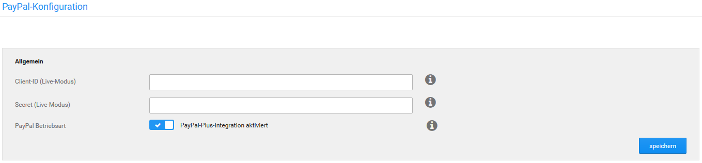

!!! danger "Achtung"

	 Für die Verwendung von _**PayPal und PayPal Plus v3.x**_ sind neue Zugangsdaten für die sogenannte REST-Schnittstelle erforderlich. Deine bisherigen Zugangsdaten können **nicht** weiter verwendet werden! \(vgl. Kapitel _**Erhalten von Zugangsdaten bei PayPal**_\)

Gib deine PayPal-Zugangsdaten ein und wähle die _**Betriebsart**_ der Schnittstelle. Standardmässig ist der _**Klassikmodus**_ aktiviert, in dem sich die Zahlungsweise für Kunden so verhält, wie du es von bisherigen PayPal-Modulen gewohnt bist. Im PLUS-Modus wandert die Auswahl der Zahlart von der PayPal Webseite in die Zahlungsauswahl des Shops. Klicke auf _**Schnittstelle einrichten**_, um die Ersteinrichtung vorzunehmen.

!!! danger "Achtung"

	 Für den Betrieb der Schnittstelle im PLUS-Modus, musst du eine Freigabe von _**PayPal**_ besitzen. Wenn du die Schnittstelle in den PLUS-Modus schaltest, aber keine Freigabe besitzt, wird je nach Status deines Händlerkontos bei PayPal eine unvollständige Auswahl von PayPal-Zahlungsweisen oder eine Fehlermeldung anstatt der PayPal Zahlungsweisen angezeigt. Nach Aktivierung des PLUS-Modus solltest du zu deiner eigenen Sicherheit eine Probebestellung durchführen und dabei prüfen, ob die Zahlungsweisen korrekt und wie gewünscht angezeigt werden. Solltest du noch keine Freigabe besitzen, kannst du diese hier bei PayPal beantragen: https://www.paypal.com/de/webapps/mpp/paypal-plus

##### Experteneinstellungen 

###### Bestellstatusänderungen nach Aktionen

Über den Bereich _**Bestellstatusänderungen nach Aktionen**_ kann der jeweilige Bestellstatus nach einer

-   abgeschlossenen Zahlung
-   schwebenden Zahlung
-   fehlgeschlagenen Zahlung

festgelegt werden. Wähle hierzu den jeweiligen Status über das Dropdown-Menü aus und klicke auf _**Speichern**_.

###### Darstellung im Shop

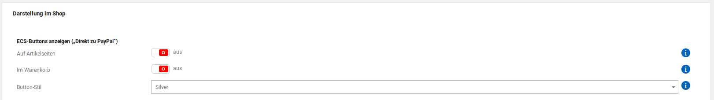

Über die Einstellungen unter _**Darstellung im Shop**_ können Details zur Darstellung von PayPal vorgenommen werden.

Hierbei kann die Verwendung der _**ECS**_ \(Express Checkout Shortcut, ‘Direkt zu PayPal‘\)-Buttons für den _**Warenkorb**_ und die _**Artikeldetailseite**_ an- bzw. abgeschaltet werden. Über diese Buttons ist ein verkürzter Bestellvorgang möglich. Zudem kann die Darstellung der Buttons über den _**Button-Stil**_ geändert werden.

Nimm die gewünschten Einstellungen vor und bestätige diese mit einem Klick auf _**Speichern**_.

###### Sonstige Einstellungen

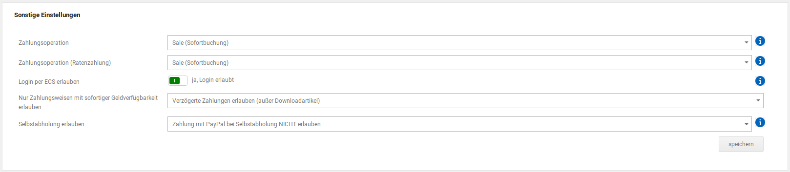

Wird das Zahlungsmodul im Klassik-Modus verwendet, sind für die Zahlungsoperationen folgende Einstellungen möglich:

-   _**Sale**_ - In diesem Modus wird die Zahlung sofort abgebucht und deinem Händlerkonto gutgeschrieben
-   _**Authorization**_ - Dieser Modus reserviert den Rechnungsbetrag zunächst, die Abbuchung muss aber nachträglich manuell ausgelöst werden.

    Dies ist zum Beispiel dann sinnvoll, wenn du Waren mit längeren Lieferfristen verkaufst und dem Kunden erst zum Zeitpunkt der Lieferung der Betrag abgebucht werden soll.

-   _**Order**_ - entspricht dem Authorization-Betrieb, bis auf den Punkt dass beim Kunden der Zahlbetrag nicht fest vorgemerkt wird. Der Betrag wird erst in einem Folgeschritt fest reserviert und abgebucht.

!!! note "Hinweis" 
	 Bei der Verwendung von _**PayPal Plus**_ als Betriebsart wird immer _**Sale**_ verwendet.

Über _**Login per ECS erlauben**_ kann festgelegt werden, was geschieht wenn ein Kunde nach einer ECS-Zahlung \(„Direkt zu PayPal“\) in den Shop zurückkehrt. Ist der Kunde nicht in den Shop eingeloggt, besitzt aber ein Kundenkonto im Shop \(identifiziert anhand der E-Mail Adresse\) muss der Kunde im Regelfall sein Shopkennwort eingeben. Wird diese Option aktiv gesetzt, wird das Passwort im Shop nicht abgefragt, der Kunde wird direkt ins Shop-Kundenkonto eingeloggt.

Zudem gibt es die Einstellung _**Nur Zahlungsweisen mit sofortiger Geldverfügbarkeit erlauben**_. Hier kann ausgewählt werden, ob verzögerte Zahlungen \(z.B. Rechnung\) erlaubt sind. Auch die Einschränkung auf physische Artikel ist mit der Auswahl _**Verzögerte Zahlungen erlauben \(außer Downloadartikel\)**_ möglich.

Darüber hinaus kann festgelegt werden, ob bei PayPal-Bestellungen _**Selbstabholung**_ durch den Kunden _**erlaubt**_ ist. Beachte bei der Wahl der Einstellung insbesondere die dadurch möglichen Implikationen in Bezug auf den PayPal-Käuferschutz.

Nimm die jeweiligen Einstellungen vor und bestätige diese mit einem Klick auf _**Speichern**_.

###### Entwicklertools

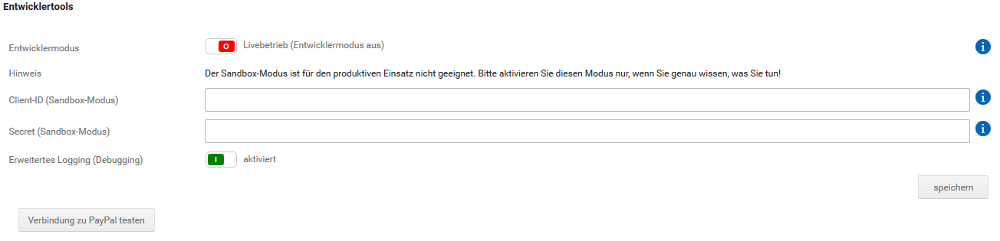

!!! danger "Achtung"

	 Die Optionen auf dieser Seite dienen der Fehlersuche und Testzwecken. Alle Optionen dieser Seite sollten im Livebetrieb deaktiviert sein.

Über die Entwicklertools können der _**Sandbox-Modus**_ aktiviert werden, um PayPal vom Live-Betrieb in den Testmodus zu versetzen und die notwendigen Zugangsdaten für dessen Verwendung eingegeben werden. Zudem kann ein _**erweitertes Logging**_ aktiviert werden, dessen Informationen im Fehlerfall bei der Fehlersuche von Nutzen sind. Über die Schaltfläche _**Verbindung zu PayPal testen**_ kann die Verbindung zu den PayPal-Servern geprüft werden. Der Test ist eine allgemeine technische Verbindungsprüfung, der Zugangsdaten nicht berücksichtigt und somit keine Indizien auf deren Korrektheit liefert.

Nimm hier die gewünschten Einstellungen vor und bestätige diese mit einem Klick auf _**Speichern**_.

###### Automatische Statusaktualisierungen von Zahlungen \(PayPal-Parameter\)

Über die automatische Statusaktualisierung wird für Bestellungen, dessen Zahlung in der Schwebe ist, eine automatisierte Prüfung durchgeführt und der Bestellstatus im Shop aktualisiert.

Dies erfordert die Einrichtung eines sogenannten _**Webhooks**_ für dein PayPal-Konto, über den die automatische Prüfung angestoßen wird. Hierfür ist es zwingend erforderlich, dass dein Shop mit einem gültigen _**SSL**_-Zertifikat ausgestattet und über _**SSL**_ erreichbar ist.

Bei der Ersteinrichtung des Moduls wird versucht die automatischen Statusaktualisierungen automatisch einzurichten, dies kann auf dieser Seite kontrolliert werden. Wenn die Einrichtung nicht erfolgreich war, kann über den Button _**Benachrichtigungen einrichten**_ ein erneuter Versuch unternommen werden. Über die _**löschen**_-Buttons im ID-Feld der unteren Tabelle können bei PayPal hinterlegte Endpunkte \(soweit bereits vorhanden\) zu Aufräumzwecken gelöscht werden.

Falls kein SSL zur Verfügung steht, kann alternativ auch ein sogenannter _**Cronjob**_ bei deinem Hosting-Anbieter eingerichtet werden, der den Status jeder offenen PayPal Bestellung überprüft und bei Veränderungen aktualisiert. Verwende die untere URL im Bereich _**Automatische Statusaktualisierungen von Zahlungen \(PayPal-Parameter\)**_ als Vorlage, um diesen einzurichten.

###### Darstellung auf der PayPal Zahlungsseite \(PayPal-Parameter\)

Über diesen Unterpunkt kann die grafische Darstellung der PayPal-Zahlungsseite angepasst werden. Die Ersteinrichtung des Moduls erzeugt dabei eine funktionierende Konfiguration, schlägt dies fehl wird oben auf der Seite ein Warnhinweis eingeblendet. Klicke auf _**Neues Darstellungsprofil anlegen**_ oder _**löschen**_ um Darstellungsprofile zu verwalten. Bei der Bearbeitung des Profils sind die Einstellungen

-   Name
-   Startseitentyp
-   Markenname
-   Logo-URL
-   Lokalisierung der Zahlungsseiten

möglich.

Verwende die Buttons _**verwenden\[xx\]**_ um ein Darstellungsprofil mit einer Shopsprache zu verknüpfen.

!!! note "Hinweis" 
	 Für den fehlerfreien Betrieb muss mit jeder im Shop aktivierten Sprache ein Darstellungsprofil verknüpft sein. Damit die PayPal Zahlungsoptionen für Kunden immer in der richtigen Sprache angezeigt werden, empfiehlt es sich für jede im Shop aktivierte Sprache ein separates Profil anzulegen und passend zu konfigurieren.

### Bezahlen über Amazon \(amazonadvpay\) {#bezahlen_ueber_amazon}

Das Modul _**Bezahlen über Amazon**_ verwendet die Schnittstelle _**Amazon Advanced Payments**_ zur Zahlungsabwicklung.

!!! danger "Achtung"

	 Ein _**Checkout by Amazon**_-Konto kann standardmäßig **nicht** für _**Bezahlen über Amazon**_ verwendet werden. Bitte wende dich hier an Amazon, um dein Händlerkonto künftig für Advanced Payments nutzen zu können.

!!! note "Hinweis" 
	 Wir empfehlen dieses Modul zusammen mit dem _**Single Sign-On für Amazon**_ zu verwenden, da das sogenannte Session-Handling dann zuverlässiger ist.

#### Installation

Bezahlen mit Amazon kann unter _**Module \> Zahlungsweisen \> Sonstige**_ installiert werden. Wähle hierzu den gezeigten Modul-Eintrag aus und klicke in der rechten Spalte auf _**Installieren**_. Anschließend kann das Modul bearbeitet oder konfiguriert werden.

##### Bearbeitung

|Feldname|Beschreibung|
|--------|------------|
|Kürzel für Bestellübersicht|Kürzel für die Zahlungsweise, die in der Bestellübersicht angezeigt wird|
|Bezahlungen durch Amazon Advanced Payments aktivieren|Modul aktivieren/deaktivieren|
|Erlaubte Zonen|Das Modul kann hier auf bestimmte Länder eingeschränkt werden. Soll die Anzeige nur in Deutschland erfolgen, genügt die Angabe 'DE' \(ohne Anführungszeichen\).|
|Anzeigereihenfolge|Nummer für die Anzeigereihenfolge bei der Auflistung der Zahlungsweisen im Bestellvorgang|
|Bestellstatus festlegen|Bestellungen mit der Zahlungsweise Bezahlen über Amazon erhalten diesen Bestellstatus|

### Konfiguration 

Wurde das Modul installiert, kann über die Schaltfläche _**konfigurieren**_ die Konfigurationsseite des Moduls aufgerufen werden.

##### Zugangsdaten

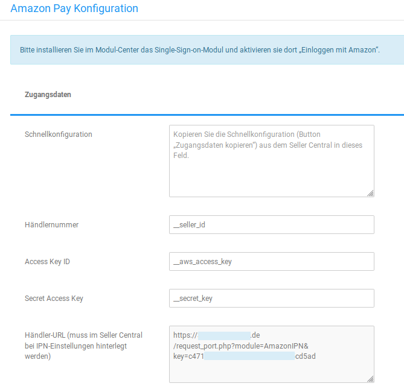

|Feldname|Beschreibung|
|--------|------------|
|Händlernummer|13-stellige Kombination aus Großbuchstaben und Zahlen. Diese erhältst du von Amazon.|
|Access Key ID|20-stellige Kombination aus Großbuchstaben und Zahlen. Diese erhältst du von Amazon.|
|Secret Access Key|40-stellige Kombination aus Groß- und Kleinbuchstaben, Sonderzeichen und Zahlen. Diese erhältst du von Amazon.|
|Händler-URL|Diese URL sollte im Amazon Seller Central hinterlegt werden, damit die automatische Übertragung von Daten von Amazon in den Shop gewährleistet ist \(Rechnungsdaten, Status\).|

##### Erscheinungsbild

|Feldname|Beschreibung|
|--------|------------|
|Farbe des Buttons|Es kann zwischen den Buttonfarben Orange und Beige gewählt werden.|
|Größe des Buttons|Es stehen mittelgroß, groß und extragroß zur Auswahl.|
|Versteckter Button|Anzeige des Buttons an- oder ausschalten.|

##### Einstellungen

|Feldname|Beschreibung|
|--------|------------|
|Betriebsmodus|zwischen _**Sandbox**_- und Livebetrieb \(_**produktiv**_\) umschalten. Der Sandbox-Modus sollte nicht verwendet werden, wenn der Shop online geschaltet ist.|
|Standort|Standort des Shops|
|Autorisierung|Die Autorisierung der Zahlungen kann _**automatisch synchron**_ \(Standard\), _**automatisch asynchron**_ oder _**manuell**_ erfolgen. Die Autorisierung kann direkt im Zuge der Bestellung geschehen oder später manuell.   
|  |manuell: nur in Spezialfällen, sollte allgemein vermieden werden
|  |synchron: sofortige Sicherstellung, dass die Autorisierung gültig ist
|  |asynchron: verzögerungsfreier Bestellabschluss, Autorisierung erfolgt ggf. später oder gar nicht

|Feldname|Beschreibung|
|--------|------------|
|Einzug|kann _**manuell**_ oder _**sofort bei Autorisierung**_ erfolgen, letzteres erfordert eine separate Freischaltung durch Amazon Payments, sollte nur nach Rücksprache mit Amazon ausgewählt werden.|
|Transaktionsverwaltung|kann zwischen _**Shop**_ \(Standard\) und _**externes ERP-System**_ umgeschaltet werden. Bei der Einstellung _**externes ERP-System**_ werden der Bestellung nachgelagerte Aufgaben nicht vom Shop, sondern einem ERP-System übernommen. Hierfür muss ein APA-kompatibles ERP-System zur Verfügung stehen.|
|Verarbeitung von Sofortbenachrichtigungen|Erlaubt die Verwendung von IPN \(Instant Payment Notification\)-Nachrichten über die gleichnamige Schnittstelle von Amazon. Diese Einstellung sollte i.d.R. aktiviert sein, um Statusaktualisierungen ohne den Button _**Daten aktualisieren**_ zu ermöglichen. Dies erfordert ein aktuelles SSL-Zertifikat und das Hinterlegen der Händler-URL im Seller Central.|
|Bestellstatus bei erfolgter Autorisierung|Standard: Zahlung autorisiert \(Amazon\)|
|Bestellstatus bei abgelehnter Autorisierung|Standard: Autorisierung abgelehnt \(Amazon\)|
|Bestellstatus bei final abgelehnter Autorisierung|Standard: final abgelehnt \(Amazon\)|
|Bestellstatus nach erfolgreichen Einzug|Standard: Betrag eingezogen \(Amazon\)|
|Bestellstatus nach fehlgeschlagenem Einzug|Standard: Einzug fehlgeschlagen \(Amazon\)|

##### Standard-Bestellstatūs verwendens

Sind die oben erwähnten Bestellstatus noch nicht im Shop vorhanden, so können diese hierüber angelegt werden. Die Verwendung ist jedoch optional.

##### Verbindung prüfen

Hierüber kann geprüft werden, ob Amazon erreichbar ist. Dies sagt jedoch nichts darüber aus, ob die Konfiguration korrekt vorgenommen wurde. Betätigt man den Button, erhält man am oberen Ende der Seite eine Rückmeldung wie diese:

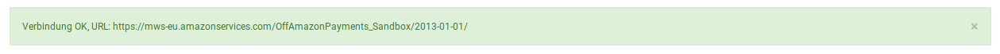

#### Darstellung im Bestellvorgang

!!! danger "Achtung"

	 Der Bezahlvorgang über Amazon kann ausschließlich vom Warenkorb aus eingeleitet werden. Erfolgt stattdessen die Auswahl der Zahlungsweise händisch über den Bestellvorgang, so wird der Kunde zurück zum Warenkorb geleitet, wo er den Amazon-Button betätigen muss.

##### Warenkorb

Hier beginnt der Bestellvorgang mit AmazonPay über den gleichnamigen Button. Das rote S auf dem Button ist dem Sandbox-Betrieb geschuldet. Der Klick auf den Button öffnet das Login-Fenster von Amazon.

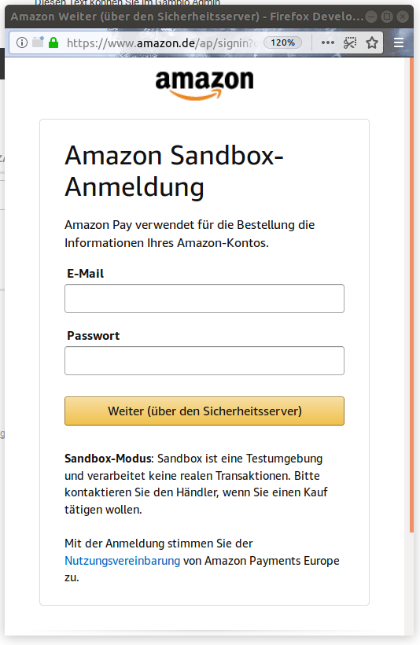

##### Versandartenauswahl

Der Kunde wählt hier aus seinem Amazon-Adressbuch die gewünschte Lieferadresse aus. Dieser Block wird oberhalb der wählbaren Versandarten angezeigt.

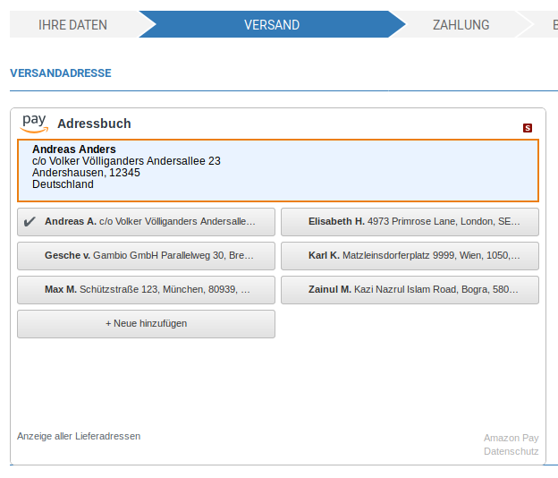

##### Zahlungsweisenauswahl

Im Anschluss kann aus den bei Amazon hinterlegten Zahlungsweisen gewählt werden. Darunter findet sich der übliche Abschnitt mit den Rechtstexten.

##### Zusammenfassung

Auf der letzten Seite der Bestellung werden die Informationen wie gewohnt zusammengefasst, die Adressdaten und darunter die Artikel aufgeführt. Hier kann die Bestellung mit Klick auf _**kostenpflichtig bestellen**_ abgeschlossen werden.

#### Behandlung der Bestellungen

Bei Bestellungen mit der Zahlungsweise _**Bezahlen über Amazon**_ gibt es in den Bestelldetails einen zusätzlichen Abschnitt, über den verschiedene Funktionen ausgelöst werden können:

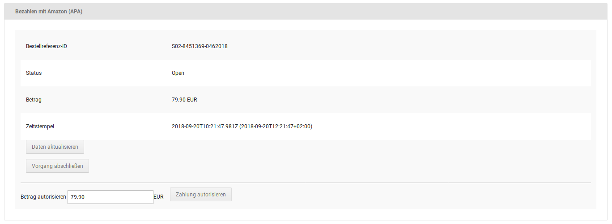

##### Daten aktualisieren

Über diese Funktion können die Rechnungsdaten aktualisiert werden. Eine manuelle Aktualisierung kann dann sinnvoll sein, wenn dein Shop nicht SSL-verschlüsselt ist oder die Händler-URL nicht im Seller Central hinterlegt wurde und daher keine automatische Übertragung von Adressdaten, Beträgen oder Bestellstatus erfolgen kann.

Bei Bestellungen mit _**Bezahlen über Amazon**_ als Zahlungsweise steht zuerst immer _**Wird später übertragen**_ in der Rechnungsadresse. Dies ändert sich, sobald Amazon zugestimmt hat, die Zahlung abzuwickeln. Dies erfolgt normalerweise wenige Minuten nach der Bestellung. Ändern sich die Daten aus den oben genannten Gründen nicht automatisch, können diese hierüber manuell aktualisiert werden.

##### Vorgang abschließen

Der Vorgang kann als abgeschlossen gemeldet werden. Danach können keine weiteren Autorisierungen, Einzüge etc. mehr vorgenommen werden. Das Abschließen des Vorgangs ist optional.

##### Zahlung autorisieren

Die Zahlung wird normalerweise automatisch autorisiert, dies muss nur in Ausnahmefällen manuell erfolgen.

### Payone

Payone ist einer der größten Zahlungsdienstleister in Deutschland und bietet auch Leistungen wie Risikomanagement und Forderungsabwicklung bis hin zum Inkassoverfahren an.

!!! note "Hinweis"

	 Diese Zahlungsweise ist nur in selbstgehosteten Shops verfügbar.

#### Installation

Die Payone-Zahlungsweisen können unter _**Module \> Zahlungsweisen \> Sonstige**_ installiert werden. Klicke hierzu zunächst auf den Eintrag _**PAYONE**_ hinter dem Plus-Zeichen, es wird die Liste der verfügbaren Payone-Module aufgeklappt. Wähle jeweils die Modul-Einträge aus, die den Zahlungsweisen entsprechen, welche du anbieten möchtest und verwende die Schaltfläche _**Installieren**_. Über _**Deinstallieren**_ kann die jeweilige Zahlungsweise wieder aus dem Bestellvorgang entfernt werden.

!!! danger "Achtung"

	 Nur Zahlungsweisen, dessen Module hier installiert worden sind, werden im Bestellvorgang angezeigt.

Nachdem ein Modul installiert ist, kann über _**Bearbeiten**_ der Geltungsbereich konfiguriert werden.

|Feldname|Beschreibung|
|--------|------------|
|Kürzel für Bestellübersicht|Kürzel, das in der Bestellübersicht in der Spalte Zahlung angezeigt wird.|
|Modul aktivieren|Ist der Haken gesetzt, wird das Modul im Bestellvorgang verwendet.|
|Erlaubte Zonen|Hier werden die Länder angegeben, für die das Modul angezeigt werden soll. Die Eingabe erfolgt durch kommagetrennte Ländercodes, z.B. _**DE,AT,CH**_|
|Zahlungszone|Die Zahlungszone kann hier zudem auf die _**Steuerzone EU**_, _**Steuerzone EU-Ausland**_ oder _**B2B**_ begrenzt werden. Diese Einstellungen können mit den erlaubten Zonen kollidieren, es sollte daher nur eines von beiden eingestellt werden.|
|Reihenfolge der Anzeige|Legt die Position des Moduls in der Reihenfolge der Zahlungsmodule im Bestellvorgang fest. Es muss darauf geachtet werden, dass die Einstellungen im Modul mit den Einstellungen in der Payone-Konfiguration übereinstimmen.|

Über die _**Erweiterte Konfiguration**_ lassen sich die Punkte _**Payone API-Log**_ und _**Payone Konfiguration**_ aufrufen.

#### Konfiguration

##### Konfiguration der Bestellstatus

Hier können die Bestellstatus konfiguriert werden.

##### Globale Parameter

Hier werden die Login-Daten zu Payone hinterlegt.

|Feldname|Beschreibung|
|--------|------------|
|Merchant-ID|ID des zu verwendenden Accounts \(wird von Payone vergeben\)|
|Portal-ID|ID des zu verwendenden Zahlungsportals \(legst du im Merchant-Interface selbst an\)|
|SubAccount-ID|ID des zu verwendenden SubAccounts \(wird von Payone vergeben\). Es können mehrere SubAccounts betrieben werden, z.B. wenn du mehrere Shops betreibst oder die Gelder der im Shop über Payone angebotenen Zahlungsweisen auf unterschiedliche Konten fließen sollen.|
|Schlüssel|Schlüssel des zu verwendenden Zahlungsportals \(wird von Payone vergeben\). Pro Portal-ID gibt es einen Schlüssel.|
|Verfahren Hashwert-Prüfung|Hier kann zwischen den Hashing-Verfahren _**md5**_ und _**Sha2-384**_ gewählt werden. Diese Einstellung ist abhängig von deinen Einstellungen bei Payone.|
|Betriebsmodus|_**Live-Modus**_: Zahlungen werden auf der Payone-Plattform ausgeführt; _**Testmodus**_: Zahlungen werden nur in der Payone-Testumgebung simuliert|
|Autorisierungsmethode|_**Sofortautorisierung**_: Der Betrag wird sofort eingezogen; _**Vorautorisierung**_: Betrag wird erst nur reserviert. Die Vorautorisierung wählt man z.B., wenn vor Erhalt der Zahlung noch die Verfügbarkeit der Ware geprüft werden soll.|
|Warenkorb übertragen|Wird der Warenkorb übertragen, so kannst du später in den Zahlungsdaten ablesen, welche Artikel gekauft wurden. Ist dies aktiviert, so kann jeder Einzelposten vom Zahlungsdienstleister nachgerechnet werden. Diese Einstellung muss für Zahlung auf Rechnung aktiviert sein.|

!!! danger "Achtung"

	 Aufgrund verschiedener Rundungen kann es hier u.U. zu Problemen kommen. Sofern du nicht Zahlung auf Rechnung über Payone anbietest, empfehlen wir die Einstellung _**Warenkorb übertragen**_ zu deaktivieren.

##### Adressprüfung

Die Adressprüfung dient zur Verfikation der eingebenen Adressen im Checkout.

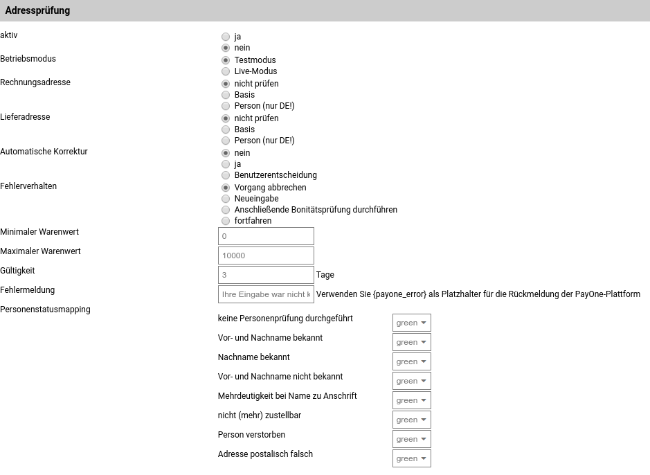

|Feldname|Beschreibung|
|--------|------------|
|Aktiv|Aktiviert die Adressprüfung im Shop. Hierbei ist zu beachten, dass die Adressprüfung anfangs nur zur Verfügung stand, wenn diese Funktion separat gebucht wurde. Seit 2016 ist diese jedoch im Standardumfang neu abgeschlossener Verträge enthalten.|
|Betriebsmodus|Hier wird definiert wie die Adressprüfung verwendet wird. _**Live**_: Zahlungen werden auf der Payone-Plattform ausgeführt; _**Test**_: Zahlungen werden nur in der Payone-Testumgebung simuliert|
|Rechnungsadresse|Mögliche Auswahlen sind _**nicht prüfen**_, _**Basic**_ und _**Person \(Nur in Deutschland möglich\)**_|
|Lieferadresse|Mögliche Auswahlen sind _**nicht prüfen**_, _**Basic**_ und _**Person \(Nur in Deutschland möglich\)**_|
|Automatische Korrektur|Falls im Ergebnis der Adressprüfung eine Korrektur angeboten wird \(secstatus=20\), soll die Korrektur der Daten dann ausführt werden? Mögliche Auswahlen sind hier _**Ja**_, _**Nein**_ und _**Benutzerentscheidung**_ \(Benutzer kann seine Adresse korrigieren oder der Korrektur zustimmen. Eine anschließende Adressprüfung sollte nicht mehr durchgeführt werden.\)|
|Fehlerverhalten|Für den Fall, dass ein Fehler in der Adresse festgestellt wird, kann unterschiedlich fortgefahren werden. Optionen sind hier: _**Neueingabe der Adresse die zum Fehler geführt hat**_, _**Anschließende Bonitätsprüfung durchführen**_, _**fortfahren**_|
|Minimaler Warenwert|Warenkorbwert, ab dem die Adressprüfung durchgeführt wird.|
|Maximaler Warenwert|Warenkorbwert, bis zu dem die Adressprüfung durchgeführt wird.|
|Gültigkeit|Dauer der Gültigkeit des Ergebnisses in Tagen|
|Fehlermeldung|Meldung die dem Kunden im Checkout angezeigt wird, falls nicht korrekte Daten eingegeben wurden. Es muss eine Variable existieren, die ersetzt werden kann durch die Rückmeldung der Payone Plattform.|
|Personenstatusmapping|Je nach Ergebnis der Adressprüfung in der Detailtiefe Person kann dem Ergebnis ein Ampelwert \(green, yellow, red\) zugeordnet werden. Dies hat in der Folge die Konsequenz, dass dem Kunden später bestimmte Zahlarten nicht zur Auswahl bereit stehen.|

##### Bonitätsprüfung

Die Bonitätsprüfung soll zur Auswahl der angebotenen Zahlarten dienen. Diese soll im Checkout-Prozess nach dem Adresscheck \(als Folgeaktion\) oder eigenständig durchgeführt werden.

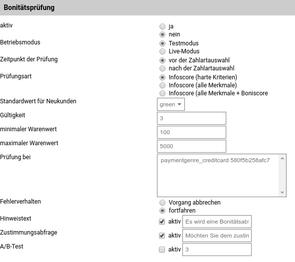

|Feldname|Beschreibung|
|--------|------------|
|Aktiv|Aktiviert die Bonitätsprüfung im Shop|
|Betriebsmodus|Hier wird definiert wie die Bonitätsprüfung verwendet wird. _**Live**_: Zahlungen werden auf der Payone-Plattform ausgeführt; _**Test**_: Zahlungen werden nur in der Payone-Testumgebung simuliert|
|Zeitpunkt der Prüfung|Die Prüfung kann _**vor der Zahlartenauswahl**_ oder _**nach der Zahlartenauswahl**_ ausgeführt werden.|
|Prüfungsart|Die Art der Prüfung kann nach _**Infoscore \(harte Kriterien\)**_, _**Infoscore \(alle Merkmale\)**_ und _**Infoscore \(alle Merkmale + Boniscore\)**_ durchgeführt werden.|
|Standardwert für Neukunden|Der zugewiesene Ampelwert bei Neukunden, wenn keine Bonitätsprüfung durchgeführt wird.|
|Gültigkeit|Gültigkeit des Ergebnisses der Bonitätsabfrage in Tagen. Eine erneute Prüfung innerhalb dieses Zeitraumes darf nicht durchgeführt werden.|
|Minimaler Warenwert|Warenkorbwert, ab dem die Bonitätsprüfung durchgeführt wird.|
|Maximaler Warenwert|Warenkorbwert, bis zu dem die Bonitätsprüfung durchgeführt wird.|
|Prüfung bei|Zahlungsweise bei der die Prüfung ausgeführt werden soll|
|Fehlermeldung|Mehrfachauswahl aller Zahlarten bei der eine Bonitätsprüfung durchgeführt werden soll. Dies greift nur bei Auswahl von _**Nach Zahlartenauswahl**_|
|Fehlerverhalten|Hier muss gewählt werden, ob der Bestellvorgang bei einem Fehler abgebrochen und fortgeführt werden soll.|
|Hinweistext|Text der angezeigt wird, wenn eine Bonitätsüberprüfung durchgeführt wird.|
|Zustimmungsabfrage|Text einer Zustimmungsabfrage an den Käufer. Diese muss der Käufer im Checkout betätigen. Es stehen die Optionen Ja oder Nein zur Auswahl.|
|A/B-Test|Wenn aktiviert, wird nur jede n'te Bonitätsprüfung durchgeführt, gemäß dem zu konfigurierenden Wert.|

Nach unserem letzten Stand ist es so, dass das Modul _**PROTECT**_ bei Payone gebucht werden muss, wenn die Bonitätsprüfung durchgeführt werden soll. Anderenfalls steht diese Funktion nicht zur Verfügung.

Die Definition, welche Zahlarten im Checkout angeboten werden, sind in der jeweiligen Zahlart einstellbar. Dies soll ein Wert im Bereich von 0-1000 \(0= schlechte Bonität, 1000= beste Bonität\) sein. Wenn keine Boniscoreermittlung stattfindet, werden die Ampelwerte in den entsprechenden _**scorevalue**_ umgerechnet.

Dieser ermittelt sich wie folgt:

|Ampelwert \(score\)|Bonitätsindex \(scorevalue\)|
|-------------------|----------------------------|
|Green|500|
|Yellow|300|
|Red|100|

##### Konfiguration der Zahlungsarten

Hier können die aktivierten Zahlungsarten konfiguriert werden, die vorher über _**Zahlungsart hinzufügen**_ angelegt wurden. Die sechs grundlegenden Arten von Zahlungsmodulen werden hier beschrieben, da alle zusätzlich hinzugefügten Zahlungsweisen einer dieser Arten entsprechen, wird hier nicht auf jede Eventualität eingegangen. Payone unterstützt verschiedene Zahlungsweisen, für weitere Details wende dich bitte für eine Beratung an Payone.

Es muss dabei beachtet werden, dass für jede Zahlungsweise auch ein Modul unter _**Module \> Zahlungsweisen**_ zu finden ist, das installiert werden muss. Geschieht dies nicht, wird die Zahlungsweise nicht im Bestellvorgang angezeigt und kann nicht benutzt werden.

###### Kreditkarten \(paymentgenre\_creditcard\)

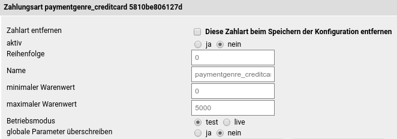

|Feldname|Beschreibung|
|--------|------------|
|Zahlart entfernen|Entfernt die Zahlart aus der Auflistung unter _**Konfiguration der Zahlungsweisen**_.|
|aktiv|Aktiviert oder deaktiviert die Zahlungsweise|
|Reihenfolge|Legt die Reihenfolge des Moduls in der Zahlungsweisenübersicht im Bestellvorgang fest. Diese Angabe muss mit den Angaben im Modul selbst übereinstimmen, die unter _**Module \> Zahlungsweisen**_ gemacht wurden.|
|Name|Legt den Namen des Zahlungsmodules fest, den es im Bestellvorgang und im Gambio Admin tragen soll. Voreingetragen ist standardmäßig ein Name wie _**paymentgenre\_creditcard 5810c291d056e**_.|
|minimaler Warenwert|Legt fest, ab welchem Mindestbestellwert das Modul angezeigt wird.|
|maximaler Warenwert|Legt die maximale Bestellsumme fest, die über das Modul bezahlt werden darf.|
|Betriebsmodus|Legt fest, ob das Modul im Test- oder Live-Modus betrieben werden soll.|
|globale Parameter überschreiben|Sollen andere Login-Daten als die unter _**Globale Parameter**_ verwendet werden, kann der Punkt auf _**Ja**_ gestellt und mit anderen Login-Daten überschrieben werden.|

|Feldname|Beschreibung|
|--------|------------|
|Aktive Länder|Die einzelnen Länder können durch Setzen bzw. Entfernen der zugehörigen Haken aktiviert respektive deaktiviert werden. Über _**Alle Länder aktivieren**_ oder _**Alle Länder deaktivieren**_ kann die Auswahl entsprechend für alle Länder festgelegt werden. Es werden nur Länder angezeigt, die unter _**Shop Einstellungen \> Land/Steuer \> Länder**_ bzw. _**Einstellungen / Sprachen, Länder, Steuern / Länder**_, nach Aufrufen der Seite, aktiviert sind.|
|Zugelassene Ampelwerte|Hier kannst du festlegen, welche Ampelwerte zulässig sind. Hat ein Kunde einen Ampelwert, der nicht den hier eingestellten entspricht, ist die Zahlung über dieses Modul nicht möglich. Die Ampelwerte werden im Abschnitt _**Bonitätsprüfung**_ näher erläutert.|

|Feldname|Beschreibung|
|--------|------------|
|Abfrage Kartenprüfziffer|Legt fest, ob die Kartenprüfziffer im Bestellvorgang abgefragt werden soll|
|Feldkonfiguration|Hier kannst du das Aussehen der Felder für die abgefragten Kreditkarten-Daten beeinflussen.|
|Typ|Der Typ sollte nicht geändert werden, da dieses Feld festlegt, was für ein Typ Daten abgefragt werden soll. Die Kartennummer besteht zwar nur aus Zahlen, der Inhalt des Feldes wird aber wie ein Textfeld übergeben. Die Prüfnummer entspricht einem Passwort und sollte daher auch so behandelt werden. Bei Gültigkeitsmonat und -jahr hingegen ist es am sinnvollsten, die Daten über ein Dropdown abzufragen, statt dort z.B. _**Text**_ auszuwählen, was den Kunden die Möglichkeit geben würde, das Gültigkeitsdatum selbst einzutippen.|
|Anz. Zeichen|Die mögliche Anzahl Zeichen, die über dieses Feld eingegeben werden kann.|
|Zeichen max.|Die Anzahl Zeichen, die die Angabe maximal haben darf. Eine Kartennummer mit mehr als 20 Zeichen ist nicht korrekt, somit werden auch nicht mehr Zeichen erlaubt.|
|iFrame|Das iFrame hat Standardgrößen, die mit Auswahl von _**Standard**_ automatisch eingetragen werden. Stellt man diesen Punkt auf _**Benutzerdefiniert**_ um, kann man eigene Abmessungen eingeben.|
|Breite & Höhe|Diese Abmessungen werden vorausgefüllt, können aber bei der Auswahl von _**iFrame benutzerdefiniert**_ selbst festgelegt werden.|
|Stil|Auch das Aussehen wird standardmäßig vorangelegt. Wählt man hier _**benutzerdefiniert**_, können eigene CSS-Styles angegeben werden.|
|CSS|Wählt man als Stil _**Benutzerdefiniert**_, können hier eigene CSS-Styles hinterlegt werden.|

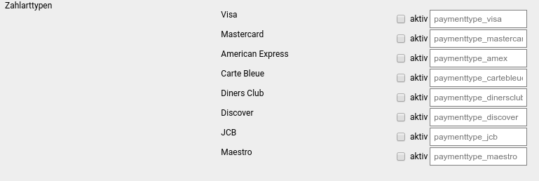

Hier kann ausgewählt werden, welche Kreditkarten akzeptiert werden sollen. Die Namen der Kreditkarten im Bestellvorgang können bei Bedarf verändert werden.

###### Online-Überweisungen \(paymentgenre\_onlinetransfer\)

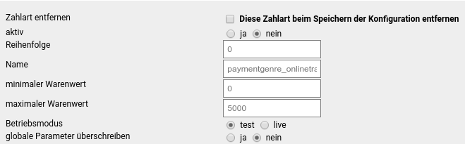

|Feldname|Beschreibung|
|--------|------------|
|Zahlart entfernen|Entfernt die Zahlart aus der Auflistung unter _**Konfiguration der Zahlungsweisen**_.|
|aktiv|Aktiviert oder deaktiviert die Zahlungsweise|
|Reihenfolge|Legt die Reihenfolge des Moduls in der Zahlungsweisenübersicht im Bestellvorgang fest. Diese Angabe muss mit den Angaben im Modul selbst übereinstimmen, die unter _**Module \> Zahlungsweisen**_ gemacht wurden.|
|Name|Legt den Namen des Zahlungsmodules fest, den es im Bestellvorgang und im Gambio Admin tragen soll. Voreingetragen ist hier meist ein Name wie _**paymentgenre\_onlinetransfer 5810c291d056e**_.|
|minimaler Warenwert|Legt fest, ab welchem Mindestbestellwert das Modul angezeigt wird.|
|maximaler Warenwert|Legt die maximale Bestellsumme fest, die über das Modul bezahlt werden darf.|
|Betriebsmodus|Auswahl, ob das Modul im Test- oder Live-Modus betrieben werden soll.|
|globale Parameter überschreiben|Sollen andere Login-Daten als die unter _**Globale Parameter**_ verwendet werden, kann der Punkt auf _**Ja**_ gestellt und mit anderen Login-Daten überschrieben werden.|

|Feldname|Beschreibung|
|--------|------------|
|Aktive Länder|Die einzelnen Länder können durch Setzen bzw. Entfernen der zugehörigen Haken aktiviert respektive deaktiviert werden. Über _**Alle Länder aktivieren**_ oder _**Alle Länder deaktivieren**_ kann die Auswahl entsprechend für alle Länder festgelegt werden. Es werden nur Länder angezeigt, die unter _**Shop Einstellungen \> Land/Steuer \> Länder**_ aktiviert sind.|
|Zugelassene Ampelwerte|Hier kannst du festlegen, welche Ampelwerte zulässig sind. Hat ein Kunde einen Ampelwert, der nicht den hier eingestellten entspricht, ist die Zahlung über dieses Modul nicht möglich. Die Ampelwerte werden im Abschnitt _**Bonitätsprüfung**_ näher erläutert.|

Hier kann ausgewählt werden, welche Zahlartypen akzeptiert werden sollen. Die Namen der akzeptierten Arten der Onlineüberweisung im Bestellvorgang können bei Bedarf verändert werden.

###### e-Wallet \(paymentgenre\_ewallet\)

|Feldname|Beschreibung|
|--------|------------|
|Zahlart entfernen|Entfernt die Zahlart aus der Auflistung unter _**Konfiguration der Zahlungsweisen**_.|
|aktiv|Aktiviert oder deaktiviert die Zahlungsweise|
|Reihenfolge|Legt die Reihenfolge des Moduls in der Zahlungsweisenübersicht im Bestellvorgang fest. Diese Angabe muss mit den Angaben im Modul selbst übereinstimmen, die unter _**Module \> Zahlungsweisen**_ gemacht wurden.|
|Name|Legt den Namen des Zahlungsmodules fest, den es im Bestellvorgang und im Gambio Admin tragen soll. Voreingetragen ist hier meist ein Name wie _**paymentgenre\_ewallet 5810c291d056e**_.|
|minimaler Warenwert|Legt fest, ab welchem Mindestbestellwert das Modul angezeigt wird.|
|maximaler Warenwert|Legt die maximale Bestellsumme fest, die über das Modul bezahlt werden darf.|
|Betriebsmodus|Auswahl, ob das Modul im Test- oder Live-Modus betrieben werden soll.|
|globale Parameter überschreiben|Sollen andere Login-Daten als die unter _**Globale Parameter**_ verwendet werden, kann der Punkt auf _**Ja**_ gestellt und mit anderen Login-Daten überschrieben werden.|

|Feldname|Beschreibung|
|--------|------------|
|Aktive Länder|Die einzelnen Länder können durch Setzen bzw. Entfernen der zugehörigen Haken aktiviert respektive deaktiviert werden. Über _**Alle Länder aktivieren**_ oder _**Alle Länder deaktivieren**_ kann die Auswahl entsprechend für alle Länder festgelegt werden. Es werden nur Länder angezeigt, die unter _**Shop Einstellungen \> Land/Steuer \> Länder**_ bzw. _**Einstellungen / Sprachen, Länder, Steuern / Länder**_, nach Aufrufen der Seite, aktiviert sind.|
|Zugelassene Ampelwerte|Hier kannst du festlegen, welche Ampelwerte zulässig sind. Hat ein Kunde einen Ampelwert, der nicht den hier eingestellten entspricht, ist die Zahlung über dieses Modul nicht möglich. Die Ampelwerte werden im Abschnitt _**Bonitätsprüfung**_ näher erläutert.|
|Zahlarttypen|Als Zahlarttyp ist nur Paypal möglich. Der Name der Zahlungsweise kann manuell geändert werden.|

###### Kontobasierte Zahlungsweisen \(paymentgenre\_accountbased\)

|Feldname|Beschreibung|
|--------|------------|
|Zahlart entfernen|Entfernt die Zahlart aus der Auflistung unter _**Konfiguration der Zahlungsweisen**_.|
|aktiv|Aktiviert oder deaktiviert die Zahlungsweise|
|Reihenfolge|Legt die Reihenfolge des Moduls in der Zahlungsweisenübersicht im Bestellvorgang fest. Diese Angabe muss mit den Angaben im Modul selbst übereinstimmen, die unter _**Module \> Zahlungsweisen**_ gemacht wurden.|
|Name|Legt den Namen des Zahlungsmodules fest, den es im Bestellvorgang und im Gambio Admin tragen soll. Voreingetragen ist hier meist ein Name wie _**paymentgenre\_accountbased 5810c291d056e**_.|
|minimaler Warenwert|Legt fest, ab welchem Mindestbestellwert das Modul angezeigt wird.|
|maximaler Warenwert|Legt die maximale Bestellsumme fest, die über das Modul bezahlt werden darf.|
|Betriebsmodus|Auswahl, ob das Modul im Test- oder Live-Modus betrieben werden soll.|
|globale Parameter überschreiben|Sollen andere Login-Daten als die unter _**Globale Parameter**_ verwendet werden, kann der Punkt auf _**Ja**_ gestellt und mit anderen Login-Daten überschrieben werden.|

|Feldname|Beschreibung|
|--------|------------|
|Aktive Länder|Die einzelnen Länder können durch Setzen bzw. Entfernen der zugehörigen Haken aktiviert respektive deaktiviert werden. Über _**Alle Länder aktivieren**_ oder _**Alle Länder deaktivieren**_ kann die Auswahl entsprechend für alle Länder festgelegt werden. Es werden nur Länder angezeigt, die unter _**Shop Einstellungen \> Land/Steuer \> Länder**_ bzw. _**Einstellungen / Sprachen, Länder, Steuern / Länder**_, nach Aufrufen der Seite, aktiviert sind.|
|Zugelassene Ampelwerte|Hier kannst du festlegen, welche Ampelwerte zulässig sind. Hat ein Kunde einen Ampelwert, der nicht den hier eingestellten entspricht, ist die Zahlung über dieses Modul nicht möglich. Die Ampelwerte werden im Abschnitt _**Bonitätsprüfung**_ näher erläutert.|

|Feldname|Beschreibung|
|--------|------------|
|Kontodaten prüfen|Legt fest ob, und nach welchen Daten die Kontodaten geprüft werden sollen. _**Basis**_ ist eine herkömmliche Prüfung auf Plausibilität und Validität der Bankdaten, während eine Prüfung nach _**POS-Sperrliste**_ einen Abgleich nach Sperrdateien vorsieht. Diese Sperrdateien enthalten Informationen zu offenen Forderungen aus dem Einzelhandel.|
|Kontoländer für SEPA-Lastschrift|Hier können die Länder gewählt werden, in denen SEPA angeboten werden soll.|
|Zusatzfelder Konto/BLZ|Sollen zusätzlich noch Felder für Kontonummer und Bankleitzahl angezeigt werden \(ja/nein\)?|
|Mandatserteilung aktivieren|Das Mandat kann automatisch erteilt werden. Eine Prüfung der Bankdaten findet hierbei immer statt, eine Prüfung nach POS-Sperrliste ist dann allerdings nicht mehr möglich.|
|Download Mandat als PDF|Legt fest, ob nach der Bestellung das Mandat noch als PDF zum Download zur Verfügung stehen soll.|

Als Zahlarttypen stehen hier ausschließlich direkt Kontobezogene Zahlarten zur Auswahl.

###### Finanzierung/Ratenkauf \(paymentgenre\_installment\)

|Feldname|Beschreibung|
|--------|------------|
|Zahlart entfernen|Entfernt die Zahlart aus der Auflistung unter _**Konfiguration der Zahlungsweisen**_.|
|aktiv|Aktiviert oder deaktiviert die Zahlungsweise|
|Reihenfolge|Legt die Reihenfolge des Moduls in der Zahlungsweisenübersicht im Bestellvorgang fest. Diese Angabe muss mit den Angaben im Modul selbst übereinstimmen, die unter _**Module \> Zahlungsweisen**_ gemacht wurden.|
|Name|Legt den Namen des Zahlungsmodules fest, den es im Bestellvorgang und im Gambio Admin tragen soll. Voreingetragen ist meist ein Name wie _**paymentgenre\_installment 5810c291d056e**_.|
|minimaler Warenwert|Legt fest, ab welchem Mindestbestellwert das Modul angezeigt wird.|
|maximaler Warenwert|Legt die maximale Bestellsumme fest, die über das Modul bezahlt werden darf.|
|Betriebsmodus|Auswahl, ob das Modul im Test- oder Live-Modus betrieben werden soll.|
|globale Parameter überschreiben|Sollen andere Login-Daten als die unter _**Globale Parameter**_ verwendet werden, kann der Punkt auf _**Ja**_ gestellt und mit anderen Login-Daten überschrieben werden.|

|Feldname|Beschreibung|
|--------|------------|
|Aktive Länder|Die einzelnen Länder können durch Setzen bzw. Entfernen der zugehörigen Haken aktiviert respektive deaktiviert werden. Über _**Alle Länder aktivieren**_ oder _**Alle Länder deaktivieren**_ kann die Auswahl entsprechend für alle Länder festgelegt werden. Es werden nur Länder angezeigt, die unter _**Shop Einstellungen \> Land/Steuer \> Länder**_ bzw. _**Einstellungen / Sprachen, Länder, Steuern / Länder**_, nach Aufrufen der Seite, aktiviert sind.|
|Zugelassene Ampelwerte|Hier kannst du festlegen, welche Ampelwerte zulässig sind. Hat ein Kunde einen Ampelwert, der nicht den hier eingestellten entspricht, ist die Zahlung über dieses Modul nicht möglich. Die Ampelwerte werden im Abschnitt _**Bonitätsprüfung**_ näher erläutert.|
|Zahlarttypen|Bei dieser Zahlungsweise ist Ratenzahlung nur über _**CommerzFinanz**_ möglich.|

###### Rechnung/Refactoring \(paymentgenre\_safeinv\)

|Feldname|Beschreibung|
|--------|------------|
|Zahlart entfernen|Entfernt die Zahlart aus der Auflistung unter _**Konfiguration der Zahlungsweisen**_.|
|aktiv|Aktiviert oder deaktiviert die Zahlungsweise|
|Reihenfolge|Legt die Reihenfolge des Moduls in der Zahlungsweisenübersicht im Bestellvorgang fest. Diese Angabe muss mit den Angaben im Modul selbst übereinstimmen, die unter _**Module \> Zahlungsweisen**_ gemacht wurden.|
|Name|Legt den Namen des Zahlungsmodules fest, den es im Bestellvorgang im Gambio Admin tragen soll. Voreingetragen ist meist ein Name wie _**paymentgenre\_safeinv 5810c291d056e**_.|
|minimaler Warenwert|Legt fest, ab welchem Mindestbestellwert das Modul angezeigt wird.|
|maximaler Warenwert|Legt die maximale Bestellsumme fest, die über das Modul bezahlt werden darf.|
|Betriebsmodus|Auswahl, ob das Modul im Test- oder Live-Modus betrieben werden soll.|
|globale Parameter überschreiben|Sollen andere Login-Daten als die unter _**Globale Parameter**_ verwendet werden, kann der Punkt auf _**Ja**_ gestellt und mit anderen Login-Daten überschrieben werden.|

|Feldname|Beschreibung|
|--------|------------|
|Aktive Länder|Die einzelnen Länder können durch Setzen bzw. Entfernen der zugehörigen Haken aktiviert respektive deaktiviert werden. Über _**Alle Länder aktivieren**_ oder _**Alle Länder deaktivieren**_ kann die Auswahl entsprechend für alle Länder festgelegt werden. Es werden nur Länder angezeigt, die unter _**Shop Einstellungen \> Land/Steuer \> Länder**_ bzw. _**Einstellungen / Sprachen, Länder, Steuern / Länder**_, nach Aufrufen der Seite, aktiviert sind.|
|Zugelassene Ampelwerte|Hier kannst du festlegen, welche Ampelwerte zulässig sind. Hat ein Kunde einen Ampelwert, der nicht den hier eingestellten entspricht, ist die Zahlung über dieses Modul nicht möglich. Die Ampelwerte werden im Abschnitt _**Bonitätsprüfung**_ näher erläutert.|

|Feldname|Beschreibung|
|--------|------------|
|Payolution: B2B-Handel erlaubt|Legt fest, ob auch Gewerbekunden hierüber zahlen dürfen.|
|Payolution: Unternehmensname|Der Unternehmensname des Shopbetreibers|
|Payolution: Kontoinhaber|Die Angaben zur Kontoverbindung erhältst du von Payone|
|Payolution: Kreditinstitut|Die Angaben zur Kontoverbindung erhältst du von Payone|
|Payolution: IBAN|Die Angaben zur Kontoverbindung erhältst du von Payone|
|Payolution: BIC|Die Angaben zur Kontoverbindung erhältst du von Payone|
|Payolution: Zahlungsziel \(Tage\)|Die EInstellung _**Zahlungsziel**_ wird nur dann verwendet, wenn von Payolution selbst kein Ziel vorgegeben wird. Aus Bestelldatum und hinterlegtem Zahlungsziel wird dann die Fälligkeit berechnet.|
|Zahlarttypen|Verfügbare Zahlarten sind hier Billsafe und Payolution.|

##### Zahlungsart hinzufügen

Die im Screenshot gezeigte Darstellung tritt dann auf, wenn noch keine Zahlungsart angelegt wurde. Dies erfolgt über _**Zahlungsart hinzufügen**_. Es kann aus folgenden Zahlungsarten gewählt werden:

|Zahlungsart|Zahlungsweise|
|-----------|-------------|
|Kreditkarten \(creditcard\)|American Express, Carte Bleue, Diners Club, Discover, JCB, Maestro, Mastercard, Visa|
|Online-Überweisungen \(onlinetransfer\)|EPS, GiroPay, iDEAL, Post-Finance Card, Post-Finance EFinance, Sofortüberweisung|
|e-Wallet \(ewallet\)|Paypal|
|Kontobasierte Zahlungsweisen \(accountbased\)|Nachnahme, Lastschrift, Rechnung, Vorkasse|
|Finanzierung/Ratenkauf \(installment\)|CommerzFinanz|
|Rechnung/Refactoring \(safeinv\)|BillSAFE, Payolution Rechnung|

#### Konfiguration exportieren

Die Konfiguration kann über den Button _**Konfiguration exportieren**_ exportiert werden. Auf diese Weise kann die Modulkonfiguration dem Support von Payone gesendet werden, falls Probleme aufgetreten sind.

#### Payone API Log

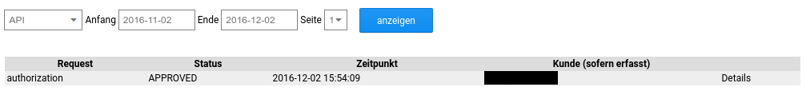

Hier kann für den gewünschten Zeitraum eine Liste aller erfolgten Transaktionen abgerufen werden. Der Eintrag _**Details**_ verweist auf ein ausführliches Log, in dem die zu Payone übermittelten Daten der Zahlung aufgeführt werden.

#### TransactionStatus-URL

Es ist nötig, im Kundenkonto bei Payone die TransactionStatus-URL einzutragen. Diese lautet http://www.dein-shop.tld/payone\_txstatus.php \(wobei _**dein-shop**_ durch den entsprechenden Teil deiner tatsächlichen Domain ersetzt werden muss\).

### iPayment {#ipayment}

!!! note "Hinweis"

	 Diese Zahlungsweise ist nur in selbstgehosteten Shops verfügbar.

Unter dem Punkt _**iPayment**_ stehen im Shop zwei Zahlungmodule zur Verfügung:

-   _**1&1 ipayment Kreditkarten**_ \(ipayment\_cc\)
-   _**1&1 ipayment Lastschrift**_ \(ipayment\_elv\)

Diese werden von 1&1 entwickelt und supported. Unter

https://www.ionos.de/eshop-loesungen/ipayment

findest du weitere Informationen und Kontaktdaten.

#### Installation

Beide Module können unter _**Module \> Zahlungsweisen \> Sonstige**_ installiert werden.

Klicke hierzu zunächst auf den Eintrag _**iPayment**_, um diesen aufzuklappen. Wähle dann das gewünschte Modul aus und verwende die Schaltfläche _**Installieren**_, in der rechten, unteren Bildschirmecke.

#### Konfiguration

Nachdem das jeweilige Modul installiert und unter _**Module \> Zahlungsweisen \> Sonstige \> iPayment**_ ausgewählt worden ist, kann es mit einem Klick auf _**Bearbeiten**_ eingerichtet werden. Die Konfiguration für beide Zahlungsweisen ist weitestgehend identisch:

**_")

|Feldname|Beschreibung|
|--------|------------|
|Kürzel für Bestellübersicht|Anzeige in der Spalte _**Zahlung**_ der Bestellübersicht|
|ipayment-Zahlungsmodul aktivieren|Hier wird das Modul im Bestellvorgang aktiviert|
|Erlaubte Zonen|Hier werden die Länder angegeben, für die das Modul angezeigt werden soll. Die Eingabe erfolgt durch kommagetrennte Ländercodes, z.B. _**DE,AT,CH**_|
|Merchant ID|Die Händler-ID oder auch Merchant-ID erhältst du von 1&1|
|Merchant License|Die Merchant License wird ebenfalls von 1&1 vergeben|
|Anwendungspasswort, Adminaktionspasswort, Security-Key|Diese Angaben funktionieren als Passworte. Der Security-Key muss ebenfalls im iPayment-Kundenkonto hinterlegt werden|
|Transaktionsmodus|Modus _**auth**_: sofortige Zahlung Modus _**preauth**_: Verzögerte Zahlungsabwicklung|
|Zahlungszone|Die Zahlungszone kann hier noch auf die Steuerzone EU, Steuerzone EU-Ausland oder B2B begrenzt werden. Diese Einstellungen können mit den erlaubten Zonen kollidieren, es sollte daher nur eines von beiden eingestellt werden|
|Temporären Bestellstatus festlegen|Bestellstatus, der vor der Durchführung der Zahlung vergeben werden soll|
|Bestellstatus festlegen|Bestellstatus, der nach einer erfolgreichen Zahlung vergeben wird|
|Fehlerstatus festlegen|Bestellstatus, der bei einer fehlerhaften Bestellung vergeben wird|
|Anzeigereihenfolge|Legt die Position des Moduls in der Reihenfolge der Zahlungsmodule im Bestellvorgang fest|
|Aktivierte Kreditkartentypen|Enthält eine Auflistung der aktivierten Kreditkarten \(kommagetrennt, keine Leerzeichen\). Mögliche Werte sind:
|  |master
|  | visa
|  |amex
|  |diners
|  |jcb
|  |solo
|  |discover
|  |maestro

### Skrill

!!! note "Hinweis"

	 Diese Zahlungsweise ist nur in selbstgehosteten Shops verfügbar.

#### Installation

Unter _**Module \> Zahlungsweisen \> Sonstige**_ befindet sich die Modulgruppe _**Skrill**_. Die gewünschten Zahlungsweisen können hier wahlweise einzeln installiert oder über die Konfigurationsseite ausgewählt werden. Nach der Installation eines der Module ruft man über den Button _**Konfigurieren**_ die Konfigurationsseite für das Skrill-Modul auf.

#### Konfiguration

##### Skrill E-Mail Adresse 

E-Mail Adresse, mit der du bei Skrill registriert bist. Besteht noch kein Konto, musst du dich zunächst bei Skrill \(https://www.skrill.com\) anmelden.

##### Skrill Geheimwort

Mit der Eingabe des Geheimwortes wird die Verbindung beim Bezahlvorgang verschlüsselt. Trage hier dein Skrill Geheimwort ein \(nicht das Passwort!\). Das Geheimwort darf nur aus Kleinbuchstaben und Zahlen bestehen. Das Geheimwort kann nach der Freischaltung im Skrill-Benutzerkonto definiert werden \(Händlereinstellungen\). Das Skrill-Konto muss jedoch für die Gambio Zahlungsabwicklung freigeschaltet sein. Hierzu kannst du eine E-Mail an _**ecommerce@skrill.com**_ senden. Wichtig ist hierbei, dass du deine Shopdomain und deine Skrill E-Mail-Adresse angibst.

##### Skrill Händler ID

Die Händler ID erhältst du bei Skrill.

##### Zahlungsweisen

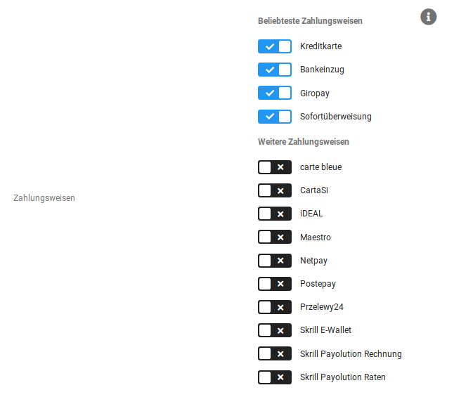

Hier können die gewünschten Zahlungsweisen ausgewählt werden.

##### Bestellstatus einstellen

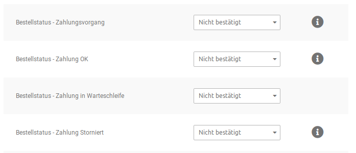

Hier kann für jeden Status der Zahlung ein separater Bestellstatus ausgewählt werden. So können z.B. fehlgeschlagene Bestellungen in der Bestellübersicht kenntlich gemacht werden.

##### Expertenmodus 

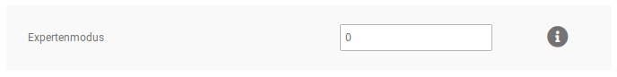

Die Einstellung _**Expertenmodus**_ darf nur in Absprache mit Skrill verändert werden. Wenn du hierzu weitere Informationen benötigst, wende dich bitte direkt an Skrill.

#### Darstellung im Bestellvorgang

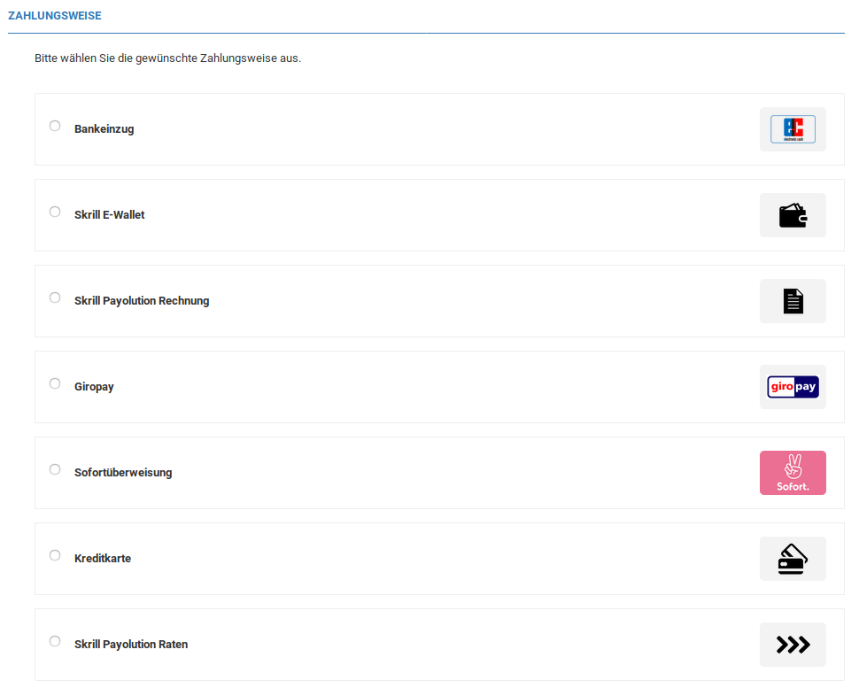

Es werden ggf. nicht alle Module gleichzeitig angezeigt, auch wenn sie installiert sind, da manche Zahlungsweisen nur in bestimmten Ländern zur Verfügung stehen und andere Zahlungsweisen wie z.B. die verschiedenen Kreditkarten, zusammengefasst werden.

Nach Bestätigung der Bestellung mit Klick auf _**Kostenpflichtig bestellen**_ wird der Kunde aufgefordert Daten anzugeben. Dieses sogenannte Widget kann unterschiedlich aussehen, bei manchen Zahlungsweisen kann man über die Reiter noch eine andere Zahlungsmethode auswählen.

Zu diesem Zeitpunkt existiert im Shop schon eine Bestellung mit dem Bestellstatus, den man unter _**Bestellstatus - Zahlungsvorgang**_ im Modul ausgewählt hat. Eine Bestellbestätigung wird, wie bei Bestellungen über Zahlungsdienstleister üblich, jedoch erst versendet, wenn die Zahlung vom Kunden komplett abgeschlossen wurde und diesem im Shop die Bestellbestätigungsseite angezeigt worden ist. Solange die Zahlung nicht komplett abgeschlossen wurde, bleiben die Artikel im Warenkorb.

### Heidelpay

!!! note "Hinweis"

	 Diese Zahlungsweise ist nur in selbstgehosteten Shops verfügbar.

Unter dem Punkt _**Heidelpay**_ stehen im Bereich _**Module \> Zahlungsweisen \> Sonstige**_ verschiedene Zahlungsmodule des Anbieters Heidelpay zur Verfügung. Diese werden im Grundumfang des Shopsystems ausgeliefert, Entwicklung und Support werden jedoch von Heidelpay geleistet. Bei Fragen zu Funktionen und Konditionen kontaktiere daher bitte unsere Kollegen von Heidelpay unter https://www.heidelpay.com/de/support/

##### Installation

Öffne unter _**Module \> Zahlungsweisen \> Sonstige**_ den Eintrag _**Heidelpay**_, indem du darauf klickst. Wähle anschließend die gewünschte Zahlungsweise aus und installiere das Modul über einen Klick auf die Schaltfläche _**Installieren**_, in der unteren, rechten Bildschirmecke.

Es stehen folgende Zahlungsweisen zur Verfügung:

-   Kreditkarte \(hpcc\)
-   Debitkarte \(hpdc\)
-   Lastschrift \(hpdd\)
-   Versicherte Lastschrift \(hpddpg\)
-   Giropay \(hpgp\)
-   IDeal \(hpidl\)
-   Vorkasse \(hppp\)
-   PayPal \(hppay\)
-   Sofortueberweisung \(hpsu\)
-   Kauf auf Rechnung \(hpbs\)
-   Rechnung \(hpiv\)
-   Versicherter Rechnungskauf \(hpivpg\)
-   PostFinance \(hppf\)
-   MangirKart \(hpmk\)

#### Konfiguration der Sandbox

Um die Heidelpay Module in einer Sandbox-Umgebung testen zu können, muss zunächst eine Sandbox-Umgebung erstellt und konfiguriert werden. Hierfür wählt man ein beliebieges Heidelpay Modul aus und klickt anschließend auf den Button _**Heidelpay konfigurieren**_. Hierdurch wird man auf eine neue Seite weitergeleitet, auf der man notwendige Einstellungen zum Datenaustausch zwischen dem Shop und Heidelpay tätigen kann. Sollen die Module Live genutzt werden, so sind echte Zugangsdaten zu Heidelpay notwendig. Anderenfalls kann mit einem Klick auf den Button _**Demo Zugangsdaten wiederherstellen**_ am unteren Ende der Konfigurationsseite die Sandbox ohne Weiteres konfiguriert werden.

#### Einrichtung eines Zahlungsmoduls in der Sandbox

Um ein Zahlungsmodul in der Sandbox zu testen, sind noch weitere Einstellungen im jeweils zu testenden Modul notwendig. Hierfür wählt man ein beliebieges Heidelpay Modul aus und klickt anschließend auf den Button _**Bearbeiten**_, wenn das Modul schon installiert ist. Sollte dies nicht der Fall sein, so ist es zunächst erforderlich, das gewählte Modul zu installieren.

Hier muss nun noch ein Test-Account vergeben werden, für den die E-Mail-Addresse eines Shopkontos verwendet wird. Nur Konten mit den angegebenen E-Mail-Adressen sind berechtigt Tests mit den Modulen durchzuführen. Wird eine andere E-Mail-Addresse verwendet, kommt es zu einem Fehler, der auf der Checkout-Seite angezeigt wird.

!!! danger "Achtung"

	 Je nach gewähltem Zahlungsmodul sind verschiedene Testaccounts/Testdaten notwendig, damit eine Testbestellung erfolgreich durchgeführt werden kann.

