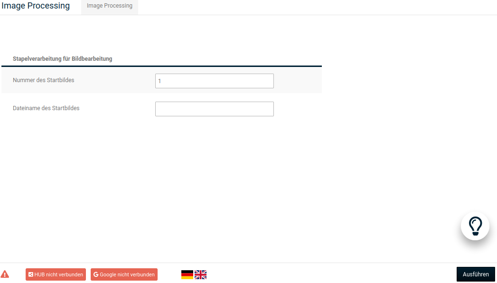
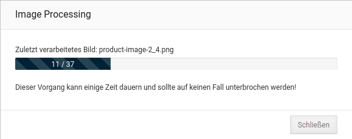

# Bild-Optionen

!!! note "Hinweis"

	 Änderungen an den Bild-Optionen werden nur für neu hochgeladene Artikelbilder übernommen. Sollen Änderungen auch bei bereits vorhandenen Artikelbildern übernommen werden, muss anschließend unter _**Einstellungen / Layout & Design / Bildverarbeitung \(Image Processing\)**_ die _**Stapelverarbeitung für Bildbearbeitung**_ ausgeführt werden.

	 
## Image Processing

Änderungen die an den Einstellungen unter _**Einstellungen / Layout & Design / Bildoptionen**_ vorgenommen werden, wirken sich immer nur auf neu hochgeladene Bilder aus. Um den bestehenden Bild-Bestand anzupassen, muss unter _**Einstellungen / Layout & Design / Bildverarbeitung \(Image Processing\)**_ die _**Stapelverarbeitung für Bildbearbeitung**_ durchgeführt werden.

Öffne hierzu den Reiter _**Image Processing**_ bzw. betätige die Schaltfläche _**aufrufen**_ und klicke unten rechts auf _**Ausführen**_.

!!! danger "Achtung"

	 Der Vorgang kann, je nach Anzahl der Artikel-Bilder im Shop, einige Zeit dauern. Er sollte auf keinen Fall vorzeitig unterbrochen werden!

Bei Bedarf kann unter _**Nummer des Startbildes**_ bzw. _**Dateiname des Startbildes**_ festgelegt werden, dass die Stapelverarbeitung einen Teil der Artikelbilder überspringt.

