# Steuer

!!! danger "Achtung"

	 Änderungen an den Steuereinstellungen können dazu führen, dass die Steuern in deinem Shop nicht mehr berechnet werden. Unter Umständen können bei fehlerhaften Steuereinstellungen sämtliche Summen nicht berechnet werden.

	 Admin-Konten haben bei der Steuerberechnung eine andere Priorität als reguläre Kundenkonten und verwenden daher die vorgenommenen Steuereinstellungen nicht eins zu eins. Änderungen sollten daher nicht mit einem Admin-Konto getestet werden, sondern mit einem Konto der entsprechenden Kundengruppe.

Die Steuereinstellungen werden von der Installationsroutine für Deutschland festgelegt. Wenn du deinen Onlineshop in einem anderen Land betreibst, müssen in der Regel die Steuereinstellungen angepasst werden.

!!! note "Hinweis" 
	 Wenn du Änderungen an den Steuersätzen vornehmen musst, informiere dich vorher bei deinem Steuer- oder Rechtsberater über die für dich gültigen Einstellungen.

## Notwendige Änderungen innerhalb der EU

Wenn du deinen Onlineshop in der Europäischen Union betreibst, sind Änderungen an den Steuersätzen unter _**Einstellungen / Sprachen, Länder, Steuern / Steuersätze**_, nach Aufruf der Seite, nötig, wenn die Steuersätze in deinem Land von denen in Deutschland abweichen.

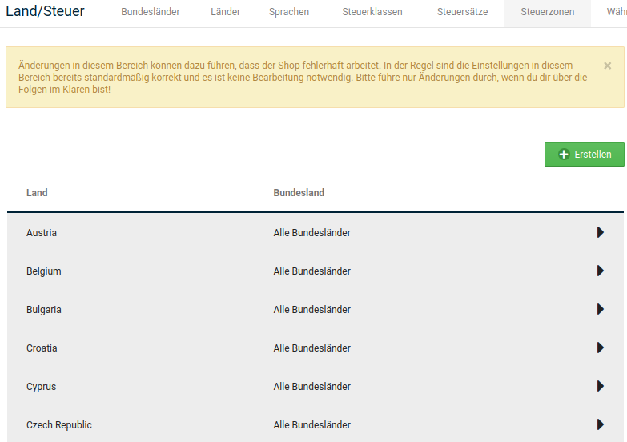

1.  Markiere den Steuersatz _**Standardsatz**_ für die Steuerzone _**Steuerzone EU**_
2.  Klicke auf _**Bearbeiten**_
3.  Ändere den Wert im Feld _**Steuersatz**_ auf den für dein Land gültigen Steuersatz
4.  Passe die Beschreibung entsprechend des Steuersatzes an

    Beachte, dass die Beschreibung aus technischen Gründen auf _**% MwSt.**_ enden muss.

5.  Nimm die Änderungen für dein Land im Steuersatz _**ermäßigter Steuersatz**_ für die Steuerzone _**Steuerzone EU**_ vor

## Notwendige Änderungen außerhalb der EU

Wenn du deinen Onlineshop außerhalb der Europäischen Union betreibst, musst du für dein Land unter _**Einstellungen / Sprachen, Länder, Steuern / Steuerzonen**_, nach Aufruf der Seite, eine neue Steuerzone anlegen.

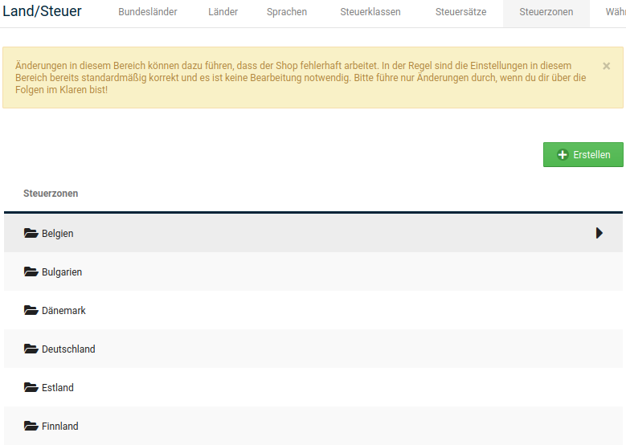

1.  Klicke auf _**Erstellen**_

    In der rechten Spalte öffnet sich die Eingabemaske für eine neue Steuerzone.

2.  Trage im Feld _**Name der Steuerzone**_ einen Namen für die neue Steuerzone ein
3.  Trage im Feld _**Beschreibung**_ eine kurze Beschreibung der Steuerzone ein
4.  Klicke auf _**Einfügen**_

    In der linken Spalte wird die neue Steuerzone hinzugefügt.

5.  Wähle die neue Steuerzone aus

    Die aktive Steuerzone wird grau hinterlegt.

6.  Klicke auf _**Details**_ \(►\)
7.  Klicke auf _**Erstellen**_
8.  Wähle aus der Liste _**Land**_ in der rechten Spalte das Land aus, aus dem du deinen Shop betreibst
9.  Lasse in der Liste _**Bundesland**_ den Wert _**Alle Bundesländer**_ ausgewählt
10. Klicke auf _**Einfügen**_

Dein Land wurde in die neue Steuerzone aufgenommen.

Entferne nun dein Land aus der Steuerzone _**Steuerzone EU-Ausland**_ unter _**Einstellungen / Sprachen, Länder, Steuern / Steuerzonen**_, nach Aufruf der Seite.

1.  Wähle die Steuerzone _**Steuerzone EU-Ausland**_ aus

    Die aktive Steuerzone wird grau hinterlegt.

2.  Klicke auf _**Details**_ \(►\)
3.  Markiere dein Land in der Länderliste
4.  Klicke in der rechten Spalte auf _**Löschen**_
5.  Klicke erneut auf _**Löschen**_ um das Löschen zu bestätigen

Lege nun die Steuersätze für dein Land fest. Lege dazu neue Steuersätze unter _**Einstellungen / Sprachen, Länder, Steuern / Steuersätze**_, nach Aufruf der Seite, an.

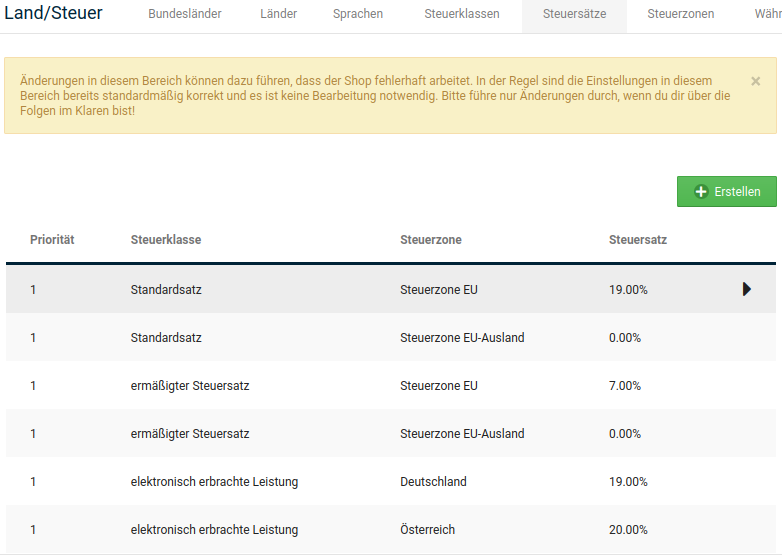

1.  Klicke auf _**Erstellen**_

    In der rechten Spalte öffnet sich die Eingabemaske für einen neuen Steuersatz.

2.  Wähle aus der Liste _**Name der Steuerklasse**_ die gewünschte Steuerklasse aus
3.  Wähle aus der Liste _**Steuerzone**_ die neue Steuerzone aus
4.  Trage im Feld _**Steuersatz \(%\)**_ den für dein Land gültigen Steuersatz in Prozent ein

    Verwende bei gebrochenen Steuersätzen einen Punkt als Dezimaltrennzeichen.

5.  Trage im Feld _**Beschreibung**_ die Beschreibung für den Steuersatz ein, der im Summenblock angezeigt werden soll

    Beachte, dass die Beschreibung aus technischen Gründen auf _**% MwSt.**_ enden muss.

6.  Trage im Feld _**Priorität**_ die Priorität des Steuersatzes ein

    Dem Standardsatz und dem ermäßigten Steuersatz sollten die selbe Priorität zugewiesen werden, wenn gemischte Steuersätze im Summenblock addiert werden sollen.

7.  Klicke auf _**Einfügen**_
8.  Wiederhole den Vorgang, wenn für dein Land zusätzliche Steuerklassen benötigt werden

## Steuerklassen

Unter _**Einstellungen / Sprachen, Länder, Steuern / Steuerklassen**_, nach Aufruf der Seite, findest du die einzelnen Steuerklassen. Diese werden verwendet, um die einzelnen Steuersätze anhand eines entsprechenden Bezeichners einstellen zu können. Standardmäßig sind die Steuerklassen _**ermäßigter Steuersatz**_, _**elektronisch erbrachte Leistung**_ und _**Standardsatz**_ im Shop vorhanden.

!!! danger "Achtung"

	 Änderungen in diesem Bereich können dazu führen, dass der Shop fehlerhaft arbeitet. In der Regel sind die Einstellungen in diesem Bereich bereits standardmäßig korrekt und es ist keine Bearbeitung notwendig. Bitte führe nur Änderungen durch, wenn du dir über die Folgen im Klaren bist!

Über einen Klick auf die Schaltfläche _**Erstellen**_ kann eine weitere Steuerklasse erstellt und hinzugefügt werden. Hierbei muss mindestens ein Name vergeben werden. Mit Klick auf _**Einfügen**_ wird die Steuerklasse mit den gemachten Eingaben angelegt. Durch Klick auf _**Abbrechen**_ werden die Eingaben verworfen.

Bestehende Steuerklassen können nach Auswahl \(die Zeile ist grau hinterlegt\) über Klick auf die Schaltfläche _**Bearbeiten**_ angepasst werden. Mit Klick auf _**Löschen**_ wird die jeweilige Steuerklasse entfernt.

## Verschieben von Ländern in andere Steuerzonen

!!! note "Hinweis"

	 Wir gehen hierbei von den Standardeinstellungen aus, d.h. dass z.B. die Steuersätze bisher nicht geändert worden sind.

Ob für Bestellungen aus einem bestimmten Land Steuern berechnet werden, hängt u.a. von der jeweiligen Steuerzone ab, in die das betreffende Land eingetragen worden ist. Für Länder in der _**Steuerzone EU**_ werden standardmäßig 19% MwSt. als Standardsatz und 7% MwSt. als ermäßigter Satz berechnet. Innerhalb der _**Steuerzone EU Ausland**_ betragen beide Sätze 0%.

**Steuern für bestimmte Länder nicht berechnen**

Wenn du für bestimmte Länder keine Steuer berechnen möchtest, kannst du diese aus der _**Steuerzone EU**_ entfernen und in die _**Steuerzone EU Ausland**_ verschieben.

Gehe hierzu unter _**Einstellungen / Sprachen, Länder, Steuern / Steuerzonen**_, nach Aufruf der Seite und wechsele auf die zweite Seite. Wähle hier die _**Steuerzone EU**_ mit einem Mausklick aus und wechsele anschließend über das Dreieck-Symbol in die Detailansicht. Wähle das jeweilige Land aus und klicke auf _**Löschen**_. Bestätige die Sicherheitsabfrage, wenn für das betreffende Land keine Steuern berechnet werden sollen.

Wähle nun die _**Steuerzone EU Ausland**_ aus und öffne dort ebenfalls die Detail-Ansicht, wie oben beschrieben. Klicke auf _**Erstellen**_, um die zuvor gelöschten Länder unter der neuen Steuerzone anzulegen.

**Steuern für bestimmte Länder berechnen**

Wenn du für bestimmte Länder Steuern berechnen möchtest, kannst du diese aus der _**Steuerzone EU Ausland**_ entfernen und in die _**Steuerzone EU**_ verschieben.

Gehe hierzu unter _**Einstellungen / Sprachen, Länder, Steuern / Steuerzonen**_, nach Aufruf der Seite und wechsele auf die zweite Seite. Wähle hier die _**Steuerzone EU Ausland**_ mit einem Mausklick aus und wechsele anschließend über das Dreieck-Symbol in die Detailansicht. Wähle das jeweilige Land aus und klicke auf _**Löschen**_. Bestätige die Sicherheitsabfrage, wenn für das betreffende Land Steuern berechnet werden sollen.

Wähle nun die _**Steuerzone EU**_ aus und öffne dort ebenfalls die Detail-Ansicht, wie oben beschrieben. Klicke auf _**Erstellen**_, um die zuvor gelöschten Länder unter der neuen Steuerzone anzulegen.

## Steuersätze

### Einleitung 

Am 01.07.2021 tritt eine Gesetzesänderung in Kraft, nach der ab einem Gesamtumsatz von 10.000 Euro pro Jahr in anderen EU-Ländern der Steuersatz des jeweiligen Landes angezeigt, berechnet und abgeführt werden muss. Hierbei gibt es neben dem Standardsatz und ermäßigten Steuersatz eine ganze Reihe speziellerer Steuerklassen, die je nach Art des Artikels zum Tragen kommen können, wie z.B. für Nahrungsmittel oder Bücher.

In diesem Kapitel beschreiben wir die Zusammenhänge zwischen den im Shop für die Steuerberechnung verwendeten Komponenten \(Steuerklassen, Steuerzonen und Steuersätze\) und erläutern anhand eines Beispiels, wie ein Steuersatz für solch einen Fall angelegt werden kann.

!!! danger "Achtung"

	 Wir können im Rahmen des Handbuchs nur die technischen Funktionen und Vorgehensweisen im Shop beschreiben, jedoch keine steuerrechtliche Einordnung geben. Bitte wende dich hierfür an deinen Rechtsbeistand bzw. Steuerberater oder an unsere Partner für Rechtssicherheit.

	 Unter folgendem Link findest du eine Liste unserer Partner für Rechtssicherheit:

	 https://www.gambio.de/shop/schnittstellen
	 
### Bestandteile der Steuerberechnung und ihre Funktion

#### Steuerklasse

Die Steuerklasse legt fest, welche Art Steuersatz berechnet wird, abhängig davon welche Art Artikel verkauft wird. Im Shop sind hierfür standardmäßig die Steuerklassen _**Standardsatz**_, _**ermäßigter Satz**_ und _**elektronisch erbrachte Leistung**_ vorhanden. Die Steuerklasse wird jeweils im Artikel bzw. im zugehörigen Modul \(z.b. Versandmodul\) eingestellt.

Aufgrund der Neuerungen ist es jetzt wahrscheinlicher, dass ihr neue Steuerklassen benötigt, z.B für Bücher oder Lebensmittel.

#### Steuerzone

Bisher wurden im Shop vornehmlich die _**Steuerzone EU**_ und _**Steuerzone EU Ausland**_ verwendet. Dies hat die Einstellung vereinfacht, da unter Angabe einer Steuerzone viele Länder enthalten sind, die nicht einzeln angegeben werden müssen.

!!! note "Hinweis"

	 Im Shop befindet sich zudem für jedes EU-Land eine eigene Steuerzone. Diese speziellen Zonen waren bisher nur für den Spezialfall der Steuerklasse _**elektronisch erbrachte Leistung**_ vorgesehen.

!!! danger "Achtung"

	 Wenn im Shop Steuersätze mit der Steuerklasse Standardsatz oder ermäßigter Satz für die Steuerzonen einzelner EU-Länder verwendet werden, darf die Steuerzone EU für diese Sätze nicht verwendet werden, da es sonst zu einer doppelten Berechnung der Steuer kommt.

#### Steuersatz

Der Steuersatz stellt den eigentlichen Anwendungsfall dar. Für jeden Steuersatz ist folgendes eingestellt:

-   _**Steuerklasse**_: welche Art Steuersatz wird hier berechnet \(Standardsatz, ermäßigter Satz, Lebensmittel, Bücher, usw.\)?
-   _**Steuerzone**_: für welche Steuerzone \(kann ein oder mehrere Länder enthalten\) wird dieser Steuersatz berechnet?
-   _**Steuersatz \(%\)**_: der eigentliche Prozentwert, der berechnet wird

### Anlegen eines neuen Steuersatzes 

Steuereinstellungen können im Shop unter _**Einstellungen / Sprachen, Länder, Steuern**_ \(ehemals _**Shop Einstellungen \> Land/Steuer**_\) vorgenommen werden. Scrolle hier zu einem der Bereiche _**Steuerklassen**_, _**Steuerzonen**_ oder _**Steuerstäze**_ hinunter bzw. gib den jeweiligen Begriff in das Suchfeld ein und klicke auf den Button _**Aufrufen**_.

!!! danger "Achtung"

	 Die hier beschriebenen Fälle sind rein fiktive Beispiele, um die notwendigen Einstellungen zu beschreiben. Wir erheben an keiner Stelle Anspruch darauf, dass die verwendeten Werte korrekt oder für den jeweiligen Anwendungsfall zutreffend sind.
	 
#### Neuer Steuersatz für bestehende Steuerzone

!!! example "Beispiel"

	 Es sollen Bücher nach Schweden verkauft werden. Der Steuersatz beträgt 6%. Wenn ein Steuersatz für ein Land angelegt werden soll, können die vorhandenen Steuerzonen verwendet werden.

##### Steuerklasse erstellen

Gehe hierzu zunächst in den Reiter Steuerklassen und klicke auf den Button Erstellen. Trage hier den Namen der Steuerklasse und optional eine Beschreibung ein. Bestätige mit Klick auf die Schaltfläche Einfügen.

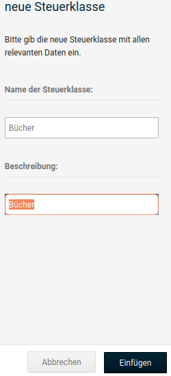

##### Steuersatz anlegen

Wechsele anschließend in den Reiter Steuersatz und klicke auf den Button Erstellen. Trage die Informationen nach dem gleichen Muster wie in der untenstehenden Abbildung angegeben ein.

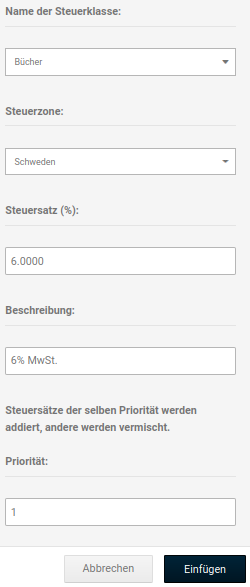

!!! danger "Achtung"

	 Die genaue Schreibweise muss in jedem Fall eingehalten werden! Achte hierbei besonders darauf, dass die Nachkommastellen beim _**Steuersatz**_ mit einem **Punkt** abgetrennt werden müssen.

	 Die _**Beschreibung**_ muss zwangsläufig nach dem Muster **ZAHL% MwSt.** angegeben werden.

	 Die _**Priorität**_ sollte bei allen Steuersätzen auf _**1**_ stehen.

!!! note "Hinweis"

	 Im Zweifelsfall kannst du bei einem der standardmäßig angelegten Sätze, wie z.B. dem _**Standardsatz**_ für die _**Steuerzone EU**_ ‘spicken‘, um die richtige Schreibweise zu verwenden

##### Steuerklasse zuweisen

Abschließend kann die neue Steuerklasse den betreffenden Artikeln zugewiesen weden. Bearbeite diese hierzu unter _**Artikel \> Artikel/Kategorien**_ und scrolle in der Artikelmaske ganz nach unten, zum Abschnitt _**Preisoptionen**_.

Wähle hier unter _**Steuerklasse**_ den neuen Eintrag _**Bücher**_ aus.

Für Kunden aus Schweden wird nun bei dem betroffenen Artikel der neue Steuersatz angezeigt:

!!! note "Hinweis"

	 Die Änderungen werden ggf. erst nach einem erneuten Einloggen im Shop sichtbar.

	 Zudem sollte für die Prüfung kein Admin-Konto verwendet werden, da dieses standardmäßig andere Steuereinstellungen verwendet.

#### Zusammenfassung mehrerer Länder in einer Steuerzone

Wenn in mehreren Ländern für die gleiche Warengruppe der gleiche Steuersatz berechnet wird, ist es sinnvoll, diese Länder in einer Steuerzone zusammenzufassen.

!!! example "Beispiel"

	 In Bulgarien, Frankreich und Österreich wird für Kindersitze der gleiche Steuersatz von 20% berechnet.

##### Steuerzone anlegen 

Wechsele in den Reiter _**Steuerzonen**_ und klicke hier auf die grüne Schaltfläche _**Erstellen**_. Trage einen Namen für die Steuerzone und optional eine Beschreibung ein.

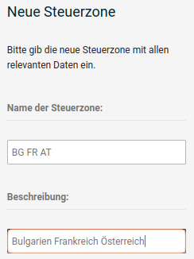

!!! note "Hinweis"

	 Die Zeichenanzahl für _**Name der Steuerzone**_ ist begrenzt. Umfangreichere Angaben sollten daher als _**Beschreibung**_ hinterlegt werden.

##### Länder der neuen Steuerzone hinzufügen

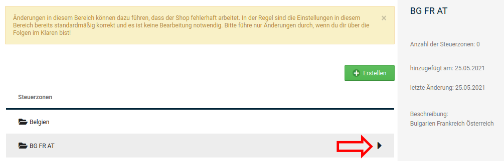

Die neue Steuerzone enthält noch keine Länder. Über einen Klick auf das schwarze Dreieck am Ende der Zeile kann die Detailansicht aufgerufen werden, um Länder hinzuzufügen:

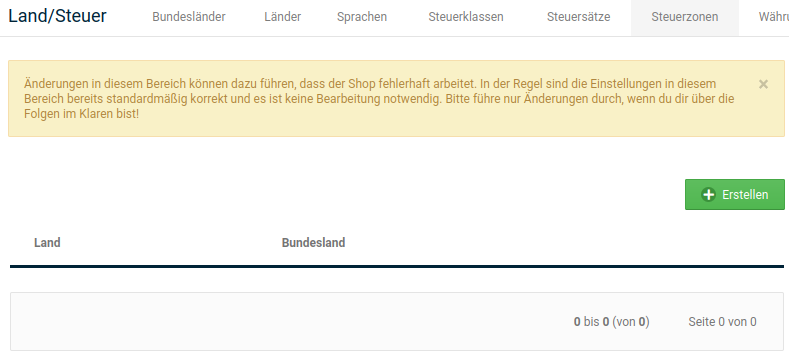

Klicke auf die Schaltfläche _**Erstellen**_, um der Zone ein Land hinzuzufügen:

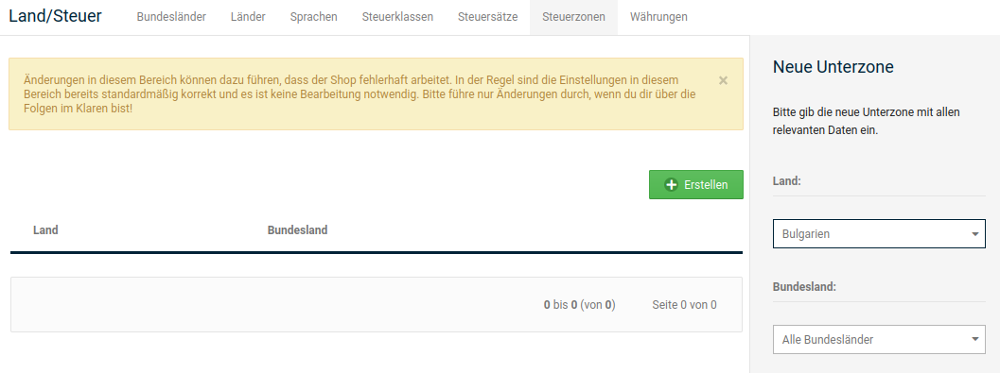

Wähle das Land aus dem Dropdown aus und klicke auf _**Einfügen**_.

!!! danger "Achtung"

	 Unter _**Bundesland**_ muss der Eintrag _**Alle Bundesländer**_ ausgewählt sein.

Wiederhole dies, bis alle gewünschten Länder in der Steuerzone angelegt worden sind.

Fahre wie unter _**Neuer Steuersatz für bestehende Steuerzone**_ beschrieben fort und lege die benötigte Steuerklasse und den neuen Steuersatz an.

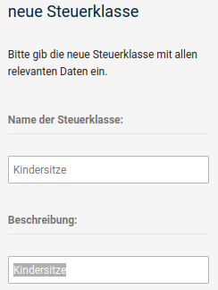

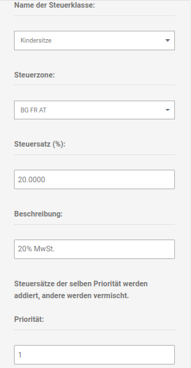

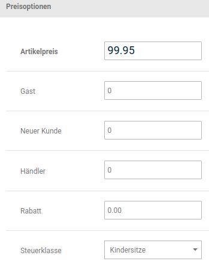

Nach dem Vornehmen aller Einstellungen wird für Bulgarien, Frankreich und Österreich der neue Steuersatz für Kindersitze angezeigt.

