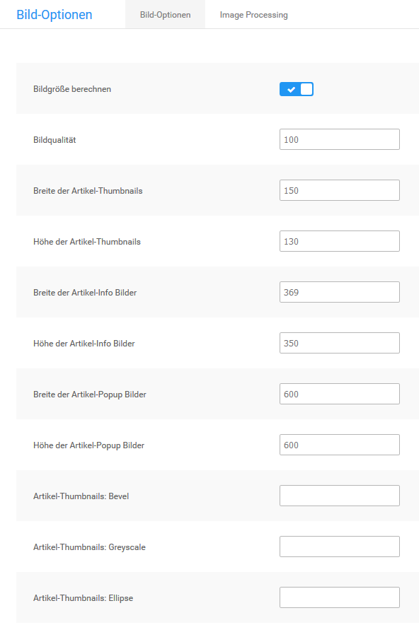
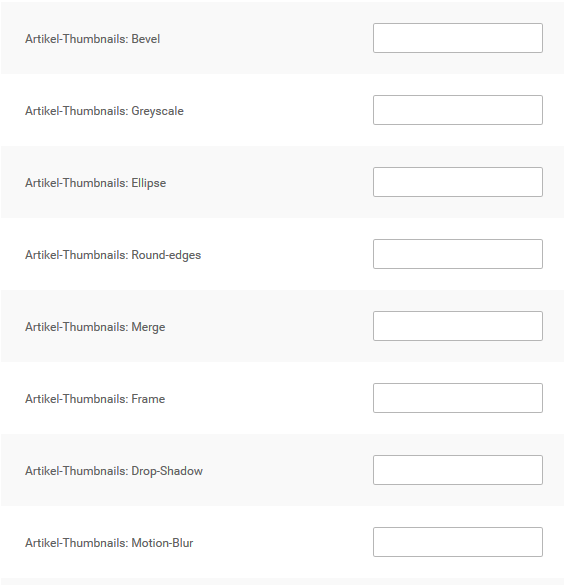
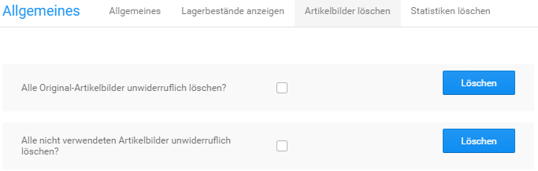

# Bild-Optionen

!!! note "Hinweis"

	 Änderungen an den Bild-Optionen werden nur für neu hochgeladene Artikelbilder übernommen. Sollen Änderungen auch bei bereits vorhandenen Artikelbildern übernommen werden, muss anschließend unter _**Darstellung \> Bild-Optionen \> Image Processing**_ bzw. _**Einstellungen / Layout & Design / Bildverarbeitung \(Image Processing\)**_ die _**Stapelverarbeitung für Bildbearbeitung**_ ausgeführt werden.

## Grundeinstellungen

Im Administrationsbereich deines Shops werden unter _**Darstellung \> Bild-Optionen**_ bzw. _**Einstellungen / Layout & Design / Bildoptionen**_ die Einstellungen für die automatische Bildberechnung der Artikelbilder vorgenommen.

|Feldname|Beschreibung|
|--------|------------|
|Bildgröße berechnen|wenn aktiviert \(Option _**Ja**_\) werden die Bildvarianten vom Shopsystem automatisch berechnet \[Ja\]|
|Bildqualität|die JPEG-Qualität der umgewandelten Bilder in Prozent \[100\]|

!!! danger "Achtung"

	 Bei Verwenden der GDlib1-Bibliotheken für die Bildbearbeitung werden sämtliche Artikelbilder in schwarz-weiß abgelegt. Wenn du deine Artikelbilder in schwarz-weiß präsentieren möchtest, verwende die dafür vorgesehenen Funktionen für GDlib2. Die Option _**GDlib processing**_ sollte nicht verändert werden.

## Bildgröße

Im Shopsystem werden die Artikelbilder beim Hochladen automatisch an die verschiedenen Ausgangsgrößen angepasst. Für jedes Artikelbild werden dabei die Kopien aus der Tabelle _**Artikelbild-Varianten**_ angelegt. Die tatsächliche Anzeigegröße hängt hierbei von den Einstellungen im _**StyleEdit**_ ab. Jedoch kann eine Änderung der Ausgangsgrößen unter _**Darstellung \> Bild-Optionen**_ bzw. _**Einstellungen / Layout & Design / Bildoptionen**_ erhebliche Auswirkungen auf Bildqualität und Ladezeit haben.

|Bildvariante \(Verzeichnisname\)|Beschreibung|
|--------------------------------|------------|
|Originalbild \(original\_ images\)|unverändertes Originalbild|
|Artikel-Popup Bild \(popup\_images\)|Großansicht für Flyover, Zoom-Funktion und Artikelbild- Lightbox|
|Artikel-Info Bild \(info\_ images\)|Artikelbild auf der Artikel-Detailseite, große Vorschaubilder \(abhängig von Einstellung unter _**Darstellung \> Template-Einstellungen**_ bzw. _**Einstellungen / Layout & Design / Bildoptionen**_\)|
|Artikel-Thumbnail \(thumbnail\_ images\)|Vorschaubild in Artikel-Listen, zum Beispiel auf der Startseite oder auf Kategorieseiten \(abhängig von Einstellung unter _**Darstellung \> Template-Einstellungen**_ bzw. _**Einstellungen / Layout & Design / Bildoptionen**_\)|
|Artikel-Galerie Bild \(gallery\_ images\)|kleines Vorschaubild auf der Artikel-Detailseite; die Bildgröße kann nicht verändert werden|

Ändere die Werte _**Breite**_ und _**Höhe**_ bei dem Bild, bei dem du die Ausgangsgröße anpassen möchtest. Die neue Breite und Höhe wird bei über die Artikel-Eingabemaske neu hochgeladenen Artikelbildern angewendet.

!!! note "Hinweis" 
	 **Ausgangsgröße ist nicht gleich angezeigte Bildgröße**. Im _**Honeygrid**_ hängt die angezeigte Bildgröße von den Einstellungen im _**StyleEdit**_ ab.

!!! note "Hinweis" 
	 Wenn die geänderte Ausgangsgröße auch bei bestehenden Artikelbildern übernommen werden soll, führe unter _**Darstellung \> Bild-Optionen \> Image Processing**_ bzw. _**Einstellungen / Layout & Design / Bildverarbeitung \(Image Processing\)**_ die _**Stapelverarbeitung für Bildbearbeitung**_ aus. Beachte, dass die Ausgabeelemente im Shopbereich nicht automatisch an die neue Größe angepasst werden. Wenn du die Bildgröße der Thumbnails oder Info-Bilder änderst, passe anschließend im Bearbeitungsmodus die betroffenen Bereiche im Shop an.

## Bild-Effekte

Das Shopsystem bietet verschiedene Funktionen an, mit denen du einen oder mehrere Effekte auf deine Artikelbilder anwenden kannst. Die Effekte werden auf den jeweiligen Bildtyp \(siehe Kapitel _**Bildgröße**_\) separat angewendet. Auf jeden Bildtyp kann ein Effekt, eine Kombination aus verschiedenen Effekten oder alle Effekte angewendet werden.

	 
### Wasserzeichen

Du kannst deine Bilder durch ein Wasserzeichen über deinen Shopbildern schützen. Beachte, dass die nachfolgenden Änderungen ausschließlich auf neu hochgeladene Produktbilder angewendet werden. Lade eine Wasserzeichengrafik im GIF-Format über _**Darstellung \> Logo Manager \> Wasserzeichen**_ hoch. Dein Wasserzeichen sollte idealerweise einen reinweißen Hintergrund haben. Die Position des Wasserzeichens kannst du über ein Parameterset in den Bildoptionen bestimmen.

Das Parameterset setzt sich aus fünf Teilen zusammen und wird am Beispiel \(overlay.gif,20,30,60,FFFFFF\) erklärt.

#### Teil 1: overlay.gif

Der erste Parameter bezieht sich auf den Dateinamen und darf nicht verändert werden. Die hochgeladene GIF-Grafik wird automatisch in overlay.gif umbenannt.

#### Teil 2&3: 20,30 

Der zweite und dritte Parameter beschreibt gemeinsam die Position des Wasserzeichens \(x,y\) über dem Produktbild.

#### Teil 4: 60

Der vierte Parameter entspricht der Durchsichtigkeit des Wasserzeichens auf dem Bild. Ein Wert von 100 macht das Wasserzeichen über dem Produktbild vollständig sichtbar, ein Wert von 0 macht das Wasserzeichen kaum sichtbar.

#### Teil 5: FFFFFF

Der fünfte Parameter beschreibt die Farbe im Wasserzeichen, die als Hintergrund betrachtet und vollständig durchsichtig sein soll. Wir empfehlen, diesen Wert auf FFFFFF \(100% weiß\) zu belassen und die Hintergrundfarbe der hochzuladenden GIF-Grafik entsprechend anzulegen.

Trage diese Parameter unter _**Darstellung \> Bild-Optionen**_ kommagetrennt in einfachen Klammern bei den Einstellungen ein:

-   Merge\(zusammenführen\)
-   Artikel-Thumbnails:Merge \(für die Thumbnails in der Kategorieübersicht\)
-   Artikel-Info Bilder:Merge \(für die kleinen Artikel-Info-Bilder in der Artikeldetailseite\)
-   Artikel-Popup Bilder:Merge \(für die großen Artikel-Bilder in der Artikeldetailseite\)

### Bevel \(Button-Effekt\)

Mit der Bevel-Funktion werden Artikelbilder erhaben dargestellt und wirken dadurch wie eine Schaltfläche.

Der Parameter für die Bevel-Funktion besteht aus drei Teilen:

1.  Kantenbreite: Der erste Teil steht für die Breite des Rahmens um das Artikelbild. Die Breite wird ganzzahlig in Pixeln angegeben.
2.  Rahmenfarbe oben links: Der zweite Teil steht für den hellen Rahmen an der oberen und linken Seite des Artikelbildes. Die Farbe wird in Hexadezimal-Codierung angegeben und kann frei gewählt werden.
3.  Rahmenfarbe unten rechts: Der dritte Teil steht für den dunklen Rahmen an der unteren und rechten Seite des Artikelbildes. Die Farbe wird in Hexadezimal-Codierung angegeben und kann frei gewählt werden.

Beispiel: \(8,FFCCCC,330000\)

Trage den fertigen Parameter mit runden Klammern ohne Anführungszeichen in das Feld _**Bevel**_ beim gewünschten Bildtyp ein.

### Greyscale \(Graustufen\)

Mit der Greyscale-Funktion werden Artikelbilder in Farbstufen eingefärbt. Dadurch ist eine Darstellung von Artikelbildern in Graustufen oder beispielsweise Sepiafärbung möglich.

Der Parameter für Graustufen besteht aus drei Teilen:

1.  Rotanteil: Der erste Teil steht für den Rotanteil der Einfärbung. Der Rotanteil wird als Ganzzahl von 0 bis 255 angegeben.
2.  Grünanteil: Der zweite Teil steht für den Grünanteil der Einfärbung. Der Grünanteil wird als Ganzzahl von 0 bis 255 angegeben.
3.  Blauanteil: Der dritte Teil steht für den Blauanteil der Einfärbung. Der Blauanteil wird als Ganzzahl von 0 bis 255 angegeben.

Beispiel: \(32,22,22\)

Trage den fertigen Parameter mit runden Klammern ohne Anführungszeichen in das Feld Greyscale beim gewünschten Bildtyp ein.

!!! danger "Achtung"

	 Ein Parameter von \(0,0,0\) färbt dein Artikelbild vollständig schwarz, wohingegen ein Parameter von \(255,255,255\) dein Artikelbild vollständig weiß färbt.

### Ellipse

Mit der Ellipse-Funktion wird ein Ausschnitt des Artikelbilds in Form einer Ellipse ausgeschnitten und anstatt des ganzen Bildes angezeigt.

Der Parameter für die Ellipse-Funktion besteht aus der Hintergrundfarbe für den Bildausschnitt. Die Farbe wird in Hexadezimal-Code angegeben.

Beispiel: \(FFFFFF\)

Trage den fertigen Parameter mit runden Klammern ohne Anführungszeichen in das Feld _**Ellipse**_ beim gewünschten Bildtyp ein.

### Round-edges \(runde Ecken\)

Mit der Round-edges-Funktion werden die Ecken des Artikelbildes abgerundet.

Der Parameter für die Round-edges-Funktion besteht aus drei Teilen:

1.  Ecken-Radius: Der erste Teil steht für die Größe des Radius, um den die Ecke abgerundet wird. Der Radius wird ganzzahlig in Pixel angegeben.
2.  Hintergrundfarbe: Der zweite Teil steht für die Hintergrundfarbe, die anstelle des Artikelbilds im Außenbereich des Radius angezeigt wird. Die Hintergrundfarbe wird in Hexadezimal-Codierung angegeben und kann frei gewählt werden.
3.  Weichzeichnungs-Breite: Der dritte Teil steht für die Weichzeichnungs-Breite der runden Ecke. Die Weichzeichnungs- Breite wird ganzzahlig in Pixel angegeben. Je höher der Wert, desto runder wirkt die Ecke. Bei einem Wert von 0 wirkt die runde Ecke je nach Radius kantig. Die Weichzeichnungs- Breite sollte die Größe des Radius nicht überschreiten.

Beispiel: \(5,FFFFFF,3\)

Trage den fertigen Parameter mit runden Klammern ohne Anführungszeichen in das Feld _**Round-edges**_ beim gewünschten Bildtyp ein.

### Frame \(Rahmen\)

Mit der Frame-Funktion wird um das Artikelbild ein 3D-Rahmen gezeichnet.

Der Parameter für die Frame-Funktion besteht aus vier Teilen:

1.  Rahmenfarbe außen oben und links sowie innen unten und rechts: Der erste Teil steht für die Farbe der hellen Rahmenteile. Die Farbe wird in Hexadezimal- Codierung angegeben und kann frei gewählt werden.
2.  Rahmenfarbe außen unten und rechts sowie innen oben und links: Der zweite Teil steht für die Farbe der dunklen Rahmenteile. Die Farbe wird in Hexadezimal- Codierung angegeben und kann frei gewählt werden.
3.  Rahmenbreite: Der dritte Teil steht für die Breite des mittleren Rahmens. Die Breite wird ganzzahlig in Pixel angegeben.
4.  Rahmenfarbe des mittleren Rahmens: Der vierte Teil steht für die Farbe des mittleren Rahmens. Die Farbe wird in Hexadezimal- Codierung angegeben und kann frei gewählt werden.

Beispiel: \(FFFFFF,000000,3,EEEEEE\)

Trage den fertigen Parameter mit runden Klammern ohne Anführungszeichen in das Feld _**Frame**_ beim gewünschten Bildtyp ein.

### Drop-Shadow \(Schlagschatten\)

Mit der Drop-Shadow-Funktion wird ein Schlagschatten nach unten rechts hinter das Artikelbild gelegt. Der Schatten wird nicht massiv als Rahmen dargestellt, sondern mit einer zusätzlichen Hintergrundfarbe in einem dynamischen Spektrum berechnet.

Der Parameter für die Drop-Shadow-Funktion besteht aus drei Teilen:

1.  Schattenbreite: Der erste Teil steht für die Breite des Schlagschattens. Die Breite wird ganzzahlig in Pixel angegeben.
2.  Schattenfarbe: Der zweite Teil steht für die Farbe des Schattens. Die Farbe wird in Hexadezimal-Codierung angegeben und kann frei gewählt werden.
3.  Hintergrundfarbe: Der dritte Teil steht für die Hintergrundfarbe, die für die Dynamik als Referenzwert verwendet wird. Die Farbe wird in Hexadezimal-Codierung angegeben und kann frei gewählt werden.

Beispiel: \(3,333333,FFFFFF\)

Trage den fertigen Parameter mit runden Klammern ohne Anführungszeichen in das Feld _**Drop-Shadow**_ beim gewünschten Bildtyp ein.

### Motion-Blur \(Bewegungs-Effekt\)

Mit der Motion-Blur-Funktion wird ein Ausschnitt des Artikelbilds nach unten rechts multipliziert. Durch die Wiederholung entsteht ein Bewegungs-Effekt.

Der Parameter für die Motion-Blur-Funktion besteht aus zwei Teilen:

1.  Anzahl Wiederholungen: Der erste Teil steht für die Anzahl Wiederholungen des unteren und rechten Bildbereichs. Die Anzahl wird ganzzahlig in Stück angegeben.
2.  Rahmenfarbe zwischen den Wiederholungen: Der zweite Teil steht für die Rahmenfarbe zwischen dem ursprünglichen Artikelbild und den jeweiligen Wiederholungen des unteren rechten Bildbereichs. Die Farbe wird in Hexadezimal-Codierung angegeben und kann frei gewählt werden.

Beispiel: \(4,FFFFFF\)

Trage den fertigen Parameter mit runden Klammern ohne Anführungszeichen in das Feld _**Motion-Blur**_ beim gewünschten Bildtyp ein.

!!! note "Hinweis" 

	 Die Änderungen an den Bild-Effekten werden nur für über die Artikel-Eingabemaske neu hochgeladene Artikelbilder übernommen. Wenn die Änderungen auch auf bereits vorhandene Artikelbilder angewendet werden sollen, führe anschließend die _**Stapelverarbeitung für Bildbearbeitung**_ unter _**Darstellung \> Bild-Optionen \> Image Processing**_ aus.
	 
## Image Processing

Änderungen die an den Einstellungen unter _**Darstellung \> Bild-Optionen \> Bild-Optionen**_ bzw. _**Einstellungen / Layout & Design / Bildoptionen**_ vorgenommen werden, wirken sich immer nur auf neu hochgeladene Bilder aus. Um den bestehenden Bild-Bestand anzupassen, muss unter _**Darstellung \> Bild-Optionen \> Image Processing**_ bzw. _**Einstellungen / Layout & Design / Bildverarbeitung \(Image Processing\)**_ die _**Stapelverarbeitung für Bildbearbeitung**_ durchgeführt werden.

Öffne hierzu den Reiter _**Image Processing**_ bzw. betätige die Schaltfläche _**aufrufen**_ und klicke unten rechts auf _**Ausführen**_.

!!! danger "Achtung"

	 Der Vorgang kann, je nach Anzahl der Artikel-Bilder im Shop, einige Zeit dauern. Er sollte auf keinen Fall vorzeitig unterbrochen werden!

Bei Bedarf kann unter _**Nummer des Startbildes**_ bzw. _**Dateiname des Startbildes**_ festgelegt werden, dass die Stapelverarbeitung einen Teil der Artikelbilder überspringt.

## Artikelbilder löschen

Unter _**Shop Einstellungen \> Allgemeines \> Artikelbilder löschen**_ bzw. _**Toolbox \> Artikelbilder löschen**_ besteht die Möglichkeit Artikelbilder bei Bedarf zu löschen. Es können die Originalbilder \(Verzeichnis /images/product\_images/original\_images\) sowie nicht benötigte Artikelbilder, die keinem Artikel mehr zugeordnet sind, entfernt werden.

Setze hierzu den Haken in das Kästchen hinter die gewünschte Funktion und klicke auf Löschen.

!!! danger "Achtung"

	 Die Original-Bilder werden für den Bilderzoom verwendet. Werden diese gelöscht, steht die Vergrößerung nicht mehr in der bisherigen Auflösung zur Verfügung.

!!! danger "Achtung"

	 Ab Version **4.1** werden die in Kollektionen hinterlegten Bilder für Optionswerte \(Auswahlwerte bei Artikelattributen\) zusammen mit den Originalbildern gespeichert. Durch das Löschen der Originalbilder werden die **Kollektionsbilder für Attribute** ebenfalls **unwiederbringlich entfernt**!
	 
