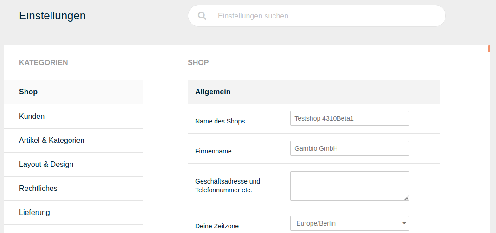

---
tags:
  - configurations
  - settings
---
# Einstellungen

Ab Version 4.3 steht im Shop ein überarbeiteter Bereich mit den Grundeinstellungen zur Verfügung. Dieser ist in die Kategorien

-   Shop
-   Kunden
-   Artikel & Kategorien
-   Layout & Design
-   Rechtliches
-   Lieferung
-   Suchmaschinenoptimierung
-   Sprachen, Länder, Steuern
-   System

aufgeteilt. Zudem steht am oberen Ende der Seite eine Suchleiste zur Verfügung, mit der nach Einträgen gefiltert werden kann. Die Ansicht wird hierbei sofort bei der Eingabe angepasst und Übereinstimmungen hervorgehoben.

Am unteren Ende der Seite befindet sich der _**Speichern**_-Button. Dieser ist ausgegraut, solange keine Änderungen vorgenommen worden sind. Der Speichern-Button übernimmt geänderte Einstellungen aus allen Bereichen und Kategorien.

## Shop {#einstellungen_shop}

### Allgemein {#einstellungen_shop_allgemein}

|Feldname|Beschreibung|
|--------|------------|
|Name des Shops|Name des Shops, wird als Titel angezeigt|
|Firmenname|Name deiner Firma|
|Geschäftsadresse und Telefonnummer etc.|Geschäftsadresse, wird z.B. im Briefkopf der Bestellbestätigung verwendet|
|Deine Zeitzone|Zeitzone des Firmensitzes|

### Shopbetreiber {#einstellungen_shop_shopbetreiber}

|Feldname|Beschreibung|
|--------|------------|
|Inhaber|Name des Shopbetreibers|
|Vorname|Vorname des Shopbetreibers|
|Nachname|Nachname des Shopbetreibers|
|Straßenname|Straßenname des Firmensitzes|
|Hausnummer|Hausnummer des Firmensitzes|
|Postleitzahl|Postleitzahl des Firmensitzes|
|Ort|Ort des Firmensitzes|
|Land|Land aus dem der Versand erfolgt|
|Region|Region des Landes, aus dem der Versand erfolgt|
|E-Mail-Adresse|E-Mail-Adresse des Shopbetreibers|
|Telefonnummer|Telefonnummer des Shopbetreibers|
|Faxnummer|Faxnummer des Shopbetreibers|

## Kunden {#einstellungen_kunden}

### Kunden {#einstellungen_kunden_kunden}

|Feldname|Beschreibung|
|--------|------------|
|Vorgabe für Kontoart|Welche Kontoart soll im Anmeldevorgang vorausgewählt sein \(_**Gastkonto**_: kein Haken für das Anlegen eines Kundenkontos gesetzt, _**Kundenkonto**_: Haken für das Anlegen eines Kundenkontos gesetzt\)|
|Löschen von Gastkonten|Soll das Gastkonto nach erfolgreicher Bestellung gelöscht werden?|
|Adressbucheinträge|Maximal erlaubte Anzahl an Adressbucheinträgen|
|Bestellübersicht|Maximale Anzahl an Bestellungen, die in der Übersicht unter _**Ihr Konto**_ angezeigt werden sollen.|
|Standardwert für Gewerbetreibender-Status|Standardwert für den Gewerbetreibender-Status bei der Kundenanmeldung, greift auch, wenn die Einstellung nicht angezeigt wird.|
|Bestellübersichts-Box|Maximale Anzahl an Artikeln, die in der persönlichen Bestellübersichts-Box des Kunden angezeigt werden sollen|
|Kundengruppencheck|Aktiviert den Kundengruppencheck zur Zugangsbeschränkung von Inhalten nach Kundengruppe. Weitere Informationen findest du im Kapitel _**Kundengruppencheck**_.|
|Kundengruppe für Neukunden|Kundengruppe, der ein Kunde nach der Anmeldung zugeordnet wird.|
|Art der Kontoerstellung|Welche Art Konto soll bei der Anmeldung erstellt werden können?|
|   |bei der Kontoerstellung _**Kundenkonto**_ können ausschließlich registrierte Kunden in deinem Shop bestellen
|   |bei der Kontoerstellung _**Gastkonto**_ können keine Kundenkonten für Stammkunden angelegt werden
|   |bei der Kontoerstellung _**beides**_ können Kunden sich in deinem Shop registrieren oder ohne Kundenkonto bestellen

### Kundendaten {#einstellungen_kunden_kundendaten}

|Feldname|Beschreibung|
|--------|------------|
|Anrede als Pflichtfeld|Legt fest, ob die Anrede bei der Kundenanmeldung zwingend ausgefüllt werden muss.|
|Addresszusatzfeld anzeigen|Soll das Adresszusatzfeld bei der Kundenanmeldung angezeigt werden?|
|Gewerbetreibender-Status|Abfrage des Gewerbetreibender-Status bei der Kundenanmeldung|
|Firma|Abfrage für Firma und Umsatzsteuer-ID bei der Kundennameldung|
|Geburtsdatum|Abfrage des Geburtsdatum bei der Kundenanmeldung|
|Faxnummer|Abfrage der Faxnummer bei der Kundenanmeldung|
|Anrede|Abfrage der Anrede bei der Kundenanmeldung|
|Vor- & Nachname optional|Soll die Angabe von Vor- und Nachname bei der Kundenanmeldung optional sein, wenn ein Firmenname angegeben wird?|
|Straße und Hausnummer trennen|Sollen für Straße und Hausnummer zwei getrennte Eingabefelder bei der Kundenanmeldung verwendet werden?|

!!! danger "Achtung"

	 Externe Module \(Zahlungsmodule, ERP, Warenwirtschaften etc.\) müssen Straße und Hausnummer getrennt verarbeiten können. Wenn du dir nicht sicher bist, lasse diese Option deaktiviert.

|Feldname|Beschreibung|
|--------|------------|
|Bundesland|Abfrage des Bundeslandes bei der Kundenanmeldung|
|Stadtteil|Abfrage des Stadtteils bei der Kundenanmeldung|
|Telefonnummer|Abfrage der Telefonnummer bei der Kundenanmeldung|

### Mindestlänge für Kundenfelder {#einstellungen_kunden_mindestlaenge_fuer_kundenfelder}

Über die Mindstlänge können Felder als Plfichtfelder festgelegt werden. Ist für die Mindestlänge ein Wert größer als 0 eingetragen, ist das betreffende Feld ein Pflichtfeld.

!!! note "Hinweis"

	 Die Firma kann standardmäßig nicht als Pflichtangabe gesetzt werden. Eine Prüfung der Mindestlänge findet nur dann statt, wenn eine Eingabe in diesem Feld erfolgt.

|Feldname|Beschreibung|
|--------|------------|
|Stadt|Mindestlänge des Städtenamens|
|Firma|Mindestlänge des Firmennamens|
|Geburtsdatum|Mindestlänge des Geburtsdatums|
|E-Mail-Adresse|Mindestlänge der E-Mail-Adresse|
|Vorname|Mindestlänge des Vornamens|
|Hausnummer|Mindestlänge der Hausnummer|
|Nachname|Mindestlänge des Nachnamens|
|Passwort|Mindestlänge des Passworts|
|Postleitzahl|Mindestlänge der Postleitzahl|
|Bundesland|Mindestlänge des Bundeslandes|
|Straße|Mindestlänge der Straßenanschrift|
|Telefonnummer|Mindestlänge der Telefonnummer|

## Artikel & Kategorien {#einstellungen_artikel_und_kategorien}

### Produkte {#einstellungen_artikel_und_kategorien_produkte}

|Feldname|Beschreibung|
|--------|------------|
|Eigenschaft-Artikelnummer anhängen|Soll die Artikelnummer der Eigenschaften-Kombination \(Variante\) eines Aritkels an die Artikelnummer des Haupt-Artikels angehängt werden, anstatt diese zu ersetzen?|
|Max. Zeichen für Artikelnamen in der Menübox "Bestellübersicht"|Begrenzung des Artikelnamens in der Menübox "Bestellübersicht"|
|UVP bei Sonderangebotspreisen anzeigen|Ist der Haken gesetzt, wird bei Sonderangeboten der ursprüngliche Artikelpreis mit dem Zusatz _**UVP**_ angezeigt. Der Zusatz kann bei Bedarf unter _**Inhalte \> Texte anpassen**_ geändert werden.|
|Normalpreis bei rabattierten Preisen anzeigen|Ist der Haken gesetzt, wird bei einem Artikel mit Artikelrabatt zusätzlich der Normalpreis und die prozentuale Ersparnis angezeigt|
|Normalpreis bei reduzierten Kundengruppen- und Staffelpreisen anzeigen|Ist der Haken gesetzt, wird bei einem Artikel mit Kundengruppen- bzw. Staffelpreisen zusätzlich der Normalpreis angezeigt|
|Bei der Preisermittlung die Zusammenfassung von Artikelbeständen nicht unterbinden|Wenn der Haken gesetzt ist, wird beim mehrfachen Bestellen eines Artikels mit GX-Customizer die gesamte Bestellmenge für Staffelpreise berücksichtigt. Dies gilt auch, wenn der Kunde über das GX-Customizer-Set verschiedene Variationen des Artikels bestellt.|
|Bestseller|Maximale Anzahl an Bestsellern, die angezeigt werden sollen.|
|Neue Artikel Liste|Maximale Anzahl der neuen Artikel, die in der Liste angezeigt werden sollen.|
|Bestseller|Minimale Anzahl an Bestsellern, die angezeigt werden sollen.|

### Suche {#einstellungen_artikel_und_kategorien_suche}

|Feldname|Beschreibung|
|--------|------------|
|Suchvorschläge aktivieren|Die Suche im Header schlägt Suchbegriffe anhand der Eingabe vor.|
|Quick Search|Schnellsuche im Top-Menü wird verwendet|
|Suchverknüpfung|Sollen alle Suchbegriffe im Suchergebnis vorkommen \(_**und**_\) oder muss nur mindestens ein Suchbegriff vorkommen \(_**oder**_\)?|
|Suche in Artikelattributen/Artikeleigenschaften|Wird dies deaktiviert, werden die Informationen aus den Attributen und Eigenschaften nicht mehr bei der Suche berücksichtigt. Da die Suche in den Artikelattributen und Eigenschaften zu einer ungleich umfassenderen Suche führt, kann dies in Shops mit vielen Attributen bzw. Eigenschaften zu sehr langen Ladezeiten beim Ausführen der Suche führen. Die Deaktivierung kann daher die Performance des Shops verbessern.|
|Suche in Artikelbeschreibungen|Wird dieser Punkt deaktiviert, sucht der Shop nur noch in den Artikelnamen, Artikelnummern und EANs nach dem Suchbegriff|

### GX Customizer {#einstellungen_artikel_und_kategorien_gx_customizer}

|Feldname|Beschreibung|
|--------|------------|
|Set Position|Legt fest, wo genau auf der Artikel-Detailseite das Customizer-Set angezeigt wird.|
|Set-Breite ignorieren und in Artikeldetailansicht maximale Breite anzeigen?|Bei ✔ wird die Breiten-Einstellung des im Set festgelegten Bereichs nicht verwendet. Stattdessen wird der maximal verfügbare Platz in dem jeweiligen Teil der Artikel-Detailseite ausgenutzt. Bei ✖ ist die im Bereich eingestellte Breite die maximale Breite.|
|Kürzen von Texteingaben in Übersichten|Vom Kunden eingegebene Texte werden im Warenkorb, auf der Bestellbestätigungsseite vor Abschluss der Bestellung, im Gambio Admin in der Bestellungenübersicht und in der Bestelldetailansicht in der Artikelauflistung auf die angegebene Zeichenzahl gekürzt \(0 = kein Kürzen\). Der gesamte Text wird weiterhin im Set, in der Druckversion der Bestellbestätigung, in der Bestellbestätigungs-E-Mail, in der PDF-Rechnung und im PDF-Lieferschein angezeigt.|
|Leerzeichen bei der Berechnung der maximalen Zeichenanzahl in Texteingabefeldern ausschließen?|Wenn diese Einstellung aktiviert ist, werden Leerzeichen bei der Begrenzung der Zeichenanzahl nicht mitgezählt.|
|Tabs zum Wechseln der Bereiche in Artikeldetailseite anzeigen?|Ist der Haken gesetzt, kann das Customizer-Set als eigener Tab angezeigt werden \(siehe Set Position\)|
|Anzahl erlaubter Dateiuploads pro Besucher \(0 = keine Begrenzung\)|Begrenzt die Anzahl der Dateien, die über den GX-Customizer hochgeladen werden können.|
|Zeitraum in Minuten, für den die Begrenzung der Anzahl an Dateiuploads gilt|Wie lange gilt die oben festgelegte Begrenzung?|

### Lagerverwaltung {#einstellungen_artikel_und_kategorien_lagerverwaltung}

|Feldname|Beschreibung|
|--------|------------|
|Überprüfen des Artikelbestandes|Prüfen, ob die Artikel in angeforderter Menge auf Lager sind, um Bestellung ausführen zu können|
|Soll nach Ablegen eines Artikels in den Warenkorb der Warenkorb angezeigt werden?|bei ✔ wird der Warenkorb angezeigt, sobald ein Artikel hineingelegt wurde.|
|Artikel inaktiv setzen|Artikel auf inaktiv setzen, wenn diese nach einer Bestellung nicht mehr auf Lager sind|
|Attribut inaktiv setzen|Attributwerte/Attribut-Optionswerte ausblenden, wenn diese nicht mehr auf Lager sind|
|Attributlagerbestand anzeigen|Attributlagerbestand hinter jedem Attribut-Optionswert anzeigen|
|Überprüfen des Artikelattribut-Bestandes|Überprüfen, ob der Bestand von Artikelattributen in ausreichender Menge auf Lager ist, um Bestellung ausführen zu können|
|Überprüfen des Downloadartikel-Bestandes|Prüfen ob die Download-Artikel in der angeforderten Menge auf Lager sind, um eine Bestellung ausführen zu können.|
|Artikelmenge abziehen|Artikelmenge vom Artikelbestand abziehen, wenn der Artikel bestellt wurde|
|Einkaufen nicht vorrätiger Artikel erlauben|Erlauben zu bestellen, auch dann, wenn bestimmte Artikel laut Lagerbestand nicht verfügbar sind.|
|Kennzeichnung vergriffener Artikel|Kennzeichnung vergriffener Artikel, um dem Kunden kenntlich zu machen, welche Artikel nicht mehr verfügbar sind.|
|Meldung an den Shopbetreiber, dass ein Artikel nachbestellt werden muss|Stückzahl ab welcher diese E-Mail versendet werden soll.|
|Lagerbestand vor dem Warenkorb prüfen?|Überprüft den Lagerbestand bereits auf der Artikeldetailseite.|
|Maximale Bestellmenge je Artikel|Maximale Menge, die je Artikel bestellt werden kann.|

### Downloadoptionen {#einstellungen_artikel_und_kategorien_downloadoptionen}

!!! note "Hinweis"

	 Dieser Bereich verwendet ein erweitertes Dropdown-Menü zur Auswahl von Einträgen.

	 

	 Klappe das Dropdown wie gewohnt über das nach unten weisende Dreieck-Symbol aus. Bereits ausgewählte Einträge werden grau hinterlegt angezeigt.

	 

	 Beim Hovern werden Einträge, die ausgewählt werden können, grün hinterlegt. Einträge die bereits ausgewählt sind und abgewählt werden können, werden rot hinterlegt.

	 

	 Einträge können auch durch Klick auf das _**x**_ hinter dem Namen wieder entfernt werden.

|Feldname|Beschreibung|
|--------|------------|
|Download von Artikeln erlauben|Hierdurch wird die Download-Artikel-Funktion aktiviert. Setze diese Einstellung, wenn du Download-Artikel anbieten möchtest.|
|Download durch Weiterleitung|Über diese Einstellung kann eine Browser-Umleitung für Artikeldownloads eingeschaltet werden. Diese Einstellung ist standardmäßig nicht gesetzt.|

!!! danger "Achtung"
	 Bitte aktiviere diese Funktion nur, wenn du dir absolut sicher bist, dass sie benötigt wird. Anderenfalls kann das Herunterladen von Dateien durch diese Einstellung beeinträchtigt oder unmöglich gemacht werden.

	 Auf Nicht-Linux/Unix Systemen sollte diese Einstellung ausgeschaltet sein.

|Feldname|Beschreibung|
|--------|------------|
|Ausgeschlossene Zahlungsmodule|Nicht erlaubte Zahlungsweisen für Downloadartikel.|
|Download-Bestellstatus|Bestellstatus für die Downloads freigegeben sind.|

## Layout & Design {#einstellungen_layout_und_design}

### Layout & Design {#einstellungen_layout_und_design_layout_und_design}

|Feldname|Beschreibung|
|--------|------------|
|Shop Logo|Schaltet die Anzeige des Shop-Logos an oder ab.|
|Automatische Silbentrennung aktivieren|Artikelnamen orthografisch trennen|
|Artikel-Ribbons aktivieren|Artikel-Ribbons in der Artikelübersicht anzeigen|

### Lightbox anzeigen {#einstellungen_layout_und_design_lightbox_anzeigen}

|Feldname|Beschreibung|
|--------|------------|
|im Bestellvorgang|Bestellvorgang als Lightbox anzeigen|
|im Warenkorb|Warenkorb als Lightbox anzeigen|
|im Anmeldevorgang|Anmeldevorgang als Lightbox anzeigen|

!!! note "Hinweis"

	 Die Anzeige als Lightbox steht ggf. nicht in allen Templates oder Themes zur Verfügung.

### Logo Manager {#einstellungen_layout_und_design_logo_manager}

|Feldname|Beschreibung|
|--------|------------|
|Logo-Manager|Klicke auf _**aufrufen**_, um zum Logo Manager zu wechseln|

### Startseite {#einstellungen_layout_und_design_startseite}

|Feldname|Beschreibung|
|--------|------------|
|In Kürze verfügbare Produkte in Swiper anzeigen|Artikelankündigungen werden im Swiper auf der Startseite angezeigt.|
|Empfehlungen in Swiper anzeigen|Empfehlungen werden im Swiper auf der Startseite angezeigt.|
|Angebote in Swiper anzeigen|Sonderangebote werden im Swiper auf der Startseite angezeigt.|
|Neue Produkte in Swiper anzeigen|Neue Artikel werden im Swiper auf der Startseite angezeigt.|
|Zeitraum \(Tage\) für neue Artikel|Zeitraum in Tagen, wie lange ein Artikel als neu gilt|
|Sonderangebote|Maximale Anzahl an Sonderangeboten, die angezeigt werden sollen.|
|Artikelankündigungen|Maximale Anzahl an angekündigten Artikeln, die auf der Startseite angezeigt werden sollen.|
|Auswahlpool der neuen Artikel|Aus wie vielen neuen Artikeln sollen die zufällig angezeigten neuen Artikel in der Box und auf der Startseite ausgewählt werden?|
|Auswahlpool der Sonderangebote|Aus wie vielen Sonderangeboten sollen die zufällig angezeigten Sonderangebote in der Box und auf der Startseite ausgewählt werden?|
|Max. Zeichen für Artikelnamen auf der Startseite|Vorgabe für die maximale Zeichenanzahl bei Artikelnamen auf der Startseite. Die tatsächliche Anzahl hängt auch von der Wort-Trennung und der Kachelgröße ab.|
|Anzahl der Angebote auf der Startseite|Anzahl der Sonderangebote, die auf der Startseite angezeigt werden.|
|Anzahl der neuen Artikel auf der Startseite|Anzahl der neuen Artikel, die auf der Startseite angezeigt werden.|
|Anzahl der empfohlenen Artikel auf der Startseite|Anzahl der Empfehlungen, die auf der Startseite angezeigt werden.|
|Reihenfolge für Artikelankündigungen|Sollen Artikelankündigungen in aufsteigender oder absteigender Reihenfolge angezeigt werden?|
|Artikelankündigungen sortieren nach|Sollen Artikelankündigungen nach _**Erscheinungsdatum**_ oder _**Artikelname**_ sortiert werden?|
|Zeichenanzahl nach der die Artikelnamen im "Flyover" gekürzt werden.|Längenbegrenzung des Artikelnames im Flyover.|
|Zeichenanzahl nach der der Artikelkurztext im "Flyover" gekürzt wird.|Längenbegrenzung der Kurzbeschreibung im Flyover.|

### Artikeldetailseite {#einstellungen_layout_und_design_artikeldetailseite}

|Feldname|Beschreibung|
|--------|------------|
|Hersteller-Bilder anzeigen|Anzeige des Hersteller-Bilds auf der Artikeldetailseite|
|Zusatzfelder auf Detailseite aktivieren|Die Inhalte der Zusatzfelder werden auf der Detailseite angezeigt|
|Bilderzoom aktivieren|Aktivieren der Lupenfunktion für das Artikelbild|
|Merkzettel aktivieren|Aktivieren des Merkzettels auf der Artikeldetaiseite|
|"Frage zum Produkt"-Modul aktivieren?|Der Link _**Frage zu Produkt**_ wird auf der Artikel-Detailseite unterhalb des Warenkorb-Buttons angezeigt|
|Facebook "Gefällt mir"-Button auf Detailseite aktivieren|Aktivieren des _**Gefällt Mir**_-Buttons auf der Artikeldetailseite|
|WhatsApp-Teilen-Button auf Detailseite aktivieren|Aktivieren des WhatsApp _**teilen**_-Buttons auf der Artikeldetailseite|
|Tweet-Button \(Twitter\) auf Detailseite aktivieren|Aktivieren des _**Tweet**_-Buttons auf der Artikeldetailseite|
|Pinterest-Button auf Detailseite aktivieren|Aktivieren des _**Pinterest**_-Buttons auf der Artikeldetailseite|
|Bildergalerie als Lightbox einbinden|Die Bildergalerie wird als Lightbox angezeigt|
|Bildergalerie aktivieren|Aktiviert die Bildergalerie auf der Artikeldetailseite \(standardmäßig aktiviert\).|
|"Datenblatt drucken"-Link auf Detailseite aktivieren|Zeigt den Link zum Drucken des Datenblatts auf der Detailseite an.|

!!! note "Hinweis"
	 Die Funktion _**Datenblatt drucken**_ steht ggf. nicht in allen Templates oder Themes zur Verfügung.

|Feldname|Beschreibung|
|--------|------------|
|Artikelnummer anzeigen|Anzeige der Artikelnummer auf der Artikeldetailseite aktivieren|
|Ebenfalls gekauft|maximale Anzahl der ebenfalls gekauften Artikel, die in der Artikeldetailansicht angezeigt werden sollen|
|Zeitraum \(Tage\) für ebenfalls gekaufte Artikel|Zeitraum in Tagen, wie alt die Bestellung des ebenfalls gekauften Artikels sein darf.|
|Reverse Cross Marketing|maximale Anzahl der Reverse Cross Marketing Artikel, die in der Box _**Dieses Produkt ist z.B. kompatibel zu**_ in der Artikeldetailansicht angezeigt werden sollen|
|Ebenfalls gekauft|Minimum Anzahl der ebenfalls gekauften Artikel, die bei der Artikelansicht angezeigt werden sollen.|
|Kunden E-Mail-Adresse als Absender des "Frage zum Produkt"-Modul verwenden|Setzt die E-Mail-Adresse des Kunden als Absender ein, anstelle des in den E-Mail-Optionen eingestellten Absenders.|
|Reverse Cross-Marketing|Das Reverse Cross-Marketing ist eine Zusatzfunktion zum Cross Selling \(siehe Kapitel _**Cross Selling**_\), über das zu einem ausgewählten Artikel weitere Artikel empfohlen werden können. Ist das Reverse Cross-Marketing aktiviert, findet eine Rückverknüpfung von dem empfohlenen Artikel zum ursprünglichen Artikel statt.| 

!!! note "Hinweis"
	 Das _**Reverse Cross-Marketing**_ kann bei einer größeren Anzahl von Artikeln die Auslastung deines Server erhöhen. Bitte prüfe nach der Aktivierung, ob sich der Shop beim Aufruf der Artikel spürbar verlangsamt hat. Ist dies der Fall, sollte das _**Reverse Cross-Marketing**_ nach Möglichkeit nicht verwendet werden.

### Artikelübersicht {#einstellungen_layout_und_design_artikeluebersicht}

|Feldname|Beschreibung|
|--------|------------|
|Lagerbestand anzeigen \(z. B. Suchergebnisse, Hersteller-Artikel\)|Lagerbestand in der Artikelübersicht anzeigen|
|Artikelattribute anzeigen \(z. B. Suchergebnisse, Hersteller-Artikel\)|Attribute in der Artikelübersicht anzeigen|
|Staffelpreise anzeigen \(z. B. Suchergebnisse, Hersteller-Artikel\)|Staffelpreise in der Artikelübersicht anzeigen|
|Mengeneingabefeld anzeigen \(z. B. Suchergebnisse, Hersteller-Artikel\)|Mengeneingabefeld in der Artikelübersicht anzeigen|
|Gekachelte Artikelauflistung \(z. B. Suchergebnisse, Hersteller-Artikel\)|Wenn aktiviert, werden Artikel in der Artikelübersicht gekachelt angezeigt, sonst in Listenform|
|Hersteller-Bilder anzeigen|Hersteller-Bilder in der Artikelübersicht anzeigen|
|Artikelnummer anzeigen|Anzeige der Artikelnummer in der Artikelübersicht aktivieren|
|Länge des Herstellernamens|Maximale Länge von Herstellernamen in der Hersteller-Box|
|Hersteller-Liste Schwellenwert|Wenn die Anzahl der Hersteller in der Hersteller-Box diesen Schwellenwert übersteigt, wird ein Dropdown anstatt einer Liste angezeigt.|
|Seiten blättern - Einzelseiten|Anzahl der Einzelseiten, für die im Seitennavigationsmenü ein Link angezeigt werden soll.|
|Artikelanzahl in Kategorie / auf Suchergebnisseite|Anzahl der Artikel, die auf Kategorie-Seiten oder auf der Suchergebnisseite angezeigt werden|
|Hersteller-Liste|Wenn der Wert auf 1 gesetzt wird, wird die Hersteller-Box als Drop-Down-Liste angezeigt. Andernfalls als Liste \(Wert auf 0\).|
|Hersteller- und Kategorie-Filter anzeigen?|Anzeige des Kategorie- bzw. Hersteller-Dropdowns in der Artikelübersicht.|

### Kategorien {#einstellungen_layout_und_design_kategorien}

|Feldname|Beschreibung|
|--------|------------|
|Artikelanzahl hinter Kategorienamen?|bei ✔wird hinter den Kategorienamen im Kategoriemenü die Anzahl der enthaltenen Artikel angezeigt|
|Horizontale Kategorie-Navigation im Header anzeigen|Kategorie-Anzeige im Top-Menü wird verwendet|
|Horizontale Kategorie-Navigation Kategorien bis zu folgender Tiefe darstellen|Unterkategorien bis zu dieser Ebene werden im horizontalen Kategoriemenü angezeigt|
|Vertikale Kategorie-Navigation in der Sidebar anzeigen|Kategorie-Anzeige in der linken Spalte wird verwendet|
|In vertikaler Navigation nur Unterkategorien der aktuellen Kategorie anzeigen|Im linken Kategoriemenü nur die Unterkategorien der geöffneten Kategorie anzeigen|
|Unterkategorien der übergeordneten Kategorie anzeigen, falls die aktuelle Kategorie leer ist|Sollen Unterkategorien angezeigt werden, die auf der gleichen Ebene sind, falls die aktuelle Kategorie keine Unterkategorien hat?|
|Klick auf Kategorie in vertikaler Navigation klappt Unterkategorien auf statt hineinzugehen|Im linken Kategoriemenü können die Unterkategorien aufgeklappt werden|
|Kategorietiefe bis zu der die vertikale Navigation immer aufgeklappt angezeigt wird|Wie viele Ebenen des linken Kategoriemenüs sollen standardmäßig aufgeklappt sein?|
|Maximale Kategorietiefe bis zu der die vertikale Navigation aufgeklappt werden kann|Bis zu dieser Tiefe lassen sich Kategorien aufklappen|
|Vertikale Kategorie-Navigation in der Sidebar anzeigen \(ohne Untermenüs\)|Kategorie-Anzeige in der linken Spalte wird verwendet|
|Kategorie Icon|Aktiviert das Kategorie-Icon.|

!!! note "Hinweis"
	 Die Funktion steht ggf. nicht in allen Templates oder Themes zur Verfügung.

|Feldname|Beschreibung|
|--------|------------|
|Ebene\(n\) in der Kategorieführung anzeigen|Legt fest, welche Ebenen in der Kategorieführung angezeigt werden sollen.|

!!! note "Hinweis"
	 Die Funktion steht ggf. nicht in allen Templates oder Themes zur Verfügung.

|Feldname|Beschreibung|
|--------|------------|
|Anzahl an Kategorien pro Zeile|Anzahl an Kategorien, die pro Zeile in den Übersichten angezeigt werden sollen|

### Topmenü {#einstellungen_layout_und_design_topmenue}

|Feldname|Beschreibung|
|--------|------------|
|Währungsauswahl im Top-Menü aktivieren|Währungsauwahl im Top-Menü wird verwendet|
|Wohnort im Top-Menü aktivieren|Wohnortauswahl im Top-Menü wird verwendet|

### Warenkorb {#einstellungen_layout_und_design_warenkorb}

|Feldname|Beschreibung|
|--------|------------|
|Artikelnummer im Warenkorb/Merkzettel anzeigen|Anzeige der Artikelnummer in Warenkorb/Merkzettel aktivieren|
|"Weiter einkaufen"-Button immer anzeigen|An- und Abschalten des Buttons _**Weiter einkaufen**_ im Warenkorb|
|Artikelanzahl statt Artikelstückzahl im kleinen Warenkorb anzeigen|Anzahl der verschiedenen Artikel im Warenkorb anstatt der Gesamtzahl an Artikeln anzeigen|

### Bewertungen {#einstellungen_layout_und_design_bewertungen}

|Feldname|Beschreibung|
|--------|------------|
|Produktbewertungen aktivieren|Kundenrezensionen aktivieren|
|Art der Namensdarstellung bei zukünftigen Produktrezensionen|Wenn Kundenrezensionen zu einem Artikel angezeigt werden, wird hierbei auch der Name des Verfassers genannt. Über diese Einstellung kannst du festlegen, dass entweder der gesamte Name aufgeführt oder wahlweise der Vor- oder Nachname gekürzt wird. Folgende Werte können ausgewählt werden:| 
|  | _**Name nicht kürzen**_: es werden Vor- und Nachname angezeigt
|  | _**Vorname kürzen**_: Es wird nur der erste Buchstaben des Vornamens und der Nachname angezeigt
|  | _**Nachname kürzen**_: Es wird der Vorname und nur der erste Buchstabe des Nachnamens angezeigt

!!! note "Hinweis"

	 Eine Änderung der Einstellung wirkt sich nur auf neue Kundenrezensionen aus. Bestehende Rezensionen bleiben in der Darstellung des Verfassers unverändert.

|Feldname|Beschreibung|
|--------|------------|
|Produktbewertungen in der Produktliste und in der gekachelten Artikelauflistung anzeigen?|Bewertungssterne in Artikelübersichten anzeigen|
|Produktbewertungen im Tab anzeigen|Kundenrezensionen werden in einem Artikeltab und nicht mehr unterhalb der Artikelbeschreibung angezeigt|
|Bewertungen in Artikeldetailansicht|Anzahl der angezeigten Bewertungen in der Artikeldetailansicht|
|Bewertungen|Mindestlänge der Texteingabe bei Bewertungen|
|Neue Bewertungen|Maximale Anzahl an neuen Bewertungen, die pro Seite angezeigt werden sollen|
|Auswahlpool der Bewertungen|Aus wie vielen Bewertungen sollen die zufällig angezeigten Bewertungen in der Box ausgewählt werden?|

### Bildoptionen {#einstellungen_layout_und_design_bildoptionen}

Im Shopsystem werden die Artikelbilder beim Hochladen automatisch an die verschiedenen Ausgangsgrößen angepasst. Für jedes Artikelbild werden dabei Kopien angelegt, die für ihre Verwendung skaliert sind. Die tatsächliche Anzeigegröße hängt hierbei von den Einstellungen im StyleEdit ab. Jedoch kann eine Änderung der Ausgangsgrößen erhebliche Auswirkungen auf Bildqualität und Ladezeit haben.

!!! note "Hinweis"

	 _**Ausgangsgröße**_ ist nicht gleich _**angezeigte Bildgröße**_. In Honeygrid und Malibu hängt die angezeigte Bildgröße von den Einstellungen im StyleEdit ab. Die Größen-Einstellungen in diesem Bereich wirken sich primär auf die Qualiät der Ausgangsbilder aus.

|Feldname|Beschreibung|
|--------|------------|
|Kleine Artikelbilder in Übersichten und Swipern verwenden|Verwendung der kleineren Thumbnails anstelle der Info-Bilder|
|Bildgröße berechnen|wenn aktiviert werden die Bildvarianten vom Shopsystem automatisch berechnet|
|Bildqualität|die JPEG-Qualität der umgewandelten Bilder in Prozent|
|Breite der Artikel-Thumbnails|Breite der Vorschaubild in Artikel-Listen, wenn _**Kleine Artikelbilder in Übersichten und Swipern verwenden**_ aktiviert ist.|
|Höhe der Artikel-Thumbnails|Höhe der Vorschaubild in Artikel-Listen, wenn _**Kleine Artikelbilder in Übersichten und Swipern verwenden**_ aktiviert ist.|
|Breite der Artikel-Info Bilder|Breite des Artikelbilds auf der Artikel-Detailseite und großer Vorschaubilder, wenn _**Kleine Artikelbilder in Übersichten und Swipern verwenden**_ nicht aktiviert ist.|
|Höhe der Artikel-Info Bilder|Höhe des Artikelbilds auf der Artikel-Detailseite und großer Vorschaubilder, wenn _**Kleine Artikelbilder in Übersichten und Swipern verwenden**_ nicht aktiviert ist.|
|Breite der Artikel-Popup Bilder|Breite der Bilder in Großansicht für Flyover, Zoom-Funktion und Artikelbild-Lightbox|
|Höhe der Artikel-Popup Bilder|Höhe der Bilder in Großansicht für Flyover, Zoom-Funktion und Artikelbild-Lightbox|

## Rechtliches {#einstellungen_rechtliches}

!!! danger "Achtung"

	 Bitte nimm Änderungen an den rechtlichen Einstellungen ausschließlich in Absprache mit deinem Rechtsberater vor. Unsachgemäße Änderungen an den Einstellungen bergen die Gefahr einer Abmahnung!

### Link zur Datenschutzerklärung anzeigen {#einstellungen_rechtliches_link_zur_datenschutzerklaerung_anzeigen}

|Feldname|Beschreibung|
|--------|------------|
|in der Registrierung|Datenschutzlink im Registrierungsformular anzeigen|
|im Callback Service|Datenschutzlink im Callback Service-Formular anzeigen|
|im Kontaktformular|Datenschutzlink im Kontaktformular anzeigen|
|im "Frage zum Produkt"-Modul|Datenschutzlink im _**Frage zum Produkt**_-Modul anzeigen|
|im "Woanders günstiger"-Modul|Datenschutzlink im _**Woanders günstiger**_-Modul anzeigen|
|im Artikelbewertungsformular|Datenschutzlink im Artikelbewertungsformular anzeigen|
|im Kundenbereich unter "Kontodaten bearbeiten"|Datenschutzlink im Kundenbereich unter _**Kontodaten bearbeiten**_ anzeigen|
|im Kundenbereich unter "Adressbuch bearbeiten"|Datenschutzlink im Kundenbereich unter _**Adressbuch bearbeiten**_ anzeigen|
|in der Newsletterregistrierung|Datenschutzlink in der Newsletterregistrierung anzeigen|
|im Bestellvorgang unter "Versandadresse bearbeiten"|Datenschutzlink im Bestellvorgang unter _**Versandadresse bearbeiten**_ anzeigen|
|im Bestellvorgang unter "Rechnungsadresse bearbeiten"|Datenschutzlink im Bestellvorgang unter _**Rechnungsadresse bearbeiten**_ anzeigen|
|im Widerrufs-Webformular|Datenschutzlink im Widerrufs-Webformular anzeigen|
|im Guthaben versenden Formular|Datenschutzlink im Guthaben versenden Formular anzeigen|
|IP-Speicherung anzeigen?|Datenschutzlink zusammen mit dem Hinweis zur IP-Speicherung anzeigen|

### Datenschutzerklärung zustimmen {#einstellungen_rechtliches_datenschutzerklaerung_zustimmen}

|Feldname|Beschreibung|
|--------|------------|
|in der Registrierung|Die Datenschutzerklärung muss in der Registrierung durch den Kunden bestätigt werden.|
|im Callback Service|Die Datenschutzerklärung muss im Callback Service durch den Kunden bestätigt werden.|
|im Kontaktformular|Die Datenschutzerklärung muss im Kontaktformular durch den Kunden bestätigt werden.|
|im "Frage zum Produkt"-Modul|Die Datenschutzerklärung muss im _**Frage zum Produkt**_-Modul durch den Kunden bestätigt werden.|
|im "Woanders günstiger"-Modul|Die Datenschutzerklärung muss im _**Woanders günstiger**_-Modul durch den Kunden bestätigt werden.|
|im Artikelbewertungsformular|Die Datenschutzerklärung muss im Artikelbewertungsformular durch den Kunden bestätigt werden.|
|im Kundenbereich unter "Kontodaten bearbeiten"|Die Datenschutzerklärung muss im Kundenbereich unter _**Kontodaten bearbeiten**_ durch den Kunden bestätigt werden.|
|im Kundenbereich unter "Adressbuch bearbeiten"|Die Datenschutzerklärung muss im Kundenbereich unter _**Adressbuch bearbeiten**_ durch den Kunden bestätigt werden.|
|in der Newsletterregistrierung|Die Datenschutzerklärung muss in der Newsletterregistrierung durch den Kunden bestätigt werden.|
|im Bestellvorgang unter "Versandadresse bearbeiten"|Die Datenschutzerklärung muss im Bestellvorgang unter _**Versandadresse bearbeiten**_ durch den Kunden bestätigt werden.|
|im Bestellvorgang unter "Rechnungsadresse bearbeiten"|Die Datenschutzerklärung muss im Bestellvorgang unter _**Rechnungsadresse bearbeiten**_ durch den Kunden bestätigt werden.|
|im Widerrufs-Webformular|Die Datenschutzerklärung muss im Widerrufs-Webformular durch den Kunden bestätigt werden.|
|im Guthaben versenden Formular|Die Datenschutzerklärung muss im Guthaben versenden Formular durch den Kunden bestätigt werden.|

### Geschäftsbedingungen {#einstellungen_rechtliches_geschaeftsbedingungen}

|Feldname|Beschreibung|
|--------|------------|
|im Bestellvorgang anzeigen|Die Allgemeinen Geschäftbedingungen werden im Bestellvorgang angezeigt.|
|im Bestellvorgang bestätigen|Die Allgemeinen Geschäftsbedingungen müssen im Bestellvorgang bestätigt werden.|
|AGB als PDF an Bestellbestätigung anhängen|Die Allgemeinen Geschäftsbedingungen werden als Anhang der Bestellbestätigung verschickt.|

### Widerruf {#einstellungen_rechtliches_widerruf}

|Feldname|Beschreibung|
|--------|------------|
|im Bestellvorgang anzeigen|Soll das Widerrufsrecht im Bestellvorgang angezeigt werden?|
|im Bestellvorgang bestätigen|Soll das Widerrufsrecht im Bestellvorgang vom Kunden bestätigt werden?|
|Webformular anbieten|Soll der Link zum Online-Widerrufsformular angezeigt werden?|
|PDF-Formular anbieten|Soll das Widerrufsformular als PDF-Datei zur Verfügung stehen?|
|Widerrufsrecht-Link innerhalb der Bestellinformationen unter Mein Konto anzeigen|Der Abschnitt _**Widerrufsformular**_ wird in den einzelnen Bestellungen unter _**Ihr Konto**_ angezeigt. Dieser beinhaltet die Verweise unter _**Webformular anbieten**_ und _**PDF-Formular anbieten**_.|
|Datenschutzerklärung als PDF an Bestellbestätigung anhängen|Die Datenschutzerklärung wird der Bestellbestätigung als PDF-Anhang hinzugefügt.|
|Widerrufsbelehrung als PDF an Bestellbestätigung anhängen|Die Widerrufsbelehrung wird der Bestellbestätigung als PDF-Anhang hinzugefügt.|
|Widerrufsformular als PDF an Bestellbestätigung anhängen|Das Widerrufsformular wird der Bestellbestätigung als PDF-Anhang hinzugefügt.|
|Downloadverzögerung bei Verzicht auf das Widerrufsrecht|Zeit, bis das Herunterladen eines Download-Artikels möglich ist, wenn auf das Widerrufsrecht verzichtet wurde.|
|Downloadverzögerung ohne Verzicht auf das Widerrufsrecht|Zeit, bis das Herunterladen eines Download-Artikels möglich ist, wenn nicht auf das Widerrufsrecht verzichtet wurde.|
|Verzicht auf Widerrufsrecht für Download-Artikel anzeigen|Auswahl zum Verzicht auf das Widerrufsrecht für Download-Artikel im Bestellvorgang anzeigen?|
|Verzicht auf Widerrufsrecht für Dienstleistungen anzeigen|Auswahl zum Verzicht auf das Widerrufsrecht für Dienstleistungen im Bestellvorgang anzeigen?|
|Verzicht auf Widerrufsrecht für Download-Artikel als Pflichtfeld|Muss bei Download-Artikeln zwangsweise auf das Widerrufsrecht verzichtet werden?|
|Verzicht auf Widerrufsrecht für Dienstleistungen als Pflichtfeld|Muss bei Dienstleistungen zwangsweise auf das Widerrufsrecht verzichtet werden?|

### Datenweitergabe an Versanddienstleister {#einstellungen_rechtliches_datenweitergabe_an_versanddienstleister}

!!! note "Hinweis"

	 Dieser Bereich verwendet ein erweitertes Dropdown-Menü zur Auswahl von Einträgen.

	 

	 Klappe das Dropdown wie gewohnt über das nach unten weisende Dreieck-Symbol aus. Bereits ausgewählte Einträge werden grau hinterlegt angezeigt.

	 

	 Beim Hovern werden Einträge, die ausgewählt werden können, grün hinterlegt. Einträge die bereits ausgewählt sind und abgewählt werden können, werden rot hinterlegt.

	 

	 Einrträge können auch durch Klick auf das _**x**_ hinter dem Namen wieder entfernt werden.

|Feldname|Beschreibung|
|--------|------------|
|im Bestellvorgang anzeigen|Text zur Datenweitergabe an Versanddienstleister wird im Bestellvorgang angezeigt.|
|im Bestellvorgang bestätigen|Text zur Datenweitergabe an Versanddienstleister muss im Betellvorgang durch den Kunden bestätigt werden.|
|Anzeige für Versandart|Für welche Versandarten soll der Text zur Datenweitergabe angezeigt werden?|

### Bestellabschluss {#einstellungen_rechtliches_bestellabschluss}

|Feldname|Beschreibung|
|--------|------------|
|Datenschutzerklärung-Link anzeigen|Link zur Datenschutzerklärung wird auf der letzten Seite des Bestellvorgangs \(_**Bestätigen**_\) angezeigt.|
|AGB-Link anzeigen|Link zu den Allgemeinen Geschäftsbedigungen wird auf der letzten Seite des Bestellvorgangs \(_**Bestätigen**_\) angezeigt.|
|Widerrufsrecht-Link anzeigen|Link zur Widerrufsbelehrung wird auf der letzten Seite des Bestellvorgangs \(_**Bestätigen**_\) angezeigt.|

### IP Adresse speichern {#einstellungen_rechtliches_ip_adresse_speichern}

|Feldname|Beschreibung|
|--------|------------|
|bei Login und Registrierung IP speichern|IP-Adresse bei Login und Registrierung IP speichern|
|im Bestellvorgang IP speichern|IP-Adresse im Bestellvorgang IP speichern|
|im Bestellvorgang IP-Logging bestätigen|im Bestellvorgang muss der Kunde das IP-Logging bestätigen|
|im Callback Service|IP-Adresse im Callback Service speichern|
|im Kontaktformular|IP-Adresse im Kontaktformular speichern|
|im "Frage zum Produkt"-Modul|IP-Adresse im _**Frage zum Produkt**_-Modul speichern|
|im "Woanders günstiger"-Modul|IP-Adresse im _**Woanders günstiger**_-Modul speichern|
|im Artikelbewertungsformular|IP-Adresse im Artikelbewertungsformular speichern|
|im Kundenbereich unter "Kontodaten bearbeiten"|IP-Adresse im Kundenbereich unter _**Kontodaten bearbeiten**_ speichern|
|im Kundenbereich unter "Adressbuch bearbeiten"|IP-Adresse im Kundenbereich unter _**Adressbuch bearbeiten**_ speichern|
|in der Newsletterregistrierung|IP-Adresse in der Newsletterregistrierung speichern|
|im Bestellvorgang unter "Versandadresse bearbeiten"|IP-Adressse im Bestellvorgang unter _**Versandadresse bearbeiten**_ speichern|
|im Bestellvorgang unter "Rechnungsadresse bearbeiten"|IP-Adresse im Bestellvorgang unter _**Rechnungsadresse bearbeiten**_ speichern|
|im Widerrufs-Webformular|IP-Adresse im Widerrufs-Webformular speichern|
|im Guthaben versenden Formular|IP-Adresse im Guthaben versenden Formular speichern|
|bei Bestätigung der Datenweitergabe an Transportunternehmen|IP-Adresse bei Bestätigung der Datenweitergabe an Transportunternehmen speichern|

### Mehrwertsteueranzeige {#einstellungen_rechtliches_mehrwertsteueranzeige}

|Feldname|Beschreibung|
|--------|------------|
|Mehrwertsteuer-Anzeige|In der Grundkonfiguration wird auf allen Seiten die Mehrwertsteuer unterhalb des Artikelpreises angezeigt, von denen aus ein Artikel in den Warenkorb gelegt werden kann. Deaktiviere das Kontrollkästchen, wenn du die Anzeige abschalten möchtest.|
|Auch Mehrwertsteuer anzeigen, wenn diese gleich 0 ist|Setze den Haken, wenn du die Mehrwertsteuer ebenfalls anzeigen möchtest, wenn der Steuersatz 0% ist.|
|Kleinunternehmerreglung: "Kein Steuerausweis gem. Kleinuntern.-Reg. §19 UStG" statt der MwSt.-Angabe bei jedem Preis anzeigen lassen|Aktiviert die Anzeige zur Kleinunternehmerregelung in den Artikeln.|

### Einwilligungsprotokoll exportieren {#einstellungen_rechtliches_einwilligungsprotokoll_exportieren}

|Feldname|Beschreibung|
|--------|------------|
|Erstellt eine CSV-Datei, die alle Kunden beinhaltet, die den Rechtstexten zugestimmt haben|Klicke auf _**aufrufen**_, um die CSV-Datei zu erstellen.|

### Cookie Consent {#einstellungen_rechtliches_cookie_consent}

|Feldname|Beschreibung|
|--------|------------|
|Cookie Consent|Klicke auf _**aufrufen**_, um die Konfigurationsseite des Cookie Consent-Moduls anzuzeigen.|

## Lieferung {#einstellungen_lieferung}

### Lieferstatus {#einstellungen_lieferung_lieferstatus}

|Feldname|Beschreibung|
|--------|------------|
|Lieferstatus|Über _**aufrufen**_ kann die Seite zum Anlegen und Konfigurieren der Lieferstatus angezeigt werden.|
|Lieferstatusanzeige aktivieren|Aktiviert bzw. deaktiviert die Lieferstatus-Anzeige im gesamten Shop|
|Lieferstatus automatisch aktualisieren|Hier sollte der Haken gesetzt werden, wenn der Lieferstatus nach einer Bestellung aktualisiert werden soll. Ist der Haken nicht gesetzt, findet keine Aktualisierung statt.|
|Versandkosten in Artikelinfos|Zeigt Link zu den Versandkosten-Informationen im Artikel an|
|Versandgewicht im Warenkorb|Zeigt das Versandgewicht im Warenkorb an|
|Versandkostenrechner im Warenkorb|Aktiviert die Versandkostenberechnung im Warenkorb|
|Postleitzahl des Versandstandortes|Postleitzahl des Standortes von dem versendet wird|
|Versandland|Land des Standortes vom dem versendet wird|
|Maximalgewicht, das als ein Paket versendet werden kann|Gibt das maximal pro Paket mögliche Gewicht ein. Die Eingabe erfolgt in Kilogramm|
|Versandkosten Content Seiten ID|Interne ID des Contents für Versand- & Zahlungsinformationen, standardmäßig 3889891|
|Paketleergewicht|Wenn du das Gewicht der Verpackung in den Versandkosten berücksichtigen möchtest, kannst du hier einen fixen Wert eingeben, zum Beispiel 0.4, wenn die Verpackung immer mit 400g berücksichtigt werden soll.|
|Bei größeren Leerpaketen - Gewichtszuwachs in %|Diese Eingabe ist ebenfalls optional und wird nur berücksichtigt, wenn das Paketleergewicht nicht ausgefüllt wurde. Du hast also die Möglichkeit, entweder das Paketleergewicht mit einem fixen Gewicht anzugeben oder einen Gewichtszuwachs, der einen bestimmten Prozentsatz des Artikelgewichtes beträgt. Gehst du bei der Berechnung der Versandkosten also davon aus, dass das Gewicht der Verpackung immer ca. 10% des Gesamtgewichtes ausmachen wird, so gib hier eine 10 ein.|

### Versanddienstleister {#einstellungen_lieferung_versanddienstleister}

|Feldname|Beschreibung|
|--------|------------|
|Paketdienste|Klicke auf _**aufrufen**_, um die Konfigurationsseite für die Paketdienste anzuzeigen.|

## Suchmaschinenoptimierung {#einstellungen_suchmaschinenoptimierung}

### Kampagnen {#einstellungen_suchmaschinenoptimierung_kampagnen}

|Feldname|Beschreibung|
|--------|------------|
|Kampagnen|Klicke auf _**aufrufen**_, um die Konfigurationsseite für die Kampagnen anzuzeigen.|

### SEO URLs {#einstellungen_suchmaschinenoptimierung_seo_urls}

|Feldname|Beschreibung|
|--------|------------|
|Suchmaschinenfreundliche URLs Pro für Artikeldetailseiten aktivieren|Artikel verwenden SEO Boost-URLs|
|Kurze Produkt-URLs|Artikel-URL wird ohne Kategoriepfad ausgegeben|
|Suchmaschinenfreundliche URLs Pro für Kategorieseiten aktivieren|Kategorien verwenden SEO Boost-URLs|
|Suchmaschinenfreundliche URLs Pro für Content-Manager-Seiten aktivieren|Content Manager-Seiten verwenden SEO Boost URLs|
|Sprachcode in URLs integrieren|Sprachcodes werden als Teil der URL angezeigt|
|index.php Suffix in zugehörigen URLs entfernen|Startseite wird ohne die Angabe _**index.php**_ in der Adressezeile geladen|

### Meta-Angaben {#einstellungen_suchmaschinenoptimierung_meta_angaben}

|Feldname|Beschreibung|
|--------|------------|
|Meta-Angaben|Klicke auf _**aufrufen**_, um die Konfigurationsseite für Meta-Angaben anzuzeigen|
|Standard Meta-Titel Anzeige|legt fest, ob der Standard Meta-Titel vor oder nach dem Seitentitel \(Meta-Titel\) ausgegeben wird|
|Standard Meta-Titel verwenden?|wenn aktiviert, wird zusätzlich zum Seitentitel der Standard Meta-Titel ausgegeben|

### Einstellungen für Suchmaschinenbots \(robots.txt\) {#einstellungen_suchmaschinenoptimierung_einstellungen_fuer_suchmaschinenbots}

|Feldname|Beschreibung|
|--------|------------|
|Robots.txt Datei|Klicke auf _**aufrufen**_, um die Konfigurationsseite für das Erzeugen der Robots-Datei anzuzeigen.|

### Sitemap {#einstellungen_suchmaschinenoptimierung_sitemap}

|Feldname|Beschreibung|
|--------|------------|
|Sitemap Generator|Klicke auf _**aufrufen**_, um die Konfigurationsseite zum Generieren der Sitemaps anzuzeigen|
|Standard-Änderungsfrequenz|In welchen Abständen soll die Sitemap durch Suchmaschinen auf Änderungen geprüft werden.|

!!! note "Hinweis"
	 Die im Shop eingestellte Änderungsfrequenz stellt lediglich eine Vorgabe dar. Die tatsächliche Frequenz, mit der die Sitemap aktualisiert wird, hängt von der jeweiligen Suchmaschine ab.

|Feldname|Beschreibung|
|--------|------------|
|Standard-Priorität|Welche Priorität soll für Sitemap-Einträge standardmäßig gesetzt werden?|

### Statische Seiten {#einstellungen_suchmaschinenoptimierung_statische_seiten}

|Feldname|Beschreibung|
|--------|------------|
|Statische Seiten|Klicke auf _**aufrufen**_, um die Konfigurationsseite für statische Seiten anzuzeigen|

### Tracking Codes {#einstellungen_suchmaschinenoptimierung_tracking_codes}

|Feldname|Beschreibung|
|--------|------------|
|Tracking Codes|Klicke auf _**aufrufen**_, um die Konfigurationsseite für Tracking Codes anzuzeigen|

## Sprachen, Länder, Steuern {#einstellungen_sprachen_laender_steuern}

### Steuerklassen {#einstellungen_sprachen_laender_steuern_steuerklassen}

|Feldname|Beschreibung|
|--------|------------|
|Steuerklassen|Klicke auf _**aufrufen**_, um die Konfigurationsseite für die Steuerklassen anzuzeigen|

### Steuersätze {#einstellungen_sprachen_laender_steuern_steuersaetze}

|Feldname|Beschreibung|
|--------|------------|
|Steuersätze|Klicke auf _**aufrufen**_, um die Konfigurationsseite für die Steuersätze anzuzeigen|

### Umsatzsteuer {#einstellungen_sprachen_laender_steuern_umsatzsteuer}

|Feldname|Beschreibung|
|--------|------------|
|USt-IdNr. des Shopbetreibers|Die USt-IdNr. des Shopbetreibers|
|USt-IdNr. überprüfen|Die USt-IdNr. auf Plausibilität überprüfen?|

!!! note "Hinweis"

	 Die USt-IdNr. wird lediglich auf Plausibilität geprüft. Eine genauere Live-Überprüfung auf Plausibilität ist über die untenstehende Einstellung möglich.

|Feldname|Beschreibung|
|--------|------------|
|USt-IdNr. live überprüfen|Die USt-IdNr. live auf Plausibilität überprüfen?|

!!! danger "Achtung"

	 Damit die Live-Prüfung durchgeführt werden kann, muss auf dem Server _**fsockopen**_ oder _**curl**_ zur Verfügung stehen.

|Feldname|Beschreibung|
|--------|------------|
|Kundengruppe nach USt-IdNr. Überprüfung anpassen?|Nach einer erfolgreichen Prüfung, wird der Kunde automatisch in eine voreingestellte Kundengruppe verschoben.|
|Eintragung falscher oder ungeprüfter Ust-Id Nummern sperren?|Durch Einschalten dieser Option werden nur geprüfte und richtige Ust-Id Nummern eingetragen.|
|Gäste verschieben wenn "Kundengruppe nach USt-IdNr. Überprüfung anpassen" aktiv ist|Sollen Gast-Konten ebenfalls nach einer erfolgreichen Prüfung in eine entsprechende Kundengruppe verschoben werden?|
|Netto-Preisanzeige anhand USt-IdNr. bestimmen|Für internationale EU-Kunden mit gültiger USt-IdNr. keine Steuer ausweisen? Die Kundengruppenkonfiguration wird übergangen.|
|Kundengruppe für USt-IdNr.-geprüfte Kunden \(Ausland\)|Kundengruppe, die ausländischen Kunden nach erfolgreicher Prüfung zugeordnet werden sollen.|
|Kundengruppe für USt-IdNr.-geprüfte Kunden \(Inland\)|Kundengruppe, die inländischen Kunden nach erfolgreicher Prüfung zugeordnet werden sollen.|

### Steuerzonen {#einstellungen_sprachen_laender_steuern_steuerzonen}

|Feldname|Beschreibung|
|--------|------------|
|Steuerzonen|Klicke auf _**aufrufen**_, um die Konfigurationsseite für die Steuerzonen anzuzeigen|

### Länder {#einstellungen_sprachen_laender_steuern_laender}

|Feldname|Beschreibung|
|--------|------------|
|Länder|Klicke auf _**aufrufen**_, um die Konfigurationsseite für die Länder anzuzeigen|

### Währungen {#einstellungen_sprachen_laender_steuern_waehrungen}

|Feldname|Beschreibung|
|--------|------------|
|Währungen|Klicke auf _**aufrufen**_, um die Konfigurationsseite für die Währungen anzuzeigen|

### Bundesländer {#einstellungen_sprachen_laender_steuern_bundeslaender}

|Feldname|Beschreibung|
|--------|------------|
|Bundesländer|Klicke auf _**aufrufen**_, um die Konfigurationsseite für die Bundesländer anzuzeigen|

### Sprachen {#einstellungen_sprachen_laender_steuern_sprachen}

|Feldname|Beschreibung|
|--------|------------|
|Sprachen|Klicke auf _**aufrufen**_, um die Konfigurationsseite für die Sprachen anzuzeigen|

## System {#einstellungen_system}

### E-Mail Optionen {#einstellungen_system_e_mail_optionen}

|Feldname|Beschreibung|
|--------|------------|
|Senden von E-Mails|Automatischen Versand von E-Mails aktivieren \(beispielsweise Kundenkontoerstellung, Bestellbestätigungen\)|
|E-Mail Logo|Soll das E-Mail-Logo angezeigt werden?|
|E-Mail von|Die E-Mail-Adresse, die beim Versenden \(sendmail\) benutzt werden soll.|
|Absender der Bestellbestätigungsmail|Bei manchen Server- und E-Mail-Konfigurationen kann der E-Mail Empfang beim Kunden fehlschlagen. Wenn deine Kunden keine Bestellbestätigungsmails erhalten, stelle sicher, dass die Option auf _**Betreiber E‑Mail**_ steht.|
|Pfad zu Sendmail|Pfad zum Sendmail Programm, standardmäßig: /usr/sbin/sendmail|
|E-Mail Transport-Methode|Definiert, ob der Server die PHP mail-Funktion, eine lokale Verbindung zum "Sendmail-Programm" benutzt oder ob er eine SMTP Verbindung über TCP/IP benötigt. Server die auf Windows oder MacOS laufen, sollten SMTP verwenden. "mail" ist Standard und sollte aktiviert sein, wenn E-Mails erfolgreich versendet werden.|
|E-Mail Linefeeds|Definiert die Zeichen, die benutzt werden sollen, um die Mail Header zu trennen.|
|HTML E-Mails senden|Versenden von E-Mails als MIME HTML oder Reintext|
|Überprüfen der E-Mail-Adressen über DNS|E-Mails von Kunden vor dem Senden automatischer Mails auf Erreichbarkeit prüfen|
|Maximale Anzahl E-Mails pro Versand|Schränkt die Anzahl der E-Mails ein, die gleichzeitig versendet werden können|
|E-Mail-Signatur|Diese Signatur wird in deinen E-Mail-Vorlagen anstelle der Variablen _**\{$EMAIL\_SIGNATURE\_HTML\}**_ bzw. _**\{$EMAIL\_SIGNATURE\_TEXT\}**_ eingesetzt.|
|SMTP Username|Benutzername für den E-Mail Versand über SMTP|
|SMTP Port|Port für den E-Mail Versand über SMTP \(Standard: 25\)|
|SMTP Passwort|Passwort für den E-Mail Versand über SMTP|
|Adresse des SMTP Servers|Die Adresse des Servers für den E-Mail Versand über SMTP|
|Adresse des SMTP Backup Servers|Falls der Server für den E-Mail Versand über SMTP nicht erreichbar ist, werden E-Mails über den Backup Server verschickt|
|SMTP Verschlüsselung|Wähle hier die Art der SMTP-Verschlüsselung aus|
|SMTP AUTH|Aktivieren, wenn der SMTP-Server AUTH voraussetzt|

### E-Mail Kontaktadressen {#einstellungen_system_e_mail_kontaktadressen}

|Feldname|Beschreibung|
|--------|------------|
|Kontakt - E-Mail-Adresse|Gibt hier eine korrekte Absender-Adresse für das Versenden der E-Mails über das Kontaktformular ein.|
|Kontakt - Weiterleitungsadressen|Optional: gib hier weitere E-Mail-Adressen ein, an die die E-Mails des Kontaktformulars noch versendet werden sollen \(kommagetrennt, ohne Leerzeichen\).|
|Kontakt - E-Mail-Adresse, Name|Absender-Name für das Versenden der E-Mails über das Kontaktformular.|
|Kontakt - Antwortadresse|Gib hier eine E-Mailadresse ein, an die Kunden antworten können.|
|Kontakt - Antwortadresse, Name|Absendername für Antwortmails|

### E-Mail Rechnungsadressen {#einstellungen_system_e_mail_rechnungsadressen}

!!! note "Hinweis"

	 Dieser Bereich betrifft das sogenannte Verrechnungsystem des Shops. Hierüber werden zum Beispiel Bestellbestätigungen oder Bestellstatus-Änderungen versendet.

|Feldname|Beschreibung|
|--------|------------|
|Verrechnung - E-Mail-Adresse|Gibt hier eine korrekte Absender-Adresse für das Versenden der E-Mails über das Verrechnungssytem ein.|
|Verrechnung - Weiterleitungsadressen|Optional: gib hier weitere E-Mail-Adressen ein, an die die E-Mails des Verrechnungssytem noch versendet werden sollen \(kommagetrennt, ohne Leerzeichen\).|
|Verrechnung - E-Mail-Adresse, Name|Absender-Name für das Versenden der E-Mails über das Verrechnungssystem.|
|Verrechnung - Antwortadresse|Gib hier eine E-Mailadresse ein, an die Kunden antworten können.|
|Verrechnung - Antwortadresse, Name|Absendername für Antwortmails|
|Verrechnung - E-Mail Betreff|Betreff für E-Mails des Verrechnungssytems|

### E-Mail Supportadressen {#einstellungen_system_e_mail_supportadressen}

!!! note "Hinweis"

	 Dieser Bereich betrifft das sogenannte Supportsystem des Shops. Hierüber werden zum Beispiel Kontoerstellungsmails oder Bestätigugnsmails für Passwortänderungen versendet.

|Feldname|Beschreibung|
|--------|------------|
|Technischer Support - E-Mail-Adresse|Gibt hier eine korrekte Absender-Adresse für das Versenden der E-Mails über das Supportsytem ein.|
|Technischer Support - Weiterleitungsadressen|Optional: gib hier weitere E-Mail-Adressen ein, an die die E-Mails des Supportsytem noch versendet werden sollen \(kommagetrennt, ohne Leerzeichen\).|
|Technischer Support - E-Mail-Adresse, Name|Absender-Name für das Versenden der E-Mails über das Supportsystem.|
|Technischer Support - Antwortadresse|Gib hier eine E-Mailadresse ein, an die Kunden antworten können.|
|Technischer Support - Antwortadresse, Name|Absendername für Antwortmails|
|Technischer Support - E-Mail Betreff|Betreff für E-Mails des Supportsytems|

### Rechnung & Lieferschein {#einstellungen_system_rechnung_und_lieferschein}

|Feldname|Beschreibung|
|--------|------------|
|Rechnung / Lieferschein|Klicke auf _**aufrufen**_, um die Konfigurationsseite für Rechnungen und Lieferschein anzuzeigen.|

### Bestell- und Kundennummer {#einstellungen_system_bestell_und_kundennummer}

|Feldname|Beschreibung|
|--------|------------|
|Nummernkreise|Klicke auf _**aufrufen**_, um die Konfigurationsseite für Nummernkreise anzuzeigen.|

### Passwortverschlüsselung {#einstellungen_system_passwortverschluesselung}

|Feldname|Beschreibung|
|--------|------------|
|Standardverschlüsselung für Kundenpasswörter|Wähle _**password\_hash**_, um Passwörter maximal stark zu verschlüsseln \(empfohlen\). Wähle _**md5**_, sofern du externe Schnittstellen nutzt, die direkt über die Datenbank Passwörter abgleichen und keine _**password\_hash**_-verschlüsselten Passwörter unterstützen.|
|Kundenpasswörter beim nächsten Login nötigenfalls mit der aktuellen Standardverschlüsselung erneut verschlüsseln? \(empfohlen\)|Aktiviere diese Option, wenn du die Standardverschlüsselung wechseln möchtest und Kunden \(auch Admin-Konten!\) sich weiterhin mit ihren bisher gespeicherten Passwörtern einloggen können sollen. Andernfalls ist der Login nicht mehr möglich und ein neues Passwort muss über die _**Passwort vergessen**_-Funktion gesetzt werden.|

### Anmeldeversuche {#einstellungen_system_anmeldeversuche}

|Feldname|Beschreibung|
|--------|------------|
|Versuche \(min. 2\)|Anzahl Versuche \(mindestens 2\), nach denen der Login gesperrt wird|
|Zeitraum \(Sek.\)|Zeitraum in Sekunden, in dem ein wiederholter Login-Versuch geloggt wird|
|Timeout \(Sek.\)|Zeit in Sekunden, bis ein erneutes Einloggen möglich ist|

### Suchmaschinen {#einstellungen_system_suchmaschinen}

|Feldname|Beschreibung|
|--------|------------|
|Anzahl Suchen loggen|Anzahl Suchvorgänge, nach denen die Suchfunktion gesperrt wird|
|Zeitraum \(Sek.\)|Zeitraum in Sekunden, in dem eine wiederholte Suchanfrage geloggt wird|
|Timeout \(Sek.\)|Zeit in Sekunden, bis eine erneute Suchanfrage abgeschickt werden kann|

### Sicherheitsabfragen {#einstellungen_system_sicherheitsabfragen}

Über Sicherheitscodes soll verhindert werden, dass Eingabeformulare von automatischen Skripten, sogenannten Bots, verwendet werden. Zu diesem Zweck müssen die Nutzer ihre Anfrage über einen Sicherheitscode bzw. eine andere Bestätigung verifizieren.

|Feldname|Beschreibung|
|--------|------------|
|Art der Sicherheitsabfrage|   _**Standard**_: wird shopseitig generiert; es wird ein Buchstaben- und Zahlencode in einem Bild aus Linien angezeigt, der vom Kunden eingegeben werden muss
|   |_**reCAPTCHA v2**_: ist eine andere, sicherere Form der Sicherheitsabfrage und kann von Bots nicht so leicht überwunden werden, stellt also einen besseren Schutz gegen Spam dar.|

!!! note "Hinweis"

	 Damit du dich an reCaptcha v2 beteiligen kannst, musst du dich dafür anmelden. Dies kannst du unter https://developers.google.com/recaptcha/ tun. Public Key und Private Key erhältst du nach der Anmeldung für reCaptcha v2. Gebe diese dann im Sicherheitscenter im Shop ein. Den API-Key kannst du auch unter folgendem Link erhalten, wenn du dich schon für reCAPTCHA v2 angemeldet hast: https://www.google.com/recaptcha/admin/create Bitte beachte, dass dies keine Auswirkungen auf den Spam über das Widerrufsformular haben wird. Das Widerrufsformular darf keine Sicherheitsabfrage enthalten, somit wird auch das reCAPTCHA v2 dort nicht angezeigt.

|Feldname|Beschreibung|
|--------|------------|
|Public key|Public key für reCAPCHA v2|
|Private key|Private key für reCAPTCHA v2|

### Sicherheitsabfragen anzeigen {#einstellungen_system_sicherheitsabfragen_anzeigen}

|Feldname|Beschreibung|
|--------|------------|
|Sicherheitscodeabfrage in "Woanders günstiger?"-Modul anzeigen?|Aktiviert die Sicherheitscodeabfrage unter _**Woanders günstiger**_|
|Sicherheitscodeabfrage in "Frage zum Produkt"-Modul anzeigen?|Aktiviert die Sicherheitscodeabfrage unter _**Frage zum Produkt**_|
|Sicherheitscodeabfrage in "Bewertungen"-Modul anzeigen?|Aktiviert die Sicherheitscodeabfrage für die Kundenrezensionen|
|Sicherheitscodeabfrage in "Callback Service"-Modul anzeigen?|Aktiviert die Sicherheitscodeabfrage unter _**Callback Service**_|
|Sicherheitscodeabfrage in Kontaktformular anzeigen?|Aktiviert die Sicherheitscodeabfrage im _**Kontaktformular**_|
|Sicherheitscodeabfrage in "Passwort vergessen?" anzeigen?|Aktiviert die Sicherheitscodeabfrage für die _**Passwort vergessen**_-Funktion|
|Sicherheitscodeabfrage im Newsletterformular anzeigen?|Aktiviert die Sicherheitscodeabfrage für die Newsletter-Anmeldung|
|Sicherheitsabfrage in Account-Erstellung anzeigen?|Aktiviert die Sicherheitscodeabfrage bei der Kundenanmeldung|

### Wartungsmodus {#einstellungen_system_wartungsmodus}

|Feldname|Beschreibung|
|--------|------------|
|Shop online / offline|Klicke auf _**aufrufen**_, um die Konfigurationsseite für die Shop online / offline-Seite anzuzeigen.|
|Offline schalten|Aktiviere diese Einstellung, um dem Shop eine sogenannte Offline-Seite vorzuschalten. Auf diese Weise ist es für Besucher und Kunden nicht möglich Inhalte des Shops zu sehen oder Bestellungen durchzuführen. Dies ist besonders dann nützlich wenn der Shop erstmalig eingerichtet oder umstrukturiert wird.Der Shop bleibt für Admininistratoren weiterhin aufrufbar.|

!!! danger "Achtung"

	 Bei Arbeiten am Shop sollte dieser unbedingt offline geschaltet werden. Geschieht dies nicht, werden dem Kunden z.B. unvollständige AGBs oder Testartikel angezeigt, die nicht lieferbar sind. Hier besteht potenziell die Gefahr einer Abmahnung, ein einfacher Hinweis wie _**Dieser Shop ist nur zu Testtzwecken online.**_, kann u.U. nicht ausreichend sein.

!!! danger "Achtung"

	 Es ist standardmäßig ein Inhalt für die Offline-Seite vorgegeben. Dieser enthält einen Link Login der auf die Admin-Login-Seite des Shops verweist. Auf diese Weise kannst du dich in deinen Shop einloggen, wenn dieser Offline gestellt ist. Sollte dieser Link auf deiner Seite nicht mehr angezeigt werden, kannst du diesen manuell aufrufen. Füge deiner Shopadresse hierzu einfach ein /login\_admin.php hinzu, sodass sie in der Adresszeile deines Browsers folgendermaßen aussieht: www.shop.de/login\_admin.php \(www.shop.de muss hier durch deine Shop-Adresse ersetzt werden\)

### Gambio Admin {#einstellungen_system_gambio_admin}

|Feldname|Beschreibung|
|--------|------------|
|WYSIWYG-Editor aktivieren|Der WYSIWYG \(What You See Is What You Get\)-Editor ist ein Texteingabefeld mit eingebauter Vorschaufunktion. Seit der Shopversion 2.1 wird hierfür der sogeannte _**CK-Editor**_ verwendet.|
|Anzahl Kunden pro Seite|Wie viele Kunden sollen in der Übersicht pro Seite im Gambio Admin angezeigt werden?|
|Anzahl Bestellungen pro Seite|Wie viele Bestellungen sollen in der Übersicht pro Seite im Gambio Admin angezeigt werden?|
|Anzahl Artikel pro Seite|Wie viele Artikel sollen in der Übersicht pro Seite im Gambio Admin angezeigt werden?|
|Menüeintrage ohne Übersetzung|Menüeinträge ohne Übersetzung im Gambio Admin anzeigen.|
|Favoritenbox immer ausgeklappt|Zeigt die Favoritenbox immer ausgeklappt an.|
|Page-Token System|Das Page-Token System ist ein zusätzliches Sicherheitssystem, das mit Hilfe von Zeitstempeln und zufallsgenerierten Hash-Werten arbeitet. Hieraus wird für jede Sitzung ein eindeutiger Kontrollwert, der sogenannte Token, errechnet. Dieser wird beim Aufruf von Seiten des Gambio Admins abgeglichen.|
|Artikelnavigator aktivieren?|Der Artikelnavigator ist eine zusätzliche Auswahl in der Artikel-Detailansicht, über die der Kunde innerhalb einer Kategorie von Artikel zu Artikel wechseln kann. So ist es nicht notwendig, die Kategorie erneut aufzurufen.|
|Verlinken/Kopieren aktivieren|Über diese Funktion ist es möglich, unter _**Artikel \> Artikel/Kategorien**_ im Gambio Admin, einen Artikel in mehrere Kategorien zu kopieren bzw. zu verlinken. Hierzu müssen die Kategorien nach Klick auf die Schaltlfläche Kopieren lediglich angehakt werden. Diese Funktion ist standardmäßig aktiviert.|
|Brutto Preisangaben im Gambio Admin?|Artikelpreis werden entweder brutto \(Einstellung aktiviert\) oder netto \(Einstellung deaktiviert\) eingetragen.|
|Umrechnungsgenauigkeit für Dezimalstellen|Anzahl der Dezimalstellen, die intern gespeichert werden. Standardwert: 4|
|Standardzahlungsweise bei manuell angelegten Bestellungen|Wähle hier aus, welche Zahlungsweise bei manuell im Gambio Admin angelegten Bestellungen vorausgewählt werden soll.|

### Shop Key {#einstellungen_system_shop_key}

|Feldname|Beschreibung|
|--------|------------|
|Shop-Key|Klicke auf _**aufrufen**_, um die Konfigurationsseite für den Shop-Key anzuzeigen.|

### Sessions {#einstellungen_system_sessions}

|Feldname|Beschreibung|
|--------|------------|
|Überprüfen des User Browsers|Wenn diese Option auf ✔ eingestellt ist, wird der Browser des Kunden daraufhin überprüft ob dieser einen korrekten Referer enthält. Sollte der Browser des Kunden nicht erkannt werden, kann das Einloggen für diesen unmöglich werden. Diese Option ist standardmäßig nicht gesetzt.|
|Überprüfen der IP-Adresse|Wenn diese Option gesetzt wurde, wird geprüft, ob sich die IP Adresse des Kunden zwischen den Seitenaufrufen geändert hat. Ist dies der Fall, wird die Session zwangsweise beendet und der Kunde ist nicht mehr eingeloggt. Dies kann sehr unerwartet auftreten, beispielsweise wenn die IP Adresse kundenseitig durch eine erneute Einwahl ins Internet geändert wurde. Diese Option sollte daher ebenfalls nicht gesetzt werden, um den Verlust der Session zu vermeiden.|
|Session erneuern|Diese Option erneuert die Session ID, wenn der Kunde sich während einer Session ausloggt und wieder einloggt. Da dies aber einige Server von sich aus vornehmen, ist diese Einstellung standardmäßig nicht gesetzt. Diese Option kann erst ab der PHP Version 4.1 genutzt werden, da bei älteren Varianten die Sitzung in Mitleidenschaft gezogen wird. Wenn die Sitzung erfolgreich erneuert wurde, bleiben Warenkorb und Login erhalten.|
|Spider Sessions vermeiden?|Hierdurch kann verhindert werden, dass Bots von Suchmaschinen eine Session im Shop erhalten. Mit einer Session könnten diese Bots Artikel in den Warenkorb legen und würden als normale Besucher gewertet. Die Einstellung ist standardmäßig gesetzt.|
|Session Gültigkeitsdauer|Legt die Dauer in Minuten fest, wie lange eine Session im Gambio Admin gültig ist. Nach Ablauf dieser festgelegten Zeit wird die Session entfernt und eine erneute Anmeldung ist erforderlich!|

### Performance {#einstellungen_system_performance}

|Feldname|Beschreibung|
|--------|------------|
|HTTP Caching|Durch Aktivieren des HTTP Cachings lädt der Browser die JavaScripte des Shops nicht erneut vom Server herunter, wenn er diese bereits im Cache \(Zwischenspeicher\) hat.|
|GZip Kompression einschalten|Schalter die HTTP GZip Kompression ein, um die Seitenaufbaugeschwindigkeit zu optimieren.|
|Kompressionslevel|Wähle ein Kompressionslevel zwischen 1 \(Minimum\) und 9 \(Maximum\).|
|HTML Kompression einschalten|HTML Kompression entfernt unnötige Leerzeichen aus dem Code der Seiten, erschwert aber die Fehlerdiagnose.|
|Cache-freundliche Dateinamen|Über die Einstellung _**Cache-freundliche Dateinamen**_ können die Namen bestimmter Ressourcen \(JavaScript, CSS\) automatisch angepasst werden, damit diese nicht im Browsercache gespeichert, sondern bei jedem Laden der betreffenden Seite aktuell abgerufen werden.|
|CSS inline im Head ausgeben|Wird der Haken gesetzt, wird der CSS-Code im Head-Bereich der Seite ausgegeben, anstatt die externe CSS-Datei zu verlinken.|

### Logging {#einstellungen_system_logging}

|Feldname|Beschreibung|
|--------|------------|
|Logging aktivieren|Logging im gesamten Shop aktivieren / deaktivieren|
|Speichern der Berechnungszeit der Seite|Speichern der Zeit, die benötigt wird, um Scripte bis zur Ausgabe der Seite zu berechnen. Diese Funktion erzeugt jedoch ebenfalls eine gewisse Server-Last. Abhängig vom Server kann die Belastung durch die Speicherung der Berechnungszeit minimal bis erheblich sein. Wenn du einen langsamen Server verwendest, sollte diese Funktion nach Möglichkeit deaktiviert werden.|
|Speicherort der Logdatei der Berechnungszeit|Hier wird der absolute Verzeichnispfad mit dem Dateinamen der Logdatei eingetragen. Standardmäßig ist dieses Feld folgendermaßen belegt: /var/log/www/tep/page\_parse\_time.log|
|Berechnungszeit der Seiten anzeigen|Wenn das Speichern der Berechnungszeit für Seiten eingeschaltet ist, kann diese im Footer \(Seitenende\) angezeigt werden.|
|SQL-Logging im Frontend|Datenbankverändernde SQL-Befehle im Frontend werden geloggt. Dies wäre z.B. dann der Fall, wenn ein Kunde eine Bestellung durchführt.|
|SQL-Logging im Backend|Datenbankverändernde SQL-Befehle im Backend werden geloggt, wie es bei allen Änderungen an Artikeln, Contents, etc. der Fall ist.|
|Maximale Dateigröße|Maximale Dateigröße der SQL-Logging-Datei in MB. Wird das Limit überschritten, wird die Log-Datei unter neuem Namen im gz-Format komprimiert angelegt. Damit wird verhindert, dass die Log-Datei unnötig groß wird.|
|Speichern aller Datenbankabfragen|Speichern der einzelnen Datenbankabfragen in der Logdatei für Berechnungszeiten. Datenbankabfragen sind alle Abrufe von Daten, die im Shop stattfinden.|
|E-Mail-Fehlerberichte an|E-Mail-Adresse, an die Fehlerberichte gesendet werden sollen. Um keine Berichte zu senden, kann das Feld einfach leer gelassen werden. Zur Sendung von Fehlerberichten an den Gambio Support kann die Adresse debug@gambio-support.de eingetragen werden.|

