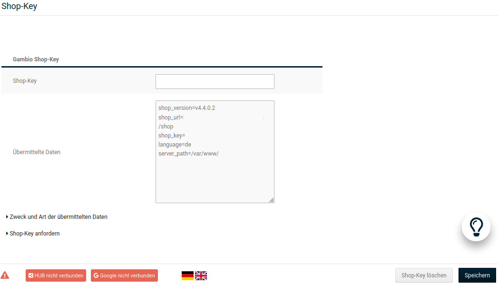

# Grundkonfiguration 

Nehme nach der Installation des Shopsystems die erstmalige Konfiguration des Shops vor. Im Folgenden findest du Informationen zur Grundkonfiguration deines Shops.

## Shop-Key 

!!! note "Hinweis"

	 Dieser Bereich des Gambio Admins ist nur in selbstgehosteten Shops verfügbar.

Der Shop-Key wird für die Verknüpfung deines Gambio Shops mit dem Gambio Kundenportal verwendet. Den Shop‑Key erhältst du im Gambio Kundenportal.

Den Shop-Key kannst du im Administrationsbereich deines Shops unter _**Einstellungen / System / Shop Key**_ in das Feld _**Shop-Key**_ eingeben. Wenn du den Shop-Key eingegeben hast, klicke auf _**Speichern**_. Das Shopsystem übermittelt nun in regelmäßigen Abständen folgende Versionsinformationen zu deinem Shop an das Gambio Kundenportal:

-   die Internetadresse \(URL\) deines Shops
-   die aktuelle Shopversion
-   den Shop‑Key
-   die zum Zeitpunkt der Übermittlung aktive Sprache im Gambio Admin
-   wenn vorhanden, eine Liste mit vorherigen Shopversionen

Eine Liste mit den genauen Daten, die an das Gambio Kundenportal weitergegeben werden, kannst du im Gambio Admin deines Shops unter _**Einstellungen / System / Shop Key**_ nach Aufruf der Seite über den Link _**Zweck und Art der übermittelten Daten**_ einsehen.