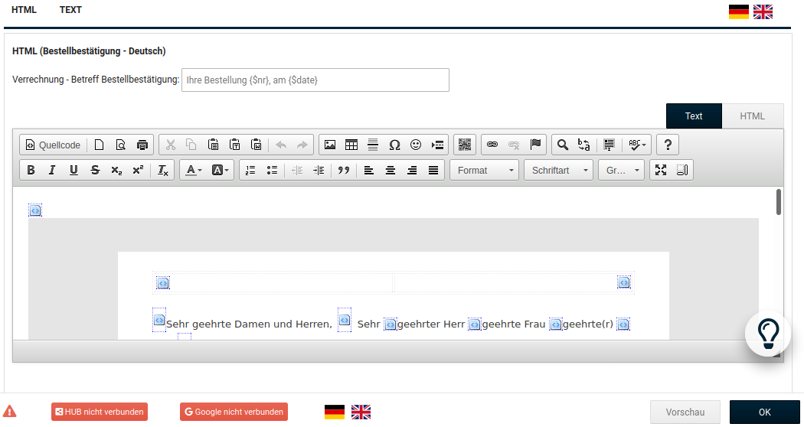

# E-Mail-Optionen 

!!! danger "Achtung"

	 Änderungen an den Einstellungen unter _**Kunden \> E-Mails \> E-Mail-Optionen**_ können dazu führen, dass keine E-Mails aus dem Shopsystem versendet werden können!

!!! note "Hinweis" 

	 Die E-Mail Transport-Methode wird in den meisten Fällen durch die Installationsroutine korrekt festgelegt. Sollte der E-Mail Versand fehlschlagen, stelle zunächst die Option bei _**Absender der Bestellbestätigungsmail**_ von _**Betreiber E-Mail**_ auf _**Kunden E-Mail**_. Wenn nach wie vor kein E-Mail Versand möglich ist, setze den _**Absender der Bestellbestätigungsmail**_ wieder auf die Standard-Einstellung zurück, ändere die _**E-Mail Transport-Methode**_ auf _**SMTP**_ und trage die SMTP-Daten ein. Achte hierbei auch den korrekten _**SMTP Port**_ und die Auswahl der richtigen _**SMTP Verschlüsselung**_ sowie die Aktivierung der Einstellung _**SMTP AUTH**_, falls der Server eine Verschlüsselung erfordert.

## E-Mail Vorlagen

Das Shopsystem versendet automatisierte E-Mails. Die Vorlagen kannst du unter _**Kunden \> E-Mails \> E-Mail Vorlagen**_ anpassen.

|Vorlagenname|Beschreibung|
|------------|------------|
|Passwort ändern|Wird dem Kunden nach Ändern des Passworts über den Shopbereich zugesandt|
|Kundenkonto erstellt|Wird dem Kunden nach erfolgreicher Kundenregistrierung zugesandt|
|Neues Passwort|Wird dem Kunden nach der Bestätigung über die Passwort vergessen-Funktion zugesandt|
|Newsletter|Wird dem Kunden nach Anmeldung am Newsletter zugesandt|
|Bestellbestätigung|Wird dem Kunden nach Bestellabschluss zugesandt|

!!! note "Hinweis"
	 In den Shopversionen 4.3 und 4.4 befindet sich an dieser Stelle auch das Eingabefeld für den Betreff der Bestellbestätigung.

|Vorlagenname|Beschreibung|
|------------|------------|
|Passwortbestätigung|Wird dem Kunden zur Bestätigung der Passwort vergessen-Funktion zugesandt|
|Rechnungsversand|Wird dem Kunden beim Erstellen einer E-Mail Rechnung zugesandt|
|Gutschein|Wird verschickt, wenn ein Kunde einen Teil seines Guthabens an einen anderen Kunden verschickt|
|Widerrufssendebestätigung|Wird versendet, wenn der Kunde das Online-Widerrufsformular verschickt|
|Bezahlen über Amazon: Benachrichtigung über abgelehnte Zahlart|Wir verschickt, wenn die gewählte Zahlungsart von Amazon Payments abgelehnt wird|
|Admin: Änderung Bestellstatus|Wird dem Kunden nach Änderung des Bestellstatus im Administrationsbereich zugesandt, wenn das Kontrollkästchen _**Kunde benachrichtigen**_ aktiviert wurde|
|Admin:Kundenkonto angelegt|Wird dem Kunden zugesandt, wenn ein Kundenkonto über den Administrationsbereich angelegt wurde|
|Admin: Gutschein freigeschaltet|Wird dem Kunden zugesandt, wenn die Gutschein-Warteliste verwendet wird und der Gutschein über den Administrationsbereich freigeschaltet wurde|
|Admin: Coupon senden|Wird dem Kunden zugesandt, wenn ein Coupon über _**Gutscheine \> Rabatt Coupons**_ verschickt wird.|
|Admin: Gutschein senden|Wird dem Kunden zugesandt, wenn ein Gutschein über _**Gutscheine \> Gutschein E-Mail**_ verschickt wird|
|Admin: Kundenkonto löschen|Wird dem Administrator zugesandt, wenn ein Kunde sein Kundenkonto über die Funktion im Shopbereich löschen möchte|
|Admin: PayPal-Link senden|Wird dem Kunden zugesandt, wenn der Administrator einen PayPal-Link generiert|

Passe die gewünschte E-Mail Vorlage über den CK-Editor an. Klicke auf _**Vorschau**_, das Vorschaufenster muss geöffnet sein, damit du die vorgenommenen Änderungen speichern kannst.