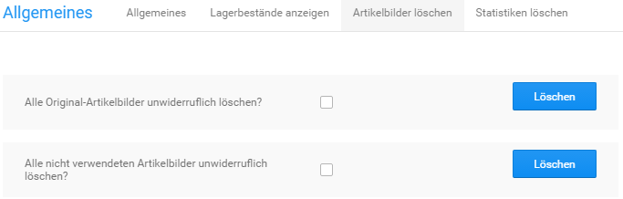

# Bild-Optionen

!!! note "Hinweis"

	 Änderungen an den Bild-Optionen werden nur für neu hochgeladene Artikelbilder übernommen. Sollen Änderungen auch bei bereits vorhandenen Artikelbildern übernommen werden, muss anschließend unter _**Einstellungen / Layout & Design / Bildverarbeitung \(Image Processing\)**_ die _**Stapelverarbeitung für Bildbearbeitung**_ ausgeführt werden.

## Grundeinstellungen

Im Administrationsbereich deines Shops werden unter _**Einstellungen / Layout & Design / Bildoptionen**_ die Einstellungen für die automatische Bildberechnung der Artikelbilder vorgenommen.

|Feldname|Beschreibung|
|--------|------------|
|Bildgröße berechnen|wenn aktiviert \(Option _**Ja**_\) werden die Bildvarianten vom Shopsystem automatisch berechnet \[Ja\]|
|Bildqualität|die JPEG-Qualität der umgewandelten Bilder in Prozent \[100\]|

!!! danger "Achtung"

	 Bei Verwenden der GDlib1-Bibliotheken für die Bildbearbeitung werden sämtliche Artikelbilder in schwarz-weiß abgelegt. Wenn du deine Artikelbilder in schwarz-weiß präsentieren möchtest, verwende die dafür vorgesehenen Funktionen für GDlib2. Die Option _**GDlib processing**_ sollte nicht verändert werden.

## Bildgröße

Im Shopsystem werden die Artikelbilder beim Hochladen automatisch an die verschiedenen Ausgangsgrößen angepasst. Für jedes Artikelbild werden dabei die Kopien aus der Tabelle _**Artikelbild-Varianten**_ angelegt. Die tatsächliche Anzeigegröße hängt hierbei von den Einstellungen im _**StyleEdit**_ ab. Jedoch kann eine Änderung der Ausgangsgrößen unter _**Einstellungen / Layout & Design / Bildoptionen**_ erhebliche Auswirkungen auf Bildqualität und Ladezeit haben.

|Bildvariante \(Verzeichnisname\)|Beschreibung|
|--------------------------------|------------|
|Originalbild \(original\_ images\)|unverändertes Originalbild|
|Artikel-Popup Bild \(popup\_images\)|Großansicht für Flyover, Zoom-Funktion und Artikelbild- Lightbox|
|Artikel-Info Bild \(info\_ images\)|Artikelbild auf der Artikel-Detailseite, große Vorschaubilder \(abhängig von Einstellung unter _**Einstellungen / Layout & Design / Bildoptionen**_\)|
|Artikel-Thumbnail \(thumbnail\_ images\)|Vorschaubild in Artikel-Listen, zum Beispiel auf der Startseite oder auf Kategorieseiten \(abhängig von Einstellung unter _**Einstellungen / Layout & Design / Bildoptionen**_\)|
|Artikel-Galerie Bild \(gallery\_ images\)|kleines Vorschaubild auf der Artikel-Detailseite; die Bildgröße kann nicht verändert werden|

Ändere die Werte _**Breite**_ und _**Höhe**_ bei dem Bild, bei dem du die Ausgangsgröße anpassen möchtest. Die neue Breite und Höhe wird bei über die Artikel-Eingabemaske neu hochgeladenen Artikelbildern angewendet.

!!! note "Hinweis" 
	 **Ausgangsgröße ist nicht gleich angezeigte Bildgröße**. Im _**Honeygrid**_ hängt die angezeigte Bildgröße von den Einstellungen im _**StyleEdit**_ ab.

!!! note "Hinweis" 
	 Wenn die geänderte Ausgangsgröße auch bei bestehenden Artikelbildern übernommen werden soll, führe unter _**Einstellungen / Layout & Design / Bildverarbeitung \(Image Processing\)**_ die _**Stapelverarbeitung für Bildbearbeitung**_ aus. Beachte, dass die Ausgabeelemente im Shopbereich nicht automatisch an die neue Größe angepasst werden. Wenn du die Bildgröße der Thumbnails oder Info-Bilder änderst, passe anschließend im Bearbeitungsmodus die betroffenen Bereiche im Shop an.

	 
## Image Processing

Änderungen die an den Einstellungen unter _**Einstellungen / Layout & Design / Bildoptionen**_ vorgenommen werden, wirken sich immer nur auf neu hochgeladene Bilder aus. Um den bestehenden Bild-Bestand anzupassen, muss unter _**Einstellungen / Layout & Design / Bildverarbeitung \(Image Processing\)**_ die _**Stapelverarbeitung für Bildbearbeitung**_ durchgeführt werden.

Öffne hierzu den Reiter _**Image Processing**_ bzw. betätige die Schaltfläche _**aufrufen**_ und klicke unten rechts auf _**Ausführen**_.

!!! danger "Achtung"

	 Der Vorgang kann, je nach Anzahl der Artikel-Bilder im Shop, einige Zeit dauern. Er sollte auf keinen Fall vorzeitig unterbrochen werden!

Bei Bedarf kann unter _**Nummer des Startbildes**_ bzw. _**Dateiname des Startbildes**_ festgelegt werden, dass die Stapelverarbeitung einen Teil der Artikelbilder überspringt.

## Artikelbilder löschen

Unter _**Toolbox \> Artikelbilder löschen**_ besteht die Möglichkeit Artikelbilder bei Bedarf zu löschen. Es können die Originalbilder \(Verzeichnis /images/product\_images/original\_images\) sowie nicht benötigte Artikelbilder, die keinem Artikel mehr zugeordnet sind, entfernt werden.

Setze hierzu den Haken in das Kästchen hinter die gewünschte Funktion und klicke auf Löschen.

!!! danger "Achtung"

	 Die Original-Bilder werden für den Bilderzoom verwendet. Werden diese gelöscht, steht die Vergrößerung nicht mehr in der bisherigen Auflösung zur Verfügung.

!!! danger "Achtung"

	 Ab Version **4.1** werden die in Kollektionen hinterlegten Bilder für Optionswerte \(Auswahlwerte bei Artikelattributen\) zusammen mit den Originalbildern gespeichert. Durch das Löschen der Originalbilder werden die **Kollektionsbilder für Attribute** ebenfalls **unwiederbringlich entfernt**!
	 
