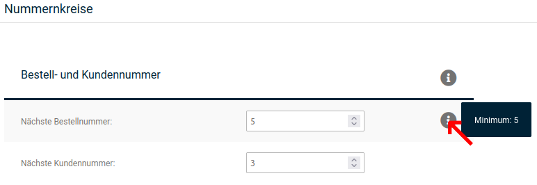

# Nummernkreise

Über Nummernkreise wird die automatische Vergabe von Bestell-, Kunden-, Rechnungs- und Lieferscheinnummern konfiguriert. Die entsprechenden Einstellungen findest du unter _**Einstellungen / System / Bestell- und Kundennummer**_, nach Aufruf der Seite _**Nummernkreise**_.

Um den Minimumwert für einen Nummernkreis anzeigen zu lassen, bewege den Mauszeiger in die zugehörige Zeile über das dann angezeigte Info-Symbol \(in der Abbildung rot markiert\).

## Bestell- und Kundennummern {#nummernkreise_bestell_und_kundennummern}

Die kommenden, zu vergebenen Bestell- und Kundennummer werden in den Eingabefeldern _**Nächste Bestellnummer**_ bzw. _**Nächste Kundennummer**_ angezeigt. Dort können die Nummern auch geändert werden. Hierbei ist zu beachten, dass die neu vergebenen Nummern nicht unter dem angezeigten Minimum liegen dürfen. Zudem kann 1 nicht als Kundennummer vergeben werden, da diese Nummer für den Hauptadministrator vorgesehen ist.

!!! danger "Achtung"

	 Das Unterschreiten des Minimum-Wertes sorgt für widersprüchliche Einträge in der Datenbank und führt so zu Fehlern im Shop.

Generell gilt, dass die Kundennummern nur heruntergesetzt werden können, wenn zuvor alle Kundenkonten gelöscht wurden.

## Rechnungs- und Lieferscheinnummer {#nummernkreise_rechnungs_und_lieferscheinnummer}

Hier kannst du die Nummernkreise für Rechnungs- und Lieferscheinnummer anpassen.

Die als nächstes zu vergebenen Rechnungs- und Lieferscheinnummer werden in den Eingabefeldern _**Nächste Rechnungsnummer**_ bzw. _**Nächste Lieferscheinnummer**_ angezeigt. Dort können die Nummern auch mit einem neuen Startwert belegt werden. Dieser darf allerdings nicht unterhalb des mit _**Minimum**_ angegebenen Wertes liegen.

!!! danger "Achtung"

	 Das Unterschreiten des Minimum-Wertes sorgt für widersprüchliche Einträge in der Datenbank und führt so zu Fehlern im Shop.

Zudem können in den Feldern _**Format Rechnungsnummer**_ und _**Format Lieferscheinnummer**_ der generelle Aufbau der Rechnungsnummer festgelegt werden. Dabei wird die fortlaufende Nummer mit dem Platzhalter _**\{INVOICE\_ID\}**_ eingetragen.

!!! example "Beispiel" 
	 Wenn unter _**Format Rechnungsnummer**_ folgendes eingetragen ist: R\_\{INVOICE\_ID\}\_2014 werden die Rechnungsnummern nach folgendem Muster vergeben:

	 R\_26\_2014, R\_27\_2014, R\_28\_2014, usw.

!!! note "Hinweis" 
	 Rechnungsnummern müssen grundsätzlich fortlaufend vergeben werden. Bei weiteren Fragen hierzu wende dich bitte an deinen Rechtsbeistand.

Beachte, dass diese beiden Nummern fortlaufend sind und jeweils erst bei der Erstellung bzw. dem Versand von Rechnung und Lieferschein generiert werden. Solltest du das Format nachträglich anpassen, so wird das neue Format auch erst in neu generierten Rechnungen und Lieferscheinen angewendet.
