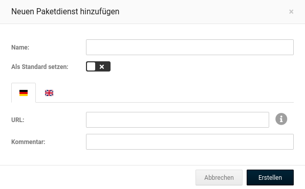

# Paketdienste

Über den Paketdienste ist es möglich Bestellungen im Shop mit dem Tracking des jeweiligen Versanddienstleisters zu verknüpfen.

## Paketdienste anlegen und bearbeiten {#toolbox_paketdienste_paketdienste_anlegen_und_bearbeiten}

Unter _**Einstellungen / Lieferung / Versanddienstleister**_, nach Aufruf der Seite _**Paketdienste**_, kannst du die Dienstleister hinterlegen und bearbeiten. Klicke auf _**Erstellen**_, um einen neuen Paketversender anzulegen. Gib unter _**Name**_ einen allgemeinen Bezeichner ein, z.B. DHL.

Trage bitte im Feld _**URL**_ die Internetadresse ein, unter der sich die Sendungsverfolgung des jeweiligen Dienstleisters aufrufen lässt. Gib hierbei für die Sendungsnummer den Platzhalter _**\{TRACKING\_NUMBER\}**_ ein.

In das Kommentarfeld kann zusätzlicher Text zum Paketdienst hinterlegt werden, der dem Kunden angezeigt wird, wenn er seine Bestellung unter _**Ihr Konto**_ aufruft.

Wenn du unter mehreren Paketdiensten einen Anbieter üblicherweise verwedest, kannst du den Haken für _**Standard**_ setzen. Der Paketdienst wird dann beim Zuweisen der Sendungsnummer zu einer Bestellung vorausgewählt \(siehe _**Sendungsnummer zuordnen**_\).

Mit einem Klick auf _**Speichern**_ wird der Paketdienst angelegt bzw. die Änderung übernommen. Über _**Schließen**_ kannst du das Eingabefenster ohne Übernahme der Änderungen verlassen.

Über das Bleistift-Symbol kannst du einen angelegten Paketdienst bearbeiten. Über das Mülltonnen-Symbol kannst du einen angelegten Paketdienst wieder löschen.

## Sendungsnummer zuordnen {#toolbox_paketdienste_sendungsnummer_zuordnen}

Um einen Paketdienst einer Bestellung zuzuordnen, gehe bitte im Gambio Admin in das Menü _**Bestellungen \> Bestellungen**_. Wähle die Bestellung durch einen Klick aus, sodass sie blau hinterlegt ist und klicke auf das Augen-Symbol, um die Bestellung aufzurufen.

Trage die Sendungsnummer in das Eingabefeld _**Sendungsnummer**_ ein und wähle im Dropdown-Menü den zugehörigen Versanddienstleister aus. Klicke abschließend auf _**Hinzufügen**_.

Nun kann der Kunde, wenn er seine Bestellung unter _**Ihr Konto**_ aufruft, über einen Link direkt zur Sendungsverfolgung des jeweiligen Anbieters gelangen.

Die zugewiesene Sendungsnummer, der Paketdienst, sowie das Datum der Zuweisung wird nun in der Detailansicht der Bestellung angezeigt.
