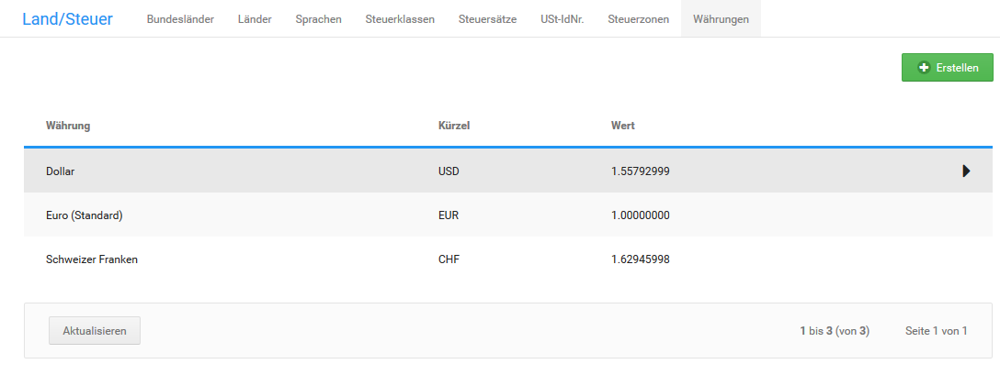

# Währungen

Bei der Installation des Shopsystems werden die Währungen Euro, Schweizer Franken und US Dollar mit geschätzten Wechselkursen angelegt. Die Wechselkurse werden nicht automatisch aktualisiert.

## Wechselkurse aktualisieren

Klicke im Gambio Admin deines Shops unter _**Einstellungen / Sprachen, Länder, Steuern / Währungen**_, nach Aufruf der Seite, auf _**Wechselkurse aktualisieren**_. Die Wechselkurse aller Währungen werden kostenfrei bei einem externen Dienstleister abgefragt. Als Referenzkurs wird die als Standardwährung festgelegte Währung verwendet.

!!! note "Hinweis" 
	 Unter Umständen können einzelne Währungskurse nicht aktualisiert werden. Ob alle Währungskurse aktualisiert werden konnten, siehst du in den Erfolgs- und Fehlermeldungen oberhalb der Tabelle. Wenn das Abrufen eines Wechselkurses fehlschlägt, führe die Aktion erneut aus.

## Währung hinzufügen

Wenn du weitere Währungen anbieten möchtest, füge unter _**Einstellungen / Sprachen, Länder, Steuern / Währungen**_, nach Aufruf der Seite, eine neue Währung hinzu.

1.  Klicke auf _**Erstellen**_
2.  Trage im Feld _**Name**_ den Namen und im Feld _**Kürzel**_ das Kürzel für die Währung ein

    Beachte, dass das Währungskürzel der ISO Normierung entsprechen muss, damit Wechselkurse korrekt abgefragt werden können.

3.  Trage im Feld _**Symbol links**_ oder _**Symbol rechts**_ das Währungssymbol ein

    Beachte, dass Sonderzeichen unter Umständen nicht korrekt angezeigt werden. Trage im Zweifelsfall ebenfalls das Kürzel als Symbol ein.

4.  Trage in die Felder _**Dezimaltrennzeichen**_, _**Tausendertrennzeichen**_ und _**Dezimalstellen**_ die für deine Währung geltenden Formatierungszeichen ein

    Europäische Währungen verwenden in der Regel ein Komma als Dezimaltrennzeichen, kein Tausendertrennzeichen und zwei Dezimalstellen.

5.  Wenn dir der aktuelle Wechselkurs zur Standardwährung bekannt ist, trage den Kurs im Feld _**Wert**_ ein
6.  Aktiviere das Kontrollkästchen _**als Standard definieren**_, um die neue Währung als Standardwährung festzulegen
7.  Klicke auf _**Einfügen**_
8.  Aktualisiere die Wechselkurse für die Währungen, wie unter _**Wechselkurse aktualisieren**_ beschrieben

## Standardwährung ändern

Üblicherweise werden alle Preise im Shop in der Standardwährung dargestellt. Die Währung muss in diesem Fall über einen der Währungswechsel im oberen rechten Menü oder in der linken Menüleiste umgestellt werden. Wenn du deinen Shop außerhalb der Eurozone betreibst, muss die Standardwährung unter _**Einstellungen / Sprachen, Länder, Steuern / Währungen**_, nach Aufruf der Seite, angepasst werden.

1.  Markiere in der Liste _**Währungen**_ die Währung, die du als Standardwährung festlegen möchtest

    Die aktuell markierte Währung ist grau hinterlegt.

2.  Klicke auf _**Bearbeiten**_
3.  Aktiviere das Kontrollkästchen _**als Standard definieren**_
4.  Trage im Feld Wert den Wert _**1.0000**_ ohne Anführungszeichen ein
5.  Klicke auf _**Aktualisieren**_
6.  Aktualisiere die Wechselkurse für die Währungen, wie unter _**Wechselkurse aktualisieren**_ beschrieben

!!! note "Hinweis" 
	 Änderungen an der Standardwährung werden erst nach einem erneuten Anmelden im Shop wirksam. Wenn du Änderungen an der Standardwährung vornimmst, melde dich von deinem Shop ab und wieder an.

## Währung löschen

Wenn du eine Währung nicht mehr benötigst, kannst du diese unter _**Einstellungen / Sprachen, Länder, Steuern / Währungen**_, nach Aufruf der Seite, entfernen. Die Standardwährung kann nicht gelöscht werden. Wenn du die Standardwährung löschen möchtest, lege zuvor eine neue Standardwährung fest, wie unter _**Standardwährung ändern**_ beschrieben.

1.  Markiere in der Liste _**Währungen**_ die Währung, die du als Standarwährung festlegen möchtest

    Die aktuell markierte Währung ist grau hinterlegt.

2.  Klicke auf _**Löschen**_
3.  Klicke erneut auf _**Löschen**_, um das Löschen zu bestätigen

