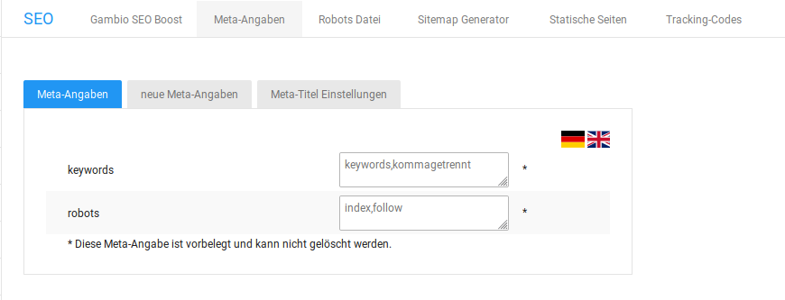
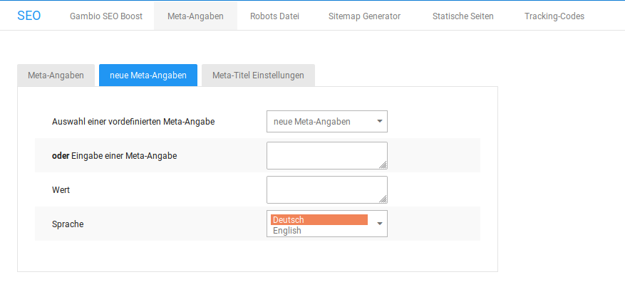
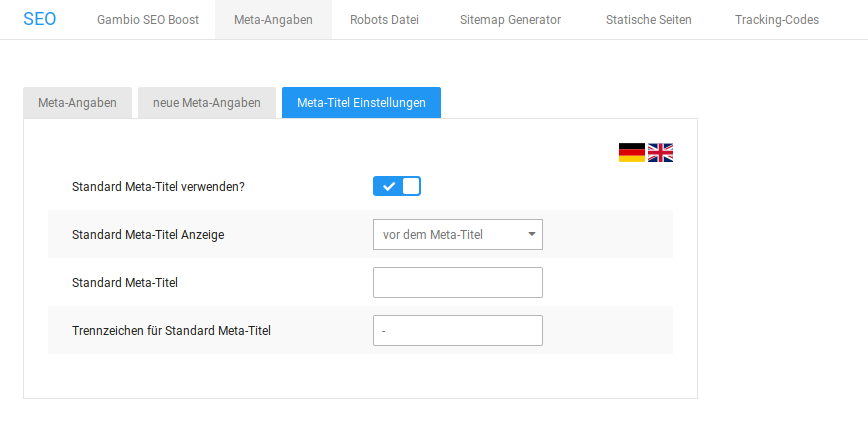

# Meta-Angaben

Unter _**Einstellungen / Suchmaschinenoptimierung / Meta-Angaben**_ können die bestehenden Einstellungen zu den Meta-Informationen deines Shops eingesehen, bearbeitet und ergänzt werden.

!!! note "Hinweis" 
	 Mit Meta-Angaben kannst du Hinweise für Web-Browser und Suchmaschinen hinterlegen. Im Shopsystem sind bereits einige Meta-Angaben voreingestellt. Zusätzlich zu den voreingestellten Meta-Angaben können beliebig viele eigene Meta-Angaben hinzugefügt werden.

## Vorgaben

### Robots

In der Meta-Angabe _**robots**_ stehen Anweisungen an Suchmaschinen-Roboter, wie mit der vorliegenden Seite umgegangen werden soll. Die Anweisungen zum Indexieren \(index,noindex\) und Folgen von Links \(follow,nofollow\) können nach Bedarf gemischt werden. Die Grundeinstellung _**index,follow**_ weist den Roboter zum Indexieren der Seite und dem Folgen von Links auf der Seite an.

### Keywords

In der Meta-Angabe _**keywords**_ \(Schlagwörter\) kannst du eine kommagetrennte Liste von Schlagwörtern zu deinem Onlineshop hinterlegen. Die Schlagwörter können von Suchmaschinen als Suchwörter berücksichtigt werden, unter denen Kunden deinen Shop finden.

## Eigene Meta-Angaben

Unter _**Einstellungen / Suchmaschinenoptimierung / Meta-Angaben**_, nach Aufruf der Seite _**Meta-Angaben**_, kannst du zusätzliche Meta-Angaben anlegen.

1.  Wähle in der Liste _**Auswahl einer vordefinierten Meta-Angabe**_ eine Meta-Angabe aus oder trage im Feld _**Eingabe einer Meta-Angabe**_ eine Meta-Angabe ein, die in der Liste nicht enthalten ist.
2.  Gebe im Feld _**Wert**_ den Wert für die entsprechende Meta-Angabe ein.
3.  Wähle aus der Liste _**Sprache**_ die Sprache aus, für die die Meta-Angabe übernommen werden soll.
4.  Speichere die neue Angabe.

|Meta-Angabe|Beschreibung|
|-----------|------------|
|description|Beschreibung der Seite|
|author|Autor der Internetseite \(inhaltlich verantwortlich\)|
|date|gibt an, wann die Seite veröffentlicht wurde|
|copyright|definiert das Copyright deines Shops, also dein Name oder deine Firma|
|publisher|Herausgeber der Seite|
|page-topic|grobe Kategorisierung für den Suchkatalog, in den deine Seite eingetragen wird. Du kannst auch mehrere Begriffe eintragen. \(beispielsweise Kleidung, Baby-Kleidung, Umstandsmode\)|
|page-type|Art deiner Website \(beispielsweise Onlineshop\)|
|audience|Zielgruppe deines Webshops, sofern du das festlegen kannst und möchtest \(beispielsweise Handwerker, Heimwerker, Erwachsene,...\)|

## Meta-Titel

Unter _**Einstellungen / Suchmaschinenoptimierung / Meta-Angaben**_, nach Aufruf der Seite _**Meta-Angaben**_, kannst du den Titel deines Onlineshops festlegen, der je nach Browser in der Tableiste oder im Browsertitel ausgegeben wird. Zusätzlich zum Seitentitel wird der Titel der aktuell angezeigten Seite ausgegeben.

!!! note "Hinweis" 
	 Wenn kein Meta-Titel festgelegt wird, verwendet das Shopsystem den unter _**Einstellungen / Shop / Allgemein**_ im Feld _**Name**_ des Shops eingetragenen Wert als Seitentitel.

|Einstellung|Beschreibung|
|-----------|------------|
|Standard Meta-Titel verwenden?|wenn aktiviert, wird zusätzlich zum Seitentitel der Standard Meta-Titel ausgegeben|
|Standard Meta-Titel Anzeige|legt fest, ob der Standard Meta-Titel vor oder nach dem Seitentitel \(Meta-Titel\) ausgegeben wird|
|Standard Meta-Titel|\(optional\) Standard Meta-Titel, der zusätzlich zum Seitentitel ausgegeben wird|
|Trennzeichen für Standard Meta-Titel|legt das Trennzeichen fest, mit dem Standard Meta-Titel und Seitentitel voneinander getrennt werden|

!!! note "Hinweis" 
	 Die Meta-Informationen im Bereich _**Einstellungen / Suchmaschinenoptimierung / Meta-Angaben**_ werden nur für Seiten ohne eigene Meta-Angaben verwendet. Individuelle Meta-Einträge auf anderen Seiten haben Vorrang vor den allgemeinen Angaben.

