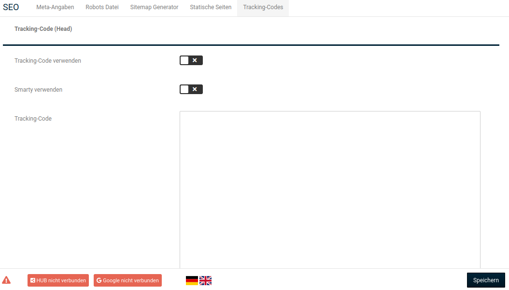

# Tracking-Codes

Unter _**Einstellungen / Suchmaschinenoptimierung / Tracking Codes**_ kann die Seite _**Tracking-Codes**_ aufgerufen werden.

!!! note "Hinweis"

	 Beim Tracking werden Seitenbesuche und das Besucherverhalten deiner Kunden in deinem Shop aufgezeichnet. Die statistische Auswertung wird mit speziellen Programmen vorgenommen. Zum Aufzeichnen der Seitenbesuche wird in der Regel ein Javascript-Code benötigt.

Es können Tracking-Codes für folgende Bereiche hinterlegt werden:

- _**Head**_: Code wird im Kopfteil (HTML-Header) aller Shopseiten eingebunden
- _**Body**_: Code wird am unteren Ende des Body-Bereichs (HTML-Body) aller Shopseiten eingebunden
- _**Body Bestellabschluss**_: Code wird im Body-Bereich der Bestellabschlusseite (Seite, die nach dem Klick auf _**kostenpflichtig bestellen**_ geladen wird) eingebunden

Für jeden Bereich stehen die gleichen Einstellungen zur Verfügung:

| Feldname                      | Beschreibung                                                 |
| ----------------------------- | ------------------------------------------------------------ |
| _**Tracking-Code verwenden**_ | Eingefügter Tracking-Code wird im betreffenden Bereich verwendet |
| _**Smarty verwenden**_        | Ist der Haken gesetzt, wird im Tracking-Code enthaltener Smarty-Code interpretiert |
| _**Tracking-Code**_           | Eingabefeld, in das Tracking-Codes eingefügt werden können   |

!!!danger "Achtung"
	 Achte darauf, dass die HTML-Tags _**script**_ am Anfang und _**/script**_ am Ende deines Codes erhalten bleiben.

Bestätige vorgenommene Änderungen mit einem Klick auf die Schaltfläche _**Speichern**_.

!!! note "Hinweis"
	 Erweitertes Tracking, wie beispielsweise Conversion Tracking, kann über die Funktion Tracking-Codes nicht eingebunden werden. Hierfür kann das _**Google Services**_ Modul unter dem Menüpunkt _**Google**_ verwendet werden.

!!! danger "Achtung"
	 Beim Tracking werden Daten deiner Kunden aufgezeichnet. Gegebenenfalls sind beim Verwenden eines Trackings Änderungen an deinen Datenschutzbestimmungen nötig. Bitte wende dich dahingehend an deinen Rechtsberater.

