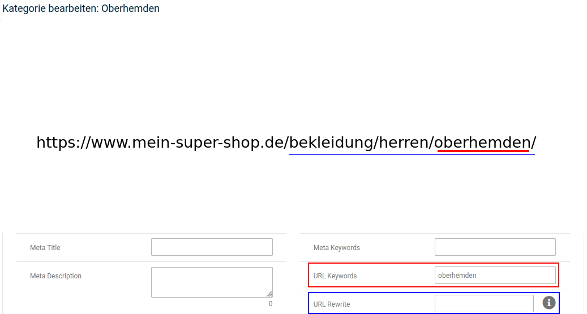
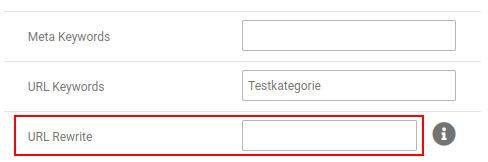
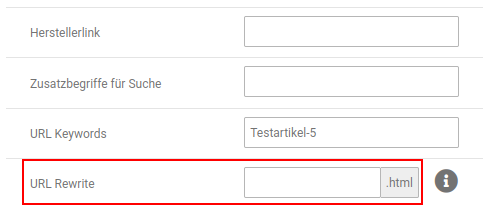
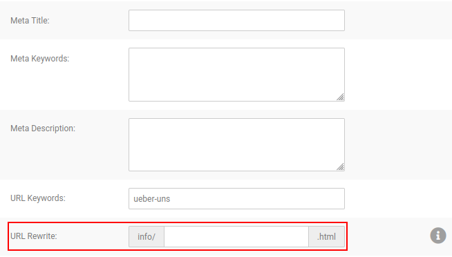

# URL Rewrite

## Einleitung

!!! abstract "Definitionen"

	 Es werden die folgenden Begriffe verwendet:
	 
	 - _**URL**_: 
		- steht für _Uniform Resource Locator_ 
		- Adresse einer spezifischen Seite im Shop
		- wird in der Adresszeile des Browsers angezeigt
		- z.B. _https://www.mein-super-shop.de/bekleidung/kleider/kragenkleid.html_
	 - _**Domain**_:
		- Name deines Shops im DNS (Domain Name System) des Internets
		- Teil der _Shopadresse_ s.u.
		- wird in der Adresszeile des Browsers angezeigt
		- z.B. _www.mein-super-shop.de_
	- _**Shopadresse**_:
		- Adresse, über die dein Shop im Internet aufgerufen werden kann
		- wird in der Adresszeile des Browsers angezeigt
		- beinhaltet typischerweise die _Domain_ deines Shops s.o.
		- z.B. _https://www.mein-super-shop.de_
	 - _**URL Keywords**_:
		- Bestandteile einer URL 
		- Artikel-, Kategorie- und Content-Seiten haben für jede verwendete Sprache eigene URL Keywords
		- URL Keywords sind innerhalb einer URL eindeutig, können also nicht mehrfach für unterschiedliche Seiten verwendet werden
		- bei der URL _https://www.mein-super-shop.de/bekleidung/kleider/kragenkleid.html_ sind _bekleidung_ und _kleider_ im Regelfall URL Keywords aus Kategorien und _kragenkleid_ aus einem Artikel

Über _**URL Rewrite**_ können die URLs zu Kategorien, Artikeln und Content-Seiten individuell angepasst werden, indem man die sogenannten URL Keywords, die in der Adresszeile des Browsers hinter der Shopadresse stehen, durch einen eigenen Inhalt ersetzt. Hierbei ist zu beachten, dass die _**URL Keywords**_, die für einen Artikel oder eine Kategorie eingetragen sind, i.d.R. nur einen Teil aller verwendeten URL Keywords darstellen:

Über _**URL Rewrite**_ lassen sich jedoch alle Keywords überschreiben, die sich in der URL der betreffenden Seite befinden. Einzige Ausnahme stellen hier Content-Seiten dar, die immer die Angabe _/info/_ nach der Shopadresse verwenden. 

!!! danger "Achtung"

	 Der Inhalt des Felds _**URL Keywords**_ sollte nach Möglichkeit unverändert bleiben und ein Eintrag nur im Feld _**URL Rewrite**_ vorgenommen werden.
	 
	 Die Funktion _**URL Rewrite**_ arbeitet nur mit aktiviertem _**Gambio SEO Boost**_.
	 
!!! note "Hinweis"
	 Nach dem Vornehmen von Änderungen über _**URL Rewrite**_ sollten unter _**Toolbox > Cache**_ die Caches für 
	 
	 1. _**Artikel- und Kategoriezuordnungen**_ (bei Änderungen an Artikeln oder Kategorien)
	 2. _**Modulinformationen**_
	 3. _**Seitenausgabe**_ 
	 
	 geleert bzw. neu erzeugt werden.

## URL Rewrite für Kategorien

Du kannst die URL einer Katgorie ändern, indem du sie unter _**Artikel > Artikel/Kategorien**_ bearbeitest. Du findest dort im Bereich _**Kategoriedetails**_ das Eingabefeld _**URL Rewrite**_:

!!! note "Hinweis"
	 Der **/** zwischen Shopadresse und URL Keywords muss nicht angegeben werden, er wird automatisch gesetzt.

!!! example "Beispiel"
	 Du hast eine Kategorie _Bekleidung >> Herren \>\> Oberhemden \>\> kurzarm_, diese lässt sich im Shop über die URL
	 
	 _https://www.mein-super-shop.de/bekleidung/herren/oberhemden/kurzarm_
	 
	 aufrufen. Du bearbeitest die Kategorie _kurzarm_ und trägst unter _**URL Rewrite**_ folgendes ein:
	 
	 _kurzarmhemden_
	 
	 Die Kategorie ist nach der Änderung über die URL
	 
	 _https://www.mein-super-shop.de/kurzarmhemden_
	 
	 aufrufbar.

!!! note "Hinweis"
	 Die Änderung über _**URL Rewrite**_ innerhalb der Kategorie wirkt sicht _nicht_ auf die enthaltenen Artikel oder Unterkategorien aus. Eine Unterkategorie _kurzarm bügelfrei_ würde weiterhin über _https://www.mein-super-shop.de/bekleidung/herren/oberhemden/kurzarm/kurzarm-buegelfrei/_ aufgerufen werden.

## URL Rewrite für Artikel

Es lässt sich ebenfalls für einzelne Artikel eine eigene URL festlegen. Bearbeite hierzu den Artikel unter _**Artikel > Artikel/Kategorien**_, das Feld _**URL Rewrite**_ befindet sich im Bereich _**Artikeldetails**_: 

!!! note "Hinweis"
	 Der **/** zwischen Shopadresse und URL Keywords muss nicht angegeben werden, er wird automatisch gesetzt.

!!! example "Beispiel"
	 Du hast einen Artikel _Bekleidung » Herren » Oberhemden » kurzarm » kurzarm Herrenhemd_, dieser wird über die URL
	 
	 _https://www.mein-super-shop.de/bekleidung/herren/oberhemden/kurzarm/kurzarm-herrenhemd.html_
	 
	 aufgerufen. Du trägst in das Feld _**URL Rewrite**_ folgendes ein:
	 
	 _arbeitshemden/kurzarm_
	 
	 Der Artikel wird nach der Änderung über die URL 
	 
	 _https://www.mein-super-shop.de/arbeitshemden/kurzarm.html_
	 
	 aufgerufen.

!!! example "Beispiel"
	 Du hast einen Artikel _Bekleidung » Herren » Oberhemden » kurzarm » kurzarm Herrenhemd_, dieser wird über die URL
	 
	 _https://www.mein-super-shop.de/bekleidung/herren/oberhemden/kurzarm/kurzarm-herrenhemd.html_
	 
	 aufgerufen. Du trägst in das Feld _**URL Rewrite**_ folgndes ein:
	 
	 _arbeitshemd_
	 
	 Der Artikel wird nach der Änderung über die URL 
	 
	 _https://www.mein-super-shop.de/arbeitshemd.html_
	 
	 aufgerufen.

!!! note "Hinweis"
	 Das Aufrufen von Artikeln über verkürzte Links (ohne URL Keywords aus den Kategorien) ist ebenfalls über die Einstellung _**Kurze Produkt-URLs**_ unter _**Einstellungen / Suchmaschinenoptimierung / SEO URLs**_ möglich. Diese Einstellung wirkt sich jedoch pauschal auf alle Artikel aus.
	 
	 Die Funktion _**URL Rewrite**_ überschreibt die Funktion _**Kurze Produkt-URLs**_ für den jeweiligen Artikel. Es lässt sich also z.B. ein Kategoriepfad für einzelne Artikel angeben, während für alle anderen Proukte die kurzen URLs verwendet werden.

## URL Rewrite für Content-Seiten

Es ist ebenfalls möglich die URL von eigenständigen Content-Seiten anzupassen. Gehe hierzu im Gambio Admin unter _**Inhalte > Content Manager > Seiten**_ und bearbeite den gewünschten Content. 

!!! note "Hinweis"
	 Der **/** zwischen Shopadresse und URL Keywords muss nicht angegeben werden, er wird automatisch gesetzt. Bei Content-Seiten wird außerdem immer der Zusatz _/info/_ der URL hinzugefügt.
	 
!!! example "Beispiel"
	 Du verlinkst vom Content _Über uns_ (https://www.mein-super-shop.de/info/ueber-uns.html) auf weitere Unterseiten, z.B. eine Seite _Unsere Firma_. Diese wird über die URL
	 
	 _https://www.mein-super-shop.de/info/unsere-firma.html_
	 
	 aufgerufen. Du möchtest die Content-Seite aber auch in der URL als Unterseite darstellen. Du bearbeitest daher den Content _Unsere Firma_ und trägst unter _**URL Keywords**_ folgendes ein:
	 
	 _ueber-uns/unsere-firma_
	 
	 Nach der Änderung wird die Seite über die URL
	 
	 _https://www.mein-super-shop.de/info/ueber-uns/unsere-firma.html_
	 
	 aufgerufen.