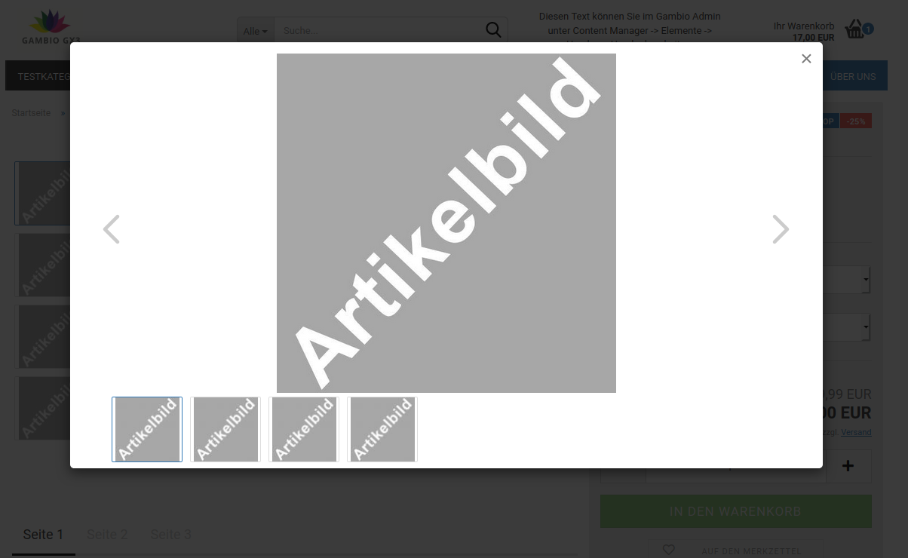
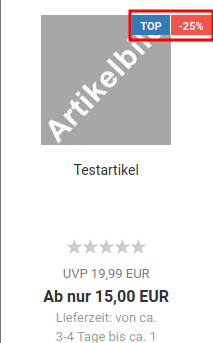
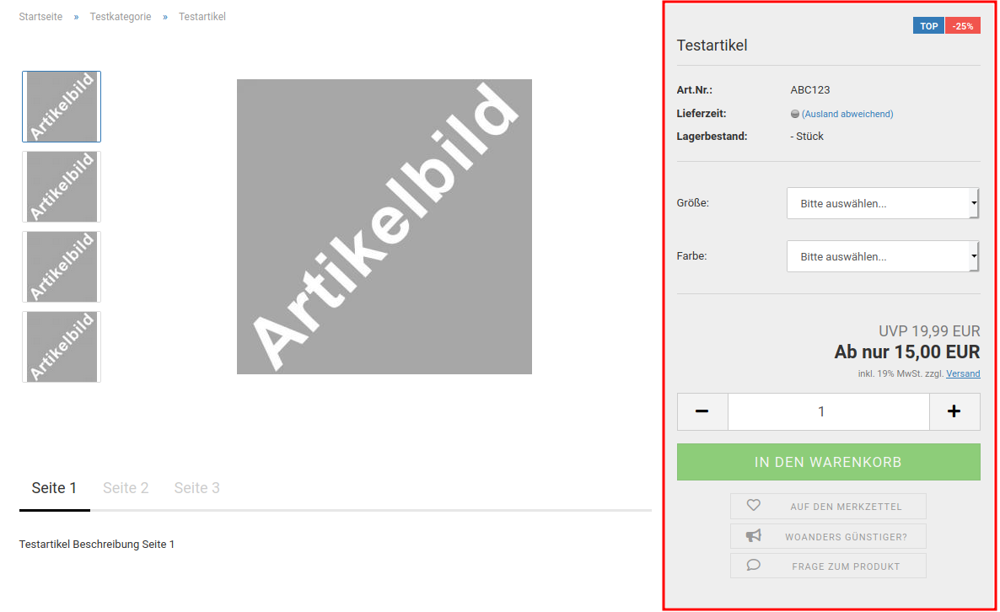
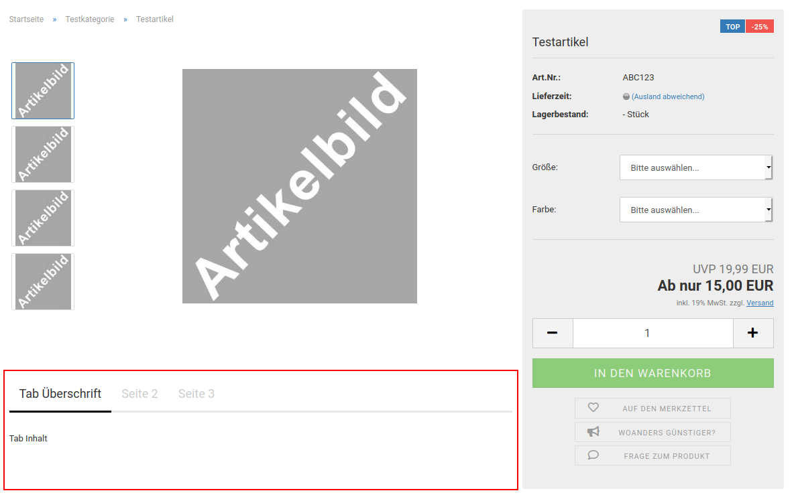

# Produkte {#styleedit4_themes_theme_bearbeiten_menues_bereiche_produkte}

## Artikelbild { .section}

|Feldname|Berschreibung|
|--------|-------------|
|Höhe|Höhe des Artikelbildbereichs auf der Artikeldetailseite|
|Höhe Mobil|Höhe des Artikelbildbereichs in der mobilen Ansicht \(Tablet und Smartphone\)|
|Höhe Lightbox|Höhe des Artikelsbildbereichs in der Lightbox

|
|Höhe Lightbox Mobil|Höhe des Artikelbildbereichs in der Lightbox in der mobilen Ansicht \(Tablet\)|
|Breite der Thumbnails|Breite des Artikelbildbereichs der kleinen Vorschaubilder|
|Breite der Thumbnails Mobil|Breite des Artikelbildbereichs der kleinen Vorschaubilder in der mobilen Ansicht|
|Hintergrund|
|Farbe|Hintergrundfarbe des Artikelbildbereichs, vorbelegt mit transparent")

|
|Bild einfügen|Hintergrundbild des Artikelbildbereichs|
|Farbverlauf einfügen|Farbverlauf als Hintergrund des Artikelbildbereichs|

**Note:**

Der Artikelbildbereich legt fest, wie viel Platz dem jeweiligen Artikelbild zur Verfügung steht. Da bei der Änderung einer Dimension \(Höhe oder Breite\) die jeweils andere entsprechend skaliert wird, kann der Bildbereich nicht unbegrenzt vergrößert werden.

## Produktliste { .section}

Produktlisten können sowohl Kategorien als auch andere Produktseiten sein, wie z.B. die Auflistung der Sonderangebote

|Feldname|Beschreibung|
|--------|------------|
|Hintergrund|
|Farbe|Hintergrundfarbe des Produkts in der Produktliste in gekachelter
                  Ansicht")

 in gelisteter
                  Ansicht")

|
|Bild einfügen|Hintergrundbild des Produkts in der Produktliste|
|Farbverlauf einfügen|Farbverlauf als Hintergrund des Produkts in der Produktliste|
|Hintergrund der Galerie|
|Farbe|Hintergrundfarbe des Galeriebereichs bei Artikellisten in gekachelter Ansicht in
                  gekachelter Ansicht")

|
|Bild einfügen|Hintergrundbild des Galeriebereichs bei Artikellisten in gekachelter Ansicht|
|Farbverlauf einfügen|Farbverlauf als Hintergrund des Galeriebereichs|
|Grid-Spalten Mobil|Anzahl der Spalten bei gekachelter Ansicht der Artikelliste, Smartphone-Ansicht|
|Grid-Spalten Klein|Anzahl der Spalten bei gekachelter Ansicht der Artikelliste, Tablet Portrait-Ansicht|
|Grid-Spalten Medium|Anzahl der Spalten bei gekachelter Ansicht der Artikelliste, Tablet Landscape-Ansicht|
|Grid-Spalten Groß|Anzahl der Spalten bei gekachelter Ansicht der Artikelliste, Desktop-Ansicht|
|Höhe des Produktnamens in der Kachel|Höhe des Bereichs der Produktkachel, in dem der Produktname angezeigt wird

|
|Höhe des Preises in der Kachel|Höhe des Bereichs der Produktkachel, in dem der Preis angezeigt wird

|
|Abstand zwischen Ribbons und Artikelbild|vertikaler Abstand, vorbelegt mit 0

|
|Höhe des Produktbildes Kachel|Höhe des Bildbereichs in der gekachelten Ansicht|
|Höhe des Produktbildes Kachel mobil|Höhe des Bildbereichs in der gekachelten Ansicht \(Smartphone\)|
|Höhe des Galeriebildes Flyover|Höhe des Bildbereichs in der Galerie der gekachelten Ansicht \(Mouseover/Hover\)|
|Breite der Galerie|Breite des Galeriebereichs der gekachelten Ansicht \(Mouseover/Hover\)|
|Lieferzeit in Kachel immer anzeigen|Lieferzeit wird durchgängig angezeigt, nicht nur beim Mouseover|

**Note:**

Hovern bzw. Flyover bezeichnet das Platzieren des Mauszeigers über ein Element, ohne es anzuklicken.

## Produktdetails Box { .section}

|Feldname|Beschreibung|
|--------|------------|
|Hintergrund|
|Farbe|Hintergrundfarbe der Produktdetailbox|
|Bild einfügen|Hintergrundbild der Produktdetailbox|
|Farbverlauf einfügen|Farbverlauf als Hintergrund der Produktdetailbox|
|Schriftfarbe|Schriftfarbe in der Produktdetailbox, vorbelegt mit $text-color|
|Hinweis Schriftfarbe|Schriftfarbe für Preis-, Steuer- und Versandkostenhinweis, vorbelegt mit $gray-light")

|
|Rahmenbreite|Breite des Rahmens um die Produktdetailbox, vorbelegt mit 0|
|Rahmenstil|Stil des Rahmens um die Produktdetailbox, vorbelegt mit none|
|Rahmenfarbe|Farbe des Rahmens um die Produktdetailbox, vorbelegt mit transparent")

|
|Button Schriftfarbe|Schriftfarbe der Buttons unterhalb des Warenkorb-Buttons")

|
|Button Schriftfarbe Hover|Schriftfarbe der Buttons unterhalb des Warenkorb-Buttons beim Mouseover/Hover, vorbelegt mit darken\($gx-product-info-button-color, 10%\)|
|Button Hintergrundfarbe|Hintergrundfarbe der Buttons unterhalb des Warenkorb-Buttons, vorbelegt mit transparent|
|Button Hintergrundfarbe Hover|Hintergrundfarbe der Buttons unterhalb des Warenkorb-Buttons beim Mouseover/Hover, vorbelegt mit transparent|
|Button Rahmenfarbe|Rahmenfarbe der Buttons unterhalb des Warenkorb-Buttons")

|
|Button Rahmenfarbe Hover|Rahmenfarbe der Buttons unterhalb des Warenkorb-Buttons beim Mouseover/Hover|
|Preisbox mitscrollen|soll die Produktdetailbox mitscrollen?|

**Note:**

Hovern bezeichnet das Platzieren des Mauszeigers über ein Element, ohne es anzuklicken.

## Tabs { .section}

|Feldname|Beschreibung|
|--------|------------|
|Schriftfarbe|Schriftfarbe der Tab-Überschriften, außer aktiver Tab|
|Schriftfarbe aktiver Tab|Schriftfarbe der Überschrift des aktiven Tabs, vorbelegt mit $text-color|
|Rahmenfarbe|Farbe der unteren Abgrenzung der Tab-Überschriften, vorbelegt mit transparent")

|
|Rahmenfarbe aktiver Tab|Farbe der unteren Abgrenzung des aktiven Tabs|
|Rahmenfarbe Tab Container|Farbe der Abgrenzung zwischen Überschriften und Tabinhalten
                  gesetzt")

|
|Hintergrund|
|Farbe|Hintergrundfarbe der Tab-Überschriften, außer aktiver Tab, vorbelegt mit transparent")

|
|Bild einfügen|Hintergrundbild der Tab-Überschriften, außer aktiver Tab|
|Farbverlauf einfügen|Farbverlauf als Hintergrund der Tab-Überschriften, außer aktiver Tab|
|Hintergrund aktiver Tab|
|Farbe|Hintergrundfarbe der Überschrift des aktiven Tabs|
|Bild einfügen|Hintergrundbild der Überschrift des aktiven Tabs|
|Farbverlauf einfügen|Farbverlauf als Hintergrund der Überschrift des aktiven Tabs|

## Ribbons { .section}

 und
        Angebot auf der Artikeldetailseite")

 und
        Angebot in der Kachelansicht (Produktliste)")

 und
        Angebot in der Listenansicht (Produktliste)")

|Feldname|Beschreibung|
|--------|------------|
|Ribbon anzeigen|Ribbon wird für passende Artikel verwendet|
|Hintergrundfarbe|Hintergrundfarbe des Ribbons|
|Schriftfarbe|Schriftfarbe des Ribbons|

**Parent topic:**[Bereiche](10_3_5_1_2_Bereiche.md)

