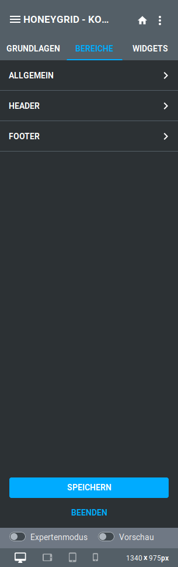

# Bereiche {#styleedit4_themes_theme_bearbeiten_menues_bereiche}

Das Menü Bereiche beinhaltet Einstellungen für die einzelnen Bereiche des Shops.

**Note:** Die Einstellungen in diesem Menü hängen vom eingestellten Modus ab. Um weitere Abschnitte anzuzeigen, aktiviere im unteren Teil des StyleEdits den Expertenmodus.

Die enthaltenen Abschnitte werden durch einen Mausklick aufgerufen. Über einen Klick auf das ✖ gelangst du zurück in die Übersicht der Bereiche. Über einen Klick auf ← gelangst du aus dem Unterabschnitt zurück in der übergeordneten Abschnitt

Manche Abschnitte beinhalten mehr als eine Ebene mit Unterabschnitten.

-   **[Allgemein](10_3_5_1_2_1_Allgemein.md)**  

-   **[Header](10_3_5_1_2_2_Header.md)**  

-   **[Kategorien](10_3_5_1_2_3_Kategorien.md)**  

-   **[Sekundärnavigation](10_3_5_1_2_4_Sekundaernavigation.md)**  

-   **[Spaltenaufteilung](10_3_5_1_2_5_Spaltenaufteilung.md)**  

-   **[Footer](10_3_5_1_2_6_Footer.md)**  

-   **[Produkte](10_3_5_1_2_7_Produkte.md)**  

-   **[Checkout](10_3_5_1_2_8_Checkout.md)**  

-   **[Menüboxen](10_3_5_1_2_9_Menueboxen.md)**  

-   **[Cookie Consent Panel](10_3_5_1_2_10_CookieConsentPanel.md)**  

**Parent topic:**[Menüs des StyleEdit 4](10_3_5_1_MenuesDesStyleEdit4.md)

