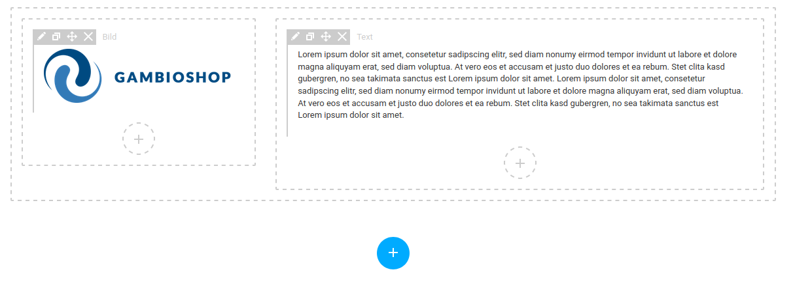

# Vornehmen von Einstellungen {#styleedit4_themes_theme_bearbeiten_einstellungen_vornehmen}

## Farbeinstellungen { .section}

Um eine Farbe zu ändern, klicke wahlweise auf den im hellgrauen Feld angezeigten Farbwert oder die quadratische Farbanzeige. Es öffnet sich der Dialog mit einer Farbpalette.

Die einzelnen Bereichen sind von oben nach unten und links nach rechts wie folgt

-   Farbauswahl: über das große Feld kann die gewünschte Farbe ausgewählt werden
-   Farbskala: wählt den Bereich des Farbspektrums aus, der in der Farbauswahl angezeigt wird
-   Transparenz: legt den Alpha-Wert der Farbe fest, von durchsichtig bis voll deckend
-   Vorschaufenster: stelt den ausgewählten Farbwert in einer Vorschau dar
-   Hex-Wert: Eingabefeld mit Farbwert in hexadezimaler Schreibweise
-   R: Rot-Anteil der Farbe, von 0 bis 255
-   G: Grün-Anteil der Farbe, von 0 bis 255
-   B: Blau-Anteil der Farbe, von 0 bis 255
-   A: Alpha-Wert / Deckkraft der Farbe, von 0 bis 1

## Farbverlaufeinstellungen { .section}

Über die Einstellung Farbverlauf anzeigen werden die Einstellungen zum Anlegen eines Farbverlaufs angezeigt. Bei einem Farbverlauf findet ein Übergang von einer zu einer anderen Farbe statt.

 nach
        blau (#0000FF)")

|Feldname|Beschreibung|
|--------|------------|
|1 Farbe|Ausgangsfarbe des Farbverlaufs|
|2 Farbe|Zielfarbe des Farbverlaufs|
|Typ|Typ des Farbverlaufs \(linear oder radial\)|
|Winkel|Winkel des Farbverlaufs bei Typ linear|

**Note:**

Wenn ein Feld für eine Farbeinstellung leer ist, lässt sich die Farbpalette nicht über einen Mausklick aufrufen. Hier hilft es, einfach einen beliebigen Farbwert, z.B. \#000000 oder \#FFFFFF in das Feld einzutragen und in einen beliebigen Bereich des Shops zu klicken. Das StyleEdit aktualisiert dann die Einstellung und es erscheint die kleine, quadratische Vorschau-Box.

Der lineare Farbverlauf findet über die Länge einer unsichtbaren Linie statt, die von einer Kante bzw. Ecke des Elements zu einer anderen läuft. Die Linie verläuft hierbei in einem Winkel, der sich in 45 Grad-Schritten einstellen lässt. Hierbei kann man sich an einer Kompassrose orientieren:

Im Beispiel sieht man, dass der Verlauf an einer \(gedachten\) Linie von unten links nach oben rechts ausgerichtet ist.

**Note:**

Im Dropdown Winkel ist üblicherweise ein Wert von 0deg voreingestellt. Angezeigt wird jedoch beim ersten Einrichten ein Verlauf mit 90deg.

 nach blau (#0000FF) in
        einem stark vergrößerten Header")

Bei einem radialen Farbverlauf geht dieser vom Mittelpunkt des jeweiligen Elements nach außen. Gut zu erkennen ist, dass der Verlauf sich gleichmäßig über die gesamte Distanz von Mittelpunkt zum äußersten Rand aufteilt. Bei einem Element mit unterschiedlichen Kantenlängen entsteht hierbei entsprechend eine "Ei-Form" statt einer Kugel.

## Bildeinstellungen { .section}

Über den Button Wählen oder einen Klick auf das Vorschau-Fenster wird der Dateimanager aufgerufen. Hierüber kann ein Bild hochgeladen und/oder ausgewählt werden. Weitere Informationen hierzu findest du im Kapitel Bilder einbinden.

Das Vorschau-Fenster hat eine Hover-Funktion, um Bereiche anzuzeigen, die außerhalb der Vorschau liegen. Bewege hierzu den Mauszeiger über das Vorschau-Fenster.

Über Löschen kann das Bild wieder aus der Auswahl entfernt werden.

## Hintergrundbildeinstellungen { .section}

Hintergrundbilder können wie reguläre Bilder eingerichtet werden. Es gibt jedoch zusätzliche Einstellungsmöglichkeiten.

|Feldname|Beschreibung|
|--------|------------|
|Position|relative Position, an der das Bild angezeigt wird \(left top: links oben, left center: links mittig, left bottom: links unten, right top: rechts oben, right center: rechts mittig, right bottom: rechts unten, center top: mitte oben, center center: mittig, center bottom: mitte unten\)|
|Verankerung|soll das Hintergrundbild mitscrollen \(scroll\) oder fixiert \(fixed\) dargestellt werden?|
|Wiederholung|soll das Hintergrundbild wiederholt werden? \(repeat: Wiederholen in horizontale und vertikale Richtung; repeat-x: wiederholen in horizontale Richtung; repeat-y: wiederholen in vertikale Richtung; space: wiederholt das Bild in beide Richtungen, so oft es hineinpasst, mit Abständen; round: wiederholt das Bild in beide Richtungen, so oft es hinein passt, passt die Bildgröße an; initial: verwendet die Standard-Einstellung; inherit: verwendet die Einstellung des übergeordneten Elements\)|
|Größe|soll die Größe des Hintergrundbilds angepasst werden? \(auto: Anzeige in Originalgröße; cover: vergrößern zur Abdeckung des gesamten Bereichs; contain: vergrößern, sodass das gesamte Bild sichtbar bleibt; initial: verwendet die Standard-Einstellung; inherit: verwendet die Einstellung des übergeordneten Elements\)|

## Widgets { .section}

Das Honeygrid-Theme verfügt über mehrere Bereiche, in denen Widgets platziert werden können. Sie werden mit gestrichelten Linien dargestellt. Der äußere Bereich dieser Boxen ist die sogenannte Sektion. Sie beinhaltet mindestens eine Spalte, in der Widgets platziert werden können.

Bewegt man den Mauszeiger über die Sektion, werden von links nach rechts die Symbole für Bearbeiten, Verschieben und Löschen angezeigt. Beim Bearbeiten gibt es verschiedene Einstellungen:

Unter Aufteilung kann festgelegt werden, wie viele Spalten die Sektion enthalten soll und wie diese verteilt sind. Unter Inhalt können die Container bei Bedarf zentriert werden. Zudem kann der Container unter Responsive auf verschiedenen Endgeräten ausgeblendet werden.

Schlussendlich kann der Sektion eine ID und eine Klasse zugeordnet werden.

**Note:**

IDs und Klassen werden auf HTML-Ebene verwendet. Änderungen sind optional.

Für jede Spalte können über das Bleistift-Symbol ebenfalls Einstellungen vorgenommen werden. Hierzu zählen das Ausblenden der Spalte auf bestimmten Endgeräten, das Festlegen eines Hintergrunds und eines Rahmens.

|Feldname|Beschreibung|
|--------|------------|
|Breite|legt die Dicke der Grenzlinie in die verschiedenen Richtungen \(TOP: darüber, RIGHT: rechts, BOTTOM: darunter, LEFT: links\) in der eingestellten Einheit fest|
|Typ|Art der Trennlinie: solid \(duchgängig\), hidden \(unsichtbar\), dotted \(gepunktet\), dashed \(gestrichelt\), double \(doppelt\), groove \(gerillt\), ridge \(kammförmig\), inset \(eingefügt, hintergründig\), outset \(hervorgehoben, vordergründig\), initial \(Standardwert\), inherit \(Wert des übergeordneten Elements\)|
|Farbe|Farbe der Trennlinie|

**Note:**

Durch Klick auf px, em oder % kann die jeweilige Größeneinheit eingestellt werden

Schlussendlich können auch hier ID und Klasse eingetragen werden.

**Note:**

IDs und Klassen werden auf HTML-Ebene verwendet. Änderungen sind optional.

Um ein Widget zu platzieren, klicke es mit der linken Maustaste an, halte diese gedrückt und ziehe es auf die gewünschte Spalte. Lasse die Maustaste wieder los, um das Widget einzubinden.

Sind die Widgets platziert, können diese mit einem Klick auf das Bleistift-Symbol bearbeitet werden. Zudem stehen von links nach rechts die Optionen Kopieren, Verschieben und Löschen zur Verfügung.

Unterhalb der angezeigten Sektionen kann über einen Klick auf das in der Abbildung hervorgehobene Plus-Zeichen eine weitere Sektion hinzugefügt werden. Innerhalb der Spalten wird mit einem Klick auf das entsprechende Plus der Widget-Bereich des StyleEdits aufgerufen.

**Parent topic:**[Theme mit StyleEdit 4 bearbeiten](10_3_5_ThemeBearbeiten.md)

