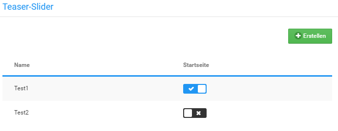
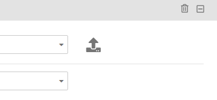

# Teaser-Slider verwalten {#teaser_slider_verwalten}

Neue Teaser-Slider kannst du im Gambio Admin deines Shops unter Darstellung \> Teaser-Slider anlegen.

**Note:** Im Teaser-Slider können Vorschaubilder der im Slider enthaltenen Bilder in der unteren rechten Ecke des Sliders angezeigt werden. Die Vorschaubilder \(Thumbnails\) werden nicht vom Shopsystem erstellt und müssen vor dem Hochladen mit einem geeigneten Grafikprogramm auf die gewünschte Größe verkleinert werden.

## Slider anlegen { .section}

1.  Klicke auf Erstellen
2.  Trage unter Name einen Namen für den neuen Slider ein
3.  Ändere bei Bedarf im Feld Geschwindigkeit die Anzeigedauer je Bild in Sekunden
4.  Klicke auf Speichern, um die Konfiguration des Teaser-Sliders zu speichern

## Slider löschen { .section}

1.  Bewege den Mauszeiger in die Zeile des Sliders, den du löschen möchtest
2.  Klicke auf das Mülltonen-Symbol
3.  Bestätige die Sicherheitsabfrage mit einem Klick auf Löschen, um den gewählten Teaser-Slider zu löschen

## Bilder hinzufügen { .section}

Für jedes Bild des Teaser-Sliders wird ein sogenannter Slide angelegt. Ein Slide entspricht einem Bild, jedoch kann für die verschiedene Ansichten des Shops je eine eigene Bild-Datei zugeordnet werden. Auf diese Weise können für unterschiedliche Ansichten \(z.B. Desktop-Ansicht oder Smartphone-Ansicht\) Bilder mit hierfür angepassten Auflösungen verwendet werden. Ein Slide hat für jede einzelne Sprache, die im Shop verwendet wird, eine eigene Einstellungsseite, die über den Reiter mit der Landesflagge oben links ausgewählt werden kann.

Um eine Bilddatei für einen bestimmten Anwendungsfall einzurichten, bewege den Mauszeiger in die Zeile mit dem zugehörigen Dropdown-Menü und klicke anschließend auf das Upload-Icon. Die Bilddatei steht nach dem Hochladen im zugehörigen Dropdown zur Verfügung.

|Feldname|Beschreibung|
|--------|------------|
|Vorschaubild|Bild-Datei, die als Thumbnail verwendet wird|
|Smartphone|Bild-Datei für die Smartphone-Ansicht|
|Tablet Portrait|Bild-Datei die Tablet-Ansicht \(hochkannt\)|
|Tablet Landscape|Bild-Datei für Tablet-Ansicht \(quer\)|
|Desktop|Bild-Datei für Desktop-Ansicht|
|Titel|der Bildtitel des aktuellen Slides \(wird im Shopbereich beim darüberfahren mit der Maus angezeigt\)|
|ALT-Text|der Alternativtext des aktuellen Slides \(wird angezeigt, wenn das Bild nicht geladen werden kann\)|
|Link|legt fest, ob die angegebene Internetseite in einem neuen Fenster oder im selben Fenster geöffnet wird|
| |wenn angegeben, wird der Kunde beim Klick auf den Slider auf die angegebene Internetseite weitergeleitet \(wird ignoriert, wenn die Image-Map konfiguriert ist\)|

Über einen Klick auf das Mülltonen-Symbol in der grauen Titel-Leiste des Slides kann ein Slide gelöscht werden. Mit dem - bzw. + kann ein Slide minimiert bzw. wiederhergestellt werden.

**Parent topic:**[Teaser-Slider](10_4_Teaser_Slider.md)

